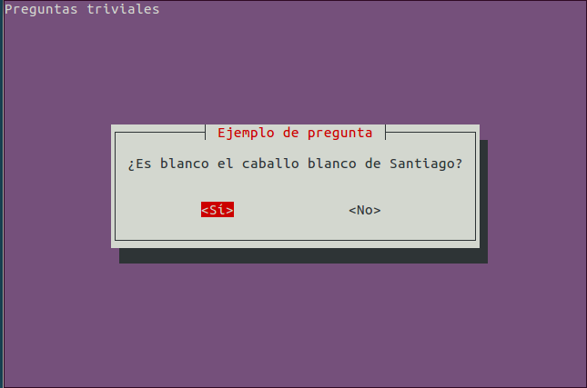
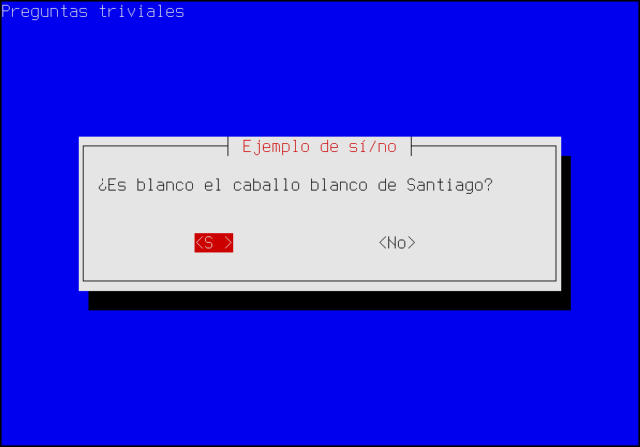
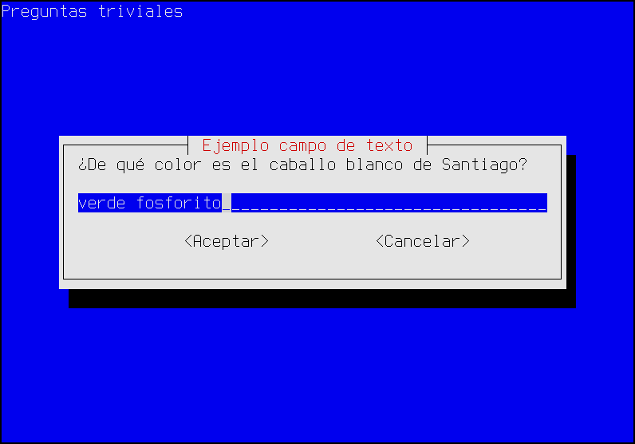
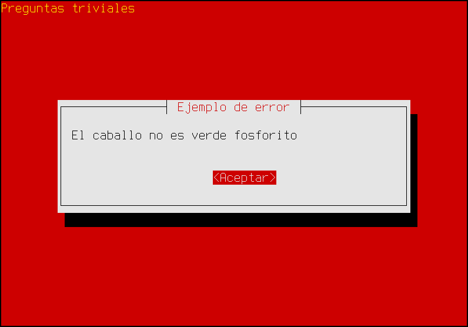
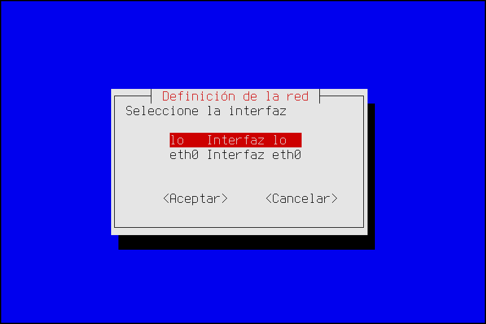

.. _whiptail:
.. index:: whiptail

*Script* molones
================
Hay *scripts* que requieren la asistencia interactiva del usuario, ya que éste
debe alimentar con datos al programa. Dicho de otra forma, *scripts* en los que
el usuario debe contestar preguntas.

Conceptos básicos
-----------------
Para estos casos la orden interna de :command:`bash` es :ref:`read <read>`, pero
si nos hemos fijado en los *scripts* de configuración de los paquetes de
*debian*, habremos podido comprobar que éstos usan una interfaz de texto
atractiva, donde hay menús, listas de selección, etc. Tal interfaz se contruye
con un programa llamado :command:`whiptail`\ [#]_, bastante sencillo de usar y
que, obviamente, está instalado por defecto en la más mínima instalación de una
distribucion basada en *debian*. Gracias a él, puede crearse un *script* en
que nuestras preguntas al usuario tenga este aspecto:

.. warning:: Obviamente, una interfaz de este tipo sólo es adecuada cuando el
   *script* se usa interactivamente. Si la operación se presta a ser repetida y
   desasistida, como por ejemplo, un *script* para dar de alta usuarios con unas
   determinadas características, entonces es preferible construir un *script*
   cuyos datos se proporcionen a través de :ref:`argumentos en línea
   <sh-gnu-args>`, los cuales permiten su ejecución por lotes\ [#]_.

:command:`whiptail` no se limita a permitir preguntas del *sí o no*, sino que
tiene una amplia gama de posibilidades que, por lo general, cubrirán todas
nuestras necesidades:

#. Pregunta sí/no (``--yesno``).
#. Mensaje informativo con confirmación (``--msgbox``).
#. Mensaje informativo con temporización (``--infobox``)\ [#]_.
#. Muestra de archivo (``--textbox``).
#. Pregunta con respuesta (``--inputbox``).
#. Petición de contraseña (``--passwordbox``).
#. Menú de selección (``--menu``).
#. Lista de selección múltiple (``--checklist``).
#. Lista de selección única (``--radiolist``).
#. Barra de progresión (``--gauge``).

.. warning:: No trataremos en el texto cómo usar cada opción\ (vea nota [#]_
   para algunos tutoriales), ya que hay innumerable información en internet
   para romper el hielo. Lo que sí haremos es exponer algunos trucos de uso
   ajenos al manual y que se echan en falta en muchos tutoriales.

   Por tanto, eche un vistazo primero al uso trivial en alguno de estos
   tutoriales y, cuando entienda cómo meterle mano a :command:`whiptail`,
   vuelva a la lectura de este documento.

Captura de datos
----------------
De todas las posibilidades ya referidas, podemos distinguir tres grupos:

* Los diálogos que dan información, pero de los que no se obtienen información:
  *gauge*\ [#]_, *msgbox* e *infobox*.
* El diálogo *yesno* que devuelve verdadero o falso.
* El resto de diálogos que devuelven distintos valores.

Como los dos últimos grupos obtienen información que el *script* debe procesar,
es importante saber cómo recogerla. En el segundo grupo, esto:

se trataría así:

.. code-block:: bash

   whiptail --backtitle "Preguntas triviales" --title "Ejemplo de sí/no" \
      --yesno "¿Es blanco el caballo blanco de Santiago?" 8 50

   case $? in
      0) echo "Ha respondido que sí";;
      1) echo "Ha respondido que no";;
      255) echo "Se ha cancelado la respuesta";;
   wsac

es decir, la respuesta se refleja en el código de respuesta de
:command:`whiptail`:

* **0** para "sí".
* **1** para "no".
* **255** si se cancela la entrada de datos con :kbd:`ESC`.

En cambio, en el otro grupo, la información que pedimos no puede devolverse en
forma de código numérico:

La respuesta para este caso es claramente una cadena y para el caso de la
respuesta a un diálogo de selección (como *menu* o *checklist*) también lo es,
porque cada ítem se asocia a una etiqueta y es la etiqueta lo que se
devuelve. Por este motivo, en estos caso el código de respuesta sólo informa de:

* Si se respondió devolviendo un **0**.
* Si no se respondió porque se usó el botón de "Cancelar", devolviendo un **1**.
* Si no se respondión porque se pulsó :kbd:`ESC`, devolviendo **255**.

En estos caso, qué se respondió exactamente se devuelve por la salida de
errores, ya que la salida estándar se usa para pintar el cuadro de diálogo. Por
ello, la forma más cómoda de capturar los datos es intercambiar la salida
estándar por la salida de errores, ya que esta última también es la pantalla. De
este modo, seguiremos viendo el diálogo y, a la vez, podremos usar una
*subshell* para capturar el dato. O sea, que el cuadro anterior podemos tratarlo
así:

.. code-block:: bash

   resp=$(whiptail --backtitle "Preguntas triviales" --title "Ejemplo campo de texto" \
      --inputbox "¿De qué color es el caballo blanco de Santiago?" 8 53 "verde fosforito" 3>&1 1>&2 2>&3)

   case $? in
      0)
         echo "El color es $resp."
         ;;
      1)
         echo "¿Cancela? ¿No se atreve a responder?"
         ;;
      255)
         echo "¿Pulsa ESC? Eso es de cobardes"
   esac

Colores
-------
:command:`whiptail` controla los colores a través de las variables de ambiente
``NEWT_COLORS_FILE`` y ``NEWT_COLORS``. La primera permite indicar un fichero en
el que se hayan definido los colores y la segunda escribir directamente los
colores en el valor. Tanto si se escriben las definiciones en fichero como si se
escriben en la variable, éstas deben ser hechas así::

   elemento_a_colorear=color_texto,color_fondo

y separar estas definiciones (obsérvese que no hay espacios dentro de cada una)
por cualquier carácter de espaciado o por punto y coma o por dos puntos. Por
ejemplo, para generar un mensaje de error y que este se aprecie, podríamos
cambiar la coloración:

lo cual se logra así:

.. code-block:: bash

   export NEWT_COLORS="
   root=,red
   roottext=yellow,red"

   whiptail --backtitle="Preguntas triviales" --title="Ejemplo de error" \
      --msgbox "El caballo no es verde fosforito" 8 50

.. note:: Para saber cómo se llaman los elementos, puede consultar `esta
   respuesta <https://askubuntu.com/a/781062>`_

Simplificación del uso
----------------------
Utilizar las técnicas que hemos expuesto aquí para recoger en una variable la
salida de :command:`whiptail` o cambiar los colores, es un poco engorroso y
puede ensuciar nuestros *script*. Lo más adecuado es trasladar esta complejidad
a una función auxiliar:

.. literalinclude:: files/dialog.sh
   :language: bash

Añadiendo este código, podemos olvidarnos en el resto del código de las liosas
redirecciones:

.. code-block:: bash

   resp=$(dialog --title "Ejemplo de campo de texto" \
      --inputbox "¿De qué color es el caballo blanco de Santiago?" 8 53 "verde fosforito")

y la redefinición de colores para mostrar avisos de error:

.. code-block:: bash

   edialog --title "Ejemplo de error" --msg "El caballo no es verde fosforito" 8 50

Diálogos de selección e ítems
-----------------------------
Otro quebradero de cabeza cuando se usan diálogos de selección es la expresión de
los ítems que lo componen. Partamos de un sencillo ejemplo:

que puede definirse así::

   $ whiptail --title "Definición de la red" --menu "Seleccione la interfaz" 10 35 2 \
      lo "Interfaz lo" \
      eth0 "Interfaz eth0"

Cuando los ítems pueden escribirse directamente en la línea, no hay problema. En
cambio, cuando no es así (por ejemplo, porque es forzoso generarlos con algún
algoritmo), surge el quebradero de cabeza. Por ejemplo, esta función::

   get_ifaces() {
      for iface in /sys/class/net/*; do
         iface=$(basename "$iface")
         echo -n "$iface 'Intefaz $iface' "
      done
   }

   items=$(get_ifaces)

propicia que podamos crear una variable cuyo :command:`echo` devuelve::

   br0 'Intefaz br0' enp1s0 'Intefaz enp1s0' lo 'Intefaz lo' tap0 'Intefaz tap0'

que es semejante a la que necesitamos en el menú, pero el problema es que
intentar esto::

   whiptail --title "Definición de la red" --menu "Seleccione la interfaz" 10 35 2 $items

no funciona, ya que las comillas que forman parte del valor de *items* se
interpretan como cualquier otro carácter y no propician que "*Interfaz br0*" se
entienda como un único argumento. Para solucionarlo hay dos vías\ [#]_:

#. Usar :ref:`eval <eval>` directamente sobre la orden::

      # Cálculo de número de item... se almacena en num.
      eval 'whiptail --title "Definición de la red" --menu "Seleccione la interfaz" $((8+num)) 35 $num' $items

   que resulta algo feo y, además obliga a contar los *items* de algún modo y
   almacenar su valor en *num*.

#. Suponiendo que no requiramos ya los argumentos del programa o la función::

      eval set -- "$items"
      num=$(($#/2))
      whiptail --title "Definición de la red" --menu "Seleccione la interfaz" $((8+num)) 35 $num "$@" 

.. warning:: En ambos casos es necesario que *items* no contenga cambios de
   línea. De ahí, que se usara :code:`echo -n` para generarlos.

.. _whiptail-gauge:

Barra de progresión
-------------------
La barra de progresión (``gauge``) permite indicar de modo atractivo cuál es el
grado de progresión de una tarea que lleva cierto tiempo. Es obvio que para que
funcione correctamente la tarea debe informar a :command:`whiptail` de cuál es
su porcentaje de progresión, por lo que cuando se usa con la opción ``--gauge``,
:command:`whiptail` espera recibir por su entrada estándar los porcentajes.
Consecuentemente, debemos aviárnoslas para que la tarea escriba en la salida
estándar los porcentajes de progreso.

Un ejemplo de uso, tan claro como inútil es el siguiente::

   $ for i in `seq 0 100`; do echo $i; sleep .5; done | whiptail ---gauge "Contando hasta cien" 7 50 0

Los números que acompañan a :command:`whiptail` son la altura y anchura del
cuadro (como en el resto de cuadros de diálogo) y el porcentaje inicial a partir
del cual se empezará a contar.

Es obvio que la dificultad está en lograr que la tarea informe correctamente de
su progresión. Una situación muy habitual es que nuestro *script* deba esperar a
que :command:`wget` se descargue un fichero. Si el servidor informa del tamaño,
:command:`wget` es capaz de informan del porcentaje de descarga, circunstancia
que podemos aprovechar con :command:`whiptail`::

   $ URL="http://mirror.slitaz.org/iso/rolling/slitaz-rolling-core.iso"
   $ wget -qO slitaz.iso --show-progress --progress=dot "$URL" 2>&1 | \
      stdbuf -o0 grep -oP '[0-9]+(?=%)' | whiptail --gauge "Descargando SliTaZ..." 7 50 0

.. note:: Con ``--progress=dot`` la progresión de :command:`wget` genera líneas
   con este aspecto::

      50K .......... .......... .......... .......... ..........  0%  118K 9m53s

   pero como sólo nos interesa el porcentaje, nos vemos obligados a usar un
   filtro como :command:`grep`.

.. note:: :code:`stdbuf -o0` es necesario para evitar que :command:`grep`
   almacene en buffer su salida, en vez de pasar inmediatamente el número a
   :command:`whiptail`

.. rubric:: Notas al pie

.. [#] :command:`whiptail` se basa en la librería `newt
   <https://en.wikipedia.org/wiki/Newt_(programming_library)>`_ y la creó `Red
   Hat <https://es.wikipedia.org/wiki/Red_Hat>`_ precisamente para desarrollar
   interfaces de instalación. Otro programa semejante (basado en `ncurses
   <https://es.wikipedia.org/wiki/Ncurses>`_) es :command:`dialog`.

.. [#] Una solución buena es permitir la introducción de datos mediante
   argumentos y pedir interactivamente aquellos no definidos con ellos. De este
   modo, el *script* podrá ser ejecutado de modo no interactivo si es
   preciso; y si no, ofrecerá una interfaz interactiva agradable que ahorra
   acordarse de los argumentos o leer la ayuda.

.. [#] Este diálogo, por un `bug antiquísimo
   <https://bugs.debian.org/cgi-bin/bugreport.cgi?bug=55182>`_, no funciona
   en algunas terminales.

.. [#] Hay tutoriales en internet como `éste en inglés
   <https://en.wikibooks.org/wiki/Bash_Shell_Scripting/Whiptail>`_ o `éste en
   castellano
   <http://www.raulprietofernandez.net/blog/shells/como-crear-cuadros-de-dialogo-en-tus-scripts-de-gnu-linux>`_

.. [#] Sólo la barra de progresión entraña dificultad de uso ya que exige que
   asociemos el avance del script con *%* de finalización. Dedicaremos un
   :ref:`epígrafe posterior <whiptail-gauge>` a ello.

.. [#] En realidad, hay una tercera: usar un array y que campo sea un elemento
   del array, pero esa solución se sale del estándar *POSIX*.

