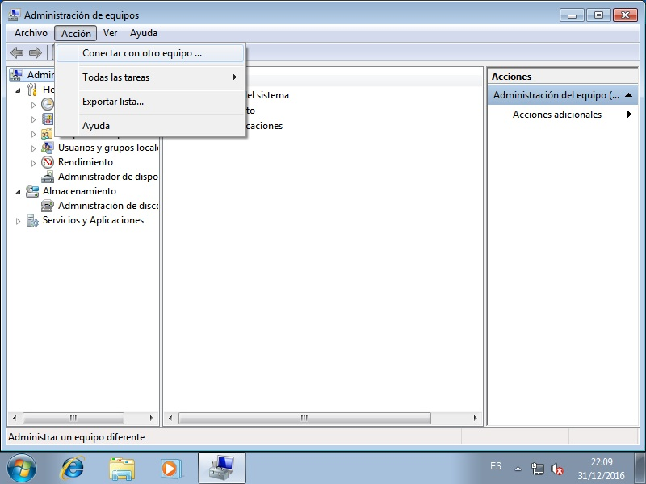
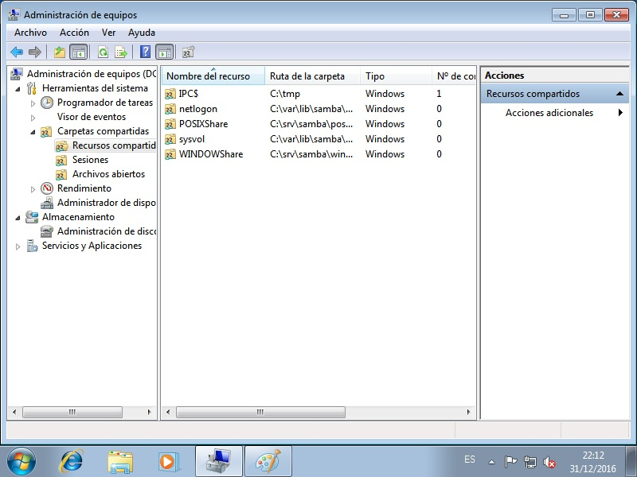

.. _smb-share:

Directorios compartidos
=======================

Conocido cómo añadir clientes, toca saber cómo compartir directorios\ [#]_. Hay
dos métodos:

* A través de las *POSIX ACL*.
* A través de las *ACL* de *windows*.

POSIX ACL
---------

Para la prueba usaremos el directorio :file:`/srv/samba/poshare` del *controlador
de dominio*::

   # mkdir -p /srv/samba/poshare
   # ls -ld /srv/samba/poshare
   drwxr-xr-x 2 root root 4096 dic 31 13:28 /srv/samba/poshare/
   # echo "Hola" > /srv/samba/poshare/saludo.txt

y añadiremos a :file:`/etc/samba/smb.conf`::

   [POSIXShare]
   path = /srv/samba/poshare
   read only = No

Por ultimo, recargamos la configuración para que tenga efecto::

   # invoke-rc.d samba-ad-dc reload

Con esto, ya tendríamos compartido el recurso de una manera básica. Obsérvese
que en el servidor se ha definido que puede acceder al recurso cualquiera, pero
que solo *root* puede escribir en él. Por ese motivo, si **desde un cliente**
usáramos un usuario del dominio\ [#]_, para acceder al recurso::

   usuario@clienteL$ smbclient //DC/POSIXShare -U zicotropico
   Enter zicotropico's password:
   Domain=[IESPJM] OS=[Windows 6.1] Server=[Samba 4.5.2-Debian]
   smb: \> ls
     .                                   D        0  Sat Dec 31 18:13:11 2016
     ..                                  D        0  Sat Dec 31 13:28:37 2016
     saludo.txt                          N        5  Sat Dec 31 17:39:11 2016

                   1733064 blocks of size 1024. 622044 blocks available
   smb: \> get saludo.txt
   getting file \saludo.txt of size 5 as saludo.txt (1,2 KiloBytes/sec) (average 1,2 KiloBytes/sec)

podremos hacerlo e incluso obtener ficheros (si es que estos permitían la
lectura). Sin embargo, no podremos subir nada, pues no tenemos permisos de
escritura::

   smb: \> put despedida.txt
   NT_STATUS_ACCESS_DENIED opening remote file \despedida.txt

Esto suponiendo que en el cliente tengamos un fichero llamado
:file:`despedida.txt`, claro. *samba*, pues, respeta los permisos definidos en
el propio servidor. Sin menoscabo de esto, la configuración de *samba* permite
negar o permitir el acceso según el usuario, el grupo o la máquina de acceso.
Por ejemplo::

   [POSIXShare]
   path = /srv/samba/poshare
   read only = No
   valid users = @"domain users"
   invalid users = fany
   hosts allow = localhost 192.168.255.0/24
   hosts deny = 192.168.255.253

Incluye cuatro directivas relativas a estos accesos:

**valid users**
   Permite indicar cuáles son los únicos usuarios a los que se les permite el
   acceso. El signo :kbd:`@` indica que se indica el nombre de un grupo. La
   ausencia de esta directiva implica todos los usuarios.

**invalid users**
   Indica los usuarios (y grupos) con el acceso vetado. Su ausencia implica que
   no haya veto alguna. Tiene preferencia sobre la directiva anterior, de modo
   que en caso de que un usuario tenga permitido y denegado el acceso, se
   denegará.

**hosts allow**
   Indica las máquinas desde las que se podrá acceder.

**hosts deny**
   Indica las máquinas desde las que no se podrá acceder.

Ahora bien, debe tenerse claro que si un usuario no tiene permisos para acceder
al directorio compartido (y por permisos se entiende los que se ven al hacer un
:command:`ls`), el usuario no podrá acceder, aunque *valid users* diga lo
contrario.

Por supuesto, podemos dotar al directorio de aquellos permisos que nos parezcan
más adecuados. Podríamos definir permisos basados en :ref:`listas de control de
accesos <acls>` o algo más sencillo con el bit pegajoso como::

   root@dc# chmod 1777 /srv/samba/poshare

que permitirá escribir a todo el mundo, pero no borrar lo que no sea de uno
mismo. Además,

.. _smb-wacl:

Windows ACL
-----------

Es el método que recomienda la documentación de *samba*. Requiere que el sistema
de ficheros soporte *acl* y *atributos extendidos de usuario*, cosa que se
comprobó al instalar el *controladore de dominio*. Además, si la máquina sobre
la que se quieren usar, **no es un controlador de dominio** es necesario añadir
a :file:`smb.conf`::

   vfs objects = acl_xattr
   map acl inherit = yes
   store dos attributes = yes

Para poder configurar los permisos de compartición es necesario un usuario que
tenga el privilegio *SeDiskOperatorPrivilege*\ [#]_::

   $ net rpc rights list privileges -S dc -k | grep SeDiskOperatorPrivilege
   SeDiskOperatorPrivilege  Manage disk shares

pero en la instalación predeterminada no hay ningún usuario ni grupo con este
privilegio::

   $ net rpc rights list privileges SeDiskOperatorPrivilege -S dc -k
   SeDiskOperatorPrivilege:

Así que lo que vamos a hacer es conceder este permiso a los usuario
pertenecientes al grupo «*Domain Admins*», que ya existe\ [#]_::

   $ getent group domain_admins
   domain_admins:*:2012:administrator

La orden adecuada es la siguiente::

   $ net rpc rights grant "Domain Admins" SeDiskOperatorPrivilege -S dc -k
   Successfully granted rights.

que, efectivamente, no falla. Esto son los privilegios del grupo *Domain
Admins*::

   $ net rpc rights list accounts "Domain Admins" -S dc -k
   SeDiskOperatorPrivilege

o, por verlo de otra forma, estas son las cuentas que poseen ese privilegio (que
fue la orden que usamos en un principio para comprobar que no había ninguna)::

   $ net rpc rights list privileges  SeDiskOperatorPrivilege -S dc -k
   SeDiskOperatorPrivilege:
     IESPJM\Domain Admins

Ahora podríamos añadir un usuario existente a este grupo (o haber dado a este
usuario directamente el privilegrio), pero podemos usar el administrador de
samba, ya que::

   $ id -Gn Administrator | grep -o domain_admins
   domain_admins

pertenece a dicho grupo. 

Con un usuario que puede gestionar las compartición de discos, ya podemos crear
un directorio a compartir::

   # mkdir -p /srv/samba/winshare
   # chgrp domain_admins /srv/samba/winshare
   # chmod g=rwx /srv/samba/winshare

y compartirlo a través de :file:`smb.conf`::

   [WINDOWShare]
   path = /srv/samba/winshare
   read only = No

No debemos olvidarnos de recargar la configuración::

   # invoke-rc.d samba-ad-dc reload

El resto de la configuración debemos hacerla en un cliente *windows* adherido al
dominio e identificarnos en él con un usuario con permisos para establecer
propiedades de compartición.

Primeramente debemos usar el ítem de *Administrar* *Equipo*:

.. image:: ../03.clientes/images/equipo_propiedades.jpg
   :alt: Localización de "Administración" de "Equipo" en windows7.

Esto abrir una aplicación que permite administrar distintos aspectos del
sistema. Como lo que queremos es administrar el *controlador de dominio* no el
equipo local, debemos, situados sobre el ítem *Administración de equipos*,
seleccionar *Acción* en el menú superior y conectar a otro equipo que es *DC*
(esto es, el nombre que elegimos para el controlador):

Ya en la administración del *controlador de dominio* debemos escoger
``Herramientas del sistema>Carpetas compartidas>>Recursos compartidos``:

para que aparezca qué es lo que comparte el *controlador* con el dominio. Ahora
en el menú contextual del recursos :file:`WINDOWShare`, que es el que nos
interesa y elegir el ítem *Propiedades*:

.. image:: images/shareperms.jpg
   :alt: Permisos compartidos para un recurso.

En la ventana emergente, hay dos pestañas de interés:

**Permisos de los recursos compartidos**
   Que permite indicar quiénes pueden acceder o quiénes no. Su manipulación
   equivale más o menos a las directivas *valid users* e *invalid users*, que
   se vieron bajo el epígrafe anterior. En este caso, convendría eliminar el
   grupo *Todos* y sustituirlo por *Domain Users*, que son los que deberían
   acceder a este recurso.

**Seguridad**
   En esta pestaña, se pueden editar los permisos y definir qué puede hacer cada
   usuario o grupo individual. Este proceder equivale a la manipulación de
   permisos directa del directorio en el controlador. De hecho, si hacemos algún
   cambio (p.e. dar *Control total* a un determinado usuario) y nos vamos al
   *controlador* veremos que lo que hace *samba* internamente es definir *ACLs*
   sobre el directorio, *ACLs* que nosotros mismos podríamos haber definido
   usando :ref:`setfacl <setfacl>`\ [#]_.

.. rubric:: **Enlaces de interés**

* `Shares with POSIX ACLs <https://wiki.samba.org/index.php/Shares_with_POSIX_ACLs>`_
* `Shares with Windows ACLs <https://wiki.samba.org/index.php/Shares_with_Windows_ACLs>`_

.. rubric:: Notas al pie

.. [#] Cualquier miembro del dominio puede compartir un directorio, bastará con
   tocar su :file:`smb.conf` correspondiente, tal como se explica aquí para el
   *controlador*.

.. [#] Para crear un usuario, consóltese el :ref:`epígrafe correspondiente
   <smb-usr>`. Si se sigue en estricto orden esta guía, aún no tendremos creado
   ninguno, pero aún podremos usar el usuario *Administrator* (en vez de
   *zicotropico*) para hacer las pruebas que se sugieren. La diferencia es que
   sí podremos tendremos permisos para subir el fichero :file:`despedida.txt`.

.. [#] El comando :command:`net` permite usar autenticación con *kerberos*
   añadiendo la opción ``-k``, que es lo que se ha hecho. Obviamente, esto exige
   :ref:`haber obtenido las credenciales antes con kinit <kinit>`.

.. [#] Recuérdese que al configurar *sssd* (gracias al cual podemos usar
   :ref:`getent <getent>`) indicamos que queríamos sustituir el espacio por el
   el subrayado, así que en toda operación en la que intervenga *nss* «*Domain
   Admins*» será *domain_admins* (o cualquier otra variante que intercambie
   minúsculas por mayúsculas). Otra forma de haber consultado la existencia del
   grupo habría sido a través de :kbd:samba-tool group list` tal como se hizo
   durante las comprobaciones post-instalación.

   Nótese también que con la configuración de sssd que hemos realizado, este
   inventa todos los datos (excepto el nombre de usuario y la contraseña) que
   necesitan los sistemas para reconocer al usuario. Como consecuencia todos
   los usuarios y grupos son reconocidos por linux. Esto es, claramente, un
   inconveniente.

.. [#] Además de que sea un poco engorroso y propenso a fallos el definir
   nosotros directamente las *ACLs*, hay otra dificultad. Los *UID* y *GID* que
   se usan para referirse a usuarios y grupos podrían no serán los que viéramos
   al hacer una consulta con :command:`getent`, si se optó por no fijar estos
   identificadores numéricos en el directorio activo, sino los que se obtienen
   del siguiente modo (supongamos que el usuario se llama *zicotropico*)::

      # wbinfo --sid-to-uid $(wbinfo --name-to-sid zicotropico)
      3000020

   Para entender todo esto, es conveniente avanzar al siguiente epígrafe.
