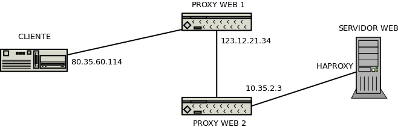

Otros aspectos
**************

.. _nginx-map:

Definición mediante mapeo
=========================
Si requerimos definir una variable dependiendo del valor de otra, disponemos de
la directiva `map
<http://nginx.org/en/docs/http/ngx_http_map_module.html#map>`_:

.. code-block:: nginx

   map $host $dominio {
      hostnames;

      default              "desconocido";
      *.example.net        "example";
      *.dominio.org        "dominio";
      ~[^.]+\.otro\.[^.]+  "otro";
   }

En este caso, se define la variable ``$dominio`` a partir de los valores de la
variable ``$host``. Se comprueba si el valor de esta última concuerda con
alguna entrada de la izquierda y, si es así, se asigna el valor de la columna
derecha correspondiente. Si no hay concordancia, se usa la entrada *default*.
Además, se puede incluir la palabra :kbd:`hostnames` para expresar que lo
contenido son nombres de máquina y que se entienda la notación con asterisco.
Si la lista es larga, puede usarse ``include``:

.. code-block:: nginx

   map $host $dominio {
      hostnames;

      include dominios.txt;
   }

y en el fichero :file:`/etc/nginx/dominios.txt` escribir la lista de dos
columnas.

Otro ejemplo (meramente ilustrativo porque para ello ya existe el módulo
`ngx_http_referer
<http://nginx.org/en/docs/http/ngx_http_referer_module.html>`_) es el de
comprobar si el *referer* es válido:

.. code-block:: nginx

   map $http_referer $invalid_referer {
      default                 1;

      # Dominios con los que se considera válido el referer.
      "~www.example.net"      0;
      "~example.net"          0;
   }

.. _nginx-comp:

Compresión
==========
Es muy recomendable, para ahorrar ancho de banda configurar el servidor para que
comprima aquellos ficheros cuyo ratio de compresión es alto. La configuración
predeterminada sólo comprime los documentos |HTML|, así que creamos un fichero
de :download:`configuración adicional <files/gzip.conf>` como
:file:`/etc/nginx/conf.d/gzip.conf`:

.. literalinclude:: files/gzip.conf
   :language: nginx

.. _nginx-debug:

Depuración
==========
Es obvio que depurar el funcionamiento del servidor pasa por mirar los ficheros
de registro. Sin embargo, si realizamos en la configuración :ref:`reescrituras
internas <ngx-rewrite>`, podremos comprobar que estas no dejan rastro en los
*logs*, ya que su registro está deshabilitado. Para habilitarlo podemos añadir
fichero :file:`/etc/nginx/conf.d/rewrite.conf`::

   # cat > /etc/nginx/conf.d/rewrite.conf
   rewrite_log on;

pero esto no es suficiente, ya que se registran en el registro de errores con
nivel *notice*, mientras que el nivel predeterminado es *error*.
Consecuentemente, habrá que retocar la directiva ``error_log`` que corresponda
para cambiar el nivel. Por ejemplo::

   error_log  /var/log/nginx/error.log notice;

.. _nginx-tras-proxy:

Servicio tras *proxy*
=====================
Cuando un :ref:`proxy inverso <proxy-inverso>` intermedia interceptando la
comunicación entre clientes y servidor, puede actuar de :ref:`modo transparente
<proxy-transparente>` (en cuyo caso nuestro :program:`nginx` será incapaz de
reconocerlo) o no. Es en este segundo caso en el que el
el :ref:`proxy web inverso <proxy-web-inverso>` produce distorsiones en la
comunicación que debemos tener en cuenta al configurar el servidor *web*:

a. El *proxy* captura la petición del cliente y la reproduce hacia el servidor lo
   que supone que la comunicación que recibe el servidor no proceda del cliente
   original, sino del *proxy*.

#. Puede darse el caso de que en las comunicaciones cifradas, el extremo de
   cifrado se traslade del servidor al *proxy*, a fin de que este entienda la
   comunicación  |HTTP| y pueda hacer el trabajo que tenga encomendado (cacheo,
   balanceo, etc.). En ese caso, el servidor recibirá una conexión no segura,
   pero es conveniente que sepa que originariamente era segura.

Tenga presente que tratar estas cabeceras en el servidor, no es sólo necesario
para el correcto funcionakiento del servidor, sino también para el correcto
funcionamiento de las aplicaciones que éste ejecute.  Por ejemplo, las
aplicaciones escritas en |PHP| consultan la dirección remota a través de
``$_SERVER["ADDRESS"]`` y si está activo el protocolo seguro a través de
``$_SERVER["HTTPS"]``. Por tanto, configurar bien el servidor para que ejecute
aplicaciones |PHP| implica que ambos parámetros que pasa el servidor *web* al
intérprete tengan los valores adecuados.

.. _nginx-clientip:

Cliente original
----------------
Un *proxy* intermedio que no actúe de forma transparente, hará creer al servidor
web que todas las peticiones las recibe de él. En consecuencia, cualquier
decisión que queramos tomar en función de quién sea quien nos haga la petición
(p.e. si la petición es de un cliente local o uno remoto), será imposible.

Para soslayar este inconveniente los *proxies* pueblan la cabecera
:ref:`X-Forwarded-For <xforwardedfor>`, de manera que el servidor pueda
recalcular la dirección que identifica al cliente original y definir la variable
`$remote_addr`_, en vez de usar la |IP| de la conexión (que será la del
*proxy*). Para que :program:`nginx` sea capaz de aprovechar la información de
esta cabecera puede crearse un fichero con contenido semejante a éste que
aprovecha el módulo `ngx_http_realip_module
<http://nginx.org/en/docs/http/ngx_http_realip_module.html>`_::

   # /etc/nginx/conf.d/realip.conf
   set_real_ip_from 127.0.0.1;
   set_real_ip_from 10.0.0.0/8;
   real_ip_recursive on;
   real_ip_header X-Forwarded-For;

La directiva `real_ip_header
<http://nginx.org/en/docs/http/ngx_http_realip_module.html#real_ip_header>`_
permite indicar cuál es el nombre del campo a analizar, `set_real_ip_from
<http://nginx.org/en/docs/http/ngx_http_realip_module.html#set_real_ip_from>`_
las redes y direcciones en que consideramos que hay *proxies* que alteran la
|IP| original; y `real_ip_recursive
<http://nginx.org/en/docs/http/ngx_http_realip_module.html#real_ip_recursive>`_
puede tener dos valores que alteran de distinto modo la |IP| del cliente (o sea,
`$remote_addr
<https://nginx.org/en/docs/http/ngx_http_core_module.html#var_remote_addr>`_)
cuando la detectada originalmente coincide con alguna de las recogidas en
`set_real_ip_from`_:

* *off* provoca que se tome incondicionalmente la última incluida en el campo
  referido por `real_ip_header`_.
* *on*, que se tome la última que no esté incluida en las referidas por
  `set_real_ip_from`_.

Para ilustrarlo supongamos este esquema:

que genera la siguiente cabecera ``X-Forwarded-For``:

.. code-block:: none

   X-Forwarded-For: 80.35.60.114 123.12.21.34 10.35.2.3

y una dirección |IP| para el cliente que vale *127.0.0.1* originalmente, ya que
el *proxy* que recibe la comunicación en nuestro servidor (:program:`haproxy`)
se comunica con :program:`nginx` a través de la interfaz de *loopback*. En este
caso, debido a la configuración anterior en :file:`conf.d/realip.conf` y a que
la |IP| original del cliente está incluida en `real_ip_recursive`_:

* Si `real_ip_recursive`_ está deshabilitado, `$remote_addr`_ valdrá
  *10.35.2.3*, esto es, la última |IP| de ``X-Forwarded-For``.
* Si está habilitado, `$remote_addr`_ valdrá *123.12.21.34*, ya que éste es
  el último valor de ``X-Forwarded-For`` que no está incluido en las directivas
  `set_real_ip_from`_.

Protocolo original
------------------
Para que el *proxy* declare el protocolo (|HTTP|\ s) con el que recibió la
petición se suele usar otra cabecera, *X-Forwarded-Proto*, con valor *https* si
el protocolo original era |HTTP|\ s. Para tenerlo en cuenta en nuestro servidor
podemos incluir esta configuración:

.. code-block:: nginx

   # /etc/nginx/conf.d/https.conf
   map $http_x_forwarded_proto $_https {
      default  $https;
      https    on;
   }

que permite conocer la naturalza original del protocolo usando la variable de
usuario :kbd:`$_https` en vez de la original :kbd:`$https`. Ahora, basta con
usar :kbd:`$_https` allí donde usábamos antes :kbd:`$https`:

.. code-block:: nginx

   server {
      listen   80;

      server_name _;

      root /srv/www;
      try_files $uri $uri/ =404;

      # Necesario si queremos redirigir el tráfico seguro a no seguro
      if ($_https != "on") {
         return 301 https://$host$uri$is_args$args;
      }

   }

Además, si el sitio es dinámico y usa |PHP|, debemos hacérselo al intérprete
añadiendo otro bloque a la configuración:

.. code-block:: nginx
   :emphasize-lines: 3

   location ~ \.php$ {
      include snippets/fastcgi-php.conf;
      fastcgi_param  HTTPS  $_https if_not_empty;
      fastcgi_pass php;
   }

Página de mantenimiento
=======================
En ocasiones, podemos requerir ocultar temporalmente uno o varios de los sitios
web que nuestro servidor aloja. Podemos optar por distintas estrategias, pero
una muy cómoda es configurar :command:`nginx` de modo que:

a. No se requiere alterar la configuración del servidor para habilitar o
   deshabilitar la situación de mantenimiento.

#. Si en :file:`/srv/www/enobras`, creamos el archivo :file:`enabled`, todos los
   sitios que alojemos pasarán a encontrarse en mantemiento y se mostrará una
   página que informe de ello.

#. Si deseamos poner en mantemiento un sitio particular, entonces debemos crear
   el archivo :file:`enabled-nombresitio`. Por ejemplo, para mostrar la página de
   mantenimiento exclusivamente para el sitio *info.example.net*, debemos crear
   el archivo :file:`enabled-info`.

Para lograr este comportamiento debemos:

#. Crear el directorio :file:`/srv/www/enobras` con una página de mantenimiento
   apropiada (p.e. :download:`ésta <files/mantenimiento.html>`).

#. Crear el *snippet* :download:`mantenimiento.conf <files/mantenimiento.conf>`:

   .. literalinclude:: files/mantenimiento.conf
      :language: nginx

.. todo:: La configuración con |IP|\ s que burlan el mantenimiento que se
   aconseja a continuación no está probada.

Listo. Ahora bien, si el mantenimiento exige hacer cambios sobre la página que
requieren el acceso a la aplicación, la página de mantenimiento nos impedirá
también a nosotros acceder y, por tanto, hacer y probar los cambios. Una
solución es habilitar una serie de direcciones |IP| desde las que habilitar el
mantenimiento no tendrá efecto. Para ello necesitamos el módulo `geo
<http://nginx.org/en/docs/http/ngx_http_geo_module.html>`_ de
:program:`nginx`. El módulo puede ayudar a identificar los grupos de direcciones
|IP| que queremos que burlen el mantenimiento. Para ello, debe crearse:

.. code-block:: nginx

   # /etc/nginx/conf.d/adminip.conf
   geo $adminip {
      default           0;
      127.0.0.0/8       1;
      10.0.0.0/8        1;
      172.16.0.0/12     1;
      192.188.0.0/16    1;
   }

que identifica a los clientes que se conectan desde direcciones locales\ [#]_:
hecho lo cual, podemos modificar :file:`mantenimiento.conf` para que, cuando la
|IP| del cliente sea una de ellas, no tenga efecto el estado de mantemiento:

   .. literalinclude:: files/mantenimiento-ip.conf
      :language: nginx
      :emphasize-lines: 13-16

.. warning:: El módulo geo_ no está compilado estáticamente en el ejecutable,
   por lo que deberá comprobar si con su sabor de :program:`nginx` tiene
   instalado el paquete :deb:`libnginx-mod-http-geoip`.

.. _nginx-systemd:

Registros con systemd
=====================
:program:`nginx` escribe directamente sus registros en el fichero que indiquemos
en las directivas :ref:`access_log y error_log <nginx-logs>`. Ahora bien,
también da la posibilidad de pasárselos al gestor de registros
(:program:`systemd` en las versiones modernas de *debian*) y que éste se
encargue. Para ello podemos crear el siguiente fichero::

   # /etc/nginx/conf.d/logging.conf
   log_format  journald  '$host[$remote_addr] - $request - $status $body_bytes_sent "$http_user_agent"';
   access_log  syslog:server=unix:/dev/log,facility=local7,severity=info,nohostname journald;
   error_log   syslog:server=unix:/dev/log,facility=local7,severity=error,nohostname; 

.. warning:: Además, habra qué comentar las directivas correspondientes
   presentes en :file:`/etc/nginx/nginx.conf`, porque de lo contrario seguirán
   escribiéndose registros en los ficheros ahí definidos:

   .. code-block:: nginx

      ##
      # Logging settings
      ##

      #access_log /var/log/nginx/access.log;
      #error_log /var/log/nginx/access.log;

De este modo, los registros de acceso y error aparecerían al ejecutar:

.. code-block:: console

   # journalctl -u nginx

Para los de acceso se ha redefinido el formato, a fin de que aparezca el nombre
del dominio al que se accede (por si manejamos varios dominios virtuales) y no
la hora y fecha, ya que de esto último se encarga el propio gestor.
Desgraciadamente para los de error no es posible.

Si además queremos que los registros en su formato tradicional no se apunten
en :file:`/var/log/syslog`, sino en otro fichero, entonces debemos crear el
fichero :file:`/etc/rsyslog.d/nginx.conf` con el siguiente contenido:

.. code-block:: console

  # cat > /etc/rsyslog.d/nginx.conf
  local7.=info    /var/log/nginx/access.log
  local7.err      /var/log/nginx/error.log
  local7.*        &
  # invoke-rc.d rsyslog restart

.. note:: Como las líneas contienen el nombre del dominio, los registros de
   acceso es posible separarlos en distintos archivos dependiendo tal nombre.
   Véase `cómo escribir las reglas para rsyslog
   <http://www.rsyslog.com/doc/v8-stable/configuration/filters.html>`_

.. note:: Como hemos colocado los registros dentro de :file:`/var/log/nginx` que
   es donde *debian* espera encontrar los logs de :program:`nginx`, no tenemos
   que preocuparnos de las rotaciones, ya que existe
   :file:`/etc/logrotate.d/nginx` que se encarga de ello.

.. _nginx-debcache:

Caché de paquetes
=================
Cuando se requiere actualizar muchos ordenadores de la red local, la descarga de
paquetes puedo suponer un gran tráfico de red. Una solución para evitarlo crear
un repositorio completo, pero por lo general sólo se instalan una ínfima parte
de los paquetes de la distribución con que descargamos y sincronizamos muchos
paquetes que no son totalmente inútiles.

Una solución alternativa es crear un *proxy*\ [#]_ caché para almacenar los
paquetes de descargados; asi sólo la primera instación requerirá descargarlos de
internet y las siguientes se limitarán a obtenerlos del *proxy*.
:program:`nginx` nos permite hacerlo como por otro lado nos lo permitiría
:ref:`squid <squid>`).

La idea es modificar el fichero :file:`sources.list` de manera que las líneas
que se escriben así::

   deb http://ftp.fr.debian.org/debian/ stretch  main

pasen a estar escritas así::

   deb http://debian-cache.example.net/ftp.fr.debian.org/debian/ stretch  main

es decir, la línea es igual pero insertando el nombre de nuestro *proxy* al
nombre de la máquina del reposito de *debian*. De este modo, el gestor de
paquetes contactará con nuestro :program:`nginx` y éste será capaz de conocer
cuál es el repositorio y la ruta al recurso, simplemente transformando el primer
directorio en el nombre del repositorio.

Para ello lo primero es crear un directorio de almacenamiento para las
descargas::

   # mkdir -p /var/cache/nginx
   # chown www-data /var/cache/nginx

Y ahora definir cómo es esta caché en :file:`/etc/nginx/conf.d/cache.conf`:

.. literalinclude:: files/cached.conf
   :language: nginx

cuyo contenido supone que:

* Almacenaremos todos los datos en :file:`/var/cache/nginx/debcache`.
* La caché la podremos referir luego como *debcache*.
* Dispondrá de un tamaño máximo de 500 MB. Si se supera este tamaño, para
  respetar este límite, se empezarán a eliminar contenidos empezando por
  aquellos cuyo tiempo de acceso es más antiguo.
* Los contenidos permanecerán 14 días almacenados. Superado este tiempo, se
  eliminarán.

Por último debemos crear el dominio virtual (que hemos llamado
*debian-cache.example.net*) con :download:`esta configuracion
<files/site-cache>`:

.. literalinclude:: files/site-cache
   :language: nginx

Actúa como *proxy* entre el repositorio de *debian* y el cliente usando la
caché. Ahora bien, almacenar durante mucho tiempo la lista de paquetes no
es muy recomendable, porque si un paquete se actualiza en el repositorio, pero
nuestra lista no, el cliente intentará obtener una versión antigua del paquete y
se encontrará con un error **404**. Por ello configuramos del siguiente modo:

* Los ficheros cacheados que no son paquetes *debian* se considerarán inválidos
  después de 8 horas, o sea, una jornada de trabajo. Si se detectan muchos
  errores **404** como consecuencia de la desincronización con el repositorio,
  se puede disminuir este tiempo a costa de que sean necesarias más
  actualizaciones remotas de las listas de paquetes el mismo día.
* Los paquetes, en cambio, se consideran válidos durante 14 días. A diferencia
  del caso anterior que un paquete cacheado se vuelva obsoleto, no supone un
  error, ya que el cliente descargará el nuevo paquete. La única desventaja es
  que cachearemos la versión antigua y la nueva y ocuparemos espacio de disco
  innecesariamente.

.. https://www.linuxito.com/gnu-linux/nivel-alto/943-crear-una-cache-de-paquetes-de-debian-con-nginx
   http://tdt.rocks/repo_cache_ft_nginx.html
   https://raymii.org/s/tutorials/NGINX_proxy_folder_to_different_root.html

Testeo del rendimiento
======================

.. todo:: Mostrar el uso de apachebench (p.e. tal como explica `aquí
   <https://easyengine.io/tutorials/benchmark/apachebench/>`_)

.. rubric:: Notas al pie

.. [#] Podríamos, claro está, incluir también alguna dirección publica propia
   desde la que nos solemos conectar al servidor para administrarlo.

.. [#] Aunque es mucho mas sencillo, si no necesitamos instalar :program:`nginx` por
   otra razón, usar `apt-cacher-ng
   <https://www.tecmint.com/apt-cache-server-in-ubuntu/>`_.

.. |HTML| replace:: :abbr:`HTML (HyperText Markup Language)`
.. |PHP| replace:: :abbr:`PHP (PHP Hypertext Preprocessor)`
