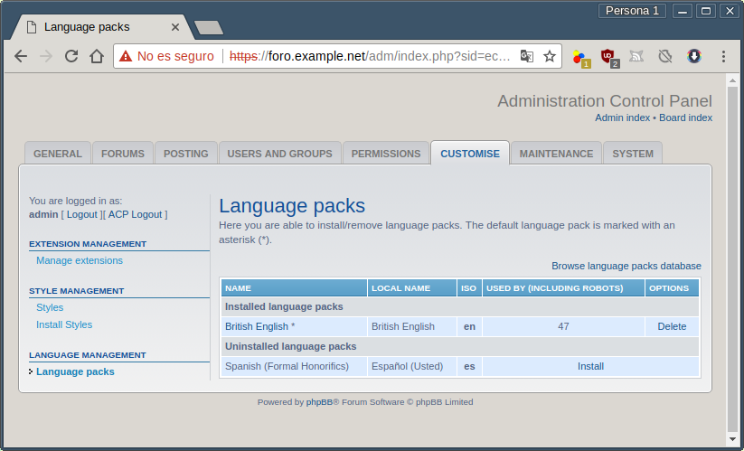
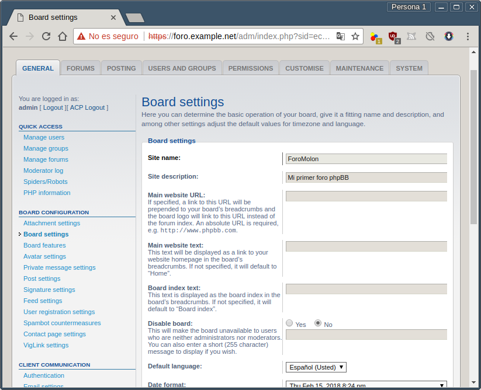
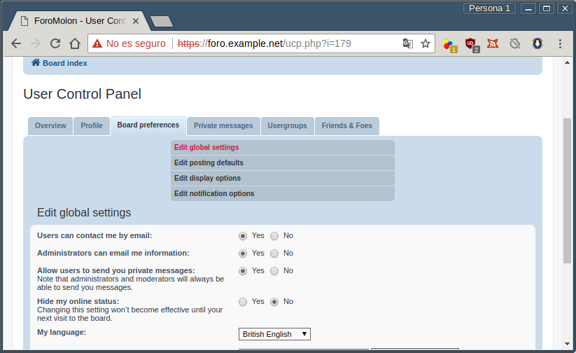

.. _php_BB:

Foro
****
Una de las aplicaciones web más recurrentes y utilizadas son los foros que han
usurpado en gran medida la función que antiguamente cumplían las listas de
correo y las popularmente conocidas `news
<https://es.wikipedia.org/wiki/Usenet>`_. Hay dos aplicaciones que se usan
mayoritariamente:

* `vBulletin <https://www.vbulletin.com/es/>`_, que es *software* comercial.
* `phpBB <https://www.phpbb.com/>`_, que es *software* libre y el que
  instalaremos nosotros.

Preliminares
============
Como en todos los casos anteriores partimos de un servidor :ref:`nginx <n-ginx>`
instalado con :ref:`soporte para contenido dinámico <nginx-php>` y *MySQL*.
Reservaremos el nombre *foro.example.net* para :program:`phpbb` y
albergaremos los ficheros de la aplicación bajo :file:`/srv/www/foro`. Además,
requerimos la instalación de otros módulos de |PHP|::

   # apt-get install php-{gd,json,xml,zip,imagick,mbstring}

y una base de datos para para la aplicación::

   # mysql
   mysql> CREATE DATABASE phpbb;
   mysql> GRANT ALL PRIVILEGES ON phpbb.* TO 'usuariocomplicado'@'localhost' IDENTIFIED BY 'contraseñadificil';

.. note:: Como para el resto de aplicaciones es conveniente que usuario y
   contraseña sean largos y complicados, ya que sólo requeriremos recordarlos
   en el momento de la instalación.

Por último debe descargarse y descomprimirse :program:`phpbb` en
:file:`/srv/www/foro`::

   # mkdir -p /srv/www/foro
   # wget -qO - https://www.phpbb.com/files/release/phpBB-3.2.2.tar.bz2 | tar -C /srv/www/foro -jxvf - --strip-component=1
   # chown -R root:root /srv/www/foro
   # chown -R www-data /srv/www/foro/{config.php,store,cache,files,images/avatars/upload}

.. warning:: Obsérvese que el enlace al software contiene la versión, así que
   es probable que este número cambie en el momento de su lectura, Compruebe
   cuál es el enlace en la `página de descargas
   <https://www.phpbb.com/downloads/>`_.

Opcionalmente, puede descargarse un módulo de idioma. Esto, sin embargo, lo
haremos más adelante.

Configuración en :program:`nginx`
=================================
Basta con que creemos un :download:`fichero de sitio <files/site-foro>` con la
siguiente configuración:

.. literalinclude:: files/site-foro
   :language: nginx

Instalación
===========
Hecho todo lo anterior, basta con visitar con un navegador gráfico la
dirección::

   http://foro.example.net/install

y contestar a las preguntas. Acaba la instalación, es necesario eliminar el
directorio :file:`install`::

   # rm -rf /srv/www/foro/install

.. rubric:: Idioma

Adicionalmente, podemos instalar el paquete de idioma para que el foro *hable*
en castellano. Esto paquetes `pueden descargarse del sitio de la aplicación
<https://www.phpbb.com/languages/?sid=bd6df495100db3afcdb49aa9b86cee2b>`_,
aunque desgraciadamente sólo está en formato *zip* por lo que requeriremos::

   # apt-get install unzip

Hecho lo cual y descargado el paquete, podemos descomprimirlo dentro de
:file:`/srv/www/foro`\ [#]_::

   # ln -s foro /srv/www/spanish_formal_honorifics_3_2_2
   # unzip -d /srv/www spanish_formal_honorifics_3_2_2.zip
   # rm -f spanish_formal_honorifics_3_2_2

Esta operación, sin embargo, no completa la instalación, ya que hay que
instalarlo de forma efectiva en el **Panel de Administración**. Para ello, hay
que dirigirse a ``Customise>Language packs``:

y hacer efectiva la instalación del paquete de idioma, que debe aparecer en la
lista después de haber hecho la descopresión. A continuación puede hacerse que
tal idioma sea la lengua por defecto en ``General>Board Settings``:

Esto es independiente de que cada usuario en su *panel de control* pueda usar el idioma que más le
convenga (en nuestra instalación sólo podrá elegir entre inglés o castellano,
porque no hemos instalado otros). De hecho, el panel de administración lo
seguimos viendo en inglés, porque el administrador sigue con este idioma como su
idioma preferido. Si vamos a su *panel de control* (para lo cual hay que salir
del *panel de administración*), veremos cómo cambiarlo:

.. warning:: Si tras la instalación comprueba que el foro no funciona bien (no
   puede iniciar sesión, no puede hacer ningún registro de usuario, etc.),
   asegúrese de borrar totalmente las cookies.

.. rubric:: Notas al pie

.. [#] Como :command:`unzip` carece de la opción ``-strip-component`` de
   :command:`tar`, es  algo más lioso.

.. |PHP| replace:: :abbr:`PHP (PHP Hypertext Preprocessor)`
