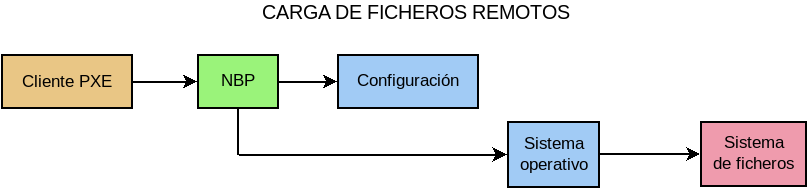
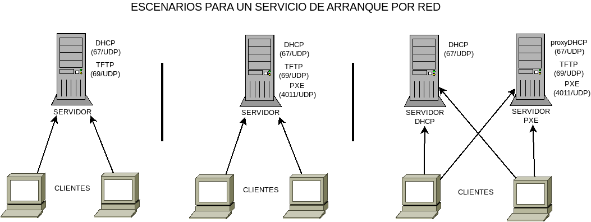

Conceptos
=========

Componentes
-----------
Sólo atendiendo a la definición es posible establecer las tres necesidades del
cliente para el arranque por red:

#. La obtención de una configuración dinámica de red, lo cual exige la
   existencia de un servidor |DHCP|.
#. La obtención de la información sobre cómno arrancar por red, o lo que es lo
   mismo, cuál es el servidor y el sistema que permitirán tal arranque.  Esta
   segunda necesidad es la que satisface lo que llamaremos servidor |PXE|.
#. La descarga propiamente del sistema para su ejecución, lo cual exige un
   servicio de descarga de ficheros (típicamente |TFTP|).

Por tanto, si queremos construir un servicio de arranque por red, necesitamos
montar varios servicios que cooperen entre sí.

Comparativa
-----------
Dado que estamos habituados a hacer arranques locales de nuestras máquinas y que
están arranquen desde su disco duro o un cederrón o un pincho, es interesante
comparar ambos arranques.

Cuando es el *arranque local*:

#. La |BIOS| va al dispositivo local que se haya indicado en la secuencia de
   arranque y carga un gestor de arranque (como, por ejemplo, `grub
   <https://www.gnu.org/software/grub/>`_).
#. Tal gestor de arranque lee del dispositivo local un fichero de configuración
   que declara los sistemas presentes y permite elegir uno de ellos\ [#]_.
#. El gestor carga el sistema seleccionado.
#. Dicho sistema es probable que, a su vez, necesite acceder a un sistema de
   ficheros local.

En caso de *arranque remoto*, las acciones son semejantes, pero la diferencia
radica en que los ficheros no se obtienen de un dispositivo local, sino de la
red, lo que obliga a montar el servicio con los componentes antes reseñados:

#. Gracias a la carga del cliente |PXE| de la |ROM| de la tarjeta, se obtiene
   una configuración de red del servidor |DHCP| y la ubicación de un
   ejecutable llamado |NBP|, que cumple la función del gestor arranque en el caso
   anterior. Es muy común que el |NBP| sea `pxelinux
   <http://www.syslinux.org/wiki/index.php?title=PXELINUX>`_, pero incluso podría
   hacerse uso de :program:`grub`.
#. Se descarga el |NBP| y éste, por lo general, necesitará descargar un fichero de
   configuración que declare los sistemas de red arrancables para que podamos
   elegir uno de ellos.
#. El |NBP| carga el sistema seleccionado.
#. Dicho sistema es probable que, a su vez, necesite un sistema de ficheros el
   cual debe obtenerlo descargando un fichero de red.

La secuencia es, pues, paralela, con lo que centrarnos en las diferencias es
centrarnos en el proceso de obtención de los ficheros:

Hay, pues, tres programas distintos que descargan:

* El *cliente PXE* que, por lo general, sólo soporta |TFTP|.
* El |NBP| que puede suportar otros protocolos como |HTTP|. Nosotros usaremos
  :program:`lpxelinux.0` que ofrece esta posibilidad.
* El sistema operativo que podrá descargar con los protocolos que soporte cada
  cual.

.. _pxe-escenarios:

Escenarios
----------
Como son tres los servicios, son varios los escenarios posibles:

#. Que el servidor |DHCP| asuma el papel del servidor |PXE|, puesto que el
   protocolo permite facilitar al cliente la información sobre el arranque por
   red (fichero y servidor en el que está).

#. Que ambos servicios se mantengan separados, de manera que exista un servidor
   |DHCP| e, independiente de éste, un servidor |PXE|. Cuando esto es así, hay a
   su vez, dos posibilidades:

   a. Que ambos servidores se encuentren en la misma máquina.
   b. Que cada uno se encuentre en una máquina distinta.

.. note:: En realidad, el servidor |TFTP| puede encontrarse en otra máquina
   distinta al servidor |PXE|, con lo que tendríamos que duplicar los
   escenarios.  Sin embargo, aparte de no ser lo normal, la diferencia en la
   configuración no consistiría más que en indicar cuál es la |IP| de tal
   servidor y montar el servicio |TFTP| en tal máquina. Muy poca diferencia,
   pues, como para tenerlo en consideración.

Es obvio que el escenario más simple es el primero, puesto que solamente
requiere un servidor |DHCP|, que proporciona la información sobre la red y el
|NBP| y un servidor |TFTP| para la transferencia de ficheros. Sin embargo, es
preciso notar que esta primera solución exige modificar la configuración del
|DHCP| para añadir los parámetros de arranque remoto (servidor y nombre de
fichero) y puede haber ocasiones en que esto no sea posible\ [#]_. Cuando es
así, es preciso recurrir al tercer escenario\ [#]_ que permite montar el
servicio sin alterar en absoluto la configuración |DHCP|.

Así pues, dependiendo del control que tengamos sobre el servidor |DHCP|
tendremos que optar por el primero o el tercer escenarios. Al segundo, en
cambio, no tenemos por qué vernos abocados, puesto que si somos capaces de
incluir un servidor |PXE| en la máquina que ejecuta el servidor |DHCP|, lo más
probable es que también seamos capaces de controlar la configuración del propio
|DHCP|. Aun con ello, puede interesarnos, si queremos mantener separada la
configuración de red de la configuración del arranque remoto.

En estos apuntes dividiremos el estudio según estos tres escenarios:

#. |PXE| integrado en |DHCP|
#. |PXE| y |DHCP| independientes en máquinas distintas.
#. |PXE| y |DHCP| independientes en la misma máquina.

Software
--------
Para poner en marcha el servicio necesitaremos:

* Un servidor |DHCP| que puede ser tanto el :ref:`servidor del ISC <isc-dhcp>`
  como :ref:`dnsmasq <dnsmasq>`. Para montar este servicio es más recomentable
  el segundo, ya que permite implementar los tres escenarios y hace innecesario
  cualquier otro software. El primero sólo puede actuar de servidor |DHCP| puro
  y sólo en el primer escenario puede facilitar la información de arranque. A
  pesar de ello, trataremos su configuración, ya que es posible que en nuestra
  red nos veamos obligados a usarlo como servidor |DHCP| por requerir alguna
  funcionalidad que él puede prestarnos y :program:`dnsmasq`, no (p.e. |DNS|
  dinámico).

* Cuando el servicio |PXE| sea independiente (segundo y tercer escenario),
  :program:`dnsmsaq`.

* Un servidor |TFTP| para transferir el |NBP| y un servidor |HTTP| para hacer lo
  propio con el resto de ficheros. Para lo segundo, usaremos :ref:`nginx <n-ginx>`
  y para lo primero, depende:

  * Si la solución incluye :program:`dnsmasq`, usaremos el propio
    :program:`dnsmasq`, ya que incluye un servidor |TFTP|.

  * Si la solución no lo incluye (primer escenario sin :program:`dnsmasq`),
    habrá que instalar un servidor |TFTP| independiente como :deb:`tftpd`\ [#]_.

  .. note:: En principio, toda la transferencia puede resolverse con |TFTP|,
     pero no es recomendable, porque no está pensado para la transferencia de
     archivos grandes\ [#]_.

* Un |NBP| a fin de poder cargar un sistema operativo que haga funcionar la
  máquina. No diremos más porque le dedicaremos un epigrafe completo.

.. _pxe-independiente:

Servicio |PXE|
--------------
Ya se ha adelantado que este servicio es el encargado de proporcionar la
información de arranque por red a la máquina, lo cual se traduce en indicarle
qué |NBP| debe cargar y desde dónde debe hacerlo, o expresándolo de otro modo,
una tupla |TFTP|/|NBP|.

Ciñéndonos exclusivamente a esta descripción, un servidor |DHCP| es capaz de
proporcionar ambos datos, con lo cual podríamos pensar que tal servidor es capaz
de proporcionar un servicio completo de |PXE|. Lo cierto es que no es así.

En principio, un servidor |PXE| real es capaz de proporcionar al cliente varias
alternativas de arranque por red (o sea, varios tuplas |TFTP|/|NBP|), de manera
que el cliente permita al usuario elegir una de ellas. No debe confundirse esto
con la capacidad posterior que proporciona el |NBP| para elegir sistema de
arranque, aunque ciertamente, pueden usarse ambas posibilidades para el mismo
fin. Un servidor |DHCP| es incapaz de ello\ [#]_: sólo envía un tupla |TFTP|/|NBP| y
con ella deberá arrancar el cliente.

Por supuesto, se puede manipular la configuración del |DHCP| para que,
dependiendo del cliente, se envíe una tupla u otra, pero para cada cliente
tendremos una y sólo una tupla. Si el cliente |PXE| que usamos está incluido en
la |ROM| de la tarjeta de red, entonces siempre se identificará del mismo modo
y, consecuentemente, siempre recibirá la misma tupla. Un servicio |PXE|, por
contra, envía varias de manera que posibilita que el cliente puede presentar al
usuario un menú para que elija interactivamente qué |NBP| se descargará.

Es cierto que un |NBP| medianamente completo permitirá la selección de varios
sistemas e incluso alguno de estos *sistemas* puede ser, no un sistema operativo,
sino otro |NBP|, con lo que la limitación de usar un servidor |DHCP| para
proporcionar la información de arranque no es tan grave. En realidad, la
principal ventaja de disponer un servidor |PXE| independiente es la de separar
la información de red (en el servidor |DHCP|) de la información de arranque, y
esta ventaja se vuelve obligación cuando es imposible modificar la configuración
del |DHCP| para añadir tal información.

Un servidor |PXE| escucha en el puerto *4011/UDP* y recibe consultas del cliente
|PXE| que usa el puerto *68/UDP*\ [#]_. Sin embargo, los clientes |PXE| no lo
consultan automáticamente, sino que tienen que ser advertidos de que existe
uno. Cómo se logran tal cosa, se explicará al analizar los tres escenarios
descritos anteriormente.

.. rubric:: Notas al pie

.. [#] ... o no. En ocasiones, la configuración consiste en arrancar el único
   sistema disponible sin darle opción al usuario a que elija una alternativa
   que no hay.

.. [#] Por ejemplo, cuando el servidor |DHCP| es un router cuya configuración es
   muy limitada.

.. [#] Si se ve el gráfico, podrá comprobarse que en este escenario hay un
   enigmático servicio *proxyDHCP*. Trataremos más adelante qué papel juega.

.. [#] Este servidor no permite descargar ficheros de más de 32MB, como es
   nuestro caso, pues salvo el |NBP|, que es bastante pequeño, descargaremos
   todo lo demás a través de |HTTP|.

.. [#] De hecho, el estándar original (véase
   :rfc:`1350`) limita el tamaño del fichero
   transmitido a 32MB. El :rfc:`2348` introdujo una opción para poder aumentar
   este tamaño a 4GB.

.. [#] O quizás si. Tal vez se pueda encapsular tal información en la opción
   **43**. No hemos probado tal extremo.

.. [#] Lo cual es lógico ya que este es el puerto característico de los clientes
   |DHCP|.

.. |PXE| replace:: :abbr:`PXE (Preboot eXecution Environment)`
.. |TFTP| replace:: :abbr:`TFTP (Trivial FTP)`
.. |BIOS| replace:: :abbr:`BIOS (Basic Input/Output System)`
.. |NBP| replace:: :abbr:`NBP (Netboot Bootstrap Program)`
.. |ROM| replace:: :abbr:`ROM (Read-Only Memory)`
