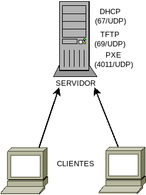
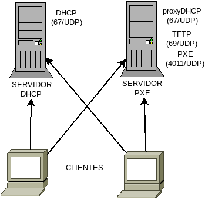

Servicios DHCP/PXE
******************

.. _pxe-dhcp-solo:

1º escenario
============
Como ya sabemos, en este primer escenario el servidor |DHCP| se encarga tanto de
entregar la información de red como la información de arranque.

Para ello tenemos dos alternativas.

:program:`dnsmasq`
------------------
Podemos implementar los datos del |DHCP| en el fichero
:file:`/etc/dnsmasq.d/dhcp.conf`::

   dhcp-range=192.168.255.128,192.168.255.191,8h
   domain=aula.ies,192.168.255.0/24

y los referentes al arranque en :file:`/etc/dnsmasq.d/pxe.conf`::

   dhcp-boot=bios/lpxelinux.0

En este caso, sólo se da información sobre el fichero de configuración, ya que
por defecto :program:`dnsmasq` envía como |IP| del servidor de ficheros la
propia del servidor |DHCP|. Si los ficheros los alojásemos en otro distinto,
bastaría con añadirlo a la directiva a continuación::

   dhcp-boot=bios/lpxelinux.0,192.168.255.2

Con esta configuración, dispondríamos un arranque gestionado con
:program:`syslinux` y en el que los ficheros se descargan por |TFTP|. Dado que
los clientes |PXE| tradicionales no soportan otra descarga, es conveniente que
así sea. Ahora bien, el |NBP| descargado (o sea, :program:`lpxelinux.0`) sí la
soporta por lo que es recomendable que el resto de las descargas se hagan por
este medio\ [#]_, aunque no usemos la capacidad de ejecutar dinámicamente
*scripts* para crear configuraciones según cliente. Para ello podemos enviar la
opción **210**::

   dhcp-option-force=210,http://192.168.255.1/boot/bios/

que establece el *directorio de trabajo* y, además establece el protocolo de
descarga. Podríamos añadir la opción **209** para indicar un fichero en concreto
y no dejar que :program:`pxelinux` haga la búsqueda de los nombres
predeterminados, pero no haremos tal para seguir la estrategia que fijamos al
definir la estructura de ficheros del servidor.

Como alternativa, podemos encapsular la opción dentro de la opción **43** lo que
no obliga a forzar su envío::

   dhcp-option=encap:43,210,http://192.168.255.1/boot/bios/

Consecuentemente, el fichero :file:`/etc/dnsmasq.d/pxe.conf` nos quedará así::

   dhcp-boot=bios/lpxelinux.0

   # Si deseamoa continuar la descarga por HTTP
   dhcp-option=encap:43,210,http://192.168.255.1/boot/bios/

.. note:: Recuérdese que usamos también :program:`dnsmasq` como servidor |TFTP|,
   por lo que aún se requerirá otro fichero :file:`/etc/dnsmasq.d/tftp.conf`
   según los expuesto al :ref:`explicar tal servicio <pxe-tftp>` para
   habilitarlo.

.. _pxe-isc:

:program:`isc-dhcp-server`
--------------------------
Básicamente, consiste en traducir la configuración propuesta para
:program:`dnsmasq`::

   authoritative;
   ddns-update-style none;
   default-lease-time 28800;
   max-lease-time 28800;

   include "/etc/dhcp/pxe.conf";

   subnet 192.168.255.1 netmask 255.255.255.0 {
      option domain-name-servers  192.168.255.1;
      option domain-name "aula.ies";
      option routers 192.168.255.1;

      range 192.168.255.128 192.168.255.191;
   }

Y en :file:`pxe.conf`, incluimos la información del arranque::

   next-server 192.168.255.1;
   filename    "bios/lpxelinux.0";

   # Si deseamos continuar la descarga por HTTP
   option pxe-pathprefix code 210 = text;
   option pxe-pathprefix "http://192.168.255.1/boot/bios/";
   
   if exists dhcp-parameter-request-list {
      option dhcp-parameter-request-list = concat(option dhcp-parameter-request-list, d2);
   }

que enviaría la opción **210**. Si se prefiera encapsular dentro de la opción
**43**::

   next-server 192.168.255.1;
   filename    "bios/lpxelinux.0";

   # Si deseamos continuar la descarga por HTTP
   option space pxe;
   option local-encapsulation code 43 = encapsulate pxe;
   option pxe.pathprefix code 210 = text;
   option pxe.pathprefix "http://192.168.255.1/boot/bios/";

.. note:: Tanto en este como en el segundo escenario, en los que somos capaces
   de manipular el servidor |DHCP|, es conveniente asociar a los clientes |PXE|
   un tiempo de concesión bastante corto, ya que por lo general el arranque en
   red apenas dura. Para :program:`dnsmasq` podríamos definir las concesiones
   así::

      dhcp-vendorclass=set:pxe,PXEClient

      dhcp-range=tag:!pxe,192.168.255.128,192.168.255.191,8h
      dhcp-range=tag:pxe,192.168.255.128,192.168.255.191,7m

   En el del |ISC| requeriríamos simplemente, definir un tiempo de concesión más
   corto para los clientes |PXE|::

      class "PXEClient" {
         match if substring(option vendor-class-identifier, 0, 9) = "PXEClient";
         default-lease-time 420;
      }

.. note:: Es conveniente hacer una puntualización sobre este escenario, ya sea
   el servidor :program:`dnsmasq` o el del |ISC|. Dado que un servidor |DHCP|
   es capaz de identificar el tipo de máquina y definir, mediante la opción
   **209**, el nombre del fichero de descarga, podríamos cambiar por completo la
   estrategia para crear configuraciones dinámicas. En nuestra propuesta el
   *script* |PHP| recibe en crudo la dirección |MAC| y su código debe encargarse
   de asociar la dirección con el tipo. En cambio, en este escenario y usando
   :program:`pxelinux` como |NBP|, podríamos hacer una configuración en
   :program:`dnsmasq`\ [#]_ de este tipo::

      dhcp-host=00:25:22:*:*:*,set:clonicos
      dhcp-host=74:D4:35:*:*:*,set:apd

      dhcp-option=vendor:PXEClient,210,http://192.168.255.1/boot/bios/
      dhcp-option=clonicos,vendor:PXEClient,209,script/boot.php?tipo=clonicos
      dhcp-option=apd,vendor:PXEClient,209,script/boot.php?tipo=apd

   De este modo, el *script* ya recibiría el tipo. Ahora bien, esto tiene dos
   limitaciones

   * Sólo vale cuando el |NBP| es :program:`syslinux`.
   * Sólo vale en este escenario.

   Es por ello que preferimos la solución más universal de pasar al *script*
   la |MAC| en crudo. 

.. _pxe-dhcp-juntos:

2º escenario
============
En este escenario ambos servidores son independientes, pero se encuentran en la
misma máquina:

El servidor |DHCP| escucha en el puerto *67/UDP* y el servidor |PXE| en el
puerto *4011/UDP*. Ahora bien, el cliente no intenta automáticamente un
descubrimiento de éste último servidor como sí hace con el de |DHCP|, sino que
por |DHCP| espera obtener la información de dónde está.

El aviso de que el servidor |PXE| se encuentra en la misma máquina se da
haciendo que |DHCP| envíe la opción **60** con la cadena "*PXEClient*". En
consecuencia:

* Separamos la información de red y la de arranque; pero

* Necesitamos modificar la configuración del |DHCP| para incluir la opción
  **60**.

* Dado que estamos montando el |PXE| en la misma máquina que el servidor |DHCP|,
  es plausible pensar que somos capaces de modificar la configuración de éste
  último, por lo que la necesidad anterior no será problema.

* Lo normal es que montemos el servidor del |ISC| como |DHCP| y
  :program:`dnsmasq` como servidor |PXE| (y |TFTP|)\ [#]_.

* Las **ventajas** de este escenario sobre el anterior son:

  - Separamos la información de ambos servidores.
  - Accedemos a las capacidades extra del servidor |PXE| (seleccionar entre
    distintos |NBP| de arranque).
  - Podemos hacer uso de la configuración extra que permite hacer |ISC| y no
    :program:`dnsmasq`.

* Las **desventajas**, en cambio, son:

  - Necesitamos montar dos servidores distintos\ [#]_.
  - No podemos enviar la opción **210** con el |PXE| y enviarla con el servidor
    |DHCP| es introducir información de arranque en el servicio |DHCP|, que es
    precisamente lo que queremos evitar al usar esta solucion.

|DHCP|
------
La configuración es básicamente la misma que para el primer escenario, pero
sustituyen la información |PXE| por el envío de la opción **60**:

.. code-block:: none
   :emphasize-lines: 6

   authoritative;
   ddns-update-style none;
   default-lease-time 28800;
   max-lease-time 28800;

   option vendor-class-identifier "PXEClient";

   subnet 192.168.255.1 netmask 255.255.255.0 {
      option domain-name-servers  192.168.255.1;
      option domain-name "aula.ies";
      option routers 192.168.255.1;

      range 192.168.255.128 192.168.255.191;
   }

|PXE|
-----
Para este servicio usaremos :program:`dnsmasq` con dos ficheros de
configuración: :file:`tftp.conf`, según lo ya expuesto para habilitar el
servicio |TFTP| y :file:`pxe.conf` con este contenido:

.. code-block:: none
   :emphasize-lines: 2,8

   # ProxyDHCP en otro alternativo.
   dhcp-alternate-port=0
   dhcp-range=192.168.255.0,proxy

   dhcp-no-override
   dhcp-option=vendor:PXEClient,6,2b

   pxe-service=x86PC,"Servicio de clonaciones",bios/lpxelinux.0

Hay tres consideraciones interesantes:

* No se usa ``dhcp-boot``, puesto que no se envía la información mediante el
  servicio |DHCP|, sino ``pxe-service``.

* El servicio |PXE| no funciona en :program:`dnsmasq` si no se habilita el
  serviicio *proxyDHCP* que ya introduciremos con el :ref:`tercer escenario
  <pxe-dhcp-separados>`. Consecuentemente tenemos que habilitarlo. Ahora bien, este
  servicio funciona en el mismo puerto que el servicio |DHCP|. Para evitar el
  confilcto, hacemos que escuche en un puerto aleatorio libre con
  ``dhcp-alternate-port``.

* La directiva ``pxe-service`` puede repetirse para enviar varios |NBP|
  disponibles al cliente y que este cree un menú de selección. No hacemos uso de
  ello, porque hemos decidido usar :program:`syslinux` para tal tarea.

.. _pxe-dhcp-separados:

3º escenario
============
En este último escenario disponemos el servidor |PXE| en una máquina distinta a
la que corre el servidor |DHCP|. Muy comúnmente se debe a que no podemos tocar
la máquina encargada de servir direcciones o, si podemos, no con total libertad.
El ejemplo más habitual es que esta máquina sea un *router* con un sistema
empotrado que apenas permite configuración alguna.

Dado que no podemos tocar el servicio |DHCP|, este no puede enviar al cliente
aviso de que debe conectarse a un servidor |PXE|. Para paliar este
inconveniente, se monta un servidor *proxyDHCP* que no es más que un servicio
que escucha también en el puerto *67/UDP*, por lo que recibe los paquetes
*DHCPdiscover* del cliente, pero no envía configuración de red alguna en su
paquete *DHCPoffer*, sino que se limita a enviar la opción **60** con el valor
antes referido y, encapsulada en la opción **43**, la dirección del servidor
|PXE|. Un cliente |PXE| atiende también estos paquetes del *proxyDHCP* y hace a
continuación una petición al puerto *4011/UDP* de la |IP| referida para obtener
la información de arranque. Es así como puede montarse el servicio de arranque
sin necesidad de tocar en absoluto la configuración del |DHCP|.

.. warning:: Tenga en cuenta que el servidor |PXE| se encuentra en otra máquina,
   de modo que si el servidor |DHCP| sigue siendo la *192.168.255.1*, ella podrá
   ser la *192.168.255.2*. Tenga muy presente esto porque, si está usando
   direcciones |IP| en la configuración, el fichero
   :file:`/srv/tftp/bios/pxelinux.cfg/default` que :ref:`cambia el protocolo a
   HTTP <pxe-cambio-a-http>` debe reflejar esta nueva |IP|.

|DHCP|
------
Simplemente, la configuración ya debe estar funcionado y servir un rango a los
clientes que lo requieran. Obviamente, no debería ofrecer ninguna información
sobre el arranque por red.

|PXE|
-----
Como requerimos montar un servicio *proxyDHCP* sólo podemos usar
:program:`dnsmasq` para la tarea. La configuración es exactamente la misma que
en el caso anterior con la salvedad de que evitamos usar la directiva
``dhcp-alternate-port``, ya que el servicio debe escuchar en el puerto propio
del |DHCP|::

   dhcp-range=192.168.255.0,proxy

   dhcp-no-override
   dhcp-option=vendor:PXEClient,6,2b

   pxe-service=x86PC,"Servicio de clonaciones",bios/lpxelinux.0

.. note:: Recuérdese que también debemos habilitar el servidor |TFTP|.

.. rubric:: Notas al pie

.. [#] Recordemos que si no se indica una |URL| completa, se toma como base
   de las rutas de lo ficheros que se citan en la configuración, el *directorio
   de trabajo*. Consecuentemente, si el primer fichero de configuración se
   descarga por |HTTP| todos los demás también, incluidos los núcleos e imágenes
   *initrd*, que son pesados.

.. [#] Traducir este código a |ISC| no tiene demasiado dificultad.

.. [#] Teóricamente es posible usar :program: dnsmasq` para ambas tareas, pero
   eso implicaría que para uno de los *roles* tendríamos que buscarnos las
   vueltas para configurarlo y arrancarlo,

.. [#] EN realidad, si en el primer escenario usamos el servidor del |ISC|,
   requerimos un servidor |TFTP| con lo que montamos también dos servidores. La
   desventaja sólo es efectiva si la implementación se hace con
   :program:`dnsmasq`, que puede resolverlo todo.

.. |PXE| replace:: :abbr:`PXE (Preboot eXecution Environment)`
.. |NBP| replace:: :abbr:`NBP (Network Bootstrap Program)`
.. |TFTP| replace:: :abbr:`TFTP (Trivial FTP)`
.. |URL| replace:: :abbr:`URL (Uniform Resource Locator)`
.. |ISC| replace:: :abbr:`ISC (Internet Systems Consortium)`
.. |PHP| replace:: :abbr:`PHP (PHP Hypertext Preprocessor)`
.. |MAC| replace:: :abbr:`MAC (Media Access Control)`
