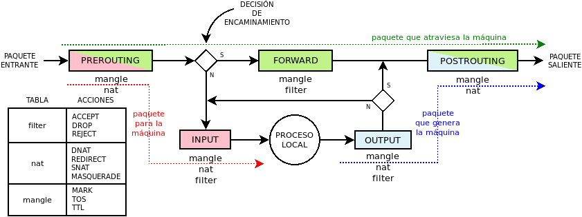

Conceptos básicos
*****************
.. note:: Centraremos las explicaciones en la principal herramienta:
   :program:`iptables`, y añadiremos al final algunas notas para
   :program:`ebtables` y :program:`arptables`. 

Partiendo de lo explicado, en general, para :program:`netfilter`, es fácil
particularizar para :program:`iptables`.

Conceptos
=========
En :program:`iptables` casi todos los :ref:`conceptos de netfilter
<netfilter-conceptos>` (excepto las propias reglas) están predefinidos de
antemano.

Familias
--------
Se usa una u otra aplicación dependiendo de cuál sea el tipo de tráfico
(:ref:`familia <netfilter-families>`) que queramos fiscalizar:

- Para tráfico |ARP| usaremos :command:`arptables`.
- Para la manipulación en capa 2 de trafico que entra o sale por interfaces
  *bridge* debe usarse :command:`ebtables`.
- Para el resto de tráfico, manipulable en capa de red y de transporte, usaremos
  :program:`iptables` (|IP|\ v4) o :program:`ip6tables` (|IP|\ v6).

Tablas
------
Ya está predefinidas sin posibilidad de añadir más:

**filter**
   Es la tabla que incluye las cadenas dedicadas a contener las reglas de
   filtrado, (o sea, de tipo *filter*) habituales.

**nat**
   Es la tabla que incluye las cadenas dedicadas a contener reglas de tipo
   *nat*.

   .. note:: Recuérdese que este tipo de reglas sólo se aplican al primer
      paquete de la conexión.

**mangle**
   Es una tabla que incluye cadenas con reglas de filtrado, dedicadas
   fundamentalmente a alternar algunos de los campos de cabecera |IP| (p.e.
   el |TTL| o el |TOS|). También se usan para alterar la *marca* del paquete, esto
   es, una marca que no se encuentra en el propio paquete, sino en la
   representación que el kernel hace del paquete, A efecto prácticos, dónde se
   encuentre realmente la marca nos importa poco.

**raw**
   Es la tabla que incluye cadenas con reglas de filtrado utilizada básicamente
   para marcar paquetes a fin de evitar el seguimiento de la conexión, o bien,
   para desecharlos antes de cualquier otra decisión. Para el tráfico con que
   hagamos esto, :program:`iptables` se comportará como un :ref:`cortafuegos sin
   inspección de estado <fw-stateless>`.

**security**
   Es la tabla que incluye cadenas con reglas de filtrado para crear reglas de
   seguridad |MAC|. Véase para más información `este artículo
   <https://www.linux.com/tutorials/using-selinux-and-iptables-together/>`_.

Enganches
---------
Dado que son cosa de :program:`netfilter`, son los :ref:`ya expuestos
<netfilter-hooks>`. Ahora bien, puesto que, por ahora nos centramos
exclusivamente en :program:`iptables`, podemos simplificar el esquema:

.. _iptables-flowchart:

.. note:: En este diagrama, los colores no identifican familias de tráfico, sino
   caminos del paquete.

Cadenas
-------
Podemos definir las *cadenas de usuario* que queramos, pero las *cadenas base*
están prestablecidas y lo único que nos será posible definir en ellas es la
política predeterminada de aceptación (*accept*) o rechazo (*drop*). Por
defecto, es *accept*.

Es fácil identificar las características de una *cadena base*, puesto que:

- Su nombre, aunque en mayúsculas, indica el :ref:`enganche <netfilter-hooks>`
  al que se asocia (p.e. una cadena *PREROUTING* se engancha a *prerouting*).
  Por ello y porque no hay posibilidad de crear más *cadenas base* de las
  predefinadas, podemos fundir en uno los conceptos de *enganche* y de *cadena
  base*. De hecho, eso es lo que se ha hecho al pintar el :ref:`diagrama de
  flujo simplificado <iptables-flowchart>` en el que se representan *cadenas
  base* y no *enganches*.
- La tabla a la que pertenece nos refiere su :ref:`prioridad <netfilter-prio>`
  (p.e. las cadenas de la tabla *mangle* tienen prioridad -150).
- También la tabla refiere el tipo de reglas: las que pertenecen a *nat* son
  cadenas de tipo de *nat* y las que pertenecen a todas las demás, de filtrado\
  [#]_.

Las cadenas predefinadas son las siguientes:

.. table::
   :class: chains-tables

   ========== ============ ======= ========= ======== =============
   \           PREROUTING   INPUT   FORWARD   OUTPUT   POSTROUTING
   ========== ============ ======= ========= ======== =============
   raw             Sí                           Sí
   mangle          Sí         Sí       Sí       Sí          Sí
   nat             Sí         Sí                Sí          Sí
   filter                     Sí       Sí       Sí
   security                   Sí       Sí       Sí
   ========== ============ ======= ========= ======== =============

.. note:: Como puede verse no hay ninguna cadena *INGRESS* lo que significa que
   no hay forma de utilizar ese enganche con :program:`iptables`. De ahí, que no
   se haya representado en el diagrama simplificado.

Es preciso puntualizar por qué existen cadenas en *nat* enganchadas a *input* y
*output*. Las cadenas de esta tabla sirven, fundamentalmente, para acciones de
|SNAT| y |DNAT|. Para un paquete entrante, podemos llevar a cabo |DNAT| en el
enganche *prerouting*, porque el paquete pasa por ahí. En cambio, un paquete
creado por un proceso interno, no pasa por ese enganche, y es en *output* donde
de ser necesario, se puede hacer el |DNAT|\ [#]_. Por otro lado, para los paquetes
salientes se puede hacer |SNAT| en *postrouting*, pero si una
aplicación local se comunica con otra aplicación local, el paquete nunca pasa
por ese enganche y es en *input* donde puede llevarse a cabo la operación\ [#]_.

Funcionamiento
==============
Si volvemos la vista al :ref:`diagrama simplificado de flujo
<iptables-flowchart>`, comprobaremos que los paquetes siguen tres caminos:

**Paquetes destinados al cortafuegos**
   Representados por la línea roja, el primer conjunto de reglas que se
   comprueba con ellos son las incluidas en la cadena *PREROUTING*, llamada así
   porque se aplican tales reglas antes de tomar la decisión de encaminamiento.
   Pasadas las reglas, se toma la decisión que por nuestra suposición será un
   proceso interno, lo que implica comprobar las reglas de la cadena *INPUT*. Si
   el paquete no es filtrado por alguna de estas últimas reglas, el paquete
   alcanzará el proceso al que iba destinado y ahí acabará su vida.

**Paquetes en tránsito**
   Representados por la línea verde, son los paquetes que alcanzan el
   cortafuegos, pero cuyo destino es otra máquina, por lo que utilizarán otra
   interfaz de red (excepcionalmente puede que sea la misma) para salir hacia su
   destino. En su caso la *decisión de encaminamiento* hace que sigan su curso
   atravesando la cadena *FORWARD*. Si logra atravesar esta cadena, comprobará
   a continuación *POSTROUTING*, pasada la cual se escoge según la dirección de
   destino la interfaz de salida y en paquete abandona la máquina.

**Paquetes generados por el cortafuegos**
   Representados por la línea azul, son los paquetes originados por un proceso
   interno del cortafuegos. En este caso se comprueban primero las reglas de la
   cadena *OUTPUT*. Si el paquete no es filtrado por alguna de sus reglas,
   alcanzará la cadena *POSTROUTING*, a partir de la cual se obrará de la misma
   forma que con el tipo anterior de paquetes.

.. _iptables-packet-type:

Además, en lo referente a la conexión, hay siete estados distintos

**NEW**
   Que es el estado del paquete que origina la conexión.

**ESTABLISHED**
   Que es el estado del paquete que pertenece a una conexión establecida.

**RELATED**
   Que es el estado del paquete que origina una conexión que se puede relacionar
   con otra que ya ha sido establecida. Por ejemplo, imaginemos que intentamos establecer
   una conexión |TCP| con un servidor remoto y este nos responde con un paquete |ICMP| de rechazo.
   El estado de este segundo paquete sería **RELATED**, ya que no forma parte de la conexión
   anterior, pero está relacionado con ella. También en el :ref:`tráfico FTP <iptables-ftp>` el paquete
   que abre la conexión de datos es es **RELATED** puesto que tal conexión está relacionada con la
   conexión de control.

**INVALID**
   Que es el estado de los paquetes que no se pueden relacionar con ninguna conexión establecida.

**UNTRACKED**
   Que es el estado de los paquetes de los que se decidió no hacer seguimiento
   de la conexión (con *NOTRACK*).

**SNAT**
   Que es el estado de los paquetes sobre los que se llevó a cabo un cambio
   en la |IP| de origen. También tiene este estado los paquetes de respuesta.

**DNAT**
   Que es el estado de los paquetes sobre los que se llevó a cabo un cambio
   en la |IP| de destinoo. También tiene este estado los paquetes de respuesta.

Estos estados no son excluyentes en todos los casos. Por ejemplo, un paquete
puede a la vez ser parte de una conexión establecida a la que se aplica
enmascaramiento (o sea, |SNAT|)\ [#]_.

.. _iptables-sintaxis:

Sintaxis
========
Dado que la estructura de tablas y cadenas está ya predefinida, las reglas de
:program:`iptables` consiste básicamente en definir las reglas.
Por ejemplo, esta es una sentencia válida::

   # iptables -A FORWARD -p tcp --dport 25 -j DROP

El primer :kbd:`-A FORWARD`, indica que vamos a añadir esta regla al final de la
cadena *FORWARD*. La acción es *DROP*, o sea, desechar; y la condición es
:kbd:`-p tcp --dport 25`, o sea, protocolo |TCP| con puerto de destino el 25.
Esto quiere decir que cualquier paquete que cumpla con esto (posiblemente sea
tráfico |SMTP| de salida), está vetado y no atravesará nuestro cortafuegos. ¿Qué
pasa con el tráfico web? Como el tráfico web es bastante improbable que tenga
como destino el puerto 25, no cumplirá la condición, y no será desechado; al
menos por esta regla.

Es muy importante recordar que dentro de una cadena las reglas se comprueban
siguiendo un orden, y que las acciones pueden ser terminales (se dejan de
comparar el resto de las reglas) como en el caso de ejemplo, o no serlo como por
ejemplo::

   # iptables -A FORWARD -p tcp --dport 25 -j LOG --log-prefix "Cliente hace petición SMTP"
   # iptables -A FORWARD -p tcp --dport 25 -j DROP

En este caso primero se registra el paquete, pero como la regla no es termina,
la siguiente desecha el paquete.

En general las sentencia que crean reglas tiene este aspecto::

   # iptables [-t TABLA] [opciones] -ACCIÓN CADENA [condiciones] [-j OBJETIVO [opciones_del_objetivo]]

en donde se observa que hay cuatro partes fundamentales: 

* la elección de la tabla, 
* Cuál es la acción que se quiere llevar a cabo y sobre qué cadena.
* La condición o condiciones que debe cumplir un paquete para que se le apliqye la regla;
* El objetivo u acción.

Acción
------
Básicamente indican qué se quiere hacer con la regla: si añadirla, borrarla o
alternarla y sobre qué cadena se lleva a cabo tal acción:

.. table::
   :class: iptables-action

   +--------------------------------+---------------------------------------------------------------------------------+
   | Acción                         | Descripción                                                                     |
   +================================+=================================================================================+
   | -A <cadena>                    | Añade la nueva regla al final de la cadena                                      |
   |                                +---------------------------------------------------------------------------------+
   |                                | iptables -A INPUT -p tcp --dport 80 -j DROP                                     |
   +--------------------------------+---------------------------------------------------------------------------------+
   | -I <cadena> [N]                | Añade la nueva regla a la cadena en la posición que se especifique. Si no se    |
   |                                | expresa ninguna, se sobreentiente que en la primera.                            |
   |                                +---------------------------------------------------------------------------------+
   |                                | iptables -I INPUT -p tcp --dport 80 -j DROP                                     |
   +--------------------------------+---------------------------------------------------------------------------------+
   | -D <cadena> [N]                | Borrar una regla de la cadena indicada. Hay dos formas de indicar cuál:         |
   |                                |                                                                                 |
   |                                | * Volverla a escribir tal y como se definió.                                    |
   |                                | * Indicar su número de posición dentro de la cadena.                            |
   |                                +---------------------------------------------------------------------------------+
   |                                | iptables -D INPUT -p tcp --dport 80 -j DROP                                     |
   |                                | iptables -D INPUT 1                                                             |
   +--------------------------------+---------------------------------------------------------------------------------+
   | -R <cadena> [N]                | Reemplaza una regla por otra. Se indica la posición de la regla a reemplazar y  |
   |                                | a continuación la regla sustituta.                                              |
   |                                +---------------------------------------------------------------------------------+
   |                                | iptables -R INPUT 1 -p tcp --dport 8080 -j DROP                                 |
   +--------------------------------+---------------------------------------------------------------------------------+
   | -F [<cadena>]                  | Borrar todas las reglas referentes a una tabla de la cadena. Si no se indica la |
   |                                | cadena, borra todas las reglas de todas las cadenas de una tabla.               |
   |                                +---------------------------------------------------------------------------------+
   |                                | iptables -t nat -F PREROUTING                                                   |
   +--------------------------------+---------------------------------------------------------------------------------+
   | -Z [<cadena>]                  | Pone a cero los contadores de paquetes de la cadena especificada. Si no se      |
   |                                | indica cadena, se aplica a todas las de la tabla. Los contadores muestran el    |
   |                                | número de paquetes que han cumplido las condiciones de la regla.                |
   |                                +---------------------------------------------------------------------------------+
   |                                | iptables -Z                                                                     |
   +--------------------------------+---------------------------------------------------------------------------------+
   | -N <cadena_de_usaurio>         | Crea una nueva cadena. Para que los paquetes comprueben sus reglas, será        |
   |                                | necesario saltar a ella desde una de las cadenas predefinidas. Hay un objetivo  |
   |                                | para ello.                                                                      |
   |                                +---------------------------------------------------------------------------------+
   |                                | iptables -N proxy                                                               |
   +--------------------------------+---------------------------------------------------------------------------------+
   | -X <cadena_de_usuario>         | Borra una cadena creada anteriormente.                                          |
   |                                +---------------------------------------------------------------------------------+
   |                                | iptables -X proxy                                                               |
   +--------------------------------+---------------------------------------------------------------------------------+
   | -P [<cadena>] [ACCEPT|DROP]    | Establece la política predeterminada de filtrado:                               |
   |                                |                                                                                 |
   |                                | * Lista blanca: *DROP*.                                                         |
   |                                | * Lista negra: *ACCEPT*.                                                        |
   |                                +---------------------------------------------------------------------------------+
   |                                | iptables -P INPUT ACCEPT                                                        |
   +--------------------------------+---------------------------------------------------------------------------------+
   | -L [<cadena>]                  | Muestra las reglas añadidas a una cadena. Si no se especifica ninguna, muestra  |
   |                                | todas las cadenas de la tabla. Son útiles para esta acción, :kbd:`-v`, que      |
   |                                | muestra los contadores de paquetes, :kbd:`-n` que muestra direcciones |IP| y no |
   |                                | nombres de máquinas y :kbd:`--line-numbers` que muestra la posición de la regla |
   |                                | y puede ser usada en las acciones de borrado, inserción y remplazo.             |
   |                                +---------------------------------------------------------------------------------+
   |                                | iptables -t nat --line-numbers -nvL PREROUTING                                  |
   +--------------------------------+---------------------------------------------------------------------------------+

Objetivo
--------
El :dfn:`objetivo` es la operación que se lleva a cabo sobre el paquete en caso
de que le sea aplicable la regla.

.. table::
   :class: iptables-objetivo

   +--------+--------------+----------------------------------------------------------------------------------------+
   | Tabla  | Objetivo     | Descripción                                                                            |
   +========+==============+========================================================================================+
   | filter | ACCEPT       | Se acepta el paquete y no se analizan más reglas de las cadenas de la tabla.           |
   |        |              +----------------------------------------------------------------------------------------+
   |        |              | iptables -A INPUT -p icmp -j ACCEPT                                                    |
   |        +--------------+----------------------------------------------------------------------------------------+
   |        | DROP         | Desecha el paquete sin informar al emisor. Por ello, sólo considerará fallida la       |
   |        |              | conexión tras un tiempo de espera. Obviamente, no es revisada ninguna regla posterior. |
   |        |              +----------------------------------------------------------------------------------------+
   |        |              | iptables -A INPUT -p icmp -j DROP                                                      |
   |        +--------------+----------------------------------------------------------------------------------------+
   |        | REJECT       | Rechaza un paquete enviando al emisor el aviso del rechazo mediante un paquete |ICMP|. |
   |        |              | Se puede especificar el tipo de |ICMP| mediante :kbd:`--reject-with` y, en el caso,    |
   |        |              | de conexiones |TCP| se puedfe usar *tcp-reset* para enviar un paquete *RST* que cierre |
   |        |              | elegantemente la conexión. Si no se incluye la opción se envía :kbd:`port-unreachable`.|
   |        |              +----------------------------------------------------------------------------------------+
   |        |              | iptables -A FORWARD -p tcp --dport 25 -j REJECT --reject-with tcp-reset                |
   |        +--------------+----------------------------------------------------------------------------------------+
   |        | LOG          | Registra en un archivo el paquete que cumple las condiciones de la regla. De las       |
   |        |              | opciones posibles la más útil es :kbd:`--log-prefix` que permite añadir un prefijo a   |
   |        |              | las anotaciones, lo cual puede ser útil para filtrar esas anotaciones. Vea más         |
   |        |              | adelante :ref:`como realizar anotaciones en el registro <iptables-log>`. El objetivo   |
   |        |              | no altera la comprobación de las reglas posteriores.                                   |
   |        |              +----------------------------------------------------------------------------------------+
   |        |              | | iptables -A FORWARD -p tcp --dport 25 -j LOG --log-prefix="[netfilter]               |
   |        |              | | iptables -A FORWARD -p tcp --dport 25 -j REJECT --reject-with tcp-reset              |
   +--------+--------------+----------------------------------------------------------------------------------------+
   | nat    | SNAT         | Cambia la |IP| de origen del paquete. Sólo está disponible en las cadenas              |
   |        |              | *POSTROUTING* e *INPUT* de la tabla *nat*. Necesita la opción :kbd:`--to-source` para  |
   |        |              | indicar cuál es la |IP| sustituta.                                                     |
   |        |              +----------------------------------------------------------------------------------------+
   |        |              | iptables -t nat -A POSTROUTING -o eth0 -j SNAT --to-source 172.22.0.2                  |
   |        +--------------+----------------------------------------------------------------------------------------+
   |        | MASQUERADE   | Cambia la |IP| de origen del paquete por la |IP| de salida del cortafuegos. Útil       |
   |        |              | cuando la |IP| es dinámica.                                                            |
   |        |              +----------------------------------------------------------------------------------------+
   |        |              | iptables -t nat -A POSTROUTING -o eth0 -j MASQUERADE                                   |
   |        +--------------+----------------------------------------------------------------------------------------+
   |        | DNAT         | Cambia la |IP| de destino del paquete. Debe hacerse en la cadena *PREROUTING* o en     |
   |        |              | *OUTPUT* de la tabla *nat*. Necesita la opción :kbd:`--to-destination` para indicar la |
   |        |              | |IP| sustituta. Puede además modificarse el puerto de destino separándolo con dos      |
   |        |              | puntos (":kbd:`:`").                                                                   |
   |        |              +----------------------------------------------------------------------------------------+
   |        |              | iptables -t nat -A PREROUTING -p udp --dport 53 -j DNAT --to-destination 172.22.0.1    |
   |        +--------------+----------------------------------------------------------------------------------------+
   |        | REDIRECT     | Cambia la |IP| de destino a ``127.0.0.1``. Puede añadirse la opción :kbd:`--to-port`   |
   |        |              | para modificar el puerto de destino. Puede usarse en *PREROUTING* o en *OUTPUT*.       |
   |        |              +----------------------------------------------------------------------------------------+
   |        |              | iptables -t nat -A PREROUTING -p tcp --dport 80 -j REDIRECT --to-port 3128             |
   +--------+--------------+----------------------------------------------------------------------------------------+
   | mangle | MARK         | Sirve para marcar la representanción del paquete en el núcleo de *Linux*, con el fin   |
   |        |              | de que más adelante el propio :program:`iptables` u otro proceso reconozca la marca.   |
   |        |              | Debe usarse con la opción :kbd:`--set-mark` para fijar la marca (un byte).             |
   |        |              +----------------------------------------------------------------------------------------+
   |        |              | iptables -t nat -A PREROUTING -p tcp --dport 22 -j MARK --set-mark 0x2                 |
   |        +--------------+----------------------------------------------------------------------------------------+
   |        | TOS          | Cambia el |TOS| del paquete.                                                           |
   |        |              +----------------------------------------------------------------------------------------+
   |        |              | iptables -t nat -A PREROUTING -p tcp --dport 22 -j TOS --set-tos 0x10                  |
   |        +--------------+----------------------------------------------------------------------------------------+
   |        | TTL          | Cambia el |TTL| del paquete.                                                           |
   |        |              +----------------------------------------------------------------------------------------+
   |        |              | iptables -t nat -A PREROUTING -p tcp --dport 22 -j TTL --set-ttl 64                    |
   +--------+--------------+----------------------------------------------------------------------------------------+
   | raw    | NOTRACK      | Evitar hacer el seguimiento de la conexión. Puede usarse en las cadenas *PREROUTING* y |
   |        |              | *OUTPUT*.                                                                              |
   |        |              +----------------------------------------------------------------------------------------+
   |        |              | iptables -t raw -A PREROUTING -p udp --dport 53 -j NOTRACK                             |
   |        +--------------+----------------------------------------------------------------------------------------+
   |        | DROP         | Como lo anterior, pero descarta el paquete en vez de dejarlo pasar y no hacerle        |
   |        |              | seguimiento. Si nuestra intención es filtrar un tráfico vaya a la máquina o pretenda   |
   |        |              | atravesarlo, este el mejor momento, ya que sólo requiere una regla en vez de dos, una  |
   |        |              | para cada tabla y, además, se realiza antes de tomar ninguna decisión con lo que es    |
   |        |              | más eficiente.                                                                         |
   |        |              +----------------------------------------------------------------------------------------+
   |        |              | iptables -t raw -A PREROUTING -p udp --dport 53 -j DROP                                |
   +--------+--------------+----------------------------------------------------------------------------------------+
   | Todas  | nueva_cadena | Hace que la comprobación de reglas salte a la nueva cadena, que previamente tuvo que   |
   |        |              | ser definida. Si esto ocurre, se comprobarán las reglas incluidas en esta cadena y, si |
   |        |              | se agotan, se volverá a la cadena en la que se incluyó el salto justamente tras la     |
   |        |              | regla que provocó el salto.                                                            |
   |        |              +----------------------------------------------------------------------------------------+
   |        |              | iptables -A INPUT -j indeseables                                                       |
   |        +--------------+----------------------------------------------------------------------------------------+
   |        | RETURN       | Hace que el paquete cese la comprobación de las reglas de la cadena y vuelva a la      |
   |        |              | cadena de orden superior (p.e. un *RETURN* en indeseables, provoca el regreso a INPUT).|
   |        |              | Si no hay cadena de orden superior, se aplica la política predefinida de la cadena.    |
   |        |              +----------------------------------------------------------------------------------------+
   |        |              | iptables -t nat -A PREROUTING -i eth1 -s 192.168.9.208/28 -p tcp --dport 80 -j RETURN  |
   |        +--------------+----------------------------------------------------------------------------------------+
   |        | CONNMARK     | Define marcas para una conexión. La diferencia entre *MARK* y *CONNMARK* es que la     |
   |        |              | primera marca paquetes individuales, mientras que la segunda, una vez usada, marcará   |
   |        |              | todos los paquetes que pertenezcan a la misma conexión. Las marcas de paquete y de     |
   |        |              | conexión son dos campos independientes. Tiene dos grandes utilidades: por un lado,     |
   |        |              | posibilita tener marcados los paquetes de vuelta o incluso paquetes de una conexión    |
   |        |              | relacionada; por otro. Se usa fundamentalmente en la tabla *nat*, ya que de esta forma |
   |        |              | se lleva a cabo la definición sólo en el primer paquete.                               |
   |        |              +------------------+---------------------------------------------------------------------+
   |        |              | --set-mark       | Fija la marca de conexión.                                          |
   |        |              |                  +---------------------------------------------------------------------+
   |        |              |                  | iptables -t nat -A PREROUTING -i eth1 -j CONNMARK --set-mark 1      |
   |        |              +------------------+---------------------------------------------------------------------+
   |        |              | --restore-mark   | Copia el valor de la marca de conexión en la marca de paquete.      |
   |        |              |                  +---------------------------------------------------------------------+
   |        |              |                  | iptables -t mangle -A FORWARD -j CONNMARK --restore-mark-mark 1     |
   |        |              +------------------+---------------------------------------------------------------------+
   |        |              | --save-mark      | Guarda la marca de paquete en la marca de conexión                  |
   |        |              |                  +---------------------------------------------------------------------+
   |        |              |                  | iptables -t nat -A POSTROUTING -j CONNMARK --save-mark              |
   +--------+--------------+------------------+---------------------------------------------------------------------+

Condición
---------
Hace aplicable la regla sobre el paquete, de suerte que todos aquellos paquetes
que la cumplan realizarán el objetivo expresado en la regla. A cuenta de las
condiciones es conveniente saber que:

* Pueden expresarse varias condiciones lo que implica que deban cumplirse
  todas. Por ejemplo, en::

   # iptables -t nat -A PREROUTING -i eth1 -s 192.168.9.208/28 -p tcp --dport 80 -j RETURN

  hay tres condiciones independientes: :kbd:`-i eth1` que expresa cuál es la
  interfaz de entrada, :kbd:`-s 192.168.9.208/28`, que expresa cuál es la red
  de origen, y :kbd:`-p tcp --dport 80`, que fuerza a que el puerto de destino
  sea el 80/|TCP|. Si no se cumplen las condiciones, el paquete no llevará a
  cabo el objetivo (**RETURN**).

* Las condiciones pueden admitir el uso de opciones. En el ejemplo, la
  condición es :kbd:`-p tcp` (protocolo |TCP|), pero esta condición admite como
  opción que se especifique un puerto, de ahí que hayamos podido añadir
  :kbd:`--dport 80`.

* Las condiciones pueden negarse anteponiendo el carácter :kbd:`!`. Por
  ejemplo, :kbd:`! -i eth1` significa cualquier interfaz de entrada, excepto la *eth1*;
  o :kbd:`-p tcp ! --dport 80` cualquier puerto |TCP| excepto el 80.

* Podemos distinguir dos tipos de condiciones:

  + Las condiciones *simples* que son aquellas que se refieren al origen o
    destino del paquete (ya sea referido a la interfaz o a su dirección |IP|) o a su
    protocolo de capa de red (|IP|, |ICMP|) o de transporte (|TCP|, |UDP|). En este
    último caso, podremos inquirir sobre sus puertos de origen o destino.

  + Las condiciones que requieren un módulo o extensión, las cuales requieren
    que se especifique qué`extensión es la que se usa a través de la opción
    :kbd:`-m` o :kbd:`--match`.

.. rubric:: Condiciones simples

.. table::
   :class: iptables-simpl-cond

   +-----------------------+--------------------------------------------------------------------------------------+
   | Opción                | Descripción                                                                          |
   +=======================+======================================================================================+
   | -p, --protocol        | Protocolo de capa de transporte del paquete. Los valores posibles son                |
   |                       | :kbd:`udp`, :kbd:`tcp`, :kbd:`icmp` o :kbd:`all` (o sea, todos).                     |
   |                       +--------------------------------------------------------------------------------------+
   |                       | iptables -A FORWARD -p icmp -j REJECT                                                |
   |                       +------------------------------+-------------------------------------------------------+
   |                       | --sport, --source-port       | Para |TCP| o |UDP|, indicar puerto de origen.         |
   |                       |                              | Para indicar im rango, úsense dos puntos:             |
   |                       |                              | :kbd:`80:100`.                                        |
   |                       |                              +-------------------------------------------------------+
   |                       |                              | iptables -A FORWARD -p tcp --sport 80 -j ACCEPT       |
   |                       +------------------------------+-------------------------------------------------------+
   |                       | --dport, --destination-port  | Para |TCP| o |UDP|, indica puerto de destino.         | 
   |                       |                              +-------------------------------------------------------+
   |                       |                              | iptables -A FORWARD ! -p tcp --dport 80 -j ACCEPT     |
   |                       +------------------------------+-------------------------------------------------------+
   |                       | --tcp-flags                  | Para |TCP|,  permite seleccionar paquetes según       |
   |                       |                              | sus *flags*: *SYN*, *ACK*, *FIN*, *RST*, *ALL*        |
   |                       |                              | (todas) o *NONE* (ninguna). Si quieren expresarse     |
   |                       |                              | varias pueden separarse por comas. Admite dos         |
   |                       |                              | parámetros el primero cuáles se buscan y el           |
   |                       |                              | segundo cuáles se esperan encontrar. :kbd:`--syn`     |
   |                       |                              | equivale a :kbd:`--tcp-flags SYN,RST,ACK,FIN SYN`.    |
   |                       |                              +-------------------------------------------------------+
   |                       |                              | iptables -A INPUT -p tcp --tcp-flags ALL SYN -j DROP  |
   |                       +------------------------------+-------------------------------------------------------+
   |                       | --icmp-type                  | Para |ICMP|, especifica el tipo de paquete |ICMP|     |
   |                       |                              | :rfc:`792`.                                           |
   |                       |                              +-------------------------------------------------------+
   |                       |                              | iptables -A FORWARD -p icmp ! --icmp-type 8 -j DROP   |
   +-----------------------+------------------------------+-------------------------------------------------------+
   | -s, --source          | |IP| de origen que puede ser una dirección simple o una red en notación |CIDR|       |
   |                       | (p.e. ``192.168.0.0/24``) o expresando la máscara ``192.168.0.0/255.255.255.0``.     |
   |                       +--------------------------------------------------------------------------------------+
   |                       | iptables -A INPUT -s 192.168.0.0/24 -j DROP                                          |
   +-----------------------+--------------------------------------------------------------------------------------+
   | -d, --destination     | |IP| de destino.                                                                     |
   |                       +--------------------------------------------------------------------------------------+
   |                       | iptables -A FORWARD -d 192.168.0.0/24 -j DROP                                        |
   +-----------------------+--------------------------------------------------------------------------------------+
   | -i, --in-interface    | Interfaz de entrada del paquete. Válida sólo en *PREROUTING*, *INPUT* y *FORWARD*.   |
   |                       +--------------------------------------------------------------------------------------+
   |                       | iptables -A FORWARD -i eth0 -p tcp --tcp-flags SYN -j DROP                           |
   +-----------------------+--------------------------------------------------------------------------------------+
   | -o, --out-interface   | Interfaz de salida del paquete. Válida sólo en *POSTROUTING*, *OUTPUT* y *FORWARD*.  |
   |                       +--------------------------------------------------------------------------------------+
   |                       | iptables -t nat -A POSTROUTING -o eth0 -j MASQUERADE                                 |
   +-----------------------+--------------------------------------------------------------------------------------+

.. rubric:: Extensiones

Cualquier otra condición no incluida en las simplas que refiere la tabla
anterior, son condiciones que requieren de un módulo invocado a través de las
opciones :kbd:`-m` o :kbd:`--match`. No trataremos todas y algunas muy
específicas las referiremos en epígrafe aparte.

.. table::
   :class: iptables-ext

   +-----------+---------------------+--------------------------------------------------------------------------------+
   | Extension | Opción              | Descripción                                                                    |
   +===========+=====================+================================================================================+
   | multiport | --sports            | Lista de puertos de origen. Admite comas y dos puntos para rangos.             |
   |           |                     +--------------------------------------------------------------------------------+
   |           |                     | iptables -A FORWARD --p tcp -m multiport --source-port 22,23,80:100 -j DROP    |
   |           +---------------------+--------------------------------------------------------------------------------+
   |           | --dports            | Lista de puertos de destino. Admite comas y dos puntos para rangos.            |
   |           |                     +--------------------------------------------------------------------------------+
   |           |                     | iptables -A FORWARD --p tcp -m multiport --source-port 22,23,80:100 -j DROP    |
   +-----------+---------------------+--------------------------------------------------------------------------------+
   | mark      | --mark              | Marca del paquete.                                                             |
   |           |                     +--------------------------------------------------------------------------------+
   |           |                     | iptables -A INPUT -m mark --mark 1 -j DROP                                     |
   +-----------+---------------------+--------------------------------------------------------------------------------+
   | connmark  | --connmark          | Marca de la conexión.                                                          |
   |           |                     +--------------------------------------------------------------------------------+
   |           |                     | iptables -t nat -A POSTROUTING -o eth0 -m connmark --mark 0x2 -j MASQUERADE    |
   +-----------+---------------------+--------------------------------------------------------------------------------+
   | mac       | --mac-source        | Mac de origen.                                                                 |
   |           |                     +--------------------------------------------------------------------------------+
   |           |                     | iptables -A INPUT -m mac --mac-source 00:11:22:33:44:55 -j DROP                |
   +-----------+---------------------+--------------------------------------------------------------------------------+
   | physdev   | Sirve para manipular de modo muy limitado **tráfico conmutado**, no encaminado.                      |
   |           +---------------------+--------------------------------------------------------------------------------+
   |           | -physdev-in         | Interfaz de entrada.                                                           |
   |           |                     +--------------------------------------------------------------------------------+
   |           |                     | iptables -A INPUT -p tcp --dport 25 -m physdev --physdev-in eth1 -j DROP       |
   |           +---------------------+--------------------------------------------------------------------------------+
   |           | -physdev-out        | Interfaz de salida.                                                            |
   |           |                     +--------------------------------------------------------------------------------+
   |           |                     | iptables -A OUTPUT -p tcp --dport 25 -m physdev --physdev-out eth0 -j DROP     |
   |           +---------------------+--------------------------------------------------------------------------------+
   |           | -physdev-is-bridged | Comprueba si el tráfico es conmutado  Solo en *FORWARD* y *POSTROUTING*.       |
   |           |                     +--------------------------------------------------------------------------------+
   |           |                     | iptables -A FORWARD -m physdev --physdev-is-bridged -o br0 -j ACCEPT           |
   +-----------+---------------------+--------------------------------------------------------------------------------+
   | string    | Su contenido incluye una cadena.                                                                     |
   |           +---------------------+--------------------------------------------------------------------------------+
   |           | --algo bm|kmp       | Algoritmo de búsqueda. *bm* es más rápido pero menos exhaustivo                |
   |           +---------------------+--------------------------------------------------------------------------------+
   |           | --string            | Cadena a comprobar.                                                            |
   |           |                     +--------------------------------------------------------------------------------+
   |           |                     | iptables -A FORWARD -m string --string "facebook" --algo bm -j DROP            |
   +-----------+---------------------+--------------------------------------------------------------------------------+

Además, trataremos más adelante:

- :ref:`state y conntrack <iptables-conn>`.
- :ref:`limit <iptables-limit>`.
- :ref:`recent <iptables-recent>`.
- :ref:`set <ipt-ipset>`.

Persistencia
============
Las reglas de :program:`iptables` no son permanentes, por lo que cualquier
apagado de la máquina las limpia por completo. Por ello, cuando se han definido
todas las reglas adecuadas, es muy importante buscar un buen método para
recuperarñas tras cada arranque. Tenemos varias alternativas:

**Restauración**
   Las órdenes :command:`iptables-save` e :command:`iptables-restore` permiten
   guardar y recuperar respectivamente las reglas de :command:`iptables`. Así,
   una vez que tenemos perfectamente configurado el cortafuegos puede hacerse::

      # iptables-save > /etc/iptables.rules

   Para recuperar estas reglas tras un reinicio, es preciso ejecutar
   automáticamente :command:`iptables-restore`, lo cual podemos lograr
   incluyéndo est linea en :file:`/etc/tc.local`:

   .. code-block:: bash

      iptables-restore < /etc/iptables.rules

   .. note:: :command:`ebtables` y :command:`arptables` tienen órdenes
      equivalentes.

**Script**
   Consiste en crear un script de la *shell* en que se introduzcan las órdenes
   que generan la configuración deseada:

   .. code-block:: bash

      #!/bin/sh

      iptables -P INPUT DROP
      iptables -P OUTPUT DROP
      iptables -P FORWARD DROP

      # etc...

   Para que el *script* se ejecute al arrancar se puede invocar desde
   :file:`/etc/rc.local`.

**Script para interfaces** (sólo debian)

   .. todo:: Por escribir.

.. rubric:: Notas al pie

.. [#] No hay reglas de tipo *route*.
.. [#] Porque queremos engañar a la máquina con la que nos comunicamos
   haciéndole creer que somos otra. Obviamente, la única manera de que esto
   funcione, es que los paquetes que nuestra comunicamte envía a la máquina
   suplantada, pasen forzosamente por la nuestra.
.. [#] En este caso, para hacer crear a nuestra aplicación que se comunica con
   una aplicación externa.
.. [#] De hecho, en :program:`nftables` se distingue entre :kbd:`state` (*new*,
   *established*, *related*, *invalid* o *untracked*) y :kbd:`status` (*snat* o
   *dnat*).

.. |MAC| replace:: :abbr:`MAC (Media Access Control)`
.. |TCP| replace:: :abbr:`TCP (Transmission Control Protocol)`
.. |UDP| replace:: :abbr:`UDP (User Datagram Protocol)`
.. |ICMP| replace:: :abbr:`ICMP (Unternet Control Message Protocol)`
.. |NAT| replace:: :abbr:`NAT (Network Address Translation)`
.. |DNAT| replace:: :abbr:`DNAT (Destination NAT)`
.. |SNAT| replace:: :abbr:`SNAT (Source NAT)`
.. |TTL| replace:: :abbr:`TTL (Time To Live)`
.. |TOS| replace:: :abbr:`TOS (Type Of Service)`
.. |CIDR| replace:: :abbr:`CIDR (Classless Inter-Domain Routing)`
.. |ARP| replace:: :abbr:`Address Resolution Protocol`
