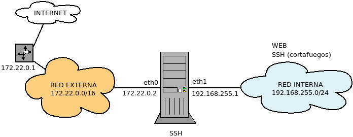

.. _nftables-uso:

Uso práctico
************
Se tratarán, porque ayudan a ilustrar el uso del cortafuegos, :ref:`los mismos
casos que se estudiaron con iptables <iptables-uso>`. Como en aquella ocasión,
se aplicará siempre una política de **lista blanca**.

Casos ejemplares
================
Los tres casos que ayudan a entender el seguimiento de las conexiones son:

Conexión a servidor genérico
----------------------------
Se considera el siguiente esquema:

.. image:: ../01.iptables/files/casos-conexion-simple.png

en el que nuestro cortafuegos se interpone entre una red interna de clientes y
el exterior. Esta red externa puede o no ser internet. Lo que realmente
distingue a la red externa de la interna es que en la interfaz con la que
conecta el cortafuegos (*eth0*) se hace enmascaramiento, de manera que los
clientes internos son conscientes de que se comunican con el exterior, mientras
que las máquinas externas no son capaces de ver más allá de esta interfaz. Así
pues, será necesaria una regla de enmascaramiento.

Estudiemos dos casos de distintos de conexión de un cliente a un servidor:

* El caso en que un cliente interno quiere conectar con un servidor web externo.
* El caso en que un cliente externo quiere conectar con un servidor web de la red
  interna (supondremos su |IP| *192.168.255.2*).

.. _nftables-lista-blanca:

Tomaremos como base la siguiente configuración:

.. code-block:: bash

   #!/usr/sbin/nft -f

   flush ruleset

   table ip filter {
      chain INPUT {
         type filter hook input priority filter
         policy drop

         iiftype loopback accept
      } 

      chain OUTPUT {
         type filter hook output priority filter
         policy drop

         oiftype loopback accept
      }

      chain FORWARD {
         type filter hook forward priority filter
         policy drop
      }
   }

   include "./nftables.d/*.nft"

.. _nftables-masq:

A la cual añadiremos esta (por ejemplo, en el fichero
:file:`99-masquerade.nft`)::

   # /etc/nftables/99-masquerade.nft

   table ip nat {
      chain POSTROUTING {
         type nat hook postrouting priority srcnat

         oif eth0 snat to 172.22.0.2
      }
   }

**Servidor externo**
   Las claves para la configuración son:

   - Los clientes deben ser capaces de hacer la petición web atravesando el
     cortafuegos y, por supuesto, el tráfico consecuente debe atravesarlo también.

   - Para navegar es necesario resolver nombres, de modo que las peticiones
     |DNS| también deben poder atravesar el *router*.

   Esto podemos implementarlo añadiendo la siguiente configuración:

   .. code-block:: bash

      # /etc/nftables/10-external.nft
      #
      # Servicios del exterior accesibles desde la red interna.
      #

      table ip filter {
         chain FORWARD {
            ct state established accept

            oif eth0 tcp dport {http, https} accept comment "Acceso Web"
            oif eth0 udp dport domain accept comment "Resolución de nombres"
            oif eth0 tcp dport domain accept comment "Resolución de nombres"
         }
      }

   .. note:: Como la cadena ya existe, las reglas se añaden. No es esto, aunque
      lo parezca, una cadena de usuario.

   .. note:: Dado que queremos que el tráfico de los clientes fluya
      libremente por el servidor, podríamos mejorar el rendimiento de la
      solución usando :ref:`flowtables <nftables-flowtables>`, que consiste
      en sustituir el código de la cadena *CHAIN* por el siguiente:

      .. code-block:: bash

         # /etc/nftables/10-external.nft
         #
         # Servicios del exterior accesibles desde la red interna.
         #

         table ip filter {
            flowtable bypass {
               hook ingress priority 0
               devices = {eth0, eth1}
            }

            chain atajo {
               flow add @bypass
               accept
            }

            chain FORWARD {
               oif eth0 tcp dport {http, https} jump atajo
               oif eth0 udp dport domain jump atajo
               oif eth0 tcp dport domain jump atajo

               # ¿Por qué es necesario esto para que no se eternice el DNS?
               ct state established accept
            }
         }

      No volveremos a tratar esta posibilidad en los ejemplos, pero téngala en
      consideración.

**Servidor interno**
   La diferencia radical es que los clientes, que están en la red externa,
   desconocen por completo que el servidor web es en realidad una máquina interna
   e intentan la conexión directamente al cortafuegos. Por tanto, el cortafuegos
   deberá hacer una redirección hacia la máquina servidor:

   .. code-block:: bash

      # /etc/nftables.d/10-internal.nft

      table ip nat {
         chain PREROUTING {
            type nat hook prerouting priority dstnat

            iif eth0 tcp dport {http, https} dnat to 192.168.255.2 comment "Acceso al servidor web"
         }
      }

      table ip filter {
         chain FORWARD {
            ct status dnat accept

            # Es probable que se quiera que el servidor acceda al exterior...
         }
      }

   Es probable que el servidor web, para funcionar correctamente, requiera
   poder conectarse al exterior, pero deberá analizarse en cada caso.

Conexión a servidor |FTP|
-------------------------
La dificultad de este protocolo es que utiliza dos canales de comunicación: el
de control y el de datos.

.. seealso::  Lea con atención el epígrafe sobre los :ref:`modos de
   funcionamiento de FTP <ftp-modos>`.

La dificultad del protocolo radica en el establecimiento del canal de datos
relacionado con el de control, sobre todo en el caso del modo activo, en el cual
el canal lo abre el servidor, no el cliente. Los cortafuegos de inspección de
estado son capaces de lidiar con esta dificultad gracias a que son capaces de
distinguir conexiones y estimar si una conexión está relacionada con otra.

Antes de pasar a analizar las reglas concretas, deben tenerse presente tres
cosas:

- Para que :program:`netfilter` sea capaz de identificar el canal de datos como
  conexión relacionada, necesita entender y analizar la conexión |FTP|. Esto
  se logra cargando un módulo::

   # modprobe nf_conntrack_ftp

- Cuando en un *router* se lleva a cabo enmascaramiento (como es el caso de
  nuestro cortafuegos), las máquinas externas creen estar comunicándose con el
  *router*, no con una máquina interna, lo cual provocará que:

  + En el *modo activo* cuando el servidor es externo, éste intentará abrir el
    canal de datos con el *router*, no con cliente, por lo que el *router*
    tendrá que hacer un |DNAT|. Esta dificultad es fácil de solucionar, porque
    el puerto de origen siempre es el *20/TCP*.

  + En el *modo pasivo* cuando el servidor es interno, el cliente intentará
    abrir el canal de datos con el *router*, no con el servidor, po lo que habrá
    que hacer |DNAT|. El problema es que no hay definidos puertos típicos para
    este canal de datios, sino que los puertos de cliente y servidor varían
    de conexión a conexiín. En consecuencia, es imposible hacer una regla
    estática que nos resuelva este problema.

  Afoortunadamente, el núcleo de *linux* incorpora otro módulo que es capaz de
  reconocer cuándo debe hacerse el |DNAT| y lo lleva a cabo::

   # modprobe nf_nat_ftp

- Para que lo anterior funcione, es necesario que el núcleo sepa cuáles son las
  conexiones que debe monitorizar en busca de conexiones relacionadas. Estos
  monitores reciben el nombre de :dfn:`helpers` y hay un puñado de ellos
  definidos. |FTP| tiene el suyo y hay también que declarar que quiere usarse.
  Si se trabaja con :program:`iptables`, debe cambiarse un parámetro del núcleo,
  pero con :program:`nftables` la declaración del *helper* se lleva a cabo
  dentro de la propia configuración.

  .. https://shorewall.org/Helpers.html

.. _nftables-modulos-ftp:

.. note:: Para automatizar en el arranque la carga de los dos módulos anteriores
   lo más cómodo es hacer::

      # cat > /etc/modules-load.d/ftp.conf
      nf_conntrack_ftp
      nf_nat_ftp

Resolvamos ahora el mismo caso que para el servidor genérico, pero
particularizado para el servicio |FTP| (o cualquier otro que abra una conexión
relacionada). Tengamos presente que permitir la comunicación por el canal de
control es exactamente el mismo caso que el del servidor genérico, pero que en
este caso:

- Debemos cargar los módulos ya mencionados.
- Debemos definir el *helper* para que monitorice el canal de control.
- Debemos permitir el canal de datos, esto es, el tráfico relacionado.

**Servidor externo**
   Tomando como base la solución para el servidor genérico:

   .. code-block:: bash
      :emphasize-lines: 2-4, 7, 9

      table ip filter {
         ct helper ftp-standard {
            type "ftp" protocol tcp;
         }

         chain FORWARD {
            ct state {established, related} accept

            oif eth0 tcp dport ftp ct helper set "ftp-standard" accept comment "FTP"
            oif eth0 udp dport domain accept comment "Resolución de nombres"
            oif eth0 tcp dport domain accept comment "Resolución de nombres"
         }
      }

**Servidor interno**
   La solución difiere un poco respecto a la del servidor genérico:

   .. code-block:: bash

      table ip nat {
         chain PREROUTING {
            type nat hook prerouting priority dstnat

            iif eth0 tcp dport ftp dnat to 192.168.255.2 comment "Acceso al servidor FTP"
         }
      }

      table ip filter {
         ct helper ftp-standard {
          type "ftp" protocol tcp
         }

         chain FORWARD {
            iif eth0 tcp dport ftp ct helper set "ftp-standard" accept
            ct state {related, established} accept 

            # Es probable que se quiera que el servidor acceda al exterior...
         }
      }

   ya que hay que definir el *helper* y además indicar cuándo se debe usar. Esto
   hace que sea no podamos ser tán vagos como en el caso anterior en que
   aceptamos cualquier tráfico que hubiera sufrido |DNAT|.

Conexión a un servidor *antipático*
-----------------------------------
Consideremos la siguiente red:

.. image:: ../01.iptables/files/servcli.png

en la cual el servidor web sólo admite comunicaciones con el cortaguegos
(*192.168.255.1*), por lo que el cliente no puede comunicarse directamente con
él, por lo que el cliente deberá pedir las páginas al cortafuegos y éste
redirigir ese tráfico al servidor.

Podríamos, como en los casos anterior, redirigir en el cortafuegos la petición
del cliente hacia el servidor, pero la cosa seguirá sin funcionar por dos
razones:

* El servidor no responderá, puerto que sólo se comunica con la *192.168.255.1*
  y la petición procede de *192.168.255.3*.
* Aun en el supuesto de que respondiera, la |IP| de destino de la respuesta sería
  *192.168.255.3*, y el servidor respondería directamente a esta ella puesto que
  se encuentra en la misma red. El cliente recibiría un paquete procedente de
  *192.168.255.2*, no de *192.168.255.1* y no sabiendo qué hacer con él lo
  desechará.

La solución es que el cortafuegos además del |DNAT| hacia el servidor a la
entrada, haga un |SNAT| arrogándose él el paquete, a fin de que el servidor web
lo tome a él como el origen, de modo que no lo rechaza y le envíe envíe la
respuesta. Ya en el cortafuegos, se desarán los cambios y la respuesta regresará
al cliente como si la hubiera hecho el propio cortafuegos.

Para llevar a cabo tal estrategia:

.. code-block:: bash

   table ip nat {
      chain PREROUTING {
         type nat hook prerouting priority dstnat

         tcp dport {http, https} dnat to 192.168.255.2
      }

      chain POSTROUTING {
         type nat hook postrouting priority srcnat

         ct status dnat snat to 192.168.255.1
      }
   }

.. seealso:: Vea la tabla resumen del recorrido del paquete en el :ref:`epígrafe
   gemelo escrito para iptables <iptables-antipatico-tabla>`.

Casos prácticos
===============
En rodos estos casos, la base de la configuración es la :ref:`la política de
lista blanca del primer caso ejemplar <nftables-lista-blanca>` y el
:ref:`enmascaramiento <nftables-masq>`. Sobre ella, añadiremos otros ficheros
para resolver los casos.

Acceso simple
-------------
Se dispone de un cortafuegos con |SSH| instalado para configurarlo exclusivamente
desde la red interna. Los clientes internos deberían ser capaces de navegador.

* Para permitir el acceso |SSH| desde la red interna:

  .. code-block:: bash

     # /etc/nftables.d/05-firewall.nft

     table ip filter {
        chain INPUT {
           ct state established accept

           iif eth1 tcp dport ssh accept comment "Administración SSH"
        }
     }

* Para permitir el tráfico web de los clientes y sus consultas |DNS|:

  .. code-block:: bash

     # /etc/nftables.d/10-external.nft

     table ip filter {
         chain FORWARD {
            ct state established accept

            oif eth0 tcp dport {http, https} accept comment "Acceso Web"
            oif eth0 udp dport domain accept comment "Resolución de nombres"
            oif eth0 tcp dport domain accept comment "Resolución de nombres"
         }
     }

Acceso con |DNS| propio
-----------------------
Al caso anterior, se añade un servidor |DNS| para agilizar las consultas

.. image:: ../01.iptables/files/caso2.png

* Para permitir el acceso |DNS| y el |SSH|:

  .. code-block:: bash

     # /etc/nftables.d/05-firewall.nft

     table ip filter {
        chain INPUT {
           ct state established accept

           iif eth1 tcp dport domain accept comment "Servicio DNS"
           iif eth1 tcp dport domain accept comment "Servicio DNS"

           iif eth1 tcp dport ssh accept comment "Administración SSH"
        }

        chain OUTPUT {
           ct state established accept

           oif eth0 tcp dport domain accept comment "Consulta DNS"
           oif eth0 tcp dport domain accept comment "Consulta DNS"
        }
     }

* Para permitir el tráfico web de los clientes:

  .. code-block:: bash

     # /etc/nftables.d/10-external.nft

     table ip filter {
         chain FORWARD {
            ct state established accept

            oif eth0 tcp dport {http, https} accept
         }
     }

Acceso mediante :program:`squid` (modo transparente)
----------------------------------------------------
A la configuración anterior se añade que se quiere forzar a que la navegación no
segura se haga a través de un proxy :program:`squid` configurado en modo
transparente en el cortafuegos. Supóngase que el puerto de escucha de
:program:`squid` es el *3128*.

.. image:: ../01.iptables/files/caso3.png

En este caso, para el tráfico |HTTP| (no el |HTTP|\ s) es en realidad el
cortafuegos el que hace las consultas al exterior.

* Accesos del servidor o al servidor:

  .. code-block:: bash

     # /etc/nftables.d/05-firewall.nft

     table ip filter {
        chain INPUT {
           ct state established accept
           ct status dnat accept

           iif eth1 tcp dport domain accept comment "Servicio DNS"
           iif eth1 tcp dport domain accept comment "Servicio DNS"

           iif eth1 tcp dport ssh accept comment "Administración SSH"
        }

        chain OUTPUT {
           ct state established accept

           oif eth0 tcp dport http accept comment "Consultas web"
           oif eth0 tcp dport domain accept comment "Consulta DNS"
           oif eth0 tcp dport domain accept comment "Consulta DNS"
        }
     }

* Accesos de la red interna al exterior:

  .. code-block:: bash

     # /etc/nftables.d/10-external.nft

     table ip nat {
         chain PREROUTING {
            type nat hook prerouting priority dstnat

            tcp dport http redirect to :3128  comment "Redirección a SQUID"
         }
     }

     table ip filter {
         chain FORWARD {
            ct state established accept

            oif eth0 tcp dport https accept comment "Acceso HTTPs al exterior"
         }
     }

Acceso mediante :program:`squid` (modo directo)
-----------------------------------------------
La misma configuración, pero en este caso, :program:`squid` se configura en modo
directo en el puerto *8080* tanto para tráfico web seguro como no seguro.

.. image:: ../01.iptables/files/caso4.png

En este caso no hay tráfico que atraviese el servidor ya que tanto las consultas
|DNS| como todas las consultas web las hace el servidor:

  .. code-block:: bash

     # /etc/nftables.d/05-firewall.nft

     table ip filter {
        chain INPUT {
           ct state established accept

           iif eth1 tcp dport domain accept comment "Servicio DNS"
           iif eth1 tcp dport domain accept comment "Servicio DNS"

           iif eth1 tcp dport http-alt accept comment "Acceso s SQUID"

           iif eth1 tcp dport ssh accept comment "Administración SSH"
        }

        chain OUTPUT {
           ct state established accept

           oif eth0 tcp dport {http, https} accept comment "Consultas web"
           oif eth0 tcp dport domain accept comment "Consulta DNS"
           oif eth0 tcp dport domain accept comment "Consulta DNS"
        }
     }

Servidor web interno
--------------------
El supuesto es parecido al primero (una red interna a la que se quiere permitir
navegar), pero añade la existencia de un servidor web interno en *192.168.255.100*
al que se quiere permitir acceso desde el exterior.

.. image:: ../01.iptables/files/caso5.png

A la configuración del primer supuesto, habrá que añadir la que permite el
acceso al servidor web interno:

.. code-block:: bash

   # /etc/nftables.d/25-servint.nft

   table ip nat {
      chain PREROUTING {
         type nat hook prerouting priority dstnat

         tcp dport {http, https} dnat to 192.168.255.100
      }
   }

   table iip filter {
      chain FORWARD {
         ct status dnat accept
      }
   }

Servidores web y |FTP| internos
-------------------------------
Al caso anterior, añadimos un servidor |FTP| n la misma máquina que el servidor
web:

.. image:: ../01.iptables/files/caso6.png

Reescribimos el fichero anterior:

.. code-block:: bash

   # /etc/nftables.d/25-servint.nft

   table ip nat {
      chain PREROUTING {
         type nat hook prerouting priority dstnat

         tcp dport {ftp, http, https} dnat to 192.168.255.100
      }
   }

   table iip filter {
      ct helper ftp-standard {
         type "ftp" protocol tcp
      }

      chain FORWARD {
         iif eth0 tcp dport ftp ct helper set "ftp-standard" accept
         ct status dnat accept
         ct state {related, established} accept
      }
   }

Y, además, debemos cargar los :ref:`módulos apropiados del núcleo
<nftables-modulos-ftp>`.

.. |DNAT| replace:: :abbr:`DNAT (Destination NAT)`
.. |SNAT| replace:: :abbr:`SNAT (Source NAT)`
