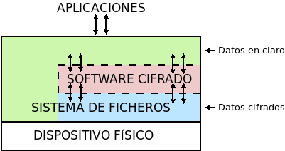

Cifrado de directorio
=====================
Esta estrategia permite cifrar un directorio entero, de modo que todo sobre lo
que trabajemos dentro de él se almacenará cifrado de forma transparente. Se basa
en el uso de un *software* intermedio (:command:`gocryptfs`  en nuestro caso) que, antes de almacenar datos en el
sistema de archivos o tras leerlos de él, cifra o descifra la información.

En consecuencia:

- Cifrado sobre el sistema de archivos definido para un directorio.
- El cifrado es también independiente del sistema de archivos.
- Sólo nos permite cifrar datos, no el sistema operativo completo.

Todo el *software* con este segundo enfoque se utiliza básicamente del mismo
modo, de modo que pueden identificarse las siguientes operaciones básicas:

* La creación del directorio cifrado, que exigirá el establecimiento de la clave
  simétrica de cifrado.

* El montaje de dicho directorio introduciendo la clave; y el desmontaje.

* El cambio de la clave.

Lo ilustraremos mediante :program:`gocryptfs`, para cuya instalación debemos
hacer::

   # apt install gocryptfs fuse

.. rubric:: Operativa manual

Es sumamente sencilla. Suponiendo que el directorio cifrado sea
:file:`~/cipher`, podemos crearlo con::

   $ gocryptfs -init ~/cipher

que nos pedirá interactivamente la contraseña (la clave simétrica) con que se
cifrarán los datos. Con ella podremos realizar el montaje del siguiente modo::

   $ gocryptfs ~/cipher ~/plain

lo cual mostrará dentro de :file:`~/plain` los contenidos descifrados, después de
que facilitemos la clave. De esta forma, el usuario podrá trabajar de forma
transparente sobre :file:`~/plain`, mientras el *software* se encarga de almacenar
los datos cifrados dentro de :file:`~/cipher`. Al acabarse el trabajo, puede
desmontarse el directorio::

   $ fusermount -u ~/plain

Puede, además, modificarse la clave simétrica de cifrado (incluso cuando el
directorio está montado)::

   $ gocryptfs -passwd ~/cipher

.. rubric:: Operativa automatizada

Lo óptimo y cómodo, cuando se desea que los usuarios tengan la posibilidad de
tener un directorio cifrado, es que las operaciones se hagan de modo
automático, de manera que al acceder al sistema el usuario tenga montado el
directorio que da acceso a los datos sin cifrar y que al dejarlo, se produzca
el desmontaje. Para lograrlo puede plantearse la siguiente estrategia:

#. En la medida en que el usuario no opera sobre el directorio cifrado, se lo
   ocultaremos anteponiendo a su nombre un punto. Por tanto, en vez de llamarlo
   :file:`~/cipher` lo llamaremos, por ejemplo, :file:`~/.Cifrado`. Al
   directorio que muestra los datos en claro, le daremos el mismo nombre pero
   sin anteponer el punto (:file:`~/Cifrado`).

#. Haremos que la clave de cifrado coincida con la contraseña de usuario, lo
   cual propicia que durante el proceso de autenticación con :ref:`PAM <pam>`
   podamos usar la contraseña introducida para montar automáticamente el
   directorio.

Establecido esto, basta con escribir un *script* que se encargue de hacer estas
operaciones, cuyo :download:`código se enlaza <files/mgocryptfs>` y dejarlo en
:file:`/usr/local/bin/mgocryptfs`::

   # mv /patH/donde/este/mgocryptfs /usr/local/bin
   # chmod +x /usr/local/bin/mgocryptfs

y preparar |PAM| para que se ejecute al abrir y cerrar sesión en el sistema. La
forma más limpia de hacerlo es creando un :download:`plugin de configuración
como éste <files/pam-gocryptfs>` que puede habilitarse del siguiente modo::

   # mv /path/donde/este/pam-gocryptfs /usr/share/pam-configs
   # pam-auth-update

El *script*, además, incluye un aspecto accesorio más: sólo afecta a los
usuarios que pertenezcan al grupo *crypto*, de modo que si queremos que un
usuario monte automáticamente un directorio para guardar cifrados los datos,
necesitaremos antes haberlo incluido en este directorio.

Por último, está el problema del cambio de contraseña. Tal y como está
configurado por defecto, cuando un usuario del grupo *crypto* accede al sistema
y no tiene directorio de cifrado, éste se crea utilizando la contraseña de
acceso. En consecuencia, contraseña y clave de cifrado coinciden y todo
funciona correctamente. Ahora bien, si se nos antoja cambiar nuestra
contraseña, la clave de cifrado seguirá siendo la antigua, por lo que para que
el montaje automático continúe funcionado, también deberemos cambiar la clave
de forma separada. Para ello podemos crear un *script* que haga de envoltorio a
la orden que usemos para cambiar la contraseña. Por ejemplo, si es :ref:`passwd
<passwd>`, una posible solución (no demasiado elegante, todo sea dicho) es
:download:`ésta <files/passwd>`.

