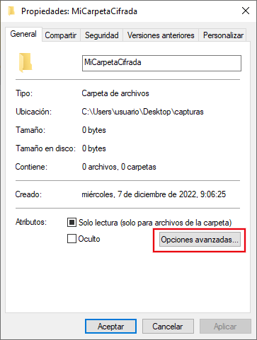
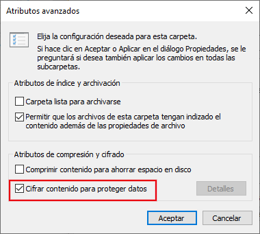
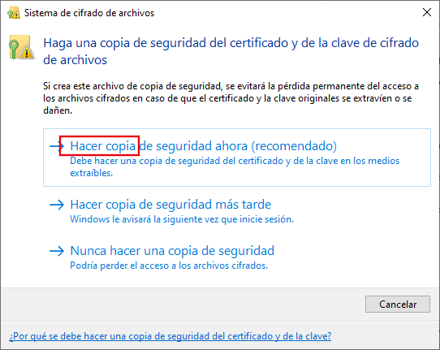

Confidencialidad
****************
Establecer un adecuado control sobre el acceso a los datos, de modo que sólo
accedan aquellos que legítimamente pueden hacerlo es fundamental en la gestión
de la información bien por secreto empresarial, bien por salvaguardar la
privacidad de los datos personales de empleados y clientes (véase la
:ref:`legislación sobre protección de datos <seg-ley>`).

Por ello es fundamental clasificar la información según su grado de confidencialidad:

**Confidencial**,
   que es información especialmente sensible para la organización o bien que
   contiene datos de carácter personal especialmente sensibles, para cuyo
   *tratamiento*:

   * Debe identificarse como tal.
   * Debe definirse estrictos controles de acceso para que sean exclusivamente
     accesibles para la dirección o para aquellos empleados que necesiten
     conocerla para poder desempeñar su función.
   * Si es preciso sacar la información de las instalaciones, debe cifrarse.
   * Debe cumplir las exigencias del |RGPD|.

**Interna**
    que es información propia de la organización accesible a todos sus empleados
    como la política de seguridad o el directorio de personal, para cuyo
    *tratamiento*:

    * Debe identificarse como tal.
    * Debe ser accesible a todo el personal.
    * Salvo indicación contraria de la dirección, no debe difundirse fuera de la
      organización.

**Pública**
    que es información que general la empresa para su difusión universal, por lo
    que no está sujeta a restricción alguna. Tal es el caso de la página web o
    los catálogos de productos. No recibe ningún *tratamiento* especial.

Ya se han enumerado las medidas que contribuyen a la confidencialidad de los
datos:

a. El control de accesos:

   * :ref:`Físico <seg-fisica>`, que comprende todos los mecanismos que limitan
     físicamente el acceso a los dispositivos de almacenamiento.
   * :ref:`Lógico <seg-acceso>`, que comprende tanto la :ref:`autenticación
     <seg-auth>` como los :ref:`mecanismos de control sobre el acceso
     <control-accesos>`.

   Ambos son asunto de la unidad ":ref:`seg-entorno`", por lo que no se tratarán
   en esta.

#. El :ref:`cifrado de datos <seg-cifrado-datos>`.

#. La :ref:`eliminación efectiva de datos <remove-data>`, cuando es preciso
   sustituir el dispositivo de almacenamiento.

.. _seg-cifrado-datos:

Cifrado de datos
================
Los fundamentos de la criptografía se tratan en la unidad sobre
":ref:`seg-cripto`", por lo que aquí nos centraremos exclusivamente en ver su
aplicación al crifrado de datos, el cual exige, desde un punto de vista
práctico y funcional, que las operaciones de cifrado y descifrado se hagan de
manera transparente, esto es, sin que el usuario tenga que utilizar las
herramientas criptográficas cada que vez que desee guardar o leer un fichero.

Fundamentos teóricos
--------------------
Están referidos en el apartado ":ref:`disk-encrypt`" y es importante conocer y
entender cuáles son las cuatro estrategias posibles.

Práctica
--------
La práctica relativa a *Linux* se encuentra en el apartado ya indicado, aunque
puede resultar un poco árida, porque exige bastante uso de la línea de órdenes.
De las cuatro estrategias, la más sencilla de practicar es :ref:`la que usa el
propio sistema de archivos (ext4) <crypto-ext4>` y, si se quiere impartir una,
esa es la más apropiada.

La práctica en *Windows* (menos árida y más apropiada para este  nivel medio) se
explicará aquí mismo.

.. rubric:: |EFS|

|EFS| es la característica del sistema de archivos |NTFS| que implementa su
cifrado (aunque no está disponibles en las versiones *Home*). Las claves de su
funcionamiento son las siguientes:

+ Cada archivo se cifra simétricamente con una clave generada *ad hoc*
  denominada |FEK|.
+ Para proteger la |FEK|, se cifra con la clave pública de un certificado
  digital de usuario.
+ El certificado de usuario se guarda en el `almacén de certificados de Windows
  <cat-cert-windows>`_, de modo que, mientras esté ahí, el usuario no tendrá
  problemas en acceder a los archivos cifrados.

Puede habilitar el cifrado de un archivo individual o el cifrado de un
directorio (lo que provocará que todos los archivos incluidos en él estén
cifrados). Para hacerlo basta con abrir el cuadro de diálogo "Propiedades" del
archivo o directorio:

y, al pulsar sobre *Opciones avanzadas*, podremos ver la posibilidad cifrar su contenido:

La operación habrá acabado a menos que no se disponga de un certificado para
cifrar archivos en cuyo caso *Windows* creará uno y nos dará la opción de
almacenar una copia en un :ref:`archivo p12 <cert-p12>` (creado con extensión
:kbd:`pfx`):

Es conveniente almacenar en un lugar seguro esa certificado por si lo
necesitamos en un futuro. Además, podemos consultar el certificado para
comprobar que se encuentra instalado.

.. rubric:: BitLocker

Es la herramienta proporcionada por el propio *Windows* para el cifrado (aunque
no se incluye en las versiones *Home*). Permite cifrar sistemas de archivos, no
archivos individuales. Daremos preferencia a la siguiente solución.

.. rubric:: Veracrypt

Tiene la ventaja de que es *software* libre y permite:

* Crear un dispositivo virtual dentro del cual todos los archivos y directorios
  estén cifrados.

* Cifrar dispositivos de datos.

* Cifrar el sistema de archivos donde se encuentra el propio sistema operativo.

En `este artículo de redeszone.net sobre Veracrypt
<https://www.redeszone.net/tutoriales/seguridad/veracrypt-cifra-archivos-gratis/>`_
desarrolla cómo hacer cada una de ellas.

Como ejercicios pueden realizarse:

* :ref:`ej-cifrado-discos`

.. _seg-remove-data:

Eliminación de datos
====================
La eliminación de datos se explica en el epígrafe sobre :ref:`eliminación
efectiva de datos <remove-data>`. En él se da suficiente base teórica, pero la
aplicación práctica se desarrolla exclusivamente en *Linux*. Para complementarlo,
es necesario revisar cómo de forma práctica se puede eliminar datos en
*Windows*. En consecuencia, el epígrafe se debe abordar del siguiente modo:

#. Atender a la teoría expresada allí para entender que se deben eliminar datos
   de forma efectiva y no borrar datos sin más.
#. Saber que existen dos estrategias (la :ref:`basada en sobrescribir los datos
   <borrado-sobre>` y la :ref:`basada en la funcionalidad de borrado seguro del
   firmware del disco <borrado-firmware>`) y tener claro que no hay que usar la
   primera de ellas, por las razones que se aducen.
#. Estudiar y prácticar la :ref:`segunda estrategia <borrado-firmware>`:

   + Mediante *Linux* con lo desarrollado en ese epígrafe.
   + Mediante *Windows* con diskpart_ que puede ejecutarse
     desde un disco de instalación de *Windows* 10 (u 11) y cuyo uso viene
     explicado en `este artículo de Tom's hardware
     <https://www.tomshardware.com/how-to/secure-erase-ssd-or-hard-drive#how-to-securely-erase-your-ssd-with-windows-diskpart>`_

.. |NTFS| replace:: :abbr:`NTFS (NT File System)`
.. |DAC| replace:: :abbr:`DAC (Discretionary Control Access)`
.. |RGPD| replace:: :abbr:`RGPD (Reglamento General de Protección de Datos)`
.. |ZFS| replace:: :abbr:`ZFS (Zettabyte File System)`             
.. |EFS| replace:: :abbr:`EFS (Encrypting File System)`             
.. |FEK| replace:: :abbr:`FEK (File Encrypting Key)`             

.. _diskpart: https://learn.microsoft.com/es-es/windows-server/administration/windows-commands/diskpart
