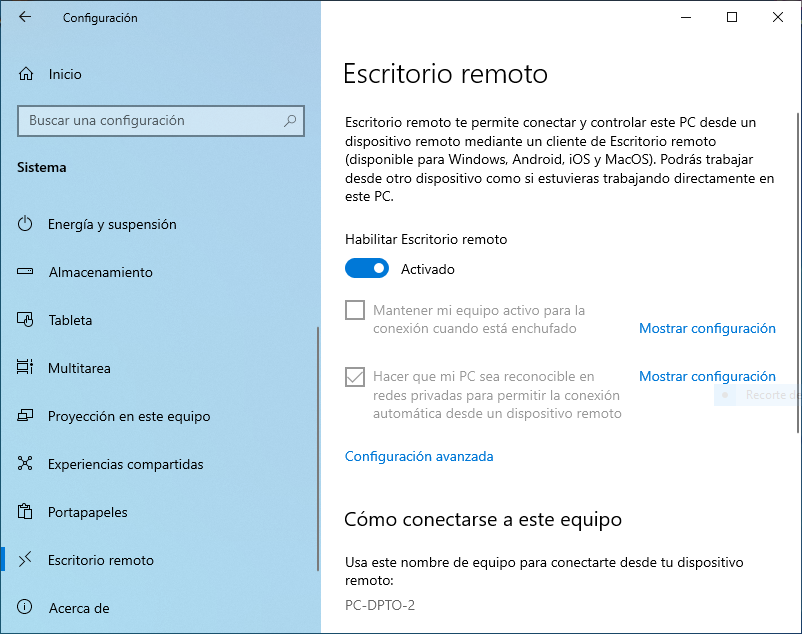
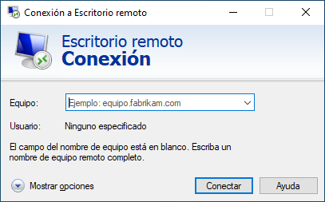

.. _ser-adm-rem:

Administración remota
*********************
Los *servicios de administración remota* permiten el acceso y manipulación de un
equipo desde otro situado en la misma o distinta red. Exigen la autenticación
del usuario remoto, por lo que es fundamental que la comunicación sea segura.

Hay, fundamentalmente, dos tipos de servicios:

* Los **servicios gráficos** que permiten acceder a sistemas con entorno de
  escritorio.
* Los **servicios de terminal de texto** que permiten acceder al entorno de la
  *shell* de un servidor remoto.

Servicios gráficos
==================
Nos centraremos en tres:

#. `Remote Desktop Protocol
   <https://en.wikipedia.org/wiki/Remote_Desktop_Protocol>`_, que es el
   protocolo que traen incorporados los *Windows* modernos para su
   administración remota.
#. `VNC <https://es.wikipedia.org/wiki/VNC>`_, que se basa en `el protocolo
   RFB <https://es.wikipedia.org/wiki/RFB_protocol>`_ y tiene versiones para
   múltiples sistemas operativos tanto como servidor como cliente.
#. `TeamViewer <https://en.wikipedia.org/wiki/TeamViewer_(company)>`_, que
   también funciona en múltiples sistemas operativos y está enfocado al soporte
   técnico: facilita que un técnico pueda acceder al ordenador de un cliente a
   fin de resolverle algún problema.

.. _ser-rdp:

Remote Desktop Protocol (|RDP|)
-------------------------------
Permite gestionar de manera remota un sistema *Windows* desde cualquier sistema (gracias a que existe FreeRDP_, aunque existen otras implementaciones libres). Las claves para su uso son las siguientes:

.. rubric:: Servidor

Se puede acceder a su configuración a través de :kbd:`Configuración>Sistema>Escritorio remoto`, aunque en la búsqueda basta con escribir ":kbd:`remoto`" para que una de las opciones sea "Configuración del escritorio remoto". Por defecto, está deshabilitado, de modo que habrá que habilitarlo:

.. note:: Con clientes antiguos (como :program:`rdesktop` de Linux), necesitaremos
   deshabilitar en la configuración avanzada la autenticación a nivel de red:

   .. image:: files/conf-rdp-avanzada.png

.. rubric:: Cliente

En *Windows* el cliente es muy fácil de usar. Basta con ejecutar :program:`mstsc.exe` al que se puede acceder sin recordar el nombre simplemente con escribir en la búsqueda ":kbd:`remoto`" y escoger la opción de "Conexión a Escritorio remoto":

*Linux* tiene varios clientes competentes: :program:`freerdp`
(:deb:`freerdp3-x11`) o :deb:`remmina`, que sirve también sirve como cliente
VNC. El veterano :deb:`rdesktop` no soporta la autenticación de las últimas
versiones del protocolo.

|VNC|
-----
Permite la gestión remota de múltiples sistemas desde un cliente que puede correr también en múltiples sistemas. Como para la gestión de un *Windows* es mejor utilizar su solución nativa (|RDP|), reservaremos esta posibilidad para la gestión remota de un *Linux*.

.. _ser-vnc:

.. rubric:: Servidor

Podemos usar TigerVNC_. Si lo usamos, la mejor alternativa es utilizarlo como un módulo de :program:`Xorg`, para lo cual:

1. Instalamos::

      # apt install tigervnc-xorg-extension

2. Se crea el archivo de configuración para la carga del módulo\ [#]_:

   .. code-block:: xorg.conf

      # /etc/X11/xorg.conf.d/10-tigervnc.conf
      Section "Module"
         Load "vnc"
      EndSection

      Section "Screen"
         Identifier "Screen0"

         # Sin autenticación
         #Option "SecurityTypes" "VeNCrypt,TLSNone"

         # Autenticación mediante contraseña
         Option "SecurityTypes" "VeNCrypt,TLSVnc"
         Option "PasswordFile" "/etc/tigervnc/vncpasswd"

         # Autenticación mediante usuario/contraseña local
         #Option "SecurityTypes" "VeNCrypt,TLSPlain"
         Option "PAMService" "tigervnc"
         Option "PlainUsers" "usuario,otrousuario"

         # Autenticación mediante contraseña. El servidor se identifica
         #Option "SecurityTypes" "VeNCrypt,X509Vnc"
         Option "X509Cert" "/etc/tigervnc/tigervnc.pem"
         Option "X509Key" "/etc/tigervnc/tigervnc.key"
      EndSection

3. El archivo anterior presenta cuatro alternativas:

   + La primera (deshabilitada) permite el acceso al servidor sin contraseña, lo
     cual no es nada recomendable.

   + La segunda (que es la que está habilitada) exige la autenticación
     mediante una contraseña almacenada en un archivo. Si preferimos esta opción,
     necesitaremos crear la contraseña dentro de tal archivo con la orden::

      # vncpasswd /etc/tigervnc/vncpasswd

   + La tercera (deshabilitada también) permite la autenticación usando
     las credenciales de un usuario del sistema. Mediante la opción
     :kbd:`PlainUsers` definimos la lista de usuarios válidos.

   + La cuarta es como la segunda (así que necesita definirse también
     ":kbd:`PasswordFile`"), pero añade la identificación del servidor mediante
     :ref:`certificado digital <cert-digital>`. Ello exige, al menos, la
     creación de un certificado autofirmado::

      # cd /etc/tigervnc
      # openssl req -config openssl.cnf -newkey ec:openssl-ecparams.pem \
        -x509 -days 3650 -nodes -keyout tigervnc.key -out tigervnc.pem

     .. warning:: En sistemas con poca entropía la generación del certificado
        fallará. Puede solucionarse cambiando antes el valor de :kbd:`RANDFILE`
        en :file:`/etc/tigervnc/openssl.cnf`::

         RANDFILE          = /tmp/randfile

        y creando y rellenando ese archivo con caracteres al azar::

         # dd < /dev/urandom > /tmp/randfile bs=256 count=1

   Para utilizar cualquier otra alternativa, basta con comentar/descomentar las
   líneas correspondientes que definen el tipo de seguridad.

4. Reiniciamos el servidor gráfico para que se haga efectiva la carga del módulo::

      # pkill -1 X 

5. Una vez de regreso, comprobamos que el servidor escucha en el puerto *5900*::

      $ ss -4ltn
        State        Recv-Q       Send-Q             Local Address:Port             Peer Address:Port      Process      
        LISTEN       0            5                        0.0.0.0:5900                  0.0.0.0:*

Si quieren explorarse otros **tipos de seguridad**, puede tomar como guía esta
tabla:

.. _tabla-auth-vnc:

.. table:: Tipos de seguridad
   :class: auth-vnc

   +----------------------+---------+---------------------------------+------------------------+
   | Seguridad            | Cifrado | Autenticidad del servidor\ [#]_ | Autenticación          |
   +======================+=========+=================================+========================+
   | None                 | No      | No                              | Ninguna                |
   +----------------------+---------+---------------------------------+------------------------+
   | VncAuth              | No      | No                              | Con contraseña         |
   +----------------------+---------+---------------------------------+------------------------+
   | Plain                | No      | No                              | Con usuario/contraseña |
   +----------+-----------+---------+---------------------------------+------------------------+
   | VeNCrypt | TLSNone   | Sí      | No                              | Ninguna                |
   |          +-----------+---------+---------------------------------+------------------------+
   |          | TLSVnc    | Sí      | No                              | Con contraseña         |
   |          +-----------+---------+---------------------------------+------------------------+
   |          | TLSPlain  | Sí      | No                              | Con usuario/contraseña |
   |          +-----------+---------+---------------------------------+------------------------+
   |          | X509None  | Sí      | Sí                              | Ninguna                |
   |          +-----------+---------+---------------------------------+------------------------+
   |          | X509Vnc   | Sí      | Sí                              | Con contraseña         |
   |          +-----------+---------+---------------------------------+------------------------+
   |          | X509Plain | Sí      | Sí                              | Con usuario/contraseña |
   +----------+-----------+---------+---------------------------------+------------------------+

El protocolo |VNC| original es inseguro y para asegurarlo se puede tunelizar con
|SSH| o con |SSL|, o utilizar una |VPN|. Sin embargo, se han creado
posteriormente extensiones que le añaden funcionalidades.  Una de ellas es
"VeNCrypt", que le añade cifrado |SSL|, y que se usa en nuestra configuración
propuesta en todas las alternativas. Por tanto, las comunicaciones entre cliente
y servidor estarán cifradas.

Obsérvese, además, que en todas las propuestas de nuestra configuración del
servidor se habilita un único tipo de seguridad lo cual obliga al cliente a
soportarla. Es posible habilitar varias enumerándolas por orden de preferencia:

.. code-block:: xorg.conf

   Option "SecurityTypes"  "VeNCrypt,TLSPlain,VeNCrypt,TLSVnc,VncAuth"

lo cual significa que si el cliente soporta las tres, se dará preferencia a la
conexión cifrada con autenticación mediante usuario/contraseña; si no soporta la
primera, entonces la conexión será cifrada, pero la autenticación con
contraseña; y, si finalmente, el cliente no soporta cifrado, no se cifrará y la
autenticación se hará con contraseña.

.. warning:: Permitir que la conexión no sea cifrada nos asegura compatibilidad,
   ya que un cliente puede no haber implementado el cifrado |TLS|. Sin embargo,
   provoca una grave amenaza en la seguridad al permitir la monitorización de la
   comunicación. Posiblemente sea más prudente obligar al cliente a no usar
   cualquier programa.

.. note:: En la definición de ":kbd:`SecurityTypes`" es posible ahorrarse la
   declaración de *VeNCrypt* y escribir directamente el subtipo. Por tanto, la
   última definición podría haber sido, simplemente:

   .. code-block:: xorg.conf

      Option "SecurityTypes"  "TLSPlain,TLSVnc,VncAuth"

.. _ser-vnc-cliente:

.. rubric:: Cliente

Existen muchas alternativas:

* En *Linux* Vinagre_, Remmina_ (válida también para |RDP|) o el cliente de
  TigerVNC_, disponible a través del paquete :deb:`tigervnc-viewer` que instala
  el ejecutable :program:`vncviewer`). 
* En *Windows*, el mismo cliente de TigerVNC_ (descargue de su página el cliente
  :program:`vncviewer64`).

En todos estos clientes, para conectar con el servidor, basta con indicar su
|IP| (o nombre) y, en caso de que escuche en el puerto **5900** se deberá
indicar también éste. Ahora bien, no se expresa directamente el número de puerto, sino el
número de *display* que se obtiene al sustraer *5900* del número de puerto. Por
tanto, un servidor escuchando en el puerto *5900*, escuchará en el display *0*;
uno en el puerto *5901*, en el display *1*; y así sucesivamente. Por ejemplo, si
el servidor se encuentra en la dirección *172.22.9.111* y escucha en el display
*0*, deberemos conectar a él mediante :kbd:`172.22.9.111:0`.

TeamViewer
----------

.. todo:: Probar el programa TeamViewer y hacer algunas indicaciones.

Servicios de terminal de texto
==============================
Dos son los servicios de administración remota para línea de comandos:

* Telnet_, ya totalmente en desuso por ser inseguro y, aunque puede asegurarse
  mediante :ref:`ssl`, por carecer de todas las características adicionales
  de su alternativa (transferencia de archivos, autenticación mediante claves
  asimétricas, tunelización de conexiones).

* :ref:`SSH <adm-rem>` que es profusamente desarrollado en el manual. De lo
  referido en él nos interesa para el curso:

  + :ref:`Su instalación <ssh-inst>`.
  + :ref:`Su configuración básica <ssh-conf>`.
  + La utilización de sus dos clientes principales:

    + El :ref:`cliente de openssh <openssh-cliente>`, usado fundamentalmente en
      entornos *UNIX*.
    + :ref:`Putty <putty-cliente>`, ampliamente usado en entornos *Windows* (aunque su
      *Powershell* incluye el cliente de openssh.
  
  + La :ref:`autenticación con claves <ssh-cert>`, aunque podemos limitarla a
    claves y que la autenticación con certificado quede para el :ref:`módulo de
    Seguridad Informática <seg>`.

  + :ref:`Tunelización de conexiones <tunel-ssh>`.

.. rubric:: Notas al pie

.. [#] La ubicación de estos archivos no tiene por qué ser
   :file:`/etc/X11/xorg.conf.d`. Otra ubicación posible es
   :file:`/usr/share/X11/xorg.conf.d`. En cualquier caso, el directorio debería
   existir de antemano, así que si no existe en su sistema, deberá investigar
   dónde se encuentra en vez de no crear uno.
.. [#] Con ello referimos si existe algún mecanismo para saber iel cliente si se
   conecta al servidor correcto. Los subtipos ``X509*`` lo logran mediante un
   par de claves de servidor que habrá que suministrador en la configuración.

.. |VNC| replace:: :abbr:`VNC (Virtual Network Computing)`
.. |RDP| replace:: :abbr:`RDP (Remote Desktop Protocol)`
.. |SSL| replace:: :abbr:`SSL (Secure Sockets Layer)`
.. |TLS| replace:: :abbr:`TLS (Transport Layer Security)`

.. _FreeRDP: https://www.freerdp.com
.. _TigerVNC: //https://tigervnc.org
.. _Vinagre: https://wiki.gnome.org/Apps/Vinagre
.. _Remmina: https://remmina.org
.. _Telnet: https://es.wikipedia.org/wiki/Telnet
