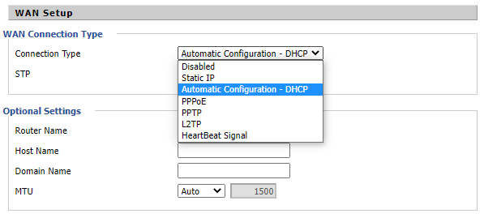
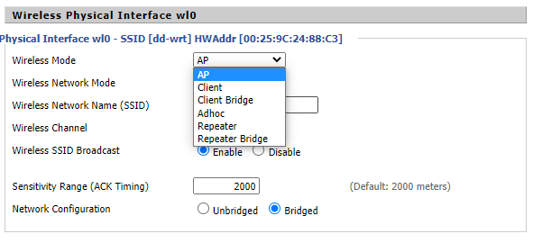
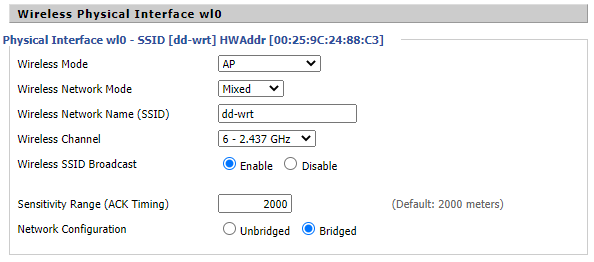
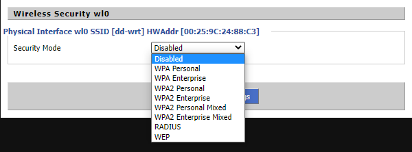

.. _ser-wifi-seg:

Seguridad
=========
Los contenidos de este epígrafe estan incluidos en el epígrafe :ref:`seg-wifi`
de una de las unidades del módulo de :ref:`seg`.

.. _ser-wifi-conf:

Configuración
=============
La configuración de dispositivos inalámbricos se puede dividir en tres aspectos:

#. La configuración de su **función de encaminador** (en caso de que sea un encaminador, claro).
#. La configuración de su **función inalámbrica** como punto de acceso.
#. **Otra configuración adicional** que dependerá de las capacidades del
   dispositivo (cortafuegos, calidad de servicio, etc.)

No hay modo de dar una receta general para llevar a cabo estas configuraciones,
porque tal configuración dependerá del *firmware* que lleve instalado. Lo que sí
es común a todos ellos es que dispongan de una interfaz web para realizar la
configuración y, en el caso de algunos, de una |CLI| accesible a través de
telnet o, más habitualmente, |SSH|. En cualquier caso, para ilustrar una
configuración utilizaremos un dispositivo que tiene instalado `DD-WRT
<https://dd-wrt.com/>` como firmware y lo haremos a través de un interfaz web.

.. rubric:: Función de *router*

Básicamente hemos de indicar cómo configuraremos la |WAN| y la |LAN|. En este
caso, por |WAN| se entiende la red externa, esto es, la red local a través de
la cual el dispositivo alcanzará Internet, mientras que |LAN| es la red que el
dispositvo conecta con el resto de la red local.

En lo referente a la |WAN|:

Hay que indicar cómo conectará el dispositivo con el resto de la red. Lo
habitual es que, simplemente, se deje que obtenga una dirección automáticamente
(|DHCP|), pero también podría interesarnos asignarle una dirección estática, en
cuyo caso tendríamos que establecer todos los parámetros (|IP|, máscara, puerta
de enlace, servidores |DNS|).

En lo referente a la |LAN|:

.. image:: files/ddwrt-lan.png

Lo habitual es que establezcamos:

+ Los parámetros estáticos de red dirección |IP| y máscara. No son necesarios
  puerta de enlace ni |DNS|, si configuramos la interfaz |WAN| dinámica, puesto
  que en ese caso esos dos datos ya nos los facilitará el servicio |DHCP|.

+ Si deseamos habilitar un servidor |DHCP|, que será lo habitual, y algunos
  parámetros al respecto (rango, máximas concesiones, tiempo de concesión).
  También se nos permite indicar qué servidores |DNS| se dirá a los clientes que
  pueden usar. Estos dispositivos también disponen de un :ref:`proxy DNS
  <proxies-freq>`, por lo que si no se especifican servidores |DNS|, será el
  propio dispositivo el que actúe como tal.

.. warning:: Que todo lo que hemos configurado tenga sentido, depende del modo
   en que se configure el dispositivo, que es justamente lo que se tratará a
   continuación.

.. rubric:: Función de punto de acceso

Antes de nada, es necesario definir :ref:`cómo actuará el dispositivo
<ser-wifi-hard-pa>`:

Lo habitual es que estos dispositivos actúen como |AP| (punto de acceso), que en
este dispositivo significa generar una nueva red local (la |LAN|) en la que se
encuentra la red *wifi* y hacer la función de *router* entre ella y la |WAN|.

Pero hay otras posibilidades que determinarán que el dispositivo se comporte de
distinto manera:

*Client*
   que para este dispositivo significa recibir la señal de la |WAN| a través de
   la conexión inalámbrica y generar una |LAN| cableada. Si se desea no generar
   una nueva red, entonces debe usarse el modo *Client bridge*.

*Repeater*
   que extiende una red inalámbrica. Si se desea, no generar una red distinta
   debe usarse el modo *Repeater bridge*.

|WDS|
   que extiende una red inalámbrica replicando exactamente la señal del punto de
   acceso principal. Todos los parámetros deben ser idénticos, incluido el canal
   de difusión. Hay una guía de cómo configurarlo en `esta entrada de blog
   <https://alexalvarez0310.wordpress.com/category/configuracion-dd-wrt-con-wds/>`_.

.. note:: La distinción ente *Client* y las otras dos alternativas es clara: la primera
   no genera una red wireless para sus clientes. En cambio, si la intención es
   generarla, si podríamos dudar qué es más adecuado. `Este artículo de la web
   de DD-WRT
   <https://wiki.dd-wrt.com/wiki/index.php/Repeating_Mode_Comparisons>`_ puede
   resultarnos útil.

.. warning:: El modo en que funcione el *router* como punto de acceso determina
   la configuración adecuada para |WAN| y |LAN|

Una vez determinado el modo, aún habrá que configurar los parámetros
característicos de la red *wifi*:

En especial:

+ El nombre de la red (|SSID|). Puede ocultarse deshabilitando *Wireless SSID
  Broadcast*.
+ El canal de difusión.

En cuanto al canal es conveniente tener claro cuál es el más adecuado y eso
dependerá de qué canales estén usando otros puntos de acceso cercanos. El
problema de los canales de 2,4GHz. es que se solapan bastante:

.. image:: files/canales-2.4GHz.jpg

y ese solapamiento provoca interferencia. Debe, pues, seleccionarse aquel canal
que presente menos solapamiento respecto a las redes *wifi* ya existentes.

.. note:: El gráfico está tomado de este interesante `artículo de redeszone.et
   sobre bandas de frecuencia
   <https://www.redeszone.net/tutoriales/redes-wifi/bandas-frecuencias-wi-fi/>`_.

Finalmente, debera escogerse cuál es la :ref:`seguridad de la red wifi
<ser-wifi-seg>`:

Las alternativas fundamentales son:

+ Ninguna, esto es, dejar la red abierta lo cual debería descartarse.
+ |WEP|, que también deberíamos descartar por motivos de seguridad. De hecho, es
  probable que otros dispositivos ni siquiera ofrezcan esta posibilidad.
+ |WPA|\ *2 Personal*, que se caracteriza por requerir una contraseña de acceso:

  .. image:: files/ddwrt-wpapersonal.png

+ |WPA|\ *2 Enterprise*, que permitirá asociar el dispositivo a un
  :ref:`servidor RADIUS <radius>` para que se definan en él los usuarios a los
  que se permite el acceso:

  .. image:: files/ddwrt-wpaenterprise.png

  Leyendo el epígrafe dedicado a la configuración de un servidor |RADIUS| es
  fácil saber cómo configurar esta opción.

.. |CLI| replace:: :abbr:`CLI (Command Line Interface)`
.. |WRT| replace:: :abbr:`WRT (Wireless RouTer)`
.. |WAN| replace:: :abbr:`WAN (Wide Area Network)`
.. |LAN| replace:: :abbr:`LAN (Local Area Network)`
.. |AP| replace:: :abbr:`AP (Access Point)`
.. |WDS| replace:: :abbr:`WDS (Wireless Distribution System)`
.. |WEP| replace:: :abbr:`WEP (Wired Equivalent Privacy)`
.. |WPA| replace:: :abbr:`WPA (Wi-Fi Protected Access)`
.. |SSID| replace:: :abbr:`SSID (Service Set IDentifier)`
.. |RADIUS| replace:: :abbr:`RADIUS (Remote Access Dial In User Service)`
