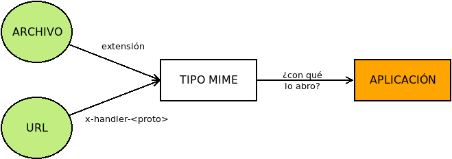

.. _mimetypes:

Aplicaciones predeterminadas
****************************
Cuando escribimos una orden en la |CLI|, cuál es la aplicación con la que se
desea manejar un archivo es información totalmente implícita::

$ geeqie foto_molona.jpeg

La orden indica expresamente al sistema que deseamos abrir el archivo
(presumiblemente una foto) con `Geeqie <https://www.geeqie.org/>`_. Hay, en
cambio, otras muchas ocasiones (p.e. cuando en un entorno gráfico pinchamos
sobre el icono que representa la foto) en que es el sistema el que tiene que que
determinar cuál es la aplicación adecuada. Cuál sea depende de cuál sea el tipo
del archivo y, así, un archivo |PDF| habrá que consultarlo con un visor para
|PDF|\ s, o una foto |JPEG| con un visor de imágenes. Para la expresión del tipo
se usa la nomenclatura |MIME|, en la que los tipos se expresan, en general, en
la forma :kbd:`tipo/subtipo`, de manera que :kbd:`image/jpeg` identifica a una
imagen en formato |JPEG| o :kbd:`application/pdf` a un archivos |PDF|.

.. seealso:: Consulte `este artículo sobre tipos MIME
   <https://developer.mozilla.org/es/docs/Web/HTTP/Basics_of_HTTP/MIME_types>`_
   de la página de desarrolladores de Mozilla_.

Así pues, para escoger la aplicación apropiada debemos conocer cuál es el tipo
del recurso. En los sistemas suelen producirse distintas situaciones:

* En ocasiones, se proporciona al sistema directamente el tipo |MIME| como
  ocurre cuando se accede por |HTTP| a un recurso alojado en un servidor web y
  éste envía el campo de cabecera :kbd:`Content-Type` cuyo valor es directamente
  el tipo |MIME|. Para más información sobre ello consulte :ref:`los fundamentos
  del protocolo HTTP <http>`.

* En otras, nuestra intención es abrir un archivo. En este caso, no se nos indica
  directamente el tipo, pero se llega a él a través de dos estrategias: la
  habitual que consiste en determinarlo a partir de :ref:`la extensión que
  incluye el nombre <nombres-archivo>` y la menos habitual de usar los `números
  mágicos <https://en.wikipedia.org/wiki/File_format#Magic_number>`_ y que es
  la que usa la aplicación :ref:`file <file>`. La primera forma exige un mapeo
  que relacion extensiones con tipos |MIME|\ [#]_.

* Y en otras se nos ofrece un recurso a través de una |URL|, y es necesario
  conocer qué aplicación es capaz de gestionar esa |URL|. Por ejemplo, que ante
  un enlace `ftp://ftp.mozilla.org <ftp://ftp.mozilla.org>`_ el sistema sepa
  que tiene que usar un determinado cliente |FTP| y lo abra al pinchar sobre
  él. En este caso, hay que asociar una aplicación (un cliente |FTP| en el ejemplo anterior)
  a un protocolo de |URL| (``ftp://``), en vez de a un tipo de archivo; por lo
  que es --en principio-- un problema distinto. Sin embargo, se usa una argucia
  para reducir este problema al anterior: cada protocolo se asimila a un tipo
  |MIME| :kbd:`x-schema-handler`, donde el subtipo es el nombre del propio
  protocolo (:kbd:`x-schema-handler/ftp`) y así vuelve a reducirse el problema a
  asociar un tipo con una aplicación. Siguiendo esta estrategia, el tipo |MIME|
  :kbd:`x-scheme-handler/http` sirve para representar el protocolo |HTTP|,
  :kbd:`x-scheme-handler/https`, el protocolo |HTTP|\ s o
  :kbd:`x-scheme-handler/mailto` las |URL|\ s que representan direcciones de
  correo electrónico.

  .. note:: Por ejemplo, si acude a la `página de Valide
     <https://valide.redsara.es/valide>`_, verá que tiene la posibilidad de
     firmar documentos |PDF|. Si lo intenta, como los navegadores no tienen esa
     capacidad, la acción de firma intenta abrir un recurso mediante el
     protocolo ``afirma://``. Si en su sistema está definido el tipo |MIME|
     :kbd:`x-schema-handler/afirma` y asociado éste a la aplicación Autofirma_,
     entonces podrá firmar. En cambio, si no tiene instalado Autofirma_ o, si
     aun estándolo, no existe tal asociación, el sistema no sabrá cómo manejar
     ese protocolo, no sabrá cómo firmar y, consecuentemente, nos podremos
     firmar.

De lo expuesto se desprende que se resolverá completamente el problema si se
hace:

#. Un mapeo que relacione extensiones con tipos |MIME|.
#. Un mapeo que relacione tipos |MIME| con aplicaciones.

.. _mimetypes-cli:

|CLI|
=====
Aunque en muchas ocasiones el propio usuario invoca la aplicación que quiere
usar, existe la posibilidad de que esto no ocurra: por ejemplo, cuando desde
dentro de un cliente de correo (como :ref:`mutt <mutt>`) necesitamos abrir un
adjunto.

.. rubric:: Mapeo de extensiones

Para relacionar extensiones de nombres de archivo y tipos |MIME| se usa el
archivo :file:`/etc/mime.types` incluido en el paquete :deb:`media-types`. Nada
más echar un vistazo al archivo, se comprende cómo funciona: está constituido
por líneas que expresan en la primera columna el tipo |MIME| y en las restantes
las extensiones asociadas. Por ejemplo, las páginas web (:kbd:`text/html`)
tienen asociadas las siguientes extensiones::

   $ grep '^text/html' /etc/mime.types
   text/html					html htm shtml

.. rubric:: Mapeo de aplicaciones

Muchas aplicaciones de texto (p.e. :ref:`mutt <mutt>`) usan :manpage:`mailcap`
para conocer qué aplicación está asociada a cada tipo |MIME|. La lectura de la
página del manual es suficientemente ilustrativa de cuál es el formato del
archivo :file:`/etc/mailcap`. También se lee el archivo de usuario
:file:`~/.mailcap` para que cada usuario pueda personalizar la aplicación a
usar.

.. _run-mailcap:

Directamente en la línea de órdenes, puede usarse la órden
:manpage:`run-mailcap` para abrir un archivo usando la aplicación que exprese el
archivo :file:`mailcap`::

   $ run-mailcap ~/Documentos/lista.txt

.. _mimetypes-gui:

|GUI|
=====
La gestión de extensiones, tipos de archivo y aplicaciones se realiza en el
entorno gráfico a través de las `xdg-utils`_ definidas por el proyecto
freedesktop.org_. Gracias a ellas, todos los entornos gráficos de *Linux* tiene
un modo unificado de tratar internamente el problema.

Por lo general, los gestores gráficos de archivos proporcionan un modo sencillo
para indicar con qué programa quiere abrirse cada tipo de archivo. Nosotros
aquí, sin embargo, trataremos cómo usar directamente las utilidades de
freedesktop.org_ desde la consola para llevar a cabo esta tarea.

.. _xdg-mime:
.. index:: xdg-mime

.. rubric:: Mapeo de extensiones

Se utilizan dos bases de datos distintas:

* La general, que se encuentra en :file:`/usr/share/mime/`.
* La particular a cada usuario, preferente, que se encuentra en
  :file:`~/.local/share/mime/`.

Las bases de datos se manipulan y consultan a través de la orden
:manpage:`xdg-mime`. Así, si queremos saber el tipo del documento
:file:`~/Documentos/redaccion.txt`::

   $ xdg-mime query filetype ~/Documentos/redaccion.txt
   text/plain

ya que en la base de datos la extensión :file:`.txt` está asociada a ese tipo
|MIME|. Mapear (y desmapear) es algo más complicado, ya que se necesita
describir la relación mediante un archivo |XML| con este aspecto:

.. literalinclude:: files/foo-bar.xml
   :language: xml
   
Gracias al cual asociamos el tipo |MIME| :kbd:`text/x-foobar` a las extensiones
:file:`.bar`, :file:`.foo` y :file:`.foobar`. Una vez construido el archivo,
tenemos dos modos de regenerar la base de datos:

* Colocar el archivo en el subdirectorio :file:`packages/` de una de las dos
  bases de datos (dependiendo de si queremos que sea un mapeo general o
  particular) y regenerarla::

   $ mv foobar.xml ~/.local/share/mime/packages
   $ update-mime-database ~/.local/share/mime

* Utilizar :command:`xdg-mime`::

   $ xdg-mime install --mode user foobar.xml

.. note:: El registro de un tipo |MIME| debería ir acompañado de la definición
   de cuál es el icono gráfico que representa los archivos de tal tipo. Tal
   acción se lleva a cabo con :manpage:`xdg-icon-resource`, pero no forma parte
   del objeto de este epígrafe.

En ambos caso, hemos definido un mapeo particular al usuario. Hecho éste,
podemos probar el nuevo mapeo::

   $ echo "Este archivo tiene un formato de prueba" > /tmp/caca.bar
   $ xdg-mime query filetype /tmp/caca.bar
   text/x-foobar

Para deshacer el mapeo, tenemos también dos alternativas:

* Borrar el archivo |XML| de :file:`packages/` y regenerar la base de datos::

   $ rm ~/.local/share/mime/packages/foobar.xml
   $ update-mime-database ~/.local/share/mime

* Utilizar :command:`xdg-mime`::

   $ xdg-mime uninstall --mode user ~/.local/share/mime/packages/foobar.xml

  .. note:: El |XML| puede encontrarse en cualquier ubicación, pero es bastante
     probable que, después de un tiempo, ya no se encuentre en su ubicación
     original. Donde sí debe encontrarse es en el subdirectorio
     :kbd:`packages/`, así que es de esta ubicación de donde lo sacamos.
   

.. rubric:: Mapeo de aplicaciones

La segunda parte del asunto es asociar aplicaciones a tipos |MIME|. Tal
asociación no se hace dentro de las bases de datos anteriores, sino aparte. En
cualquier caso, empecemos por saber consultar cuál aplicación abre por defecto
una archivo de un tipo |MIME| determinado::

   $ xdg-mime query default application/postscript
   gimp.desktop

Obsérvese que lo que se obtiene no es un ejecutable, sino un archivo
:file:`.desktop`. Estos archivos son los que utilizan los entornos gráficos para
crear los lanzadores de las aplicaciones y saber cómo tienen que arrancarse,
cómo incluirse en los menús o qué icono debe asociarse a ellas\ [#]_. `Su
especificación
<https://www.freedesktop.org/wiki/Specifications/desktop-entry-spec/>`_ también
es obra de freedesktop.org_.

Bien, pero ¿de dónde ha salido esta asociación? Si ejecutamos de esta otra
forma, obtendremos más información::

   $ XDG_UTILS_DEBUG_LEVEL=2 xdg-mime query default application/postscript
   Checking /home/josem/.config/mimeapps.list
   Checking /home/josem/.local/share/applications/mimeapps.list
   Checking /home/josem/.local/share/applications/defaults.list and /home/josem/.local/share/applications/mimeinfo.cache
   Checking /home/josem/.local/share/applications/defaults.list and /home/josem/.local/share/applications/mimeinfo.cache
   Checking /usr/local/share//applications/defaults.list and /usr/local/share//applications/mimeinfo.cache
   Checking /usr/local/share//applications/defaults.list and /usr/local/share//applications/mimeinfo.cache
   Checking /usr/share//applications/defaults.list and /usr/share//applications/mimeinfo.cache
   gimp.desktop

Llegamos al mismo resultado, obviamente, pero la orden nos ha ido desglosando en
que archivos se ha buscado la asociación: primero en archivos propios del
usuario (y que, por tanto, serán asociaciones exclusivas para ese usuario) y
después en localizaciones generales. El mapeo se comprueba en el orden que
desglosa el comando; y, cuando se encuentra una, para la búsqueda y devuelve el
resultado.

Se observan, además, dos tipos de archivos: los :file:`.list` y los
:file:`.cache`. Lo habitual es que los archivos que se usen sean:

#. :file:`~/.config/mimeapps.list`
#. :file:`~/.local/share/applications/mimeinfo.cache`
#. :file:`/usr/share/applications/defaults.list`
#. :file:`/usr/share//applications/mimeinfo.cache`

Ambos tipos de archivos se generan de distinto modo. Los :file:`.cache` se
generan a partir de los archivos :file:`.desktop` que habitualemnte incluyen un
campo :kbd:`MimeType` que desglosa cuáles son los tipos de archivos asociados al
ejecutable correspondiente. Por ejemplo, :file:`chromium.desktop` trae estos::

   $ grep "^MimeType=" /usr/share/applications/chromium.desktop 
   MimeType=text/html;text/xml;application/xhtml_xml;application/x-mimearchive;x-scheme-handler/http;x-scheme-handler/https;

lo cual asocia el navegador Chromium_ a los documentos |HTML|. Este campo, en sí
mismo, no implica la asociación efectiva, pero si tras la copia del
archivo en el directorio se ejecita :manpage:`update-desktop-database`::

   # update-desktop-database /user/share/applications

se regenerará en tal directorio el archivo :file:`mimeinfo.cache` dentro del
cuál se hace la asociación efectiva. El archivo es texto claro, así que puede
leerse simplemente con :ref:`cat <cat>`. Como varios archivos :file:`.desktop`
puede relacionarse con el mismo tipo |MIME|, pueden existir varias aplicaciones
apropiadas para un mismo tipo |MIME|. En ese caso y en ausencia de una
definición en otro archivo más precedente, ¿cuál es la predeterminada?  En
principio, será simplemente la primera que aparezca asociada al tipo en
:file:`mimeinfo.cache`. Por ejemplo, para esta línea\ [#]_::

   $ grep ^application/pdf= /usr/share/applications/mimeinfo.cache
   application/pdf=gimp.desktop;libreoffice-draw.desktop;org.gnome.Evince.desktop;

será :program:`Gimp` la aplicación que abrirá el |PDF|::

   $ xdg-mime query default application/pdf
   gimp.desktop

Sin embargo, un usuario particular puede establecer cualquiera de las otras en
su entorno de escritorio echando mano de :command:`xdg-mime`. Por ejemplo::

   $ xdg-mime default org.gnome.Evince.desktop application/pdf
   $ xdg-mime query default application/pdf
   org.gnome.Evince.desktop

Estas declaraciones se almacenan en el archivo :file:`.list` del usuario (por
tanto, :file:`~/.config/mimeapps.list`) y al tomar precedencia sobre el otro
archivo, prevalecerá. El archivo, supuesto que no existiera o estuviera vacío,
quedará así::

   $ cat ~/.config/mimeapps.list
   [Default Applications]
   application/pdf=org.gnome.Evince.desktop

que evidencia cuál es su sintaxis. Hay, no obstante, algunos limitaciones al
usar la orden para declarar la aplicación predeterminada:

* El archivo :file:`.desktop` debe existir.
* El archivo :file:`.desktop` debe declarar la aplicación como apropiada para el
  tipo |MIME|.
* La definición siempre se realiza en el archivo :file:`.list` personal, no en
  el general.

Dada la sencillez de su formato, los archivos :file:`.list` pueden editarse a
mano, lo cual será indispensable si queremos añadir mapeos en el archivo
:file:`.list` general.

.. seealso:: Puede consultar todas las posibilidades de :file:`mimeapps.list`
   en `esta entrada de la wiki de Archilinux
   <https://wiki.archlinux.org/title/XDG_MIME_Applications#mimeapps.list>`_.

.. _xdg-open:
.. index:: xdg-open

Por último, la orden :manpage:`xdg-open` abre un archivo o |URL| con la
aplicación que determine como adecuada este sistema. Por lo tanto::

   $ xdg-open https://www.iescastillodeluna.es

abrirá esa |URL| en el navegador predeterminado.

.. rubric:: Enlaces de interés

* `Especificaciones de shared MIME-info
  <https://www.freedesktop.org/wiki/Specifications/shared-mime-info-spec/>`_.

.. rubric:: Notas al pie

.. [#] Y la segunda, otro mapeo que relaciones números mágicos (o `rúbricas de
   archivo <https://en.wikipedia.org/wiki/List_of_file_signatures>`_) con
   tipos |MIME|.

.. [#] Estos archivos suelen encontrarse en :file:`/usr/share/applications/` o,
   para un usuario particular, en :file:`~/.local/share/applications`.

.. [#] Estamos suponiendo, claro está, que el :file:`mimeinfo.cache` propio del
   usuario (incluido en :file:`~/.local/share/applications`) no tiene
   información al respecto.

.. |CLI| replace:: :abbr:`CLI (Command Line Interface)`
.. |GUI| replace:: :abbr:`GUI (Graphical User Interface)`
.. |MIME| replace:: :abbr:`MIME (Multipurpose Internet Mail Extensions)`
.. |PDF| replace:: :abbr:`PDF (Portable Document Format)`
.. |JPEG| replace:: :abbr:`JPEG (Joint Photographic Experts Group)`
.. |URL| replace:: :abbr:`URL (Uniform Resource Locator)`
.. |XML| replace:: :abbr:`XML (eXtensible Markup Language)`
.. |HTML| replace:: :abbr:`HTML (HyperText Markup Language)`

.. _Mozilla: https://www.mozilla.org/
.. _Chromium: https://www.chromium.org/
.. _xdg-utils: https://www.freedesktop.org/wiki/Software/xdg-utils/
.. _freedesktop.org: https://www.freedesktop.org/wiki/
.. _Autofirma: https://firmaelectronica.gob.es/Home/Descargas.html
