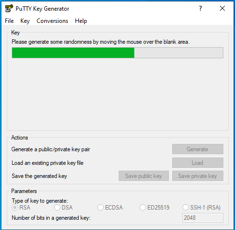
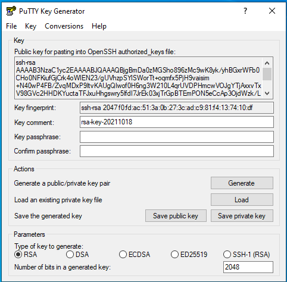
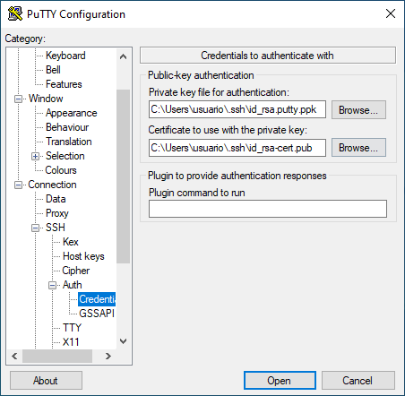

.. _ssh-cert:

******************************
Autenticación de clave pública
******************************
.. note:: Una perfecta compresión de este apartado exige tener unos
   conocimineots mínimos sobre :ref:`Criptografía <crypto>`.

Las técnicas de :ref:`cifrado asimétrico <asimetrico>` se usan en el protocolo
|SSH| para la autenticación tanto de servidor como de cliente. En el caso del
segundo, también es posible la autenticación con contraseña, que es justamente
la que hemos visto hasta ahora.

Cuando se usa autenticación con clave pública hay dos posibilidades:

+ Una solución basada exclusivamente en el uso de claves asimétricas
+ Otra que, sobre la base de la anterior, genera :ref:`certificados digitales
  <cert-digital>` a partir de las claves públicas utilizando una
  :ref:`infraestructura PKI <pki>`.

Como para analizar la segunda solución es conveniente conocer la primera,
analizaremos la primera y, sobre ella, expondremos la segunda.

.. _ssh-auth-keys:

Claves
******
Analicemos por separado cómo se identifica el servidor ante el cliente y cómo lo
hace el cliente ante el servidor.

Identificación del servidor
===========================
Ya se ha mencionado anteriormente que para evitar ataques *man-in-the-middle*
mediante la suplantación de la identidad del servidor, éste envía al cliente su
clave pública. En la primera conexión aceptar la clave pública de un servidor es
un acto de fe, a menos que se haya obtenido esa clave pública de algún modo
seguro. Sea como sea, el cliente, por su parte, puede almacenar las claves
públicas de todos los servidores a los que se conecta, de modo que si se produce
una segunda conexión compara la clave pública que le vuelve a enviar el servidor
con la que previamente tiene almacenada. En realidad lo que compara es el
*fingerprint* o huella dactilar de la clave pública, una sucesión de pares de
números hexadecimales que se obtiene a partir de ella: si coinciden, el cliente
se fiará de que el servidor es quien dice ser; si no coinciden, entonces
sospechará que hay una suplantación y, o bien avisará (caso de
:program:`putty`), o bien, se negará en rotundo a conectar hasta que no se
elimine del cliente la clave pública antigua (caso del cliente de *openssh*).

Del párrafo anterior, hay dos ideas que es necesario remarcar y que se
desglosarán bajo los siguientes epígrafes:

#. El servidor tiene una pareja de claves pública/privada que le sirven para
   identificarse ante el cliente (también sirven para cifrar la clave simétrica,
   pero esto importa poco a los efectos de esta discusión).
#. El cliente almacena las claves públicas de los servidores para comprobar las
   identidades de éstos cuando intenta una conexión.

.. _ssh-server-keys:

Claves en el servidor
---------------------
Se ha afirmado que el servidor tiene una pareja de claves. Esto no es del todo
cierto, en realidad, las versiones modernas del servidor *openssh* tiene varias
parejas de claves, cada una de cuales usa un algoritmo diferente de cifrado\
[#]_. Estas claves está almacenadas en el directorio :file:`/etc/ssh`::

   $ ls -1 /etc/ssh/ssh_host_*
   /etc/ssh/ssh_host_ecdsa_key
   /etc/ssh/ssh_host_ecdsa_key.pub
   /etc/ssh/ssh_host_ed25519_key
   /etc/ssh/ssh_host_ed25519_key.pub
   /etc/ssh/ssh_host_rsa_key
   /etc/ssh/ssh_host_rsa_key.pub

Los ficheros de extensión *.pub* son los que almacenan las claves públicas.
Paralelamente, en el fichero de configuración debe indicarse que estas serán las
claves de identificación\ [#]_::

   $ /usr/sbin/sshd -T | grep -i ^HostKey
   hostkey /etc/ssh/ssh_host_rsa_key
   hostkey /etc/ssh/ssh_host_ecdsa_key
   hostkey /etc/ssh/ssh_host_ed25519_key

Cuál de estas parejas se use para la validación depende del cliente: él le
indicará al servidor por orden que algoritmos prefiere y el servidor usará el
primero que tenga disponible. Se ha dicho también que en realidad lo que se
compara es el fingerkey obtenido a partir de la clave pública. De hecho, la
primera vez que se conecta el cliente al servidor, se encontrará con esto::

   pepe@cliente$ ssh usuario@servidor
   The authenticity of host 'servidor (192.168.1.11)' can't be established.
   ECDSA key fingerprint is SHA256:vOef4Mo/0obxdDeS9iNIZ5+kQpMB+krMf9XTedRMUbE.
   Are you sure you want to continue connecting (yes/no)

.. _ssh-keygen:

.. index:: ssh-keygen

Aceptarlo implicará almacenar en el cliente tal *fingerprint*. Tal huella
digital es posible obtenerla manualmente gracias a :command:`ssh-keygen`::

   $ ssh-keygen -l -f /etc/ssh/ssh_host_ecdsa_key.pub
   256 SHA256:vOef4Mo/0obxdDeS9iNIZ5+kQpMB+krMf9XTedRMUbE root@servidor (ECDSA)

que obviamente coincide con el *fingerprint* que observó *pepe* desde el
cliente. El primer número (**256**) indica la longitud de la clave.

.. warning:: Las claves identifican al servidor, así que es mejor no cambiarlas
   a menos que las sospechemos comprometidas. Si es absolutamente necesario,
   pueden redefinirse así::

      # ssh-keygen -t ecdsa -f /etc/ssh/ssh_host_ecdsa_key -N ""

   que crea una clave |ECDSA| en el fichero apropiado sin contraseña (esto
   último necesario, porque el servidor debe ser capaz de usarlas sin pedir
   la contraseña a nadie). La orden debería repetirse para todos los algoritmos,
   así que podríamos hacer::

      # for algo in rsa ecdsa ed25519; do ssh-keygen -t $algo -f /etc/ssh/ssh_host_${algo}_key -N ""; done

Claves en el cliente
--------------------
Como se ha adelantado, los clientes almacenan los *fingerprints* de las claves
públicas de los servidores a los que se han conectado previamente dentro del
fichero :file:`~/.ssh/known_hosts`. Ahora bien::

   pepe@cliente$ ssh-keygen -l -f ~/.ssh/known_hosts
   256 SHA256:vOef4Mo/0obxdDeS9iNIZ5+kQpMB+krMf9XTedRMUbE |1|4WnmUKMOBGnrOtOHytjLzB8cKFE=|q7chrsGIIRUBS2S1GlpzA0vDbjo= (ECDSA)
   256 SHA256:vOef4Mo/0obxdDeS9iNIZ5+kQpMB+krMf9XTedRMUbE |1|l4/bYn6a2ImKN27oCuwD3wb9M8o=|b5i6kcIRct1K1U9EBVH4PgfoJJU= (ECDSA)

si comprobamos los *fingerprints* almacenados no seremos capaces de saber a qué
servidor corresponde tal *fingerprint*. Esto se hace así por privacidad, esto
es, por evitar que otros usuarios sean capaces de conocer a qué servidores nos
conectamos\ [#]_. El comportamiento puede modificarse cambiando el valor de la
directiva *HashKnownHosts* en la configuración del cliente. Por tanto, si
añadimos como directiva global a :file:`~/.ssh/config`::

   HashKnownHosts no

se almacenarán las direcciones en claro::

   pepe@cliente$ rm -f ~/.ssh/known_hosts
   pepe@cliente$ ssh usuario@servidor

   [...]

   pepe@cliente$ ssh-keygen -l -f ~/.ssh/known_hosts
   256 SHA256:vOef4Mo/0obxdDeS9iNIZ5+kQpMB+krMf9XTedRMUbE servidor,192.168.1.11 (ECDSA)

En cualquier caso, aunque estén ofuscados los nombres, puede buscarse si hay ya alguna entrada para un servidor::

   $ ssh-keygen -F servidor

A partir de ahora, cada vez que se conecte a *servidor*, se confirmará que el
*firgenprint* de la clave proporcionada por este coincide con la almacenada. Si
no es así, ocurrirá esto::

   pepe@cliente$ ssh usuario@servidor
   @@@@@@@@@@@@@@@@@@@@@@@@@@@@@@@@@@@@@@@@@@@@@@@@@@@@@@@@@@@
   @    WARNING: REMOTE HOST IDENTIFICATION HAS CHANGED!     @
   @@@@@@@@@@@@@@@@@@@@@@@@@@@@@@@@@@@@@@@@@@@@@@@@@@@@@@@@@@@
   IT IS POSSIBLE THAT SOMEONE IS DOING SOMETHING NASTY!
   Someone could be eavesdropping on you right now (man-in-the-middle attack)!
   It is also possible that a host key has just been changed.
   The fingerprint for the ECDSA key sent by the remote host is
   SHA256:IWvZBm4stPCufdUlUdUtKGkk7P/nNhDsf1R5XDUANtM.
   Please contact your system administrator.
   Add correct host key in /home/josem/.ssh/known_hosts to get rid of this message.
   Offending ECDSA key in /home/josem/.ssh/known_hosts:1
     remove with:
     ssh-keygen -f "/home/josem/.ssh/known_hosts" -R "servidor"
   ECDSA host key for servidor has changed and you have requested strict checking.
   Host key verification failed.

Que no coincidan las claves puede suponer una suplantación de identidad... o que
las claves cambiaron en el servidor por alguna razón. Si la razón es esta
segunda, la solución está incluida en el mensaje de advertenca, y es borrar el
*fingerprint* asociado al servidor::

   pepe@cliente$ ssh-keygen -R servidor
   # Host servidor found: line 1
   /home/josem/.ssh/known_hosts updated.
   Original contents retained as /home/josem/.ssh/known_hosts.old

.. nota:: :program:`Putty` también almacena el *fingerprint* del servidor, pero
   a diferencia de éste, no rechaza la conexión cuando detecta un cambio en la
   clave, sino que advierte del peligro de seguridad y permite aceptar (o no) la
   nueva clave.

.. _ssh-auth-claves:

Identificación del cliente
==========================
Obviamente, nos referimos a su identificación mediante clave y no mediante
contraseña. Por supuesto, la identificación exige primero la creación de las
claves y que el servidor acepte este tipo de identificación::

   $ /usr/sbin/sshd -T | grep -i ^Pubkey 
   pubkeyauthentication yes

Cliente *openssh*
-----------------
En este caso, la generación es sencilla. La orden::

   $ ssh-keygen -t ecdsa -C "Comentario alusivo a la clave"

generará una clave de tipo |ECDSA| y, como fichero, se escogerá el
predeterminado para este tipo de clave (:file:`~/.ssh/id_ecdsa` y
:file:`~/.ssh/id_ecdsa.pub`, para la clave pública). Si no se altera la
configuración, en el momento en que intentemos conectar a cualquier servidor se
intentará usar esta clave para la autenticación. Tras generar la pareja de
claves se nos pide una *clave de paso*, que no es más que una contraseña con la
que cifrar la clave privada. Fijarla obliga a escribir tal contraseña antes de
usarla y nos asegura ante un hurto de las claves.

.. _ssh-copy-id:

.. index:: ssh-copy-id

Es obvio, que no basta con generar la clave en el cliente: en el servidor debe
alojarse la clave pública para que, cuando se produzca la comunicación, pueda
asegurarse que quien se conecta desde el cliente es el propietario de la clave
privada correspondiente. Para ello, puede hacerse::

   $ ssh-copy-id usuario@servidor

que subirá la clave\ [#]_ al fichero del servidor que almacena las claves
públicas (:file:`~./ssh/authorized_keys`)\ [#]_. A partir de ahora, al intentar
ingresar en el servidor, se usará en primer término la identificación mediante
el certificado y se nos pedirá la clave de paso (ya que hay que usar la clave
privada) o nada, si no se introdujo contraseña al generar las claves.

.. note:: No obstante, lo anterior, es posible usar claves almacenadas en otros
   ficheros. Por ejemplo::

      $ ssh-keygen -t ecdsa -f .ssh/id_servidor -C "Clave para 'servidor'"
      $ ssh-copy-id -i .ssh/id_servidor usuario@servidor
      $ ssh -i .ssh/id_servidor usuario@servidor

   e incluso indicar cuál es el nombre de la clave en la configuración::

      Host svm
         Hostname       servidor
         User           usuario
         IdentityFile   ~/.ssh/id_%h

   de manera que cuando conectemos a *servidor* siempre usemos
   :file:`~/.ssh/id_servidor`\ [#]_.

Cliente :program:`putty`
------------------------
Debemos efectuar las mismas acciones que en el caso anterior. El equivalente a
:command:`ssh-keygen` en la suite de :program:`putty` es :program:`puttygen`.
Al generar el par de claves (``Generate``) el programa quedará esperando que
movamos aletariamente el ratón por encima de la superficie vacía a fin de lograr
mayor aletoriedad:

Al acabar la generación, se podrá escribir un comentario y la clave de paso o
contraseña de la propia clave. Podemos entonces guardar la clave privada (``Save
private key``), pero la clave pública no es de poca ayuda, puesto que no tiene
el mismo formato que las claves que genera Open\ |SSH|. Sin embargo, la clave
pública, tal y como la exige Open\ |SSH|, se muestra en la propia pantalla con
lo que se puede copiar y pegar en un fichero:

Dado que ahora no disponemos de :command:`ssh-id-copy`, hay que subir manualmente
la clave pública al servidor para incluirla en en :file:`~/.ssh/authorized_keys`.
Quizás lo más sencillo es abrir una sesión de :program:`putty` y copiar
contenido de la clave pública directamente sobre el fichero anterior, en vez de
en un fichero cualquiera del cliente *windows*.

.. _ssh-auth-certs:

Certificados
************
Autenticar con :ref:`certificados digitales <cert-digital>` en vez de con
simples claves presenta algunas ventajas\ [#]_:

+ Un cambio de claves en el servidor, si la identificación de este ante el
  cliente es con meras claves, provoca un aviso de suplantación, por cuanto el
  cliente había almacenado ya su anterior clave. Es tan frecuente que de forma
  legítima se presente el aviso que se corre el riesgo de que el cliente no
  le dé ninguna importancia de seguridad. Un certificado de servidor lo evita.

+ En la autenticación de clientes, un mismo cliente tendrá que subir a todos los
  servidores la clave pública con la que pretende identificarse.

+ Los certificados pueden expedirse con un periodo de tiempo limitado.

+ Los certificados pueden especificar qué extras se le permiten o vetan al
  propietario (p.e. podríamos estar interesados en que el cliente pudiera
  acceder al servidor, pero que en ningún caso pudiera usarlo para tunelizar\ [#]_).

Para crear :ref:`certificados <cert-digital>` podemos partir de las claves
públicas que hemos visto en el epígrafe anterior. Estos certificados |SSH| no
son :ref:`certificados X.509 <X.509>`, como los usados en |SSL|, sino propios
de |SSH|, y se generan utilizando nuestro ya conocido :ref:`ssh-keygen
<ssh-keygen>`. 

La idea es crear una |CA| que firme las claves públicas de clientes y servidores
con objeto de crear los certificados:

.. image:: files/CA-SSH.png

Tal como se señala en el esquema se pueden tener dos parejas de claves:
*CA_host* para firmar certificados de servidor y *CA_user* para firmar
certificados de cliente:

- Cualquier servidor remitirá su clave pública a la |CA| para obtener el
  certificado correspondiente (resultado de firmar la clave con *CA_host*) y,
  además, necesitará una copia de la clave pública *CA_user*, si quiere poder
  autenticar clientes mediante certificado.

- Cualquier cliente remitirá su clave pública a la |CA| para obtener el
  certificado correspondiente (resultado de firmar la clave con *CA_user*) y,
  además, necesitará una copia de la clave pública *CA_host*, si quiere poder
  identificar clientes mediante certificado.

.. note:: Por supuesto, las dos parejas de claves pueden ser la misma.

A partir de ahora trabajaremos sobre tres máquinas:

+ La que hace de |CA| que es aquella que contiene las claves de |CA| y que
  se encarga de firmar los certificados de las demás
+ Una máquina que hace el papel de servidor |SSH|.
+ Una máquina que hace el papel de cliente |SSH|.

Para indicar en qué máquina estamos actuando al ejecutar una orden, utilizaremos
el *prompt*::

   root@ca:~#
   root@servidor:~#
   pepe@cliente:~$

Identificación del servidor
===========================
Partimos de :ref:`tener ya las claves del servidor <ssh-server-keys>` y nuestra
intención es que los clientes sean capaces de identificar al servidor mediante
certificado. Debemos antes de nada generar las claves para firmar certificados
de servidor::

   root@ca:~# ssh-keygen -t ecdsa -f /etc/ssh/ca_host -C "Clave de CA para servidores"

.. note:: Usamos claves de tipo ecdsa para evitar problemas con versiones de
   Open\ |SSH| por encima de la 8.1. Para más información, consulte `esta
   entrada de iBug <https://ibug.io/blog/2020/04/ssh-8.2-rsa-ca/>`_. 

Con esta pareja de claves operativas, debemos pasar las claves públicas del
servidor a la máquina *ca* para que puedan ser firmadas (esto es, generado el
certificado)::

   root@servidor:~$ scp /etc/ssh/ssh_host_*key.pub ca:/tmp

y una vez en ella, firmarlas para crear el certificado::

   root@ca:~# ssh-keygen -h -s /etc/ssh/ca_host -I s_hostID -n example.net,www.example.net -z1 /tmp/ssh_host_*key.pub
   root@ca:~# scp /tmp/ssh_host_*-cert.pub servidor:/etc/ssh

.. warning:: Se ha supuesto que la clave de la |CA| es |ECDSA| como se recomendo
   poco más arriba. Si la clave, no obstante, es |RSA|, aun podremos firmar,
   pero deberemos asegurarmos de que el algoritmo de *Hash* no es |SHA|\ 1
   (*ssh-rsa*) añadiendo a la orden expresamente que se usa |SHA|\ 2 con
   :code:`-t rsa-sha2-512`. Sólo así evitaremos problemas con versiones a partir
   de la *8.2*. Este misma advertencia es aplicable a la firma de certificados
   para clientes.

La orden genera certificados de servidor (gracias a :kbd:`-h`), firmados
(:kbd:`-s`) con :file:`ca_host`, con un determinado identificador (:kbd:`-I`), un número de serie (:kbd:`-z`) que debería ser único, y
que son válidos para una máquina llamada *example.net* o *www.example.net*.
Podríamos haber definido una validez determinada con :kbd:`-V`, pero por ser
estos certificados de servidor los haremos eternos.

.. note:: Los comodines no funcionan para definir nombres de servidor válidos.
   Por tanto, algo como :kbd:`-n "\*.example,example.net"` no valdrá para que
   el certificado sea aplicable a la máquina *www.example.net*.

Una vez que los certificados se remiten al servidor y se almacenan en
:kbd:`/etc/ssh` debemos modificar la configuración del servidor para que los
use::

   root@servidor:~# printf "HostCertificate %s\n" /etc/ssh/ssh_host_*-cert.pub >> /etc/ssh/sshd_config
   root@servidor:~# invoke-rc.d ssh reload

Y con esto, hemos completado la configuración en él. Ahora debemos lograr que
los clientes confien en cualquier certificado firmado por nuestra |CA|. Para ello debemos copiar la clave pública de la |CA| en el cliente::

   root@ca:~# scp /etc/ssh/CA_host.pub cliente:/tmp

con objeto de añadirla a :file:`~/.ssh/known_hosts` (o :file:`/etc/ssh/ssh_known_hosts` si se quiere que afecte a todos los usuarios)::

   pepe@cliente:~# echo "@cert-authority *.example.net,example.net,*.example.com,example.com $(cat /tmp/CA_host.pub)" >> /etc/ssh/ssh_known_hosts

Obsérvese que es necesario indicar :kbd:`@cert-authority` para expresar que la clave es una clave de |CA| que tiene validez para todas las máquinas cuyo nombre se especifica a continuación (pueden añadirse también direcciones |IP|). Hecho esto, se aceptará la conexión con el servidor, aunque nunca antes la hubiéramos hecho, y no registrará la clave pública del servidor en el archivo :file:`~/.ssh/known_hosts`.

Identificación del cliente
==========================
Para que el cliente pueda autenticarse en el servidor, también pueden utilizarse certificados. Generemos primero unas claves de |CA| para firmar certificados de cliente::

   root@ca:~# ssh-keygen -t ecdsa -f /etc/ssh/ca_user -C "Clave de CA para clientes"

.. note:: Podríamos reaprovechar la pareja de claves anteriores, pero por pulcritud usaremos dos claves distintas.

Debemos pasar la clave al servidor para que este acepte clientes que tengan su certificado firmado con ella. Esto se logra añadiendo una línea a la configuración::

   root@servidor:~# scp ca:/etc/ssh/ca_user.pub /etc/ssh
   root@servidor:~# echo "TrustedUserCAKeys /etc/ssh/ca_user.pub" >> /etc/ssh/sshd_config
   root@servidor:~# invoke-rc.d ssh reload

.. rubric:: Concesión

Y ahora, un usuario que desee autenticarse en tal servidor, deberá generar un par de claves para sí y pasarla a la |CA| para que se las firme::

   pepe@cliente:~$ ssh-keygen -C "Clave de pepe"
   pepe@cliente:~# scp ~/.ssh/id_rsa.pub ca:/tmp

La |CA| firmará esas claves::

   root@ca:~# ssh-keygen -s /etc/ssh/ca_user -I u_pepeID -n pepe,root -z1 -V +32w /tmp/id_rsa.pub

sin indicar la opción :kbd:`-h`, porque esta es una clave de cliente, indicando con :kbd:`-n` que la clave es válida para el usuario del servidor "pepe"\ [#]_ y el administrador del mismo, y que el certificado tiene una validez de 32 semanas a partir del momento en el que se firma::

   root@ca:~# ssh-keygen -Lf /tmp/id_rsa.pub
   id_rsa-cert.pub:
           Type: ssh-rsa-cert-v01@openssh.com user certificate
           Public key: RSA-CERT SHA256:eFEoGIJgDNFgiQycGvKXWc1FbJQOQljc90gjzRgI4uA
           Signing CA: ECDSA SHA256:ibktBc6yzycepNgHWYpWWo4V7l0QmKn+q73nf8/9vXM
           Key ID: "u_pepeID"
           Serial: 1
           Valid: from 2021-04-08T08:43:00 to 2021-11-18T08:44:34
           Principals:
                   pepe
                   root
           Critical Options: (none)
           Extensions:
                   permit-X11-forwarding
                   permit-agent-forwarding
                   permit-port-forwarding
                   permit-pty
                   permit-user-rc

Obsérvese que el certificado, además de limitar los usuarios con los que puede
autenticarse el propietario, también permite definir de qué *extras* puede
hacer uso (sección :kbd:`Extensions`). Los que apareen listados son los
habilitados por defecto. Sin embargo, podemos modificarlos mediante la opción
:kbd:`-O`. Por ejemplo, :code:`-O no-X11-forwarding -O mo-port-forwarding`
impediría al usuario identificado con el certificado mostrar en el escritorio
local la ejecución aplicaciones gráficas en el servidor y :ref:`hacer túneles <tunel-ssh>`.

Por último, el usuario en el cliente deberá obtener el certificado y guardarlo dentro de :file:`~/.ssh`::

   pepe@cliente:~# scp ca:/tmp/id_rsa-cert.pub ~/.ssh

.. note:: Obsérvese que con la configuración actual del servidor, un usuario podrá
   acceder al servidor tanto mediante una clave pública convertida en
   certificado como por una clave pública que no ha acreditado la |CA|, si la sube
   con :ref:`ssh-copy-id <ssh-copy-id>`. Esto puede hacer inútil
   la intención del administrador de añadir ciertas limitaciones al certificado
   (p.e. temporales) en la medida en que, una vez obtenido el certificado, el
   usuario puede utilizar :command:`ssh-copy-id` para subir la clave al archivo
   :file:`authorized_keys` de su perfil remoto. Para evitarlo, podemos
   deshabilitar la lectura de estos archivos personales añadiendo a
   :file:`sshd_config`::

    AuthorizedKeysFile      /dev/null

:program:`Putty` `desde agosto de 2022 soporta certificados SSH
<https://www.chiark.greenend.org.uk/~sgtatham/putty/wishlist/ssh2-openssh-certkeys.html>`_
tanto para acreditación del servidor como del usuario cliente. A diferencia de
las claves, el certificado no tiene formato propio y, de hecho, no puede
generarse con :program:`Puttygen`:

La captura representa la identificación del cliente con clave/certificado: la
clave privada tiene que tener el formato propio de :program:`Putty`, mientras
que el certificado es aquel que se obtiene directamente de :ref:`ssh-keygen
<ssh-keygen>`.

.. rubric:: Revocación

Puede darse el caso de que necesitemos revocar certificados antes
de que expiren. Open\ |SSH| prevee su revocación a través de
archivos |KRL| que listan aquellos certificados que se ha
decidido revocar. Lo primero es indicar en
:file:`/etc/ssh/sshd_config` qué lista consultará el servidor::

    RevokedKeys     /etc/ssh/revoked_keys

y tras ello, generar el archivo (en principio, vacío) y recargar
el servidor::

    # ssh-keygen -kf /etc/ssh/revoked_keys
    # invoke-rc.d ssh reload

A partir de este momento, todo está listo para revocar
certificados cuando sea preciso. Si el administrador conserva el
certificado o la clave pública, puede hacerlo del siguiente
modo::

    # ssh-keygen -kuf /etc/ssh/revoked_keys -z1 /path/id_rsa.pub

donde debe notarse la presencia de la opción :kbd:`-u`, porque
permite conservar la lista y añadir un nuevo ítem. Si
prescindimos de ella, el contenido anterior del archivo, se
perdera. Además, :kbd:`-z` permite definir la versión de la lista
mediante un entero (**1** en el ejemplo, porque es la primera
revisión). Hemos hecho la revocación, por otro lado, utilizando
la clave pública, pero habría sido igual de efectivo utilizar el
certificado (:file:`id_rsa-cert.pub`).

Ahora bien, la revocación también puede llevarse a cabo usando el
identificador del certificado (que se introdujo con :kbd:`-I` al
crearlo) o su número de serie (introducido en su momento con
:kbd:`-z)`. Para esto, sin embargo, se requiere facilitar la
clave privada de la |CA|::

    # ssh-keygen -kuf /etc/ssh/revoked_keys -z2 -s /etc/ssh/ca_user <(echo "id: u_pepeID")
    # ssh-keygen -kuf /etc/ssh/revoked_keys -z3 -s /etc/ssh/ca_user <(echo "serial: 5")

.. note:: :command:`ssh-keygen` sólo admite archivos como
   argumento, así que, en realidad, ":kbd:`id: u_pepeID`" o
   ":kbd:`serial: 5`" deberían encontrarse en un archivo. Hemos
   usado :ref:`process substitution <bash-process-substitution>`
   para evitarlo.

   Además, para revocar varios certificados a la vez, pueden
   incluirse varios archivos en la misma línea de órdenes como
   argumento o, en el caso de que revoquemos con identificador o
   número de serie, hacer un mismo archivo con varias líneas en
   cada una de los cuales indiquemos un certificado distinto::

    # cat > /tmp/revocaciones.txt
    id: u_pepeID
    serial: 5

    # ssh-keygen -kuf /etc/ssh/revoked_keys -z2 /tmp/revocaciones.txt

Finalmente, podemos consultar cuáles son los certificados
revocado contenidos en el |KRL| mediante la orden::

    # ssh-keygen -Qlf /etc/ssh/revoked_keys

.. _openssh-openssl:

Open\ |SSH| y Open\ |SSL|
*************************
Dado que ambas aplicaciones usan :ref:`cifrado asimétrico <asimetrico>` y
algoritmos comunes, es posible hacer conversiones entre las claves generadas con
ellas. En principio:

+ Pueden hacerse conversiones para claves |RSA| y |ECDSA|. Las claves |EdDSA| no
  tienen soporte en :ref:`OpenSSL <openssl>`.

+ El formato para las claves públicas es distinto e incompatible, pero
  :ref:`ssh-keygen <ssh-keygen>` es capaz de hacer conversiones entre ambos formatos.
  Para obtener la clave pública en formato reconocible por Open\ |SSL|::

   # ssh-keygen -e -f miclave.pub -m pkcs8 > miclave.pem

  Y para el proceso inverso::

   # ssh-keygen -i -f miclave.pem -m pkcs8 > miclave.pub

+ El formato para las claves privadas era el mismo hasta no hace demasiado, pero
  las últimas versiones de Open\ |SSH| utilizan por defecto un formato
  incompatible. En cualquier caso, el formato de Open\ |SSL| sigue soportado
  por Open\ |SSH|:. Así, si se tiene una clave privada en el formato de Open\
  |SSH|::

   $ cp miclave miclave.key
   $ ssh-keygen -p -f miclave.key -m pem

  Y si se tiene una clave generada con Open\ |SSL|::

   $ cp miclave.key miclave
   $ ssh-keygen -p -f miclave

  .. note:: En estos casos :ref:`ssh-keygen <ssh-keygen>` genera el nuevo
     formato sobrescribiendo el archivo, por lo que se hace necesaria la copia
     previa.

+ Los formatos de :ref:`certificado digital <cert-digital>` son absolutamente
  incompatibles y no hay conversión entre ellos, pero sí podemos tener sendos
  certificados generados con el mismo par de claves.

.. seealso:: Puede echar una lectura a `este artículo sobre formatos de claves
   en ambas aplicaciones
   <https://coolaj86.com/articles/openssh-vs-openssl-key-formats/>`_.

Partiendo de Open\ |SSH|
========================
Si tenemos un par de claves, las habremos generado así (para que sean |ECDSA|
habrá que añadir :kbd:`-t ecdsa`)::

   $ ssh-keygen -f miclave

lo cual creará los archivos de clave :file:`miclave` y :file:`miclave.pub`, ambas
en formato incomprensible para Open\ |SSL|. Para convertir podremos hacer::

   $ cp miclave miclave.key
   $ ssh-keygen -p -f miclave.key -m pem

Y la clave pública la podremoe obtener a partir de la clave privada usando Open\
|SSL|, La orden exacta dependerá de si la clave es |RSA| o |ECDSA|. Podemos
también usar :command:`ssh-keygen` para obtener la clave pública\ [#]_, que no
presenta diferencias sea una u otra la clave::

   $ ssh-keygen -e -f miclave.pub -m pkcs8

Partiendo de Open\ |SSL|
========================
Podemos haber generado unas claves |RSA|::

   $ openssl genrsa -aes128 -out miclave.key 4096
   $ openssl rsa -in miclave.key -pubout -out miclave.pem

o bien unas claves |ECDSA|\ [#]_::

   $ openssl ecparam -name prime256v1 -genkey -noout -out miclave.key
   $ openssl ec -in miclave.key -pubout -out miclave.pem

Sea como sea, el proceso de obtención de claves válidas para Open\ |SSH| es el
mismo::

   $ ln -s miclave.key miclave
   $ ssh-keygen -y -f miclave > miclave.pub
   $ sed -ri '$s:$: Comentario para la clave' miclave.pub

donde no hemos cambiado de formato la clave privada, porque Open\ |SSH| soporta
el formato de Open\ |SSL| y hemos obtenido la clave pública a partir de la
privada (otra opción habría sido convertir desde la clave pública en el formato
de Open\ |SSL| :file:`miclave.pem`).

.. rubric:: Notas al pie

.. [#] Hasta la versión *7.0*, también existía una versión `DSA
   <https://es.wikipedia.org/wiki/DSA>`_, pero acabó por deshabilitarse su uso al
   considerarla débil (véase `la información relativa
   <http://www.openssh.com/legacy.html>`_ par más información).

.. [#] Las líneas aparecen comentadas, pero recordemos que en este fichero las
   directivas comentadas muestran el valor predeterminado.

.. [#] Este comportamiento se deriva de la configuración predeterminada de las
   últimas versiones de debian::

      $ grep -w HashKnownHosts /etc/ssh/ssh_config 
          HashKnownHosts yes

.. [#] No especificamos dónde está la clave (opción ``-i``), pero carece de
   relevancia puesto que estamos usando los nombres predeterminados.

.. [#] Tal es así, que podríamos haber hecho la subida de forma artesanal::

      $ ssh usuario@servidor "mkdir -p ~/.ssh; cat >> ~/.ssh/authorized_keys" < ~/.ssh/id_ecdsa.pub

.. [#] Consúltese el apartado **TOKENS** de la página de manual de *ssh_config*
   para entender por qué ``%h`` se convierte en el nombre de la máquina remota
   (*servidor*).

.. [#] Para leer una larga disscusión sobre los inconvenientes, puede echar un
   ojo a `ester artículo de smallsetp
   <https://smallstep.com/blog/use-ssh-certificates/>`_.

.. [#] Es cierto que podemos utilizar la :ref:`directiva Match <ssh-match>` en
   la configuración pero lograr un efecto semejante, pero utilizar certificados
   para este fin es mucho más cómodo y evita la obligación de modificar la
   configuración.

.. [#] Obsérvese que el ejemplo el usuario remoto (del cliente) es "pepe" (como
   se observa en el *prompt*) y el usuario del servidor también se llama "pepe".
   La opción :kbd:`-n`, obviamente, refiere nombres de usuario del servidor.

.. [#] La orden de exportación puede hacerse utilizando como argumento de la
   opción :kbd:`-f` tanto la clave pública como la clave privada. Con la privada
   se requerirá introducir la contraseña de cifrado.

.. [#] La clave privada no tendrá contraseña que la proteja. Si se quiere
   proteger con una, habrá que añadir una orden más::

      $ openssl ec -in miclave.key -aes256 -out miclave.crypt.key

   Una alternativa es cambiar la clave al formato |PKCS|\ #8::

      $ openssl pkcs8 -topk8 -in miclave.key -out miclave.crypt.key

.. |SSL| replace:: :abbr:`SSL (Secure Sockets Layer)`
.. |PKCS| replace:: :abbr:`PKCS (Public-Key Cryptography Standards)`
.. |CA| replace:: :abbr:`CA (Certification Authority)`
.. |ECDSA| replace:: :abbr:`ECDSA (Elliptic Curve Digital Signature Algorithm)`
.. |RSA| replace:: :abbr:`RSA (Rivest, Shamir y Adleman)`
.. |EdDSA| replace:: :abbr:`EdDSA (EDwards-curve Curve Digital Signature Algorithm)`
.. |SHA| replace:: :abbr:`SHA (Secure Hash Algorithm)`
.. |KRL| replace:: :abbr:`KRL (Key Revocation List)`
