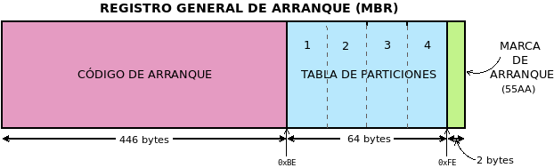
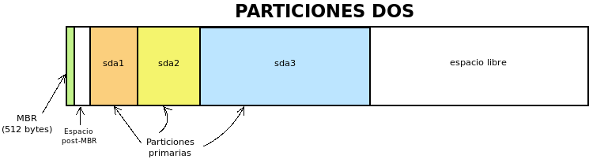
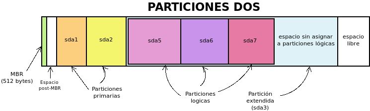
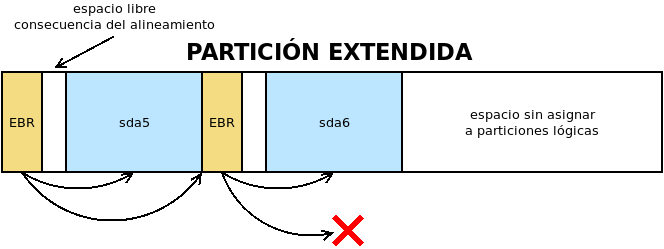
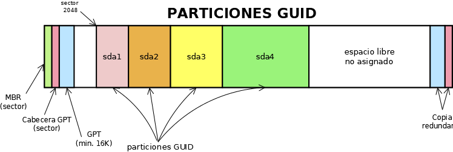

.. _particionado:

***********
Particiones
***********
Ya que ha quedado establecido que los discos pueden dividirse en partes,
llamadas :dfn:`particiones`, cada una de las cuales contiene un sistema de
archivos distinto. El sistema de particiones que usemos está bastante libado a
cómo sea :ref:`el arranque <arranque>`, pero bajo este  epígrafe nos limitaremos
a describir algunos de ellos sin preocuparnos por cómo sea este arranque.

A partir del nacimiento y triunfo de la especificación |UEFI| (que ya trataremos
al analizar el arranque), se ha impuesto el particionado |GPT|. Anteriormente,
existían múltples sistemas de particiones, pero el mayoritario es el conocido
como el particionado |DOS|. Por tanto, centraramos el estudio en estos dos:

- El particionado |DOS|.
- El particionado |GPT|.

Antes de empezar, no obstante, es útil introducir un término que es aplicable a
cualquier sistema de particiones: la *alineación* (o *alineamiento*). La
:dfn:`alineación` es el número de sectores múltiplo del cual deben situarse los
comienzos y finales de las particiones. Así, por ejemplo, si la alineación es
**1**\ MiB, esto es, 2048 sectores (como lo es habitualmente), las particiones
sólo pueden empezar en el sector 0 (lo cual es imposible como veremos), 2048,
4096, etc. Una partición que no empezase o acabase en un sector múltiplo de
**2048** sería una partición no alineada.

.. note:: `Este artículo <http://jdebp.eu./FGA/disc-partition-alignment.html>`_ de
   2011 afirma que basta con que las particiones estén alineadas en
   múltiplos de 4KiB. La `página de manual de sgdisk
   <https://linux.die.net/man/8/sgdisk>`_, por su parte, sostiene que la
   alineación en múltiplos de 1MiB es necesaria para optimizar el rendimiento
   de la tecnología `Advanced Format <https://en.wikipedia.org/wiki/Advanced_Format>`_
   de *Western Digital*, de algunos |RAID|\ s y de los dispositivos |SSD|.

.. _part-dos:

|DOS|
*****
Este sistema se basa en la existencia de un |MBR|, esto es, en que el primer
sector del disco duro (512 *bytes*) contiene la metainformación del
particionado.

Su contenido es el siguiente:

- Los primeros 446 *bytes* contiene un código de arranque, cuya discusión
  pospondremos para cuando analicemos el arranque.
- Los 64 *bytes* siguientes sirven para definir la tabla de particiones del disco.
- los dos últimos *bytes* son una marca de arranque que contiene siempre 
  ``55AA``.

Tabla de particiones
====================
La :dfn:`tabla de particiones` define cuáles son las particiones del disco, cada
una de las cuales requiere 16 *bytes* para su descripción, lo cual implica que,
en principio, sólo sea posible definir cuatro particiones. La información para
cada partición es la siguiente:

.. table::
   :class: info-part-dos

   =============== =================================================================
   Tamaño (bytes)  Descripción
   =============== =================================================================
   1               Marca de activa (*0x80* es el valor para indicar que es activa).
   3               Cilindro, Cabezal, Sector de comienzo.
   1               Tipo de partición (informa de su contenido).
   3               Cilindro, Cabezal, Sector de final.
   4               Direccionamiento de bloque lógico\ [#]_ de su sector de arranque.
   4               Longitud de la partición en sectores.
   =============== =================================================================

A estos datos se pueden hacer algunas aclaraciones y apostillas:

* Sólo puede haber una partición marcada como *activa*. El resto deberán tener
  todas ese *byte* a *0*.
* Se pueden identificar `256 tipos de sistemas de ficheros
  <https://en.wikipedia.org/wiki/Partition_type#List_of_partition_IDs>`_ distintos.

.. _tam-max-part-dos:

* Como para el direccionamiento se usan 4 *bytes* (32 *bits*) y cada sector es
  de 512 *bytes*, esto determina cuál es el **tamaño máximo** del disco si se usa
  este particionado:

  .. math::

     2^{32}*512 \mathit{B} = 2*2^{40} \mathit{B} =2 \mathit{TB}

* El tamaño máximo de una partición, por la misma razón, coincide con el tamaño
  máximo de disco.

.. note:: A la partición cuya información se recoge en la tabla de
   particiones se la denomina :dfn:`partición primaria`.

Si consideramos todo lo expuesto hasta ahora y que, por ejemplo, se hayan
definido tres particiones en la tabla de particiones del |MBR|, esquemáticamente
podríamos representar el estado de las particiones así:

En principio, aún podría definirse una cuarta partición que debería ocupar todo el
espacio libre, porque de no hacerlo, el que quedara fuera no sería aprovechable
al no poderse definir más particiones.

.. note:: Para nombrar las particiones se ha usado la nomenclatura de *Linux*
   :file:`sda` por fingir que nos encontramos ante el primer disco y un número
   correlativo para cada partición.

Obsérvese que entre el |MBR| (sector **0**) y el comienzo de la primera
partición (sector **2048**), si hemos alineado correctamente las particiones
utilizando la alineación habitual hay un pequeño espacio no particionado.

.. warning:: Este espacio es aprovechado por el gestor de arranque |GRUB| para
   instalar su segunda fase (lo analizaremos más adelante). En sistemas
   antiguos, no obstante, las particiones no se alineaban y la primera partición
   empezaba al comienzo del segundo cabezal\ [#]_, o sea, en el sector **63**.

Particiones lógicas
===================
Dos son las limitaciones fundamentales del particionado |DOS|:

+ El tamaño máximo de *2TiB* para discos y de particiones que es insalvable,
  aunque sólo ha empezado a cobrar importancia en fechas recientes.
+ La limitación de sólo poder crear cuatro particiones.

Para paliar esta segunda limitación, *Microsoft* se inventó el concepto de
:dfn:`partición extendida`, como una *partición primaria* destinada no a
contener un sistema de archivos, sino más particiones: en teoría, un número
ilimitado. Toda partición contenida dentro de una partición extendida se
denomina :dfn:`partición lógica`. En cada disco sólo puede haber una partición
primaria marcada como partición extendida.

En este caso, hay definidas tres particiones primarias (*sda1*, *sda2* y
*sda3*), la última de las cuales está marcada como extendida. En consecuencia,
dentro de ella pueden definirse particiones lógicas (*sda5*, *sda6*, *sda7*). En
el espacio sin asignar de la extendida se podrán aún definir una cantidad
ilimitado de particiones lógicas; y en el espacio libre fuera de ella una única
partición primaria más (la *sda4*).

Aunque irrelevantes a efectos prácticos, la partición extendida se implementa
del siguiente modo:

- La partición primaria que hará de partición extendida se marca como de tipo
  *0x05*.

- El primer sector de la partición extendida (su |VBR|) se denomina |EBR| y
  tiene la misma estructura que un |MBR|. En su tabla de particiones se incluyen
  dos entradas:

  + La primera entrada refiere la descripción de la partición lógica contigua
    (la primera).
  + La segunda entrada refiere el sector en el que empieza el segundo |EBR|, que
    se situará a continuación de la primera partición lógica.
  + Las dos restantes entradas no se usan.

- El segundo |EBR| es como el primero, pero describiendo la segunda partición
  lógica y el comienzo del tercer |EBR| y así sucesivamente. En caso de que no
  existan más particiones lógicas la segunda entrada estará a 0.

En resumen:

- Una tabla de particiones |DOS| es sólo capaz de registrar hasta cuatro
  particiones primarias.
- La definición de todas las particiones primarias se encuentra en el |MBR|.
- Una de las particiones primarias puede marcarse como extendida, lo cual la
  habilita para contener dentro de ella un número ilimitado de particiones
  lógicas.
- La definición de las particiones lógicas se encuentra distribuida a lo largo
  de la partición extendida que las contiene.

Limitaciones
============
Concentremos juntas las limitaciones de este sistema de particionado:

#. Los escasos 64 *bytes* para codificar toda la tabla de particiones, provocan
   que en principio sólo se puedan definir 4 particiones.
#. Para burlar la limitación anterior, se idea la argucia de la partición
   extendida, pero no deja de ser un remiendo que provoca que la definición de la
   tabla de particiones no esté concentrada en un solo punto, sino desperdigada a
   lo largo de todo el disco.
#. Sólo se usa un *byte* para codificar el tipo de partición, lo que ha
   propiciado que algunos sistemas de ficheros estén identificados por un mismo
   código. Por ejemplo, *0x07* identifica a |NTFS|, pero también al |HPFS| de
   OS/2.
#. Por :ref:`lo ya expuesto <tam-max-part-dos>`, los discos no pueden ser
   mayores a *2TiB*.

.. _part-gpt:

|GPT|
*****
.. note:: En realidad, las particiones son particiones |GUID| y |GPT| es
   acrónimo para referirse a la tabla de particiones: *GUID Partition Table*. En
   el texto, se usa *incorrectamente* en ocasiones el término |GPT|.

Las particiones |GUID| se idearon para la especificación |UEFI| y se van
imponiendo según se utiliza esta especificación en las placas bases.

Descripción
===========
El particionado |GPT| lo compone:

* Un |MBR|, en principio, de mera protección, ya que no se utiliza en |UEFI|,
  pero que se reserva por si un usuario maneja una herramienta de particionado
  sin soporte para particiones |GUID|. La zona correspondiente al sector de
  arranque no se usa, y la parte dedicada a la tabla de particiones |DOS| define
  una única partición de tipo *0xEE* (esto es, |GPT|) que ocupa todo el disco.
  Esta información no tiene ninguna utilidad, pero pone sobreaviso al
  usuario: si usa una herramienta que ignora |GPT|, tal herramienta no verá un
  |MBR| con basura (código incomprensible) sino un tabla de particiones para él
  válida.  Esto evita que nos sugiera crear un |MBR| válido y el usuario,
  inconsciente de la equivación, se cargue las particiones |GUID| y el contenido
  que pudiera haber en ellas.

* El segundo sector compone la cabecera |GPT| en la que se inscribe un
  identificador único para el disco, el número de particiones definidas y
  algunos otros datos más.

* Los siguientes sectores se dedican a guardar la información sobre cada partición
  a razón de cuatro particiones por cada sector. En consecuencia, la definición
  de cada partición ocupa 128 *bytes*. Como mínimo se establece que la tabla de
  particiones ocupe 16KiB, lo que significa que pueden almacenarse al menos
  :math:`16*2*4 = 128` particiones. No obstante, la tabla puede hacerse mayor,
  en caso de que sean necesarias más particiones. En consecuencia, no hay límite
  en el número de particiones y deja de tener sentido la distinción entre
  particiones primarias y lógicas, ya que todas están definidas en la tabla de
  particiones.

  La definición de cada partición es la siguiente:

  .. table::
     :class: part-gpt

     =============== ==================================
     Tamaño (bytes)   Descripción
     =============== ==================================
     16              Tipo de partición |GUID|.
     16              GUID único de partición.
     8               |LBA| del primer sector.
     8               |LBA| del último sector.
     8               Indicadores.
     72              Nombre de la partición (|UTF|-16).
     =============== ==================================

* La estructura se copia también al final del disco para que exista redundancia.

* La primera partición empezará en aquel sector que determine la alineación.
  Como las herramientas suelen establecerla en 1MiB, la primera partición
  habitualmente empieza en el sector *2048*.

.. image:: files/gpt.png

En un sistema de particiones de este tipo, no hay particiones primarias y
lógicas, simplemente particiones guardadas todas el la misma tabla de
particiones situada al comienzo del disco y con copia al final:

.. rubric:: Notas al pie

.. [#] EL direccionamiento de bloque lógico (|LBA| por sus siglas en ingles)
   consiste simplemente en asignarle un índice consecutivo a cada sector del
   disco, empezando por 0.
.. [#] El direccionamiento en los discos antiguos era |CHS| y cada cabezal
   contenía 63 sectores, por lo que el primer sector del segunda cabezal es el
   **63** (se empieza a numerar en **0**). Échele un ojo si tiene curiosidad
   a `este artículo de la Wikipedia
   <https://es.wikipedia.org/wiki/Unidad_de_disco_duro#Estructura_f%C3%ADsica>`_.

.. |UEFI| replace:: :abbr:`UEFI (Unified Extensible Firmware Interface)`
.. |EFI| replace:: :abbr:`EFI (Extensible Firmware Interface)`
.. |DOS| replace:: :abbr:`DOS (Disk Operating System)`
.. |GPT| replace:: :abbr:`GPT (GUID Partition Table)`
.. |BIOS| replace:: :abbr:`BIOS (Basic I/O System)`
.. |MBR| replace:: :abbr:`MBR (Master Boot Record)`
.. |ESP| replace:: :abbr:`ESP (EFI System Partition)`
.. |GRUB| replace:: :abbr:`GRUB (GRand Unified Bootloader)`
.. |LBA| replace:: :abbr:`LBA (Logical Block Addressing)`
.. |VBR| replace:: :abbr:`VBR (Volume Boot Record)`
.. |CHS| replace:: :abbr:`CHS (Cylinder-Head-Sector)`
.. |EBR| replace:: :abbr:`EBR (Entended Boot Record)`
.. |HPFS| replace:: :abbr:`HPFS (High Performance File System)`
.. |NTFS| replace:: :abbr:`NTFS (NT File System)`
.. |UTF| replace:: :abbr:`UTF (Unicode Transformation Format)`
.. |FAT| replace:: :abbr:`FAT (File Allocation Table)`
.. |SSD| replace:: :abbr:`SSD (Solid-State Drive)`
.. |NVRAM| replace:: :abbr:`NVRAM (Non-Volatile RAM)`
.. |GUID| replace:: :abbr:`GUID (Globally Unique Identifier)`

.. _EFIStub: https://wiki.archlinux.org/index.php/EFISTUB
