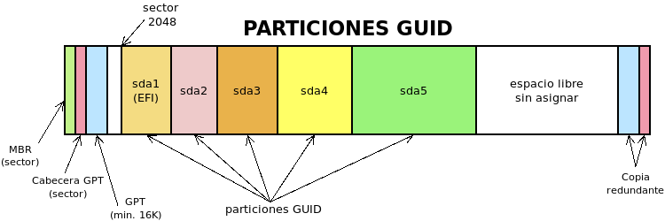

.. _arranque:

********
Arranque
********
El primer *software* que carga un ordenador al iniciarse es el *firmware*
almacenado en la placa base. que cumple cuatro funciones fundamentalmente:

+ Analizar el *hardware* presente en el ordenador con un proceso conocido como
  |POST|. El análisis puede no detectar problemas irresolubles (lo que
  generalmente se señala con un breve pitido) y encontrar algún defecto que
  impida el funcionamiento del equipo y para el arranque. De cuál sea en
  particular el defecto se informa mediante un código constituido por una
  combinación de pitidos breves y largos, cada una de las cuales identifica un
  problema distintos.

  El proceso de arranque que contiene esta comprobación se denominan
  :dfn:`arranque en frío`, frente al :dfn:`arranque en calente` que carece de
  ella. La regla es que los *arranques en frío* se producen cuando se enciende
  un ordenador apagado y los *arranques en caliente*, cuando se reinicia un
  ordenador.

+ Proporcionar una gestión básica de E/S para que al menos el usuario pueda
  utilizar el teclado.
+ Permitir la reconfiguración del firmware con el fin de que se pueda cambiar el
  comportamiento del *firmware* (p.e. para aligerar el proceso |POST| o
  cambiar cuál será el cargador de arranque que se lanzará posteriormente).
+ Cargar un programa posterior al que se le ceda el control, el cual
  habitualmente es el núcleo de un sistema operativo.

Hay dos **estándares** fundamentales:

- Desde los años 70, el antiguo |BIOS| de 16 bits.
- A partir de 2005, |EFI| o |UEFI|\ [#]_ de 32 *bits* (arquitectura *x86*) ó 64
  *bits* (arquitectura *x86_64*).

No existe en principio retrocompatibilidad entre ambos sistemas y a fecha de
2020 la situación es la siguiente:

a. Pueden existir aún equipos muy antiguos que disponen de |BIOS|.
#. Muchos equipos incluyen |EFI|, pero añaden un modo de comopatibilidad
   (normalmente denominado :dfn:`modo legacy`) que permite a la placa base
   buscar un cargador de arranque de 16 *bits* para |BIOS| o un
   cargador de arranque de 32 ó 64 *bits* para |EFI|. Muy comúnmente, se puede
   tener habilitado el modo compatibilidad a la vez que el modo normal.
#. Algunos de los equopos más recientes traen un *firmware* |EFI|, que carece
   de *modo legacy*; y es de esperar que en el futuro el número de equipos sin
   la compatibilidad aumente\ [#]_.

Como en todo estado de transición, es indispensable conocer ambas tecnologías,
que es en lo que afanará este epígrafe.

Proceso de arranque
*******************
Sea cual sea el estándar usado, en el proceso de arranque podemos distinguir las
siguientes fases:

#. Proceso |POST| de comprobación del *hardware*. Durante esta fase, el
   *firmware* mediante pulsación de ciertas teclas\ [#]_, brinda al usuario la
   posibilidad de pausar el proceso para:

   + Reconfigurar el *firmware*, que es lo que vulgarmente se conoce como
     "entrar en la bios". Si se hace esto, se presenta un entorno donde el
     usuario puede cambiar parámetros del *firmware* que se almacenan en memoria
     |NVRAM| (o CMOS_ en equipos antiguos). Al término de la configuración, se
     escoja o no salvar los cambios, se inicia un proceso de *arranque en
     caliente*.

   + Presentar un menú para seleccionar qué programa o dispositivo se desea
     arrancar. Los ítem de este menú son los ítem de la *secuencia de arranque*
     y el interesado podrá escoger cualquiera de ellos para alterar sólo en ese
     arranque la secuencia y que ese ítem pase a ser el primero.

   Aunque esta primera fase sólo está presente en un *arranque en frío*,
   generalmente en un *arranque en caliente* , si se es rápido pulsando la tecla
   apropiada se puede entrar en la configuración del *firmware* o el *menú de
   arranque*.

#. Arranque de algún programa siguiendo la :dfn:`secuencia de arranque`, que es
   una lista ordenada de todos los dispositivos detectados que se comprueban
   secuencialmente a fin de encontrar en ellos un programa de arranque válido.
   En cuanto se encuentre uno, se arranca y el *firmware* cede el control. Como
   ya veremos, en el caso de |UEFI|\ [#]_.  esa lista puede contener, además de
   dispositivos, programas concretos.

.. _boot-loader:

Cargador de arranque
********************
Ya hemos establecido que el *firmware* de placa base se encarga de ceder el
control a un programa ulterior para que habitualmente a la postre acabe por
cargarse en memoria un sistema operativo. Un :dfn:`cargador de arranque` es
cualquier programa que se carga antes del sistema operativo principal y
atendiendo a esta definición el propio *firmware* puede considerarse un
*cargador de arranque*. Todos los *cargadores de arranque*, no obstante, no
tienen la misma funcionalidad:

* Algunos tiene la función de cargar en memoria el núcleo de un sistema
  operativo y cederle el control de la máquina. Un ejemplo de cargador de
  arranque puro es EFIStub_, el cargador de arranque para |EFI| incluido en el
  propio núcleo de *Linux*\ [#]_. Con él podremos cargar un *Linux* sin
  necesidad de usar |GRUB|.

* Otros son programas que se limitan a realizar una función muy concreta como es
  el caso de memtest_ (que comprueba la integridad de la memoria |RAM|) o hdt_
  (que nos identifica el *hardware* de nuestro ordenador). En este caso, son
  programas terminales y no se pretende acabar cargando el sistema operativo.

  .. _boot-manager:

* Por último, hay cargadores cuyo propósito es, simplemente, cargar en cadena
  otro cargador de arranque. Dentro de este clase de cargadores destaca el
  :dfn:`gestor de arranque`, cuyo propósito es permitir escoger entre
  múltiples cargadores de arranque y, por tanto, brindarle al usuario la
  posibilidad de arrancar distintos sistemas operativos o programas como los del
  ítem anterior.

  Un *gestor de arranque* puede:

  * ser *puro* y limitarse a cumplir el propósito descrito, por lo que todas
    las entradas de su menú deberán ser cargadores de arranque externos. Son
    gestores puros el *gestor de arranque* incluido dentro del propio |EFI| o
    `rEFInd <http://www.rodsbooks.com/refind/>`_.

  * incluir cargadores de arranque para arrancar con ellos algunos sistemas
    operativos. Son ejemplos de este tipo de gestores |GRUB| (que permite
    arrancar sistemas *Linux* sin que el núcleo de éstos incluya EFIStub_), o
    |NTLDR| o *Windows Boot Manager*, que arrancan sistemas *Windows*.

  .. note:: Tenga presente que entre los cargadores opcionales entre los que
     deja escoger un gestor de arranque puede encontrarse otro gestor de arranque
     (que al fin es un tipo de cargador). Esto se denomina :dfn:`carga en
     cadena` (*chain loading*) y es la técnica que usa |GRUB| para cargar
     *Windows*. Como |GRUB| no incluye cargador de arranque para *Windows* lo
     que hace es cargar *Windows Boot Manager*

.. rubric:: Gestores de arranque

.. toctree::
   :glob:
   :maxdepth: 1

   02.boot/[0-9]*

.. seealso:: :program:`syslinux` es otro gestor de arranque que :ref:`se
   describe al tratar PXE <syslinux>`.

Estándares
**********
Analicemos las particularidades de cada estándar.

.. table:: Comparativa |UEFI|/|BIOS|
   :class: uefi-bios

   +-----------------+---------------+--------------------------+
   | Características | |BIOS|        | |UEFI|                   |
   +=================+===============+==========================+
   | Arquitectura    |   16bits      | 32 ó 64 bits             |
   +-----------------+---------------+--------------------------+
   | Compatibilidad  | No            | A extinguir              |
   +-----------------+---------------+--------------------------+
   | Arranque        | Dispositivos  | | Dispotivos             |
   |                 |               | | Cargadores de arranque |
   +-----------------+---------------+--------------------------+
   | Seguridad       | Ninguna       | Secure boot              |
   +-----------------+---------------+--------------------------+
   | Gestor externo  | Necesario     | Opcional                 |
   +-----------------+---------------+--------------------------+

|BIOS|
======
Es un sistema antiguo y bastante básico que para ceder el control se limita a
intentar cargar el código del |MBR|\ [#]_. Si no encuentra código en el |MBR| de
un dispositivo pasa al siguiente de la secuencia y así continua hasta que
encuentra un |MBR| con cargador de arranque. Cuando esto ocurre, delega el
control en ese código y ese código es el encargado de aviárselas con los
sistemas y particiones que pueda contener el dispositivo. Es importante, pues,
tener presente que este *firmware* no entiende de particiones ni sistemas de
archivos; y, por tanto, su sistema de arranque lee el comienzo del disco (los primeros 446 bytes concretamente) y es totalmente ajeno al sistema de particionado que se haya utilizado.

Aunque en un arranque |BIOS| suele existir una tecla cuya pulsación nos
presenta un menú con el cual podemos seleccionar el dispositivo de arranque,
esto no es propiamente un gestor de arranque en el sentido de que no podemos
añadir y eliminar a voluntad entradas en él. Sí lo es, en cambio, en el sentido
de que nos poermite seleccionar distintos cargadores de arranque: aquellos
cargadores que ocupen los respectivos |MBR| de los distintos dispositivos
detectados. Por tanto, si instalamos dos sistemas en dos dispositivos
diferentes, podremos con este mínimo gestor escoger entre uno y otro, pero si
los dos sistemas se encuentran instalados en un mismo dispositivo, no es
posible; y se requiere instalar en el |MBR| de ese disco un gestor de arranque
como |GRUB|. Sin embargo, los cargadores de arranque suelen ser más grandes que
los escasos 446 *bytes* que caben en el espacio dedicado en el |MBR| por lo que
este código alojado suele ser tan sólo una pequeña parte encargada de saber
dónde debe seguir leyendo el resto del cargador.

Lo habitual con *firmware* |BIOS| es que el sistema de particiones sea |DOS|,
aunque no es absolutamente necesario\ [#]_, puesto que, al cabo, |BIOS| sólo se
preocupa de leer al comienzo del dispositivo. Así pues, los condicionantes para
conseguir que un dispositivo sea arrancable son:

- Un particionado |DOS| (matizable, pero que daremos como verdadero).
- Un gestor de arranque en el |MBR|, como |GRUB| o *Windows Boot Manager*, que
  posibilite el arranque de los distintos sistemas almacenados en disco.

Nótese que, cada vez que se instala un sistema operativo, el programa instalador
sobrescribe el |MBR| con el cargador/gestor que incluya el nuevo sistema, por lo
que es responsabilidad de este último gestor incluir en sus entradas el nuevo
sistema y todos los que ya estén instalados en otras particiones de
instalaciones previas. Como *Windows Boot Manager* sólo se cuida de detectar y
arrancar sistemas *Windows*, y |GRUB|, sin embargo, sí busca todo tipo de
sistemas; si planteamos instalar varios sistemas operativos en un mismo disco
es preferible instalar primero los sistemas *Windows* (por orden de antigüedad,
porque las versiones antiguas pueden tener problemas en detectar *Windows* más
recientes) y después los sistemas *Linux*. Si no se sigue este orden, aún será
posible reparar el arranque, pero nos tocará utilizar herramientas para ello.

|UEFI|
======
Al contrario del sistema anterior, |UEFI| es capaz de entender la tabla de
particiones y algunos sistemas de archivos (obligatoriamente |FAT| y, para
dispositivos ópticos, CDFS), y dispone de un :ref:`gestor de arranque
<boot-manager>` básico capaz de usar cargadores de arranque. No es preciso,
pues, un gestor de arranque externo, aunque es muy común que se instale también.
*Windows*, de hecho, necesita *Windows Boot Manager* para su arranque, así que
de instalar un sistema *Windows* forzosamente requeriremos este gestor externo.
En cambio, si sólo instaláremos distintos sistemas *Linux* podríamos arrancarlos
todos sin necesidad de |GRUB|.

En este estándar para que un dispositivo sea arrancable es necesario:

- Un particionado |GPT|.
- La existencia de un partición  dedicada al arranque, denominada |ESP|, que se
  caracteriza por ser de tipo |EFI| (código simplificado *EF00*\ [#]_) y estar
  formateada en |FAT|\ 32.

El *firmware* |EFI|, a diferencia de |BIOS|, sí dispone de un verdadero gestor
de arranque, donde pueden irse registrando los cargadores que se vayan
almacenando en las particiones |ESP| de los distintos dispositivos. Esto es
posible porque |EFI| entiende el particionado |GPT| y el sistema de archivos
|FAT|\ 32, y, en consecuencia, es capaz de leer archivos almacenados en un
partición |GUID| formateada en |GPT|. Las entradas de este gestor tienen un
determinado orden y con ello se constituye la *secuencia de arranque*. De este
modo, se van probando las entradas de esta secuencia y aquella primera que
constituya un arranque válido, será la que arranque.

Las particiones |ESP| se organizan mediante un directorio llamado :file:`/EFI`
dentro del cual cada sistema operativo instalado crea un directorio con
ficheros necesarios para llevar a cabo su propio arranque:

.. code-block:: none

   /
   +-- EFI/
        +-- debian/
        +-- Microsoft/
        +-- etc.
        +-- Boot/
             +-- bootx64.efi

De este modo, los arranques de los distintos sistemas operativos pueden
coexistir sin problemas. Para que quepan es recomendable que tenga al menos
100MB. En la |NVRAM| del *firmware*\ [#]_ pueden irse manipulado las entradas de
la secuencia de arranque, definiendo su orden, elimando entradas o añadiendo
nuevas. Lo habitual, si instalamos un nuevo sistema operativo, es que este añada
una entrada para su arranque y, además, la sitúe la primera en la secuencia.

Además, de los subdirectorios para cada sistema operativo, suele existir un
subdirectorio :file:`/EFI/Boot` con un archivo denominado :file:`bootx64.efi`.
Este es el cargador de arranque que usa el *firmware* |EFI| cuando se escoge
arrancar por un dispositivo físico en vez de especificar en concreto el
cargador de arranque. La razón de que existan estan entradas genéricas para
los dispositivos no es gratuita: cuando el dispositivo arrancable es extraíble
(pensemos en un CD-ROM, por ejemplo), no se ha utilizado ningún instalador y,
por tanto, no se habrá añadido de antemano la entrada para arrancar el cargador
específico del dispositivo (cuyo nombre y ruta pueden ser cualesquiera). La
solución es que el gestor tenga la posibilidad de arrancar dispositivos y vaya
siempre a una ruta específica para encontrar el cargador.

Lo habitual es que el último sistema instalado, además de incluir su
subdirectorio propio, sobrescriba :file:`/EFI/Boot/bootx64.efi`, por lo que
arrancar por un dispositivo suele equivaler a cargar el último sistema
operativo instalado en ese dispositivo.

En definitiva, en una secuencia de arranque |EFI| encontraremos:

+ Dispositivos (que equivale a arrancar el último sistema operativo instalado
  en tal dispositivo).
+ Sistemas operativos que equivale a arrancar el cargador que se haya
  instalado en el subdirectorio correspondiente. Arrancar la entrada para un
  sistema operativo supone a menudo no arrancar directamente el sistema, sino
  el gestor de arranque que usa el sistema.
+ Utilidades como hdt_ o memtest_ que son ejecutables |EFI|.

.. image:: files/bootmanager-efi.png

Esto contrasta con la secuencia de arranque |BIOS| que sólo muestra
dispositivos, porque sólo es capaz de leer el cargador de arranque del |MBR|
correspondiente.

En cuanto al orden de instalación de los sistemas, podemos seguir la misma
regla que en el caso de |BIOS|, aunque incumplirla no es tan grave, ya que la
secuencia de arranque de |EFI| debe incluir todos los sistemas instalados y
bastará pulsar la tecla adecuada durante el proceso de arranque para que nos
aparezca un menú de selección con todos ellos. No obstante, lo más cómodo es
cumplir con el orden de instalación aconsejado, lo que devendrá en que el
cargador de arranque sea un |GRUB| con todos los sistemas instalados, tal como
ocurre en |BIOS|, que nos invita a escoger cuál arrancar sin necesidad de tener
que pulsar ninguna tecla durante la comprobacón previa de *hardware*.

Además de la mencionada tecla para mostrar la secuencia de arranque y escoger
cualquiera de sus entradas, y de un metodo gráfico para modificar perennemente
el orden de la entradas (posibilidades que ofrece |BIOS|), |EFI| proporciona
otros mecanismos para manipular la secuencia de arranque almacenada en la
|NVRAM|:

- Una *shell* con el comando :command:`bcfg`, que permite manipular la secuencia
  e incluso, añadir y borrar entradas. Esta *shell* suele incluirse como una
  entrada en la secuencia de arranque.
- Herramientas ejecutadas desde el sistema operativo. En *Linux*, este
  comando es :command:`efibootmgr`\ [#]_.

.. seealso:: La wiki de Archlinux tiene un muy completo `artículo sobre UEFI
   <https://wiki.archlinux.org/index.php/Unified_Extensible_Firmware_Interface_(Espa%C3%B1ol)>`_.

.. rubric:: ¿Qué es Secure Boot?

Para evitar la carga de *software* malicioso (p.e. `virus del sector de arranque
<https://www.kaspersky.com/resource-center/definitions/boot-sector-virus>`_) la
especificación |UEFI| introduce la posibilidad de cargar sólo *software* fiable,
esto es, *software* firmado. Esto exige que el propio *firmware* |UEFI| incluya
claves públicas de los fabricantes de *software* con el fin de que sólo sea
válido el software firmado con estas claves. Es común que en las plataformas
*x86* y *amd64* las únicas claves incluidas de fábrica sea las de *Microsoft*,
pero es posible, bien deshabilitar "Secure Boot", bien añadir más claves de
fabricantes fiables.

.. seealso:: Para entender cómo funciona esta firma digital, puede leer el
   apartado dedicado a :ref:`criptografía <crypto>`.

.. rubric:: Notas al pie

.. [#] Intel publicó la especificación con el nombre de |EFI|. Al ser  adoptada
   en 2005 por la industria en general pasó a llamarse |UEFI|. Así pues, ambos
   términos son sinónimos y debemos entender lo mismo por ellos.
.. [#] Intel, por ejemplo, ha anunciado que dejará de dar soporte a |BIOS| a
   partir de 2020 (puede leer `este artículo al respecto
   <https://www.genbeta.com/actualidad/se-acerca-el-fin-de-bios-intel-eliminara-el-soporte-en-2020>`_). 
.. [#] Las teclas varían sea cual sea el fabricante del *firmware*, por lo que
   no se puede indicar cuáles son exactamente.Habitualmente suelen escogerse
   :kbd:`Suprimir`, :kbd:`F2`, :kbd:`F8`, :kbd:`F10`, :kbd:`F11` o :kbd:`F12`.
.. [#] En |UEFI| es posible porque este firmware sí entiende de particiones y es
   capaz de leer archivos dentro de un sistema FAT32.
.. [#] Para que un kernel de linux pueda arrancarse directamente es necesario
   que se compile con la opción EFIStub_, disponible desde la versión 3.3.0.
.. [#] Es cierto que los *floppy* no disponen de |MBR| (véase `esta explicación
   <https://thestarman.pcministry.com/asm/mbr/DOS50FDB.htm>`_), pero dado lo
   anticuado del dispositivo, podemos obviarlo por completo.
.. [#] De hecho, con |GRUB| puede arrancarse un sistema |BIOS| y particionado
   |GPT|.
.. [#] En realidad, el código identificativo de esta partición es mucho más
   largo (``C12A7328-F81F-11D2-BA4B-00A0C93EC93B``). ``EF00`` es el código
   simplificado que usa la utilidad :ref:`gdisk <gdisk.i>`. Sin embargo,
   la especificación |UEFI| ni siquiera exige que la partición este marcada
   con este código, ya que las entradas que se almacenan en la |NVRAM| indican
   cuál es la partición de disco donde se encuentra el fichero que constituye el
   cargador de arranque. Lo único necesario. pues, es que el sistema de archivos
   sea comprensible, esto es, que sea |FAT|\ 32.

.. [#] En la implementación |UEFI| que traen algunos *softwares* de
   virtualización (OVMF_), la |NVRAM| se emula almacenando en el directorio
   :file:`EFI` un fichero llamado :file:`NvVars`.
.. [#] Por ejemplo, esta orden añade una nueva entrada::

      # efibootmgr --create --disk /dev/sda --part 2 --loader /EFI/so/bootx64.efi \
         --label "Mi primer arranque UEFI"

   en la que se intenta cargar el fichero :file:`/EFI/so/bootx64.efi` y la que
   se supone que la partición |ESP| es la segunda del disco.

.. |BIOS| replace:: :abbr:`BIOS (Basic I/O System)`
.. |EFI| replace:: :abbr:`EFI (Extensible Firmware Interface)`
.. |UEFI| replace:: :abbr:`UEFI (Unified Extensible Firmware Interface)`
.. |MBR| replace:: :abbr:`MBR (Master Boot Record)`
.. |FAT| replace:: :abbr:`FAT (File allocation Table)`
.. |NVRAM| replace:: :abbr:`NVRAM (Non-Volatile RAM)`
.. |ESP| replace:: :abbr:`ESP (EFI System Partition)`
.. |GRUB| replace:: :abbr:`GRUB (GRand Unified Bootloader)`
.. |LILO| replace:: :abbr:`LILO (LInux LOader)`
.. |VBR| replace:: :abbr:`VBR (Volume Boot Record)`
.. |NTLDR| replace:: :abbr:`NTLDR (NT LoaDeR)`
.. |WBM| replace:: :abbr:`WBM (Windows Boot Manager)`
.. |RAM| replace:: :abbr:`RAM (Random Access Memory)`
.. |DOS| replace:: :abbr:`DOS (Disk Operating System)`
.. |GPT| replace:: :abbr:`GPT (GUID Partition Table)`
.. |GUID| replace:: :abbr:`GUID (Globally Unique Identifier)`
.. |POST| replace:: :abbr:`POST (Power On Self Test)`

.. _OVMF: https://github.com/tianocore/tianocore.github.io/wiki/OVMF
.. _memtest: https://www.memtest.org/
.. _hdt: https://wiki.syslinux.org/wiki/index.php?title=Hdt_(Hardware_Detection_Tool)
.. _EFIStub: https://wiki.archlinux.org/index.php/EFISTUB
.. _CMOS: https://es.wikipedia.org/wiki/RAM-CMOS

