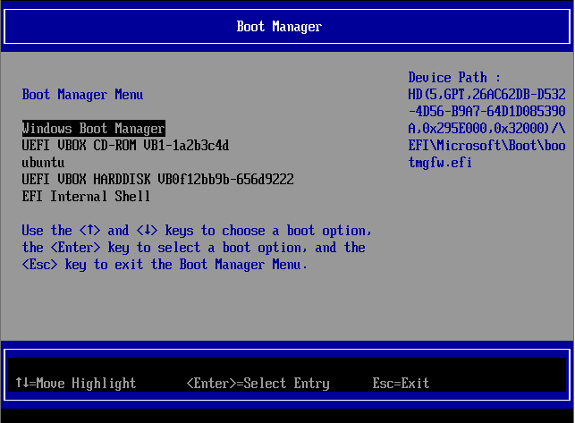

.. _arranque:

********
Arranque
********
El primer *software* que carga un ordenador al iniciarse es el *firmware*
almacenado en la placa base. que cumple cuatro funciones fundamentalmente:

+ Analizar el *hardware* presente en el ordenador con un proceso conocido como
  |POST|. El análisis puede no detectar problemas irresolubles (lo que
  generalmente se señala con un breve pitido) y encontrar algún defecto que
  impida el funcionamiento del equipo y para el arranque. De cuál sea en
  particular el defecto se informa mediante un código constituido por una
  combinación de pitidos breves y largos, cada una de las cuales identifica un
  problema distintos.

  El proceso de arranque que contiene esta comprobación se denominan
  :dfn:`arranque en frío`, frente al :dfn:`arranque en calente` que carece de
  ella. La regla es que los *arranques en frío* se producen cuando se enciende
  un ordenador apagado y los *arranques en caliente*, cuando se reinicia un
  ordenador.

+ Proporcionar una gestión básica de E/S para que al menos el usuario pueda
  utilizar el teclado.
+ Permitir la reconfiguración del firmware con el fin de que se pueda cambiar el
  comportamiento del *firmware* (p.e. para aligerar el proceso |POST| o
  cambiar cuál será el cargador de arranque que se lanzará posteriormente).
+ Cargar un programa posterior al que se le ceda el control, el cual
  habitualmente es el núcleo de un sistema operativo.

Hay dos **estándares** fundamentales:

- Desde los años 70, el antiguo |BIOS| de 16 bits.
- A partir de 2005, |EFI| o |UEFI|\ [#]_ de 32 *bits* (arquitectura *x86*) ó 64
  *bits* (arquitectura *x86_64*).

No existe en principio retrocompatibilidad entre ambos sistemas y a fecha de
2020 la situación es la siguiente:

a. Pueden existir aún equipos muy antiguos que disponen de |BIOS|.
#. Muchos equipos incluyen |EFI|, pero añaden un modo de comopatibilidad
   (normalmente denominado :dfn:`modo legacy`) que permite a la placa base
   buscar un cargador de arranque de 16 *bits* para |BIOS| o un
   cargador de arranque de 32 ó 64 *bits* para |EFI|. Muy comúnmente, se puede
   tener habilitado el modo compatibilidad a la vez que el modo normal.
#. Algunos de los equopos más recientes traen un *firmware* |EFI|, que carece
   de *modo legacy*; y es de esperar que en el futuro el número de equipos sin
   la compatibilidad aumente\ [#]_.

Como en todo estado de transición, es indispensable conocer ambas tecnologías,
que es en lo que afanará este epígrafe.

Proceso de arranque
*******************
Sea cual sea el estándar usado, en el proceso de arranque podemos distinguir las
siguientes fases:

#. Proceso |POST| de comprobación del *hardware*. Durante esta fase, el
   *firmware* mediante pulsación de ciertas teclas\ [#]_, brinda al usuario la
   posibilidad de pausar el proceso para:

   + Reconfigurar el *firmware*, que es lo que vulgarmente se conoce como
     "entrar en la bios". Si se hace esto, se presenta un entorno donde el
     usuario puede cambiar parámetros del *firmware* que se almacenan en memoria
     |NVRAM| (o CMOS_ en equipos antiguos). Al término de la configuración, se
     escoja o no salvar los cambios, se inicia un proceso de *arranque en
     caliente*.

   + Presentar un menú para seleccionar qué programa o dispositivo se desea
     arrancar. Los ítem de este menú son los ítem de la *secuencia de arranque*
     y el interesado podrá escoger cualquiera de ellos para alterar sólo en ese
     arranque la secuencia y que ese ítem pase a ser el primero.

   Aunque esta primera fase sólo está presente en un *arranque en frío*,
   generalmente en un *arranque en caliente* , si se es rápido pulsando la tecla
   apropiada se puede entrar en la configuración del *firmware* o el *menú de
   arranque*.

#. Arranque de algún programa siguiendo la :dfn:`secuencia de arranque`, que es
   una lista ordenada de todos los dispositivos detectados que se comprueban
   secuencialmente a fin de encontrar en ellos un programa de arranque válido.
   En cuanto se encuentre uno, se arranca y el *firmware* cede el control. Como
   ya veremos, en el caso de |UEFI|\ [#]_.  esa lista puede contener, además de
   dispositivos, programas concretos.

.. _boot-loader:

Cargador de arranque
********************
Ya hemos establecido que el *firmware* de placa base se encarga de ceder el
control a un programa ulterior para que habitualmente a la postre acabe por
cargarse en memoria un sistema operativo. Un :dfn:`cargador de arranque` es
cualquier programa que se carga antes del sistema operativo principal y
atendiendo a esta definición el propio *firmware* puede considerarse un
*cargador de arranque*. Todos los *cargadores de arranque*, no obstante, no
tienen la misma funcionalidad:

* Algunos tiene la función de cargar en memoria el núcleo de un sistema
  operativo y cederle el control de la máquina. Un ejemplo de cargador de
  arranque puro es EFIStub_, el cargador de arranque para |EFI| incluido en el
  propio núcleo de *Linux*\ [#]_. Con él podremos cargar un *Linux* sin
  necesidad de usar |GRUB|.

* Otros son programas que se limitan a realizar una función muy concreta como es
  el caso de memtest_ (que comprueba la integridad de la memoria |RAM|) o hdt_
  (que nos identifica el *hardware* de nuestro ordenador). En este caso, son
  programas terminales y no se pretende acabar cargando el sistema operativo.

  .. _boot-manager:

* Por último, hay cargadores cuyo propósito es, simplemente, cargar en cadena
  otro cargador de arranque. Dentro de este clase de cargadores destaca el
  :dfn:`gestor de arranque`, cuyo propósito es permitir escoger entre
  múltiples cargadores de arranque y, por tanto, brindarle al usuario la
  posibilidad de arrancar distintos sistemas operativos o programas como los del
  ítem anterior.

  Un *gestor de arranque* puede:

  * ser *puro* y limitarse a cumplir el propósito descrito, por lo que todas
    las entradas de su menú deberán ser cargadores de arranque externos. Son
    gestores puros el *gestor de arranque* incluido dentro del propio |EFI| o
    `rEFInd <http://www.rodsbooks.com/refind/>`_.

  * incluir cargadores de arranque para arrancar con ellos algunos sistemas
    operativos. Son ejemplos de este tipo de gestores |GRUB| (que permite
    arrancar sistemas *Linux* sin que el núcleo de éstos incluya EFIStub_), o
    |NTLDR| o *Windows Boot Manager*, que arrancan sistemas *Windows*.

  .. note:: Tenga presente que entre los cargadores opcionales entre los que
     deja escoger un gestor de arranque puede encontrarse otro gestor de arranque
     (que al fin es un tipo de cargador). Esto se denomina :dfn:`carga en
     cadena` (*chain loading*) y es la técnica que usa |GRUB| para cargar
     *Windows*. Como |GRUB| no incluye cargador de arranque para *Windows* lo
     que hace es cargar *Windows Boot Manager*

.. rubric:: Gestores de arranque

.. toctree::
   :glob:
   :maxdepth: 1

   02.boot/[0-9]*

.. seealso:: :program:`syslinux` es otro gestor de arranque que :ref:`se
   describe al tratar PXE <syslinux>`.

Estándares
**********
Analicemos las particularidades de cada estándar.

.. table:: Comparativa |UEFI|/|BIOS|
   :class: uefi-bios

   +-----------------+---------------+--------------------------+
   | Características | |BIOS|        | |UEFI|                   |
   +=================+===============+==========================+
   | Arquitectura    |   16bits      | 32 ó 64 bits             |
   +-----------------+---------------+--------------------------+
   | Compatibilidad  | No            | A extinguir              |
   +-----------------+---------------+--------------------------+
   | Arranque        | Dispositivos  | | Dispotivos             |
   |                 |               | | Cargadores de arranque |
   +-----------------+---------------+--------------------------+
   | Seguridad       | Ninguna       | Secure boot              |
   +-----------------+---------------+--------------------------+
   | Gestor externo  | Necesario     | Opcional                 |
   +-----------------+---------------+--------------------------+

|BIOS|
======
Es un sistema antiguo y bastante básico que para ceder el control se limita a
intentar cargar el código del |MBR|\ [#]_. Si no encuentra código en el |MBR| de
un dispositivo pasa al siguiente dispositivo de la secuencia y así continua
hasta que encuentra un |MBR| con cargador de arranque. Cuando esto ocurre,
delega el control en ese código y ese código es el encargado de aviárselas con
los sistemas y particiones que pueda contener el dispositivo. Es importante,
pues, tener presente que este *firmware* no entiende de particiones ni sistemas
de archivos; y, por tanto, su sistema de arranque lee el comienzo del disco (los
primeros 446 bytes concretamente) y es totalmente ajeno al sistema de
particionado que se haya utilizado.

Aunque en un arranque |BIOS| suele existir una tecla cuya pulsación nos
presenta un menú con el cual podemos seleccionar el dispositivo de arranque,
esto no es propiamente un gestor de arranque en el sentido de que no podemos
añadir y eliminar a voluntad entradas en él. Sí lo es, en cambio, en el sentido
de que nos poermite seleccionar distintos cargadores de arranque: aquellos
cargadores que ocupen los respectivos |MBR| de los distintos dispositivos
detectados. Por tanto, si instalamos dos sistemas en dos dispositivos
diferentes, podremos con este mínimo gestor escoger entre uno y otro, pero si
los dos sistemas se encuentran instalados en un mismo dispositivo, no es
posible; y se requiere instalar en el |MBR| de ese disco un gestor de arranque
como |GRUB|. Sin embargo, los cargadores de arranque suelen ser más grandes que
los escasos 446 *bytes* que caben en el espacio dedicado en el |MBR| por lo que
este código alojado suele ser tan sólo una pequeña parte encargada de saber
dónde debe seguir leyendo el resto del cargador.

Lo habitual con *firmware* |BIOS| es que el sistema de particiones sea |DOS|,
aunque no es absolutamente necesario\ [#]_, puesto que, al cabo, |BIOS| sólo se
preocupa de leer al comienzo del dispositivo. Así pues, los condicionantes para
conseguir que un dispositivo sea arrancable son:

- Un particionado |DOS| (matizable, pero que daremos como verdadero).
- Un gestor de arranque en el |MBR|, como |GRUB| o *Windows Boot Manager*, que
  posibilite el arranque de los distintos sistemas almacenados en disco.

Nótese que, cada vez que se instala un sistema operativo, el programa instalador
sobrescribe el |MBR| con el cargador/gestor que incluya el nuevo sistema, por lo
que es responsabilidad de este último gestor incluir en sus entradas el nuevo
sistema y todos los que ya estén instalados en otras particiones de
instalaciones previas. Como *Windows Boot Manager* sólo se cuida de detectar y
arrancar sistemas *Windows*, y |GRUB|, sin embargo, sí busca todo tipo de
sistemas; si planteamos instalar varios sistemas operativos en un mismo disco
es preferible instalar primero los sistemas *Windows* (por orden de antigüedad,
porque las versiones antiguas pueden tener problemas en detectar *Windows* más
recientes) y después los sistemas *Linux*. Si no se sigue este orden, aún será
posible reparar el arranque, pero nos tocará utilizar herramientas para ello.

.. _boot-uefi:

|UEFI|
======
Al contrario del sistema anterior, |UEFI| es capaz de entender una tabla de
particiones |GPT| y algunos sistemas de archivos (obligatoriamente |FAT| y, para
dispositivos ópticos, CDFS), y dispone de un :ref:`gestor de arranque
<boot-manager>` básico. No es preciso, pues, un gestor de arranque externo,
aunque es muy común que se instale también. *Windows*, de hecho, necesita
*Windows Boot Manager* para su arranque, así que de instalar un sistema
*Windows* forzosamente requeriremos este gestor externo. En cambio, si sólo
instaláremos distintos sistemas *Linux* podríamos arrancarlos todos sin
necesidad de |GRUB| (aunque lo habitual es que también se insale)

El gestor de arranque integrado es capaz de almacenar en memoria |NVRAM|\ [#]_
entradas ordenadas de arranque. Cada entrada recibe un nombre (p.e. "Debian") y
refiere la ruta a un archivo contenida en la partición |GUID| de un determinado
dispositivo. Cuáles sean la ruta, la partición y el dispositivo es lo de menos
con tal de que el archivo sea un cargador de arranque. La única condición es que
la partición esté formateada con un sistema de archivos inteligible por el
*firmware*. Por tanto, para arrancar un sistema opèrativo basta con que haya una
partición adecuada para albergar su cargador de arranque y que la referencia a
este cargador se haya incluido como entrada. De este modo, las entradas en el
gestor integrado no son referencias a un dispositivo, como pasa con |BIOS|, sino
a un cargador concreto, por lo que podemos tener conviviendo en un único disco
arranques de distintos sistemas operativos sin necesidad de ningún gestor
externo. A pesar de esto, nos podemos encontrar en una secuencia de arranque
|EFI| una o varias entradas que refieren dispositivos. Estas entradas en
realidad lo que hacen es buscar un archivo (un cargador de arranque) en una ruta
predefinida dentro de ese dispositivo. Desvaleremos más adelante cuál.

Además, a las entradas ya almacenadas en la |NVRAM|, el *firmware* añade
dinámicamente una entrada por cada dispositivo extraíble detectado en la fase
|POST| y que no estuviera presente ya en la secuencia. De este modo, es posible
arrancar desde una memoria |USB| que se haya pinchado circunstancialmente.

Aunque los cargadores de arranque podrían estar almacenados en distintas
particiones de distintos dispositivos y en rutas arbitrarias, en la práctica
esto se hace con ciertos criterios que acatan los instaladores de los sistemas
operativos:

+ En el particionado |GPT| de un disco se crea una partición formateada con
  sistema de archivos |FAT|\ 32 y de tipo |ESP| (código simplificado *EF00*\
  [#]_), Si disponemnos de varios discos, basta que esta partición esté en uno
  de ellos:

  .. image:: files/part-gpt-uefi.png

  .. _EFI-archivos:

+ Dentro de esa partición se crea una estructura de directorios con este aspecto:

  .. code-block:: none

     /
     +-- EFI/
          +-- debian/
          +-- Windows Boot Manager/
          +-- etc.
          +-- Boot/
               +-- bootx64.efi

  esto es, un directorio :file:`EFI` dentro del cual cada sistema operativo crea
  un subdirectorio con los archivos oportunos para el arranque o para al menos
  comenzar el arranque. Uno de esos archivos será el que deba cargar el
  *firmware* |EFI|, por lo que su ruta será la que se añada como entrada en la
  secuencia de arranque.

Como se deduce, todo está perfectamente estructurado y, por tanto, mientras
exista espacio suficiente (habitualmente con **100** MiB hay más que de sobra)
no hay riesgo de que el arranque de un sistema operativo interfiera con el de
otros, como sí ocurre en |BIOS| en que cómo sólo hay un punto de arranque por
dispositivo (su |MBR|) el arranque de un sistema instalado sobrescribirá el
código que en el |MBR| pudiera haber escrito la instalación de un sistema
operativo instalado anteriormente.

Lo normal, sin embargo, es que, al registrar un sistema operativo la entrada
para su arranque, la registre como la primera en la secuencia, lo que determina
que se cargue con preferencia en detrimento del resto de sistemas operativos que
se hubieran podido instalar antes. Si este arranque es respetuoso con el resto y
consiste en un gestor de arranque que también permite la carga de los demás,
como es el caso de |GRUB|, este hecho no es relevante, ya que este gestor
externo nos brindará la posibilidad de seguir arrancando el que queramos. Si en
cambio el gestor no es tan gentil (como es el caso de *Windows Boot Manager*),
aparentemente dejaremos de poder arrancar el resto de sistemas no *Windows*;
pero sólo aparentemente, porque bastará con pulsar la tecla apropiada que nos
muestre todas las entradas del gestor |EFI| integrado para que podamos escoger
cualquier otra distinta de la primera.

Además de poder escoger entrada a voluntad en cada arranque, también es posible
cambiar la secuencia de arranque para reordenar sus entradas. Hay diversas vías:

- Quizás algún método gráfico en la configuración del *firmware*.
- Quizás alguna *shell* de comandos proporcionada por el propio *firmware*. Esta
  *shell* disponde de la orden :command:`bcfg`, que permite manipular la
  secuencia e incluso, añadir y borrar entradas.
- Herramientas ejecutadas desde el sistema operativo. En *Linux*, este
  comando es :command:`efibootmgr`\ [#]_.

Peso a lo anterior, lo que ahorra más trabajo es seguir la misma regla ya
enunciada al tratar |BIOS| para organizar la instalación de sistemas operativos:
sistemas *Windows* de más antiguo a más nuevo y sistemas *Linux* después.

Volvamos para terminar a un aspecto que dejamos en suspenso: la adición dinámica
de entradas para arrancar dispositivos extraíbles. De hecho, en un equipo virgen
siin nada instalado aún, éstas serán las únicas entradas disponibles. Ya hemos
explicado cómo el *firmware* |EFI| intenta cargar la ruta especificada en cada
una de las entradas de la secuencia. En este caso, sin embargo, el sistema
operativo del disposivo extraíble no ha sido instalado por un instalador que
haya manipulado la |NVRAM| para registrar la ruta al cargador, por lo que la
única solución es que la entrada que representa al dispositivo siempre busque lo
mismo: la primera partición del dispositivo de tipo |ESP| y dentro de ella la
ruta :file:`/EFI/Boot/bootx64.efi`. Si tal cosa existe, el dispositivo extraíble
arrancará.

.. note:: Si se revisa el :ref:`esquema de archivos de la partición EFI
   <EFI-archivos>`, se comprobará que esa ruta predefinida también se ha
   incluido. Por lo general, la ocupa con su arranque el último sistema
   instalado (aparte de haber creado su directorio particular), por lo que una
   entrada en la secuencia de arranque que refiera a secas el dispositivo de
   disco, cargará el arranque del último sustema operativo instalado.

.. _secure-boot:

.. rubric:: ¿Qué es Secure Boot?

.. note:: Para la perfecta compresión de este apartado es forzoso que al menos
   se entiendan los fundamentos dewl :ref:`cifrado asimétrico <asimetrico>`.

Para evitar la carga de *software* malicioso (p.e. `virus del sector de arranque
<https://www.kaspersky.com/resource-center/definitions/boot-sector-virus>`_) la
especificación |UEFI| introduce la posibilidad de cargar sólo *software* fiable,
esto es, *software* firmado. Para ello existe una cadena de confianza:

* El fabricante del *hardware* dispone una clave pública, llamada clave de
  plataforma (|PK|).
* Sólo el fabricante (que posee la clave privada correspondiente a la |PK|)
  podrá añadir claves públicas a la lista de |KEK|\ s.
* Los propietarios de las claves públicas anteriores (|KEK|) son los únicos
  capaces de añadir claves públicas a la base de firmas (**db**) o a la base de
  firmas prohibidas (**dbx**).
* La **db** es la lista de claves autorizadas para firmar cargadores de
  arranque.
* La **dbx** es la lista de claves vetadas: ningún cargador firmado con
  alguna de estas claves podrá ser cargado por el *firmware* |EFI|.
* El primer cargador contiene a su vez una lista de claves que autorizan
  al *software* subsiguiente.

|PK|, |KEK|, **db** y **dbx** vienen incluidas en el propio *firmware* de la
placa y en la práctica los fabricantes de *hardware* convencional sólo incluyen
en la lista de |KEK|\ s y en la **db** sendas claves propiedad de *Microsoft*,
por lo que sólo *Microsoft* tiene capacidad para firmar el primer cargador tras
|EFI|. Por este motivo algunas distribuciones de *Linux* (*Debian* entre ellas)
incluyen un `cargador llamado shim <https://github.com/rhboot/shim>`_
(paquete `shim-signed <https://packages.debian.org/stable/shim-signed>`_) cuyo
ejecutable ha pedido cada cual a *Microsoft* que firme con la "Microsoft
Corporation UEFI CA" y en el que han incluido su propia clave para poder firmar
a su vez ya ellas mismas el |GRUB| (paquete `grub-efi-amd64-signed
<https://packages.debian.org/stable/grub-efi-amd64-signed>`_) que se carga
después que a su vez se encargara de comprobar la firma del núcleo de *Linux*
finalmente cargado.

Puede también optarse por deshabilitar *Secure Boot* en cuyo caso el cargador de
arranque no requerirá estar firmado.

.. rubric:: Enlaces de interés

* La wiki de Archlinux tiene un muy completo `artículo sobre UEFI
  <https://wiki.archlinux.org/index.php/Unified_Extensible_Firmware_Interface_(Espa%C3%B1ol)>`_.

* La entrada `The EFI System Partition and the Default Boot Behavior
  <https://blog.uncooperative.org/blog/2014/02/06/the-efi-system-partition/>`_,
  del blog `The Uncoöperative Organization  <https://blog.uncooperative.org/>`_.

.. rubric:: Notas al pie

.. [#] Intel publicó la especificación con el nombre de |EFI|. Al ser  adoptada
   en 2005 por la industria en general pasó a llamarse |UEFI|. Así pues, ambos
   términos son sinónimos y debemos entender lo mismo por ellos.
.. [#] Intel, por ejemplo, ha anunciado que dejará de dar soporte a |BIOS| a
   partir de 2020 (puede leer `este artículo al respecto
   <https://www.genbeta.com/actualidad/se-acerca-el-fin-de-bios-intel-eliminara-el-soporte-en-2020>`_). 
.. [#] Las teclas varían sea cual sea el fabricante del *firmware*, por lo que
   no se puede indicar cuáles son exactamente.Habitualmente suelen escogerse
   :kbd:`Suprimir`, :kbd:`F2`, :kbd:`F8`, :kbd:`F10`, :kbd:`F11` o :kbd:`F12`.
.. [#] En |UEFI| es posible porque este firmware sí entiende de particiones y es
   capaz de leer archivos dentro de un sistema FAT32.
.. [#] Para que un kernel de linux pueda arrancarse directamente es necesario
   que se compile con la opción EFIStub_, disponible desde la versión 3.3.0.
.. [#] Es cierto que los *floppy* no disponen de |MBR| (véase `esta explicación
   <https://thestarman.pcministry.com/asm/mbr/DOS50FDB.htm>`_), pero dado lo
   anticuado del dispositivo, podemos obviarlo por completo.
.. [#] De hecho, con |GRUB| puede arrancarse un sistema |BIOS| y particionado
   |GPT|.
.. [#] En la implementación |UEFI| que traen algunos *softwares* de
   virtualización (OVMF_), la |NVRAM| se emula almacenando en el directorio
   :file:`EFI` un fichero llamado :file:`NvVars`.
.. [#] En realidad, el código identificativo de esta partición es mucho más
   largo (``C12A7328-F81F-11D2-BA4B-00A0C93EC93B``). ``EF00`` es el código
   simplificado que usa la utilidad :ref:`gdisk <gdisk.i>`. Sin embargo,
   la especificación |UEFI| ni siquiera exige que la partición este marcada
   con este código, ya que las entradas que se almacenan en la |NVRAM| indican
   cuál es la partición de disco donde se encuentra el fichero que constituye el
   cargador de arranque. Lo único necesario. pues, es que el sistema de archivos
   sea comprensible, esto es, que sea |FAT|\ 32.

.. [#] Por ejemplo, esta orden añade una nueva entrada::

      # efibootmgr --create --disk /dev/sda --part 2 --loader /EFI/so/bootx64.efi \
         --label "Mi primer arranque UEFI"

   en la que se intenta cargar el fichero :file:`/EFI/so/bootx64.efi` y la que
   se supone que la partición |ESP| es la segunda del disco.

.. |BIOS| replace:: :abbr:`BIOS (Basic I/O System)`
.. |EFI| replace:: :abbr:`EFI (Extensible Firmware Interface)`
.. |UEFI| replace:: :abbr:`UEFI (Unified Extensible Firmware Interface)`
.. |MBR| replace:: :abbr:`MBR (Master Boot Record)`
.. |FAT| replace:: :abbr:`FAT (File allocation Table)`
.. |NVRAM| replace:: :abbr:`NVRAM (Non-Volatile RAM)`
.. |ESP| replace:: :abbr:`ESP (EFI System Partition)`
.. |GRUB| replace:: :abbr:`GRUB (GRand Unified Bootloader)`
.. |LILO| replace:: :abbr:`LILO (LInux LOader)`
.. |VBR| replace:: :abbr:`VBR (Volume Boot Record)`
.. |NTLDR| replace:: :abbr:`NTLDR (NT LoaDeR)`
.. |WBM| replace:: :abbr:`WBM (Windows Boot Manager)`
.. |RAM| replace:: :abbr:`RAM (Random Access Memory)`
.. |DOS| replace:: :abbr:`DOS (Disk Operating System)`
.. |GPT| replace:: :abbr:`GPT (GUID Partition Table)`
.. |GUID| replace:: :abbr:`GUID (Globally Unique Identifier)`
.. |POST| replace:: :abbr:`POST (Power On Self Test)`
.. |USB| replace:: :abbr:`USB (Universal Serial Bus)`
.. |PK| replace:: :abbr:`PK (Platform Key)`
.. |KEK| replace:: :abbr:`KEK (Key Exchange Key)`

.. _OVMF: https://github.com/tianocore/tianocore.github.io/wiki/OVMF
.. _memtest: https://www.memtest.org/
.. _hdt: https://wiki.syslinux.org/wiki/index.php?title=Hdt_(Hardware_Detection_Tool)
.. _EFIStub: https://wiki.archlinux.org/index.php/EFISTUB
.. _CMOS: https://es.wikipedia.org/wiki/RAM-CMOS

