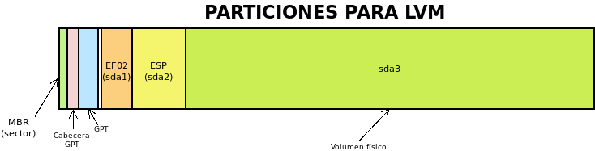

.. _lvm:

Volúmenes lógicos
*****************
A diferencia de otros como zfs_ o btrfs_, *ext4* no soporta nativamente la
gestión de volúmenes lógicos. Sin embargo, podemos manejar discos y particiones
virtuales, ayudándonos de un *software* adicional llamado |LVM|. Las
**ventajas** de su uso, ya se han establecido en epígrafes anteriores:

- Permite agrandar indiscriminadamente el disco: basta con comprar un nuevo
  disco físico e incluirlo como integrante del disco virtual.

  .. image:: files/1+1disks.png

- Permite agrandar indiscriminadamente las particiones sin cuidarse de que el
  espacio que constituye la partición deba ser contiguo. Cuando tratamos
  particiones físicas, ampliar una partición es todo un engorro, sobre todo si
  está encajonada entre otras dos particiones. Por ejemplo, ampliar en el
  siguiente gráfico :file:`sda3`, implica también mover :file:`sda4`:

  .. image:: files/ampl-part.png

Logramos, por tanto, muchísima más versatilidad que usando particiones fisicas.
En contraprestación, hay una **desventaja** evidente: las particiones lógicas
sólo son visibles con el *software* de |LVM|. 

.. rubric:: Definiciones

Antes de pasar a exponer cómo crear y manejar volúmenes lógicos, es pertinente
fijar el significado de algunos términos que se usarán en la exposición:

**Volúmen físico** (|PV|)
   Son las particiones físicas o incluso discos físicos completos sobre las que
   se definen los discos virtuales.

**Grupo de volúmenes** (|VG|)
   Es el conjunto de volúmenes físicos que conforma un disco virtual.

**Volúmenes lógicos** (|LV|)
   Es el dispoitivo virtual de bloques que alberga un sistemas de ficheros, esto
   es, lo que hemos venido definiendo como *partición virtual* a lo largo de
   nuestra exposición.

En la tarea de constituir volúmenes lógicos:

- Deben definirse cuáles son los volúmenes físicos.
- Deben definirse cómo se agrupan esos volúmenes físicos en grupos de volúmenes.
  Lo habitual es que haya un grupo de volúmenes.
- Debe particionarse cada grupo de volúmenes en volúmenes logicos.

.. note:: Es importante tener presente que |GRUB| soporta |LVM| y, por tanto, es
   capaz de arrancar un *Linux* aunque los ficheros de su fase 3 y el kernel se
   encuentren dentro de volúmenes lógicos.

Es muy probable que el *software* para gestionar volúmenes lógicos ya se
encuentre instalado, pero si no es así::

   # apt install lvm2

.. note:: |LVM| permite también la creación de |RAID|\ s, pero no es
   propósito de este apartado, tratarlo. Bajo el epígrafe dedicado a :ref:`RAUDs
   <raid>` hay :ref:`todo un apartado dedicado a la creación de RAIDs con LVM
   <lvmraid>`.

.. _pvcreate:
.. _vgcreate:
.. _lvcreate:

.. index:: pvcreate, lvcreate, vgcreate

Creación
========
Dentro del grupo de volúmenes podemos incluir todas las particiones que deseemos
crear, excepto aquellas necesarias para el arranque del disco. Por tanto, un
particionado físico del disco apropiado para crear volúmenes lógicos puede ser
el siguiente:

que usando :ref:`sgdisk <sgdisk>` puede realizarse de esta forma::

   $ sgdisk -a 8 -n "0:40:2047" -t "0:0xef02" -c "0:BOOTBIOS" \
            -a 2048 -n "0:2048:+50M" -t "0:0xef00" -c "0:EFI" \
            -N 0 -t "3:0x8e00" -c "3:LVM" /tmp/disco.raw

de forma que creamos las dos particiones necesarias para el arranque aparte,
y una tercera partición destinanda a ser el volumen físico que constituya el
grupo de volúmenes. La partición destinada para este fin se nota con el código
*0x8E00*.

.. note:: Por supuesto, podemos crear volúmenes lógicos partiendo también de un
   particionado |DOS|

Como estamos particionando un fichero, no podemos acceder
directamente a sus particiones como sí sería posible si particionáramos un disco
(p.e. de :file:`/dev/sda` aparecerían :file:`/dev/sda1`, file:`/dev/sda2`,
etc.). Para hacerlas accesibles es necesario asegurarse de que está cargado el
módulo *loop*::

   # modprobe loop

y usar :command:`losetup` para asociar/desasociar el fichero a un dispositivo de
bucle:

.. _losetup:
.. index:: losetup

::

   # losetup /dev/loop0 /tmp/disco.raw
   # losetup
   NAME       SIZELIMIT OFFSET AUTOCLEAR RO BACK-FILE      DIO LOG-SEC
   /dev/loop0         0      0         0  0 /tmp/disco.raw   0     512
   # losetup -d /dev/loop0

Con todo, asociar el fichero al dispositivo no provoca que aparezcan las
particiones, para ello es necesario usar :command:`partx`

.. _partx:
.. index:: partx

::

   # partx -a /dev/loop0
   # ls -1 /dev/loop0*
   /dev/loop0
   /dev/loop0p1
   /dev/loop0p2
   /dev/loop0p3
   # partx -d /dev/loop0
   # ls -1 /dev/loop0*
   /dev/loop0

Hecho el particionado y expuestas las particiones, lo primero es declarar que la
tercera partición es un volumen físico\ [#]_::

   # pvcreate /dev/loop0p3

tras lo cual ya puede constituirse un grupo de volúmenes llamado "VGtest" con
este volumen físico::

   # vgcreate VGtest /dev/loop0p3
   # vgs VGtest
     VG       #PV #LV #SN Attr   VSize    VFree  
     VGtest   1   0   0 wz--n-  <19,95g <19,95g

Esta última acción permite empezar a crear particiones lógicas con la orden
:command:`lvcreate`. Por ejemplo::

   # lvcreate -L 2G VGtest -n primera
   # lvcreate -L 5G VGtest -n segunda
   # vgs VGtest
     VG       #PV #LV #SN Attr   VSize    VFree  
     VGtest   1   0   0 wz--n-  <19,95g <12,95g
   # lvs VGtest
     LV      VG    Attr       LSize Pool Origin Data%  Meta%  Move Log Cpy%Sync Convert
     primera VGxxx -wi-a----- 2,00g                                                    
     segunda VGxxx -wi-a----- 5,00g

Estas acciones han particionado 7 de los 20GB del grupo de volúmenes y crean dos
dispostivos virtuales, :file:`/dev/VGtest/primera` y
:file:`/dev/VGtest/segunda` que podemos tratar como si de particiones fisicas
se tratasen. Por ejemplo, podemos dotarlas de un sistema de ficheros::

   # mkfs.ext4 -L PRIMERA /dev/VGtest/primera
   # mkfs.ext4 -L SEGUNDA /dev/VGtest/primera

Disponibilidad
==============
Habitualmente la aparición de los volúmenes lógicos es automática al hacer
disponibles los volúmenes que constituyen el grupo de volúmenes. Si no es así,
pueden habilitar con la orden::

   # vgchange -ay VGtest

Lo que es más útil es deshabilitar los volúmenes lógicos::

   # vgchange -an VGtest

ya que es indispensable hacerlo si queremos hacer desaparecer los volúmenes
físicos sobre los que se asientan. Por ejemplo, para el caso que nos ocupa, en
que hacemos pruebas con un fichero, la única forma de usar :ref:`partx <losetup>` y
:ref:`losetup <losetup>` para desasociar el fichero al dispositivo de bucle es
deshabilitar los volúmenes lógicos porque de lo contrario, fallará::

   # partx -d /dev/loop

al encontrar la partición :file:`/dev/loop03` ocupada.

.. _pvs:
.. _vgs:
.. _lvs:
.. index:: pvs, vgs, lvs

Consulta
========
Hay tres tipos de entidades (volúmenes físicos, grupos de volúmenes y volúmenes
lógicos) y dos tipos de consultas sobre ellas: la resumida y la extensa, por lo
que podemos llegar a hacer seis consultas distintas. En los seis casos, puede
añadirse como argumento una entidad concreta (|PV|, |VG| o |LV|) para recibir
información exclusivamente de ella o no añadir ninguna y recibir información de
todas.

Para volúmenes físicos, las órdenes son::

   # pvs
     PV           VG       Fmt  Attr PSize   PFree  
     /dev/sdc2    vgdebian lvm2 a--  <465,70g  79,39g
     /dev/loop0p3 VGtest   lvm2 a--  <19,95g <12,95g
   # pvdisplay /dev/loop0p3
     --- Physical volume ---
     PV Name               /dev/loop0p3
     VG Name               VGtest
     PV Size               19,95 GiB / not usable 4,98 MiB
     Allocatable           yes 
     PE Size               4,00 MiB
     Total PE              5106
     Free PE               3314
     Allocated PE          1792
     PV UUID               36SmEX-lPxG-qFW2-iMGl-1c5T-CLlb-LqLY1

Para grupos de volúmenes::

   # vgs
     VG       #PV #LV #SN Attr   VSize    VFree  
     VGtest     1   2   0 wz--n-  <19,95g <12,95g
     vgdebian   1   4   0 wz--n- <465,70g  79,39g

   # vgdisplay VGtest
     --- Volume group ---
     VG Name               VGtest
     System ID             
     Format                lvm2
     Metadata Areas        1
     Metadata Sequence No  3
     VG Access             read/write
     VG Status             resizable
     MAX LV                0
     Cur LV                2
     Open LV               0
     Max PV                0
     Cur PV                1
     Act PV                1
     VG Size               <19,95 GiB
     PE Size               4,00 MiB
     Total PE              5106
     Alloc PE / Size       1792 / 7,00 GiB
     Free  PE / Size       3314 / <12,95 GiB
     VG UUID               P3dDgq-AeHA-7Vur-Jy48-fzlm-wnC1-jf0x85

Y para volúmenes lógicos::

   # lvs
     LV      VG       Attr       LSize   Pool Origin Data%  Meta%  Move Log Cpy%Sync Convert
     primera VGtest   -wi-a-----   2,00g                                                    
     segunda VGtest   -wi-a-----   5,00g                                                    
     home    vgdebian -wi-a----- 370,00g                                                    
     lxc     vgdebian -wi-a-----   2,00g                                                    
     raiz    vgdebian -wi-a----- <12,45g                                                    
     swap    vgdebian -wc-a-----  <1,86g

   # lvdisplay /dev/VGtest/primera
     --- Logical volume ---
     LV Path                /dev/VGtest/primera
     LV Name                primera
     VG Name                VGtest
     LV UUID                KBMwih-Mctp-rOcv-W3aK-iqTG-2vXo-KlpQxs
     LV Write Access        read/write
     LV Creation host, time choquereta, 2019-11-27 07:40:59 +0100
     LV Status              available
     # open                 0
     LV Size                2,00 GiB
     Current LE             512
     Segments               1
     Allocation             inherit
     Read ahead sectors     auto
     - currently set to     256
     Block device           253:4

.. seealso:: El significado de los atributos indicados por :command:`lvs` puede
   consultarse `en esta página de Github
   <https://github.com/UnderV/py3tools/wiki/LVM-Attributes-Explained>`_.

.. _vgextend:
.. _lvextend:
.. _lvreduce:
.. _vgreduce:
.. index:: vgextend, lvextend, lvreduce, vgreduce

Modificación
============
La ventaja fundamental de las volúmenes lógicos es que podemos ampliarlos a
voluntad sin que el espacio tenga que ser contiguo. Por ejemplo::

   # lvextend -L 3G /dev/VGtest/primera

Aumenta hasta 3GiB el primer volumen lógico, aunque no el sistema de ficheros
contenido, por lo que el espacio ocupable seguirá siendo de 2GiB. Para ampliar
también el sistema de fichero es necesario, en este caso::

   # resize2fs /dev/Vgtest/primera

No obstante, podemos incluir la opción :kbd:`-r` y :command:`lvextend` se
encargará de comprobar cuál el sistema de ficheros y aplicar el comando
adecuando para que éste colonice el nuevo espacio disponible. En consecuencia
las dos órdenes anteriores son equivalente a::

   # lvextend -r -L 3G /dev/VGtest/primera

También puede indicarse, en vez de el nuevo tamaño, el incremento. Esta orden::

   # lvextend -r -L +1G /dev/VGtest/segunda

aumenta hasta los 6GiB el volumen lógico cuyo anterior tamaño era 5GiB. Es
posible también usar porcentajes en vez de tamaños o incrementos absolutos a
través de la opción :kbd:`-l`\ [#]_::

   # lvcreate -l 100%FREE VGtest -n tercera

De esta manera, la nueva partición ocupará todo el espacio libre que uqede en el
grupo de volúmenes. El disco físico se ha acabado, pero si "compráramos" otro,
podríamos añadirlo como volumen lógico a *VGtest* y volveríamos a disponer de
espacio libre::

   # truncate -s 10G /tmp/otrodisco.raw
   # losetup /dev/loop1 /tmp/otrodisco.raw
   # pvcreate /dev/loop1
   # vgextend VGtest /dev/loop1
   # vgs VGtest
     VG     #PV #LV #SN Attr   VSize  VFree 
     VGtest   2   2   0 wz--n- 29,94g  9,94g
   
Ahora el grupo de volúmenes tiene 30GiB, ya que hemos añadido 10GiB más.

Todas estas operaciones son de incremento y no requieren siquiera que
desmontemos los sistemas de ficheros para ser llevadas a cabo. En cambio, las
operaciones de reducción son más traumáticas ya que, por lo general, requieren
dejar hueco y en el caso de reducir particiones lógicas, desmontar previamente
el sistema de ficheros que contiene. Por lo demás, el procedimiento es
semejante::

   # lvresize -r -L -2G /dev/VGtest/segunda
   # lvs /dev/VGtest/segunda
     LV      VG     Attr       LSize Pool Origin Data%  Meta%  Move Log Cpy%Sync Convert
     segunda VGtest -wi-a----- 4,00g 
   # lvreduce -r -l -25%LV /dev/VGtest/segunda
   # lvs /dev/VGtest/segunda
     LV      VG     Attr       LSize Pool Origin Data%  Meta%  Move Log Cpy%Sync Convert
     segunda VGtest -wi-a----- 3,00g

.. _lvm-snapshots:

Instántaneas
============
Una :dfn:`instantánea` consiste en el almacenamiento del estado del sistema de
archivos en el momento de llevarla a cabo. Para ello, no se hace una copia del
sistema (lo cual es costoso en tiempo y equivaldría a una copia de seguridad),
sino que al modificarse por primera vez tras la instantánea el contenido de un
fichero, se guarda una copia de éste sin la modificación. De esta forma, el
estado de la instantánea es la suma de los archivos que no han llegado a ser
modificados más la copia de los archivos sí modificados.

Las instantáneas reparan las pérdidas por modificación o borrado no deseados,
papel que también puede cumplir una copia de seguridad, pero a diferencia de
éstas, no sirven como medida contra los fallos de disco o la corrupción de
datos, ya que requieren el sistema original y pueden estar almacenadas sobre el
mismo dispositivo físico.

Hay dos mecanismos para la creación de instantáneas:

- Mediante el uso de sistemas de ficheros que las soporten nativamente como
  |ZFS| o |BtrFS|.
- Mediante *software* adicional que se encargue de hacer las instantáneas como
  el *software* que nos ocupa en *Linux* o la restauración del sistema en los
  sitemas *Windows*.

Para llevar a cabo instantáneas con |LVM| el procedimiento es simple: basta con
crear un volúmen lógico que se declare que sirve para almacenar la instantánea
de otro volumen lógico. Por ejemplo, vamos a dar formato a uno de los volúmenes
lógicos y a escribir dentro de él::

   # mkfs.ext4 -L PRIMERA /dev/VGtest/primera
   # mkdir /tmp/{original,snap}
   # mount /dev/VGtest/primera /tmp/original
   # echo "Hola" > /tmp/original/saluto.txt

Hecho lo cual, podemos crear una instatánea del estado actual de "primera"::

   # lvcreate -s -n primera_snap -L 50M /dev/VGtest/primera

donde es importante tener presente que el tamaño como máximo puede ser el tamaño
del volumen original. También se puede añadir un parámetro adicional para
indicar sobre qué volumen físico de los que integran el grupo de volúmenes se quiere
definir la instantánea. Hecho esto, podemos practicar dos estrategias:

a. La obvia que es continuar trabajando sobre el volumen original y, si en algún
   momento decidimos revertir los cambios, recuperar la instantánea. Un ejemplo
   en que es una buena opción esta estrategia es ante una actualización. Si
   sospechamos que algo puede ir mal, podemos hacer antes una instantánea y
   dependiendo del resultado, revertir al estado anterior a la instalación o
   desechar la instantánea.

b. Trabajar sobre la instantánea sin alterar el volumen original, ya que si
   *recuperamos* la instantánea lo que haremos será aplicar los cambios de la
   instánea sobre el volumen original. Esta opción es adecuada en los casos en
   que queremos que el sistema siga funcionando en producción del mismo modo,
   mientras nosotros introducimos cambios (p.e. en algunos *scripts*). De nuevo,
   podrá darse el caso de que decidamos aplicar los cambios (recuperando la
   instantánea) o desecharlos (borrándola).

.. rubric:: Trabajando sobre el propio volumen

Para nuestro ejemplo, podemos hacer algunos cambios simples::

   # echo "Adios" >> /tmp/original/saludo.txt
   # cp /etc/resolv.conf /tmp/original

Con estas acciones la instantánea debería ir paulatimente incrementando su
ocupación (ya que necesita almacenar las copias de los ficheros) y es
conveniente vigilar este dato, ya que si malograremos la instantánea si
superamos la capacidad máxima (lo cual no ocurrirá jamás si hacemos su tamaño
igual al tamaño del volumen original con :kbd:`-l 100%ORIGIN`)::

   # lvs -o data_percent /dev/VGtest/primera_snap
   Data%
   0.09

.. note:: Si comprobamos que la ocupación se aproxima al 100%, podemos usar
   :ref:`lvextend <lvextend>` como se hace en los volúmenes lógicos normales.

Dependiendo de si los cambios sobre el volumen son aceptables o no, tocará
desechar la instantánea::

   # lvremote /dev/VGtest/primera_snap

o revertir los cambios sobre el volumen::

   # umount /tmp/original
   # lvconvert --merge /dev/VGtest/primera_snap

cuyo efecto será que el volumen vuelta al estado de la instantánea y que el
volumen con la instantánea desaparezca automáticamente.

.. warning:: Es importante que tanto el volumen original como el de la
   instantánea se encuentren desmontados en el momento de hacer la fusión.

.. rubric:: Trabajando sobre la instantánea

Alternativamente, podemos trabajar sobre la instantánea y dejar sin alterar el
volumen original. Para ello, basta con montar la instantánea::

   # mount /dev/VGtest/primera_snap /tmp/snap

y realizar los cambios sobre ella::

   # echo "Adios" >> /tmp/snap/saludo.txt
   # cp /etc/resolv.conf /tmp/snap

En este caso, la operaciones para desechar o revertir los cambios son justamente
las opuestas. Si deseamos aplicar los cambios sobre el volumen, necesitamos
fusionar con la instantánea::

   # umount /tmp/{original,snap}
   # lvconvert --merge /dev/VGtest/primera_snap

y, si deseamos desecharlos, eliminar el volumen de la instantánea::

   # umount /tmp/snap
   # lvremote /dev/VGtest/primera_snap

.. _lvm-aprovisionamiento:

Aprovisionamiento fino
======================
El :dfn:`aprovisionamiento fino` (*thin provisioning*, en inglés) consiste en
reservar para un volumen lógico más espacio de disco del que realmente tiene
asignado. Es un concepto muy comúnmente usando en virtualización para cuyas
máquinas virtuales podemos usar discos de un tamaño mucho mayor del que
realmente ocupa su fichero correspondiente. Algo parecido se logra con la orden
:ref:`truncate <truncate>`. Se contrapone al :dfn:`aprovisionamiento grueso` que
consiste en justo lo contrario, esto es, en reservar exactamente el tamaño del
volumen. Hasta ahora, hemos practicado con |LVM|, este último tipo de
aprovisionamiento.

Sin embargo, |LVM| soporta *aprovisionamiento fino* que, en principio, puede
servir para dos propósitos distintos:

- Ajustar el tamaño máximo de varios volúmenes lógicos a parte (o todo)
  del tamaño del grupo de volúmenes. Si no tenemos claro, cuáles van a ser las
  necesidades de crecimiento de estos volúmenes, esto puede ahorrarnos la
  necesidad de hacerlos excesivamente pequeños y, según sea la evolución
  posterior, tener después que aumentarles progresivamente el tamaño.

- Si instalamos sobre un disco pequeño con intención de que el sistema acabe 
  corriendo sobre un disco mayor, crear los volúmenes lógicos con el tamaño
  que tendrán en el disco final. Usaremos esto al plantear la :ref:`instalación
  del servidor <inst-servidor>`.

Lo primero, antes de empezar, es asegurarse de que está instalado el paquete
**thin-provisioning-tools**, hecho lo cual, podemos hacer pruebas con un nuevo
disco::

   # truncate -s 500M 0.disk
   # losetup /dev/loop0 0.disk
   # vgcreate VGtest /dev/loop0

Para probar el concepto crearemos dos volúmenes lógicos: el primero normal y el
segundo un "*pool*", esto es, un volumen en el que encerraremos los volúmenes
para los que deseamos *aprovisionamiento fino*::

   # lvcreate -L 100m -n fuera VGtest
   # lvcreate --thinpool pool -l 100%FREE VGtest
   # lvs VGtest
     LV    VG     Attr       LSize   Pool Origin Data%  Meta%  Move Log Cpy%Sync Convert
     fuera VGtest -wi-a----- 100,00m                                                    
     pool  VGtest twi-a-tz-- 388,00m             0,00   10,84

El primero es un volumen de 100MiB y, además, no podrá cambiar su tamaño a menos
que agrandemos el grupo de volúmenes con, por ejemplo, otro disco. El segundo es
el *pool* dentro del que podemos crear volúmenes lógicos con aparentemente
cualquier tamaño.

.. todo:: SEGUIR.

.. https://www.theurbanpenguin.com/maning-lvm-snapshots/
.. https://www.theurbanpenguin.com/thin-provisioning-lvm2/

.. rubric:: Notas al pie

.. [#] En las versiones más recientes, esto no es ya necesario y al incluir un
   disco  o partición en un grupo de volúmenes, se define ya como volumen físico
   automáticamente.

.. [#] Los porcentajes puede referise al espacio libre (:kbd:`FREE`) en el grupo
   de volúmenes, al espacio del volúmen lógico (:kbd:`LV`), al espacio del grupo
   de volúmenes (:kbd:`VG`) y, para instantáneas, ORIGIN que refiere al tamaño
   del volumen original.

.. |LVM| replace:: :abbr:`LVM (Logical Volume Management)`
.. |LV| replace:: :abbr:`LV (Logical Volume)`
.. |PV| replace:: :abbr:`PV (Physical Volume)`
.. |VG| replace:: :abbr:`PV (Volume Group)`
.. |DOS| replace:: :abbr:`DOS (Disk Operating System)`
.. |GRUB| replace:: :abbr:`GRUB (GRand Unified Bootloader)`
.. |RAID| replace:: :abbr:`RAID (Redundant Array of Independent Disks)`
.. |ZFS| replace:: :abbr:`ZFS (Zettabyte File System)`
.. |BtrFS| replace:: :abbr:`BtrFS (B-tree File System)`

.. _btrfs: https://es.wikipedia.org/wiki/Btrfs
.. _zfs: https://es.wikipedia.org/wiki/ZFS_(sistema_de_archivos)

