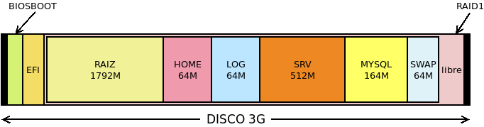

.. _inst-servidor:

Instalación del servidor
************************
El propósito desarrollado bajo este epígrafe es el siguiente:

- Protoinstalar el servidor sobre el disco de una máquina virtual.
- Discutir cuál es el particionado adecuado para el servidor y llevarlo
  a cabo haciendo uso de un :ref:`RAID 1 <mdadm>` y :ref:`volúmenes lógicos <lvm>`.
- Exponer cómo transladar la protoinstalación a la máquina real.

Preinstalación
==============
Antes de lanzar el instalador debemos planificar cuáles son los sistemas de
ficheros apropiados para nuestro servidor, y preparar las particiones, el |RAID|
y los volúmenes lógicos adecuados al plan.

Sistemas de ficheros
--------------------
Es obvio que cada servidor requerirá un esquema diferente más allá de separar
:file:`/`, :file:`/home` y dedicar una partición para la memoria de intercambio\
[#]_.  A estos tres, nos podría interesar añadir:

* :file:`/var/log` para tener aparte los registros y que no llenen por completo
  la partición raíz, si se desmadran por algún motivo.
* :file:`/srv` para almacenar los archivos relacionados con los servicios que
  podamos ofrecer (web, ftp, etc.)
* :file:`/var/lib/mysql`, si nuestro servidor almacena bases de datos de MySQL.
* Cualesquier otras particiones que ayuden en nuestro propósito. Por ejemplo, si
  el servidor incluye :ref:`BackupPC <backuppc>`, entonces conviene separar
  :file:`/var/lib/backuppc`.

Por tanto, si añadimos dos particiones de arranque para asegurarnos en un
particionado |GPT| el arranque tanto con |BIOS| como con |UEFI|\ [#]_:

.. table::
   :class: serv-part

   ==================== ========== =========== ===============
    Punto de montaje     Nombre     Tamaño      Tamaño previo
   ==================== ========== =========== ===============
    /                    RAIZ       5 GiB       1792 MiB
    /var/log             LOG        1 GiB       64 MiB
    /home                HOME       Variable    768 MiB
    /srv                 SRV        Variable    768 MiB
    /var/lib/mysql       MYSQL      Variable    768 MiB
    swap                 SWAP       2 GiB       32 MiB
    /boot/efi            EFI        100 MiB     100 MIB
    \-                   BIOSBOOT   1 MiB       1 MiB
   ==================== ========== =========== ===============
    
La columna de *tamaño previo* indica el tamaño que le daremos a la partición en
la máquina virtual y la de *tamaño* el que tendrá en el disco real. En este
particionado podemos establecer lo siguiente:

- Las dos últimas particiones son particiones de disco y quedan fuera de
  cualquier |RAID| o grupo de volúmenes.
- El resto de sistemas de archivos son volúmenes lógicos de un grupo de
  volúmenes construido sobre un |RAID| 1.
- :kbd:`/`, :kbd:`/var/log` y :kbd:`swap` son volúmenes cuyo tamaño final
  podemos establecer a priori a partir de cuál sea el uso que le demos al
  servidor. Por ejemplo, un servidor sin entorno gráfico difícilmente necesitará
  más de 5 GiB de espacio de almacenamiento.
- Los tres restastes sistemas, sin embargo, tendrán un tamaño variable según los
  datos que se almacenen en ellos. Podríamos crear tres volúmenes lógicos
  independendientes, pero podemos aprovechar el concepto de
  :ref:`aprovisionamiento fino <lvm-aprovisionamiento>` para que ocupen el
  mismo espacio y compitan por él. Como, sin embargo, el instalador de *Buster*
  no lo soporta, completaremos su creación durante la postinstalación.

Para guardar el esquema de particiones sugerido basta un disco virtual de 3GiB.

Particionado
------------
Lo llevaremos a cabo antes de hacer la instalación con el fin de tener absoluta
libertad. Podríamos, para ello, crear un disco virtual y arrancar la máquina con
un sistema *Live* como *Gparted*. En vez de eso, haremos las particiones de
disco desde el sistema anfitrión para lo cual debemos crear el disco::

   $ qemu-img create -f qcow2 servidor.qcw 3G

y hacerlo disponible en :file:`/dev/nbd0`::

   # modprobe nbd max_part=7
   # qemu-nbd -c /dev/nd0 servidor.qcw

Hecho lo cual, ya podemos particionar::

   # sgdisk -a 8 -n "0:40:2047" -t "0:0xef02" -c "0:BOOTBIOS" \
         -a 2048 -n "0:2048:+100M" -t "0:0xef00" -c "0:EFI" \
                 -N 0 -t "3:0xfd00" -c "3:RAID" /dev/nbd0
   # partx -a /dev/nbd0

Ahora debe crearse el |RAID| sobre la tercera partición::

   # mdadm --create /dev/md0 --metadata=1 --homehost=any --name=0 \
      --verbose --level=1 --raid-devices=1 --force /dev/nbd0p3

y sobre él crear un grupo de volúmenes y definir los volúmenes lógicos::

   # vgcreate VGraid /dev/md0
   # lvcreate -n raiz -L 1792M VGraid
   # lvcreate -n log -L 64M VGraid
   # lvcreate -n pool -L 768M VGraid
   # lvcreate -n swap -C y -L 64M VGraid

De estos volúmenes, el nombrado *pool* será el volumen que posteriormente
convirtamos en el *pool* de aprovisionamiento, y lo colocamos antes del
dedicado a *swap* para que al situarse éste último al final pueda ampliarse
luego su tamaño hasta los 2 GiB manteniendo la contiguidad del espacio. De
hecho, forzamos la contiguidad a través de la opción :kbd:`-C`.

Además formateamos para asegurarnos de que el tamaño de bloque es de 4KiB::

   #  mkfs.ext4 -L RAIZ -b4k /dev/VGraid/raiz
   #  mkfs.ext4 -L LOG -b4k /dev/VGraid/log

Una vez hecho esto, ya podemos comenzar la instalación en una máquina virtual,
así que desconectamos::

   # vgchange -an VGraid
   0 logical volume(s) in volume group "VGraid" now activ
   # mdadm --stop /dev/md0
   mdadm: stopped /dev/md0
   # qemu-nbd -d /dev/nbd0
   /dev/nbd0 disconnected

Instalación
===========
Debemos hacernos con el disco de instalación de la última estable de debian\
[#]_, colocar el disco duro que hemos preparado bajo el epígrafe anterior, y
arrancar la máquina virtual. La instalación es bastante sencilla:

#. Elegimos la instalación con *ncurses* (¿para qué queremos la gráfica?):

   .. image:: files/01-menu.png
      :alt: Menú inicial de instalación

#. Escogemos la lengua\ [#]_, el país y el teclado apropiados:

   .. image:: files/02-lang.png
      :alt: Lengua del sistema

   .. image:: files/03-pais.png
      :alt: Elección del país

   .. image:: files/04-teclado.png
      :alt: Mapa de teclado

#. Escogemos un nombre de servidor:

   .. image:: files/05-nombre.png
      :alt: Elección del nombre del servidor

#. Y el dominio al que pertenece:

   .. image:: files/06-dominio.png
      :alt: Elección del nombre de dominio

#. Las siguientes preguntas son referentes a los usuarios del sistema:

   .. image:: files/07-claveroot.png
      :alt: Contraseña del administrador

   .. image:: files/08-nombrerealusuario.png
      :alt: Nombre real del usuario

   .. image:: files/09-nombreusuario.png
      :alt: Nombre del usuario

   .. image:: files/10-claveusuario.png
      :alt: Contraseña del usuario

#. Seleccionamos la zona horaria:

   .. image:: files/11-zonahoraria.png
      :alt: Contraseña del usuario

#. Escogemos particionado manual

   .. image:: files/12-particiones.png
      :alt: Menú de particionado

   y llegamos a la parte más delicada de la instalación. La herramientas nos
   presentará el disco tal cómo lo dejamos preparado:

   .. image:: files/13-particiones.png
      :alt: Vista general de las particiones y volúmenes definidos

   así que nuestra labor se limita a asociar cada volumen con el punto de
   montaje apropiado. Por ejemplo, para el volumen dedicado a :file:`/`:

   .. image:: files/14-particiones.png
      :alt: Vista de las opciones de una partición

   Obsérvese que no se reformatea la partición, ya que lo hicimos antes de
   comenzar la instalación. Es importante no hacerlo, ya que de lo contrario en
   las particiones muy pequeñas, la herramienta escogerá como tamaño de bloque
   1KiB, cuando nuestra intención es que sea de 4KiB. Además, como no hemos
   podido crear aún los volúmenes de aprovisionamiento fino, dejamos *pool* sin
   asignar.

   Recuerde que hemos creado una partición |ESP| y que esta suele montarse sobre
   :file:`/boot/efi`, así que no olvide definirlo también:

   .. image:: files/15-particiones.png
      :alt: Definición de la partición ESP

   .. note:: Esta prevención es necesaria porque estamos llevando a cabo la
      instalación en un sistema |BIOS|. Si fuera |UEFI|, *Debian* habría tomado
      directamente la partición como la apropiada para este fin.

#. Después de aceptar el particionado, pasara un tiempo mientras se instalan en
   disco los paquetes básicos, después de lo cual se pedirá si deseamos añadir
   más discos como fuente de paquetes. Nuestra intención es instalar paquetes de
   internet, así que contestaremos que no:

   .. image:: files/16-cd.png
      :alt: CD como fuente de paquetes

#. Y seleccionamos un repositorio de internet. Las réplicas en España,
   particularmente, nunca me han dado buen resultado:

   .. image:: files/17-pais-replica.png
      :alt: Elección del país del repositorio

   .. image:: files/18-servidor-replica.png
      :alt: Elección del servidor de la réplica.

   Aún podremos definir si accedemos a través de un proxy, aunque lo habitual es
   que no sea así:

   .. image:: files/19-proxy.png

#. *Debian* lleva a cabo una encuesta para conocer cuáles son los paquetes más
   usados y, en consecuencia, saber cuáles son más importantes para la
   comunidad. No está de más decir que sí, aunque podemos contestar que no:

   .. image:: files/20-encuesta.png
      :alt: Participación en la encuesta sobre el uso de paquetes

#. Seleccionamos los grupos de programas que queremos instalar. En este caso, lo
   más prudente es limitarse a escoger el servidor |SSH| y las herramientas
   básicas; e instalar a mano el resto:

   .. image:: files/21-paquetes.png
      :alt: Qué paquetes se instalarán automáticamente

#. Y para finalizar el último paso nos pide indicar dónde se instalará |GRUB|.
   Como sólo tenemos un disco (:file:`sda`), es en él donde debemos instalarlo:

   .. image:: files/22-grub.png
      :alt: ¿Se quiere instalar grub?

   .. image:: files/23-discogrub.png
      :alt: Lugar de instalación de grub

Hecho todo lo cual, se completa la instalación y es posible arrancar el
servidor.

Postinstalación
===============
Tras la instalación hay tres tareas que podemos acometer:

Personalización
---------------
Las operaciones de personalización son muy particulares y pueden incluir:

- Sustituir :program:`vim-tiny` por :program:`vim`.
- Realizar :ref:`ajustes <ajustes>` (instalar y configurar :ref:`tmux <tmux>`,
  etc.)

Aprovisionamiento fino
----------------------
Como el instalador no soporta *aprovisionamiento fino* es ahora cuando debemos
llevarlo a cabo. Para ello hemos de arrancar el sistema,  instalar la
herramienta propiada y convertir el volumen lógico que reservamos para esta
función en un *pool*::

   # apt install thin-provisioning-tools
   # lvconvert --thinpool /dev/VGraid/pool

Hecho lo cual podemos crear los tres volúmenes faltantes::

   # lvcreate -T -n home -V 768M VGraid/pool
   # lvcreate -T -n srv -V 768M VGraid/pool
   # lvcreate -T -n mysql -V 768M VGraid/pool
   # mkfs.ext4 -L SRV -b4k /dev/VGraid/srv
   # mkfs.ext4 -L HOME -b4k /dev/VGraid/home
   # mkfs.ext4 -L MYSQL -b4k /dev/VGraid/mysql

Por último, podemos copiar los ficheros personal sobre el nuevo volumen::

   # mount /dev/VGraid/home /mnt
   # tar -C /home/ -cf - . | tar -C /mnt/ -xvpf -
   # umount /mnt
   # rm /home/usuario -rf

crear el punto de montaje :file:`/var/log/mysql`::

   # mkdir /var/lib/mysql

Añadir los tres puntos de montaje a :file:`/etc/fstab`::

   # cat > /etc/fstab
   /dev/mapper/VGraid-mysql /var/lib/mysql ext4 defaults   0       2
   /dev/mapper/VGraid-home /home   ext4    defaults        0       2
   /dev/mapper/VGraid-srv  /srv    ext4    defaults        0       2

Y montarlo, por esta vez, a mano::

   # mount /home
   # mount /var/lib/mysql
   # mount /srv

Generación de la imagen final
-----------------------------
Aunque la imagen ya está lista, si la queremos usar como plantilla de pruebas es
conveniente que la limpiemos para menguar su volumen:

- Mucho tamaño se debe a espacio no ocupado, pero escrito por ficheros que se
  escribieron y borraron durante la instalación.
- Pueden vaciarse los registros de :file:`/var/log`.
- Pueden eliminarse los ficheros de *bytecode* de *Python*.
- Las lista de paquetes en los repositorios ocupan también espacio
  innecesriamente.

Es posible hacer estas operaciones a mano montando el disco con
:command:`qemu-nbd`, pero :download:`este script <files/mrproper>` creado para
la ocasión, puede ahorrarnos el trabajo::

   # mrproper disco.qcw

El script generará en el mismo directorio un nuevo disco :file:`disco-light.qcw`
con el mínimo tamaño posible.

Configurar el servidor
----------------------
Con todo lo anterior ya tenemos un sistema base para trabajar. A partir de aquí
tenemos dos posibilidades:

- Trasladarlo al servidor.
- Llevar a cabo las instalaciones y configuraciones de servicios sobre la imagen
  y, cuando esté a punto, trasladar el resultado a la máquina real. Obrar de
  este segundo modo, nos da la ventaja de disponer en el futuro de una plantilla
  que la configuración exacta de nuestro servidor y, en consecuencia, apta para
  hacer pruebas antes de pasar los cambios al servidor real. En caso, de optar
  por esto segundo, no está de manos pasarle :command:`mrproper` al acabar.

Traslado a servidor real
========================
Una vez que se tenga a punto la imagen, puede trasladarse al *hardware* real.
Suponemos que en esta máquina real sí dispondremos de dos discos para el
|RAID| 1.

La idea es utilizar un sistema *linux* arrancado desde un dispositivo extraíble
para volcar la imagen sobre los discos físicos del servidor real, para lo cual
es mejor que el disco virtual no esté en formato *qcow2* sino que sea una imagen
cruda. Por tanto, antes de nada::

   # qemu-info convert -cpf qcow2 disco.qcw -O raw disco.raw
   # xz -v9 disco.raw

De esta forma, tenemos una imagen comprimida :file:`disco.raw.xz`. Lo más cómodo
es preparar un |USB| que disponga de una distribución de arranque y una
partición de datos en la que incluyamos la imagen comprimida. Como distribución
vale cualquiera medianamente moderna, ya que sólo se necesita que sea capaz de
descomprimir el formato :ref:`xz <xz>`. Incluso la mínima SliTaZ_ puede
valernos.

Sea como sea, arrancando con este pincho |USB|, suponiendo que la partición en
la que hemos copiado :file:`disco.raw.xz` se haya montado sobre :file:`/mnt`, y
finalmente que los discos del servidor sean :file:`/sda` y :file:`/sdb`::

   # xzcat /mnt/disco.raw.xz > /dev/sda

La orden volcará el contenido del disco sobre el primer disco. Esto, sib
embargo, no es suficiente, ya que al menos debemos corregir que la copia de la
|GPT| no se encuentre al final del disco::

   # sgdisk -e /devsda

Constitución del |RAID|
-----------------------
Hay, sin embargo, otro detalle nada baladí. Tenemos un |RAID| en precario que
aún no usa el segundo disco y que, además, sólo aprovecha los primeros 3GiB de
disco. Antes de nada, debemos agrandar la partición, pero si lo hacemos ahora es
bastante probable que como consecuencia de la acción de copiar al final de disco
la |GPT|, el sistema haya detectado el |RAID| y el grupo de volúmenes al releer
la tabla de particiones. Así que primero vamos a paralos::

   # vgchange -an VGraid
   # mdadm --stop /dev/md0

Para, después, a las bravas tocar la tabla de particiones::

   # sgdisk -d 3 -N 3 -t "3:0xfd00" -c "3:RAID" -p /dev/sda3

esto, es borrarla y redefinir la última partición hasta el final.  Como sólo
hemos tocado la propia |GPT| y el contenido de la partición, el |RAID| seguirá
intacto. Tocaría ahora agrandar el |RAID|, pero sale más a cuenta sincronizar
con el segundo disco y sólo después llevar a cabo la ampliación efectiva. Para
ello, empezamos por copiar la tabla de particiones::

   # sgdisk -R /dev/sdb /dev/sda
   # sgdisk -G /dev/sdb

Y ahora, sí, añadir el segundo disco al |RAID|::

   # mdadm --add /dev/md0 /dev/sdb3
   # mdadm --grow /dev/md0 --raid-device=2

Al hacerlo, comenzará el proceso de sincronización de los 3GiB, cuyo progreso
podemos observar::

   # watch cat /proc/mdstat

Completada la sincronización (que no debe durar demasiado), podemos *colonizar* el
resto de la partición::

   # mdadm --grow /dev/md0 --assume-clean -z max
   # pvresize /dev/md0

Y ya el grupo de volúmen ocupará todo el disco y, en consecuencia, podremos
aplicar los volúmenes lógicos al tamaño que deseemos, empezando eso sí, por el
dedicado a *swap* cuyo espacio debe ser contiguo::

   # lvextend -L 2G /dev/VGraid/swap
   # mkswap -L SWAP -U $(blkid -t LABEL=SWAP -o value -s UUID) /dev/VGraid/swap
   # lvextend -rL 5G /dev/VGraid/raiz
   # lvextend -rL 1G /dev/VGraid/log

Opcionalmente podemos reservar 5GiB para futuras instantáneas del sistema raíz\ [#]_::

   # lvcreate -s -n raiz_snap -L 5G /dev/VGraid/raiz

y reservar para el *pool* el espacio restante. Los volúmnes que cohabitan en él,
podemos extenderlos hasta el tamaño que estimemos oportuno, sabiendo que
posteriomente podremos ampliarlos::

   # lvextend -l +100%FREE /dev/VGraid/pool
   # lvextend -rL 50G /dev/VGraid/home
   # lvextend -rL 100G /dev/VGraid/srv
   # lvextend -rL 2G /dev/VGraid/mysql
   # lvremove /dev/VGraid/raiz_snap

Sincronización del arranque
---------------------------
Dado que hemos dejado los arranques fuera del |RAID| es obvio que, en nuestro
caso, sólo el primer disco será arrancable, y que haber partícipe al segundo
disco del |RAID| no ha mejorado este asunto.

Como nuestro objetivo no es hacer un sistema que arranque indistintamente con
uno u otro *firmware*, podemos sincronizar únicamente un arranca: aquel que sea
necesario.

|BIOS|
''''''
Si el firmware es |BIOS|, la sincronización es enormemente sencilla. Basta con
instalar |GRUB| en el disco en el que falte el arranque::

   # grub-install /dev/sdb

Cada vez que haya que sustituir un disco, tras el proceso de sincronización se
puede instalar |GRUB| para que el nuevo disco

|UEFI|
''''''
En caso de que hayamos pasado el sistema para que arranque en |UEFI|, la cosa es
bastante más complicada, ya que si mantenemos las particiones independientes el
fichero :file:`/etc/fstab` tendrá que indicar cuál de las dos es la partición
asociada al punto de montaje :file:`/boot/efi`.

.. todo:: Aegurarse que funciona lo afirmado aquí debajo.

Tenemos dos opciones:

- Mantener las particiones por separado y utilizar :command:`grub-install` para
  escribir en una y otra |ESP|. Habrá que jugar con la opción
  :kbd:`--efi-directory`.

- Hacer un |RAID| 1 constituido por ambas particiones |ESP|, que será por su
  dificultad lo que expongamos.

Partamos de que mantenemos las dos particiones por separado durante el tiempo en
que el sistema arranca con |BIOS| y que, cuando :ref:`migramos a UEFI
<bios-uefi>`\ [#]_, usamos la |ESP| de :file:`/dev/sda` para almacenar el arranque.

En esta situación vamos a copiar temporalmente el contenido de la partición::

   # mkdir /tmp/EFI
   # tar -C /boot/efi/EFI -cf - . | tar -C /tmp/EFI -xvpf -
   # umount /boot/efi

hecho lo cual, definimos un segundo |RAID| 1::

   # mdadm --create /dev/md1 --metadata=1.0 --homehost=any --name=1 \
         --verbose --level=1 --raid-devices=2 --force /dev/sda2 /dev/sdb2

   # mkfs.fat -nEFI -F32 /dev/md1

Obsérvese algo muy importante: se ha usado como versión de los metadatos la
**1.0** que se caracteriza por almacenarlos al final, no al principio. La gracia
de esto es que al formatear directamente el dispositivo :file:`/dev/md1` en
|FAT|\ 32, las dispositivos integrantes podrán ser leídos directamente como como
formateados en |FAT|\ 32 y, en consecuencia, el *firmware* será capaz de leer
las particiones y arrancar. Debemos modificar la entrada en :file:`/etc/fstab`::

   /dev/md1    /boot/efi      vfat  defaults 0  2

añadir el nuevo |RAID| a :file:`/etc/mdadm/mdadm.conf`::

   # mdadm --examine --scan | grep any:1 >> /etc/mdadm/mdadm.conf

y, por último, restituir los datos al |RAID|::

   # mount /boot/efi
   # mv /tmp/EFI /boot/efi

Además, hacemos que funcione la entrada para el dispositivo de disco::

   # grub-install --no-nvram --force-extra-removable /dev/sda

donde debemos añadir la opción :kbd:`--no-nvram` para que |GRUB| no intente
fallidamente añadir una entrada con :command:`efibootmgr`. Si nuestro |UEFI|
añade entradas automáticas para ambos discos, estas entradas funcionarán sin
problema.

.. warning:: La solución tiene el problema de que el *firmware* trata con
   los dispositivos miembros, no con el |RAID| en sí. En consecuencia, si éste
   realiza alguna operación de escritura, la hará sobre uno de los miembros y
   al montarse el |RAID|, éste fallará porque detectará que los miembros no
   están sincronizados. Un apaño para solucionar esto, lo brinda `la entrada de
   este blog
   <https://outflux.net/blog/archives/2018/04/19/uefi-booting-and-raid1/>`_, que
   reproducimos por si desaparece:

   #. Evitamos que que por mor de :file:`/etc/mdadm/mdadm.conf` se ensamble
      automáticamente este |RAID|, sustituyendo el nombre del dispotivio por
      :kbd:`<ignore>`::

         ARRAY <ignore> metadata=1.0 UUID=123...

   #. Evitamos que se monte automática el |RAID| sobre :file:`/boot/efi` tocando
      la línea adecuada en :file:`/etc/fstab`::

         /dev/md1    /boot/efi      vfat  noauto,defaults 0  2

   #. Creamos un nuevo servicio que ensamble el |RAID| reincronizando los
      miembros y montándo el resultado sobre :file:`/boot/efi`:

      .. code-block:: ini

         [Unit]
         Description=Resync /boot/efi RAID
         DefaultDependencies=no
         After=local-fs.target

         [Service]
         Type=oneshot
         ExecStart=/sbin/mdadm --assemble /dev/md1 --uuid=123... --update=resync
         ExecStart=/bin/mount /boot/efi
         RemainAfterExit=yes

         [Install]
         WantedBy=sysinit.target

   #. Actualizamos la imagen de disco inicial::

         # update-initramfs -u

.. rubric:: Notas al pie

.. [#] Tradicionalmente, :file:`/boot` también se ha colocado en sistema
   de ficheroa aparte por diversos motivos:

   - Porque en |BIOS| antiguas ésta no podía acceder más allá del cilintro
     **1024**, por lo que el arranque debía situarse antes. La forma de
     asegurarse ello, era incluirlo en una primera partición aparte.

   - Para cifrar completamente el sistema y dejar el arranque fuera del cifrado.
     Sin embargo, |GRUB| ya soporta `estar cifrado con LUKS
     <https://wiki.archlinux.org/index.php/GRUB#Encrypted_/boot>`_.

.. [#] Si el sistema tiene arranque |UEFI| podemos prescindir de hacer la
   partición *BIOSBOOT*, aunque esta no ocupa espacio ya que aprovecha el hueco
   anterior al sector *2048*. Si el arranque es |BIOS|, no es necesaria la
   |ESP|, pero no está de más que la creemos por si en el futuro acabamos
   migrando el servidor a un *hardware* con arranque |UEFI|.

.. [#] En nuestro caso, la segunda revisión de *Buster*, esto es,)la **10.2**.

.. [#] El administrador, sin embargo, es mejor que *hable inglés*, ya que de
   esta forma los errores se expresarán en inglés y será más fácil encontrar una
   solución en internet. Cambiaremos más delante su lengua a él sólo.

.. [#] Desgraciadamente la instantánea no se puede hacer sobre un volumen del
   *pool* de aprovisionamiento, porque ello exige que el volumen original se
   fije de sólo lectuta, operación que exigiría, dado que se trata del sistema
   raíz, de parar el servidor y llevar a cabo la instantánea con ayuda de un
   sistema operativo externo.

.. [#] Durante el proceso de migración, si seguimos los pasos referidos, seremos
   incapaces de acceder a los volúmenes lógicos que usan aprovisionamiento fino,
   ya que el instalador carece de soporte. Este error, sin embargo, es
   irrelevante, ya que no necesitamos esos sistema de archivos para instalar
   la versión |EFI| de |GRUB|

.. |GPT| replace:: :abbr:`GPT (GUID Partition Table)`
.. |BIOS| replace:: :abbr:`BIOS (Basic I/O System)`
.. |UEFI| replace:: :abbr:`UEFI (Unified Extensible Firmware Interface)`
.. |EFI| replace:: :abbr:`EFI (Extensible Firmware Interface)`
.. |ESP| replace:: :abbr:`ESP (EFI System Partition)`
.. |GRUB| replace:: :abbr:`GRUB (GRand Unified Bootloader)`
.. |USB| replace:: :abbr:`USB (Universal Serial Bus)`
.. |FAT| replace:: :abbr:`FAT (File Allocation Table)`

.. _slitaz: http://www.slitaz.org
