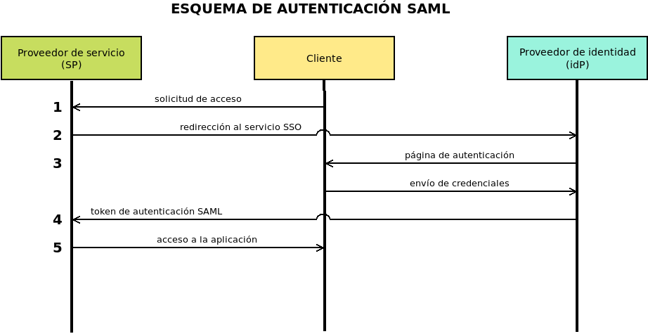

.. _simplesamlphp:

*************
SimpleSAMLphp
*************
|SAML| es un estándar basado en |XML| que permite intercambiar información de
autenticación y autorización entre distintas fuentes. Mediante este protocolo
una aplicación puede usar, para la identificación de sus clientes, un proveedor de
servicio (|SP|) el cual consulta a su vez a uno o varios proveedores de
identidad (|idP|). Véase `este artículo para más información
<https://www.nts-solutions.com/blog/saml-que-es.html>`_.

:program:`SimpleSAMLphp` es una implementación libre de este estándar escrita en
|PHP| y puede actuar, según sea nuestro interés, tanto de |SP| como de |idP|.

.. _simplesamlphp-inst:

Instalación
***********
Este epígrafe comprende la instalación y configuración básica para que la
aplicación sea convenientemente servida por :ref:`nginx <n-ginx>`. Dejará, pues,
la aplicación funcionando, pero sin utilidad alguna, puesto que no tendrá ninguna
fuente de la que obtener usuarios. Para hacerla útil será necesario
:ref:`configurarla de forma efectiva <simplesamlphp-conf>`.

Preparado ya el servidor para :ref:`procesar aplicaciones PHP <nginx-php>`\
[#]_, lo primero que debemos hacer es crear un directorio donde almacenar la
aplicación y descargarla dentro de él::

   # mkdir /srv/www/saml
   # wget -O - 'https://simplesamlphp.org/download?latest' | tar -C /srv/www/saml --strip-component=1 -zxvf -

La aplicación visible se encuentra dentro de :file:`www/`, así que ese será el
directorio que :program:`nginx` tendrá que compartir. Antes, sin embargo,
preparemos mínimamente la configuración que se encuentra en
:file:`config/config.php`:

.. code-block:: php

   $config = [
      // [...]

      'baseurlpath' => 'https://'.$_SERVER['SERVER_NAME'].'/saml/',

      // [...]

      'technicalcontact_name' => 'Administrador Todopoderoso',
      'technicalcontact_email' => 'webmaster@example.org',

      // [...]

      'timezone' => 'Europe/Madrid',

      // [...]

      'secretsalt' => 'm8a4S8a5s1fE6Ph6v8zQDLjw3u1l6QWOtLt7tId95oU=',

      // [...]

      'auth.adminpassword' => 'contraseña.de.administrador',

      // [...]

      'trusted.url.domains' => [],
   ];

Por ahora podemos cambiar únicamente las líneas referidas:

* La primera es importante configurarla en caso de que la |URL| externa
  con la que se acceda no coincida con la |URL| que detecta la aplicación,
  esto es, la |URL| a la que contesta el servidor web. Esta circunstancia puede
  darse cuando un :ref:`proxy web inverso <proxy-inverso>` intercede y modifica
  el nombre de la máquina, el puerto de acceso o la ruta. Si no hay cambios
  en el nombre o el puerto, basta con indicar simplemente la ruta correcta:

  .. code-block:: none

     'baseurlpath' => '/saml/',
     
  En el ejemplo ilustrativo, el *proxy* cambia únicamente el puerto (se basa en
  un caso en que :ref:`haproxy hace el cifrado TLS <haproxy>`), por lo que, al
  conservarse el nombre observado por el servidor web, puede usarse el valor
  *SERVER_NAME* que proporciona éste.

* Las dos siguientes líneas identifican al administrador de :program:`SimpleSAMLphp`.

* Opcionalmente, si el huso horario con que está configurado el servidor no
  coincide con el que queremos que use la aplicación, podemos cambiarlo.

* La siguiente línea representa la sal que se usará cuando se generen :ref:`hash
  <hash>`. Podemos generar un buen valor con la orden sugerida en los
  comentarios del archivo o con esta otra orden::

   $ openssl rand -base64 32
   m8a4S8a5s1fE6Ph6v8zQDLjw3u1l6QWOtLt7tId95oU=

* La penúltima línea es muy importante: es la contraseña que se usará para acceder
  a la administración de la aplicación.

* La última línea enumera las máquinas que pueden hacer uso de nuestro
  :program:`SimpleSAMLphp`. Por ejemplo, si lo hemos colocado en
  *auth.example.org* para que facilite la autenticación a una aplicación que
  está en *www.example.org*, entonces deberemos incluir esta máquina dentro de
  vector:

  .. code-block:: php

     'trusted.url.domains' => [ 'www.example.org' ],

Configurada la parte de la aplicación, toca configurar nuestro :program:`nginx`:

.. literalinclude:: files/simplesamlphp
   :language: nginx
   :emphasize-lines: 17

La configuración no reviste ningún secreto, salvo el hecho de que hemos decidido
colocar el servicio en la dirección *https://auth.example.org/saml/*. Por ese
motivo, la directiva :kbd:`baseurlpath` de la configuración de
:program:`SimpleSAMLphp` contenía esa ruta, y también por ello la
redirección remarcada añade a la |URL| *https://auth.example.org* la ruta.

Con todo esto hecho, ya deberíamos poder acceder a la aplicación:

.. image:: files/simplesamlphp-ini.png

.. _simplesamlphp-conf:

Configuración
*************
Configurar propiamente la aplicación tiene muchas particularidades que dependen
de cuál sea el propósito para el que queremos usarla. Sea como sea, hay dos
casos bien diferenciados: si queremos usarlo como |idP| o si queremos usarlo
como |SP| que utiliza algún |idP| externo.

Antes, sin embargo, es conveniente saber cómo habilitar los registros, por si
necesitamos depurar nuestras configuraciones. La aplicación los almacena dentro
del subdirectorio :file:`log`, pero para que se refistren de forma efectiva es
necesario tocar dos líneas de :file:`config/config.php`:

.. code-block:: php

    'logging.level' => SimpleSAML\Logger::DEBUG,
    'logging.handler' => 'file',

Además, es bastante probable que deseemos observar la comunicación |SAML|:

.. code-block:: php
   :emphasize-lines: 2

    'debug' => [
        'saml' => true,
        'backtraces' => true,
        'validatexml' => false,
    ],

|SP|
====
Nuestro propósito es configurar :program:`simpleSAMLphp` para que actúe como
proveedor de servicio utilizando como proveedor de identidad una fuente externa
como `Google Workspace`_ (antes *G-Suite*).

Los pasos esquemáticos que debemos seguir son dos:

1. Consultar los metadatos de nuestro |SP| a través de la pestaña de
   "Federación" y siempre que nos hayamos identificado como el administrador:

   .. image:: files/simplesamlphp-federacion.png

   Los metadatos se nos facilitan en formato |XML| y habrá que proporcionárselos
   al |idP| según éste nos indique. El contenido de ese |XML| será algo parecido
   a esto:

   .. literalinclude:: files/metadata-sp.xml
      :language: xml
      :emphasize-lines: 2, 5

#. Obtener los metadatos proporcionados por el |idP| para introducirlos en
   :file:`metadata/saml20-idp-remote.php`.

   Lo más probable es que el |idP| nos facilite sus metadatos también en formato
   |XML| y tengamos que generar nosotros el código |PHP| para añadirlo al
   archivo :file:`saml20-idp-remote.php`. No obstante, :program:`simpleSAMLphp`
   tiene un conversor que nos hace el trabajo también en la pestaña de
   "Federación":

   .. image::  files/simplesamlphp-federacion2.png

   Por tanto, basta con usar ese conversor con el el |XML| del |idP| para
   obtener el código |PHP| que debemos añadir a
   :file:`metadata/saml20-idp-remote.php`.

.. rubric:: Cómo configurarlo para `Google Workspace`_.

La concreción de los dos pasos anteriores para `Google Workspace`_ es la
siguiente:

a. Obtener el |XML| de metadatos de nuestro |SP| según lo indicado en el paso 1.
#. Entrar en la `página de administración de Google
   Workspace <https://admin.google.com>`_ y visitar la sección `Aplicaciones>Aplicaciones web y móviles
   <https://admin.google.com/ac/apps/unified>`_.
#. Añadir una aplicación |SAML| personalizada. Durante este proceso:

   + Se nos permitirá descargar el |XML| de metadatos de *Google* como |idP|,
     que es el que debemos usar en el segundo paso explicado anteriormente para
     generar el código para :file:`saml20-idp-remote.php`.
   + Se nos pedirán dos datos de nuestro |SP|, que podremos consultar en el
     |XML| obtenido en el primer paso\ [#]_:

     * El identificador de la entidad (dado por el atributo *entityID* del
       elemento *EntityDescriptor*).
     * La |URL| |ACS| que se encuentra en el atributio *Location* del elemento
       *AssertionConsumerService*. Debe tomarse la |URL| para la versión **2**
       de |SAML| (p.e. el elemento cuyo atributo *index* es **0**).

   + Mapearemos los datos que queremos facilitar. Lo más habitual es el
     nombre (*First name*) el apellido (*Last name*) y la dirección de correo
     electrónico (*Primary email*).
#. Una vez añadida la aplicación, editarla para configurar el acceso
   de los usuarios. En principio, se les niega a todos, pero podemos permitir su
   uso por unidades organizativas:

   .. image:: files/app-saml-acceso.png

#. Entrar en la página de administración de :program:`SimpleSAMLphp` y, según
   se indicó en el paso esquemático 2, generar el código |PHP| a partir del
   |XML| de metadatos facilitado por *Google*.

#. Copiar el código en :file:`metadata/saml20-idp-remote.php`.

Y ¡listo! Ahora deberíamos poder usar Google para autenticarnos. Podemos hacer
la prueba a través de la propia página de administración:

.. image:: files/autentication-test.png

Si tenemos algún problema o alguna duda, estas son algunas fuentes que puede
ayudarnos:

* `La explicación a todos los posibles errores que puede escupirnos Google cuando
  intentamos autenticarnos sin éxito <https://support.google.com/a/answer/6301076>`_.
* `La guía rápida oficial para configurar SimpleSAMLphp como SP
  <https://simplesamlphp.org/docs/stable/simplesamlphp-sp>`_.
* `Una guía para lo mismo algo más detallada
  <https://docs.acquia.com/resource/simplesaml/idp/>`_.

.. Hay que (https://simplesamlphp.org/docs/stable/simplesamlphp-sp):

   + Aplicaciones>Aplicaciones web y móviles

     Añadir aplicación SAML personalizada.
     Bajar los metadatos.
     Definir la ACS URL y la IdentityID --> Federación>Ver metadatos.
     Hacer un mapeo de los datos que nos interesen.
     Habilitar su uso por la unidades organizativas que se desee.

   + Generar la configuración a partir de los metadatos descargados (
     Federación>Conversor de XML) y copiarla en metadata/saml20-idp-remote.php.

|idP|
=====

.. todo:: Explicar la configuración de :program:`simpleSAMLphp` como |idP|.

.. rubric:: Notas al pie

.. [#] Una vez funcionando, podremos si requerimos algún paquete extra
   consultando como administrador la pestaña de "Configuración" de la interfaz
   web de la aplicación.
.. [#] En el |XML| ilustrativo de más arriba se han remarcado las dos líneas que
   contienen esos datos.

.. |SAML| replace:: :abbr:`SAML (Security Assertion Markup Language)`
.. |SP| replace:: :abbr:`SP (Service Provider)`
.. |idP| replace:: :abbr:`idP (Identity Provider)`
.. |PHP| replace:: :abbr:`PHP (PHP Hypertext Processor)`
.. |XML| replace:: :abbr:`XML (eXtensible Markup Language)`
.. |URL| replace:: :abbr:`URL (Uniform Resource Locator)`
.. |ACS| replace:: :abbr:`ACS (Assertion Consumer Service)`

.. _Google Workspace: https://workspace.google.com/
