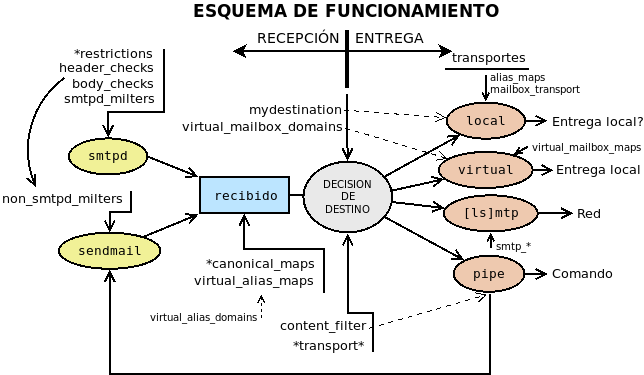

Instalación y configuración
***************************
.. _pre-smtp:

Preliminares
============
Antes de proceder a la instalación de cualquier servidor |SMTP| es necesario que
la máquina en la que se instale sea identificada como tal por el |DNS|. En
nuestro caso, necesitamos un sistema de resolución de nombres que propicie que en
las máquinas que formarán parte de nuestras pruebas (tanto servidores como
clientes), ocurra esto para el dominio de pruebas (p.e. *mail1.org*)::

   $ host mail1.org
   mail1.org mail is handled by 1 mail.mail1.org.
   $ host smtp.mail1.org
   smtp.mail1.org is an alias for mail.mail1.org.
   mail.mail1.org has address 192.168.255.1
   $ host imap.mail1.org
   imap.mail1.org is an alias for mail.mail1.org.
   mail.mail1.org has address 192.168.255.1

Ahora bien, un servidor de correo se utiliza para enviar mensaje a otros
servidores de correo y es obvio que si montamos uno en una máquina virtual con
un dominio inventado o que no nos pertenece, ningún servidor de correo serio en internet,
aceptará nuestros mensajes. Eso obliga a que tengamos que montar un segundo
servidor a fin de que puedan intercambiarse los mensajes entre sí. Por tanto,
requeriremos una segunda máquina que gestione el correo de un segundo dominio
(p.e. *mail2.org*) y que el servicio |DNS| también defina el registro **MX**
para este segundo dominio::

   $ host mail2.org
   mail2.org mail is handled by 1 mail.mail2.org.
   $ host smtp.mail2.org
   smtp.mail2.org is an alias for mail.mail2.org.
   mail.mail2.org has address 192.168.255.129
   $ host imap.mail1.org
   imap.mail2.org is an alias for mail.mail2.org.
   mail.mail2.org has address 192.168.255.129

Para resolver esto, podemos optar por la solución que deseemos. Posiblemente la
más rápida y sencilla sea instalar un servidor |DNS| en la primera de las
máquinas que resuelve ambas dominios. Por otra parte, el archivo de definición
de zona tendrá que tener al menos los siguientes registros (aparte del registro
*SOA*)::

   @     IN    NS       ns
         IN    MX       10 mail
   ns    IN    A        192.168.255.1
   mail  IN    A        192.168.255.1
   smtp  IN    CNAME    mail
   imap  IN    CNAME    imap

Además, conviene que el dominio de los servidores que obtenemos con
:command:`dnsdomain` o :command:`hostname` sea coherente\ [#]_::

   $ dnsdomain
   mail1.org
   $ hostname -d
   mail1.org

y lo mismo debería ocurrir en el otro servidor (*mail2.org*).

.. note:: La definición de la máquina que se encarga de gestionar el correo del
   dominio, que es lo visto más arriba, es lo mínimo indispensable para que
   funcione nuestro servidor. Ahora bien, si el servidor se coloca en internet,
   son recomendables :ref:`algunos otros registros que se presentan como
   consejos más adelante <smtp-acreditacion>`.

.. rubric:: Consejos

Para montar la **práctica** puede usarse:

* Una primera máquina virtual con dos interfaces de red, una en la red real y
  otra en una red interna (192.168.255.0/24). En la red interna puede tener
  dirección 192.168.225.1/24.
  
* Esta primera máquina contendrá el servidor de correo del dominio *mal1.org* y
  el servidor |DNS| encargado de gestionar los dominios *mail1.org* y
  *mail2.org*. El primer domimio podemos asociarlo a 192.168.255.0/25 y el
  segundo a 192.168.255.128/25.

* Una segunda máquina virtual con una interfaz de red en la misma red interna
  que la máquina anterior y dirección 192.168.255.129/24. En ella se alojará el
  servidor de correo del dominio *mail2.org*.

.. note:: Si se usa :program:`bind` para configurar el servidor |DNS| puede ser
   bastante más laborioso usar subredes. En ese caso, podríamos hacer que la red
   interna sea 192.168.254.0/23 y los dos dominios estén asociados a las redes
   192.168.254.0/24 y 192.168.255.0/24, respectivamente.

.. _postfix-inst:

Instalación
===========
Dado que trataremos :command:`postfix`, instalar\ [#]_ consiste en::

   # apt-get install postfix

La instalación, nos invita a realizar una configuración previa del servidor
mediante menús de :ref:`whiptail <whiptail>`. Sin embargo, es mejor elegir la
opción de dejar sin configurar el paquete y, acabada, arrancar nosotros a mano
esta configuración\ [#]_::

   # rm -f /etc/aliases
   # dpkg-reconfigure postfix

que nos planteará la siguientes preguntas:

#. Tipo de servidor:

   .. image:: files/postfix1-tipo.png

   La respuesta determina cómo funcionará el servidor:

   * **Sitio de internet**: es la opción que debemos elegir, ya que hace que
     nuestro servidor se comporte como un servidor de correo que se comunica
     con el resto de servidores de correo de la forma en que hemos ya descrito.
   * **Internet con smarthost**: en este caso, el servidor se oonfigura como
     cliente de otro servidor de correo, de manera que se le facilita un usuario
     y contraseña para que se valide en ese otro servidor y envío los mensajes
     haciendo uso de él.
   * **Sistema satélite**: es un servidor de correo adicional que recibe
     mensajes y los envía al servidor que realmente almacena los mensajes. Si
     para el dominio hubiera varios servidores de correo alternativos::

         $ host mail1.org
         mail1.org mail is handled by 1 mail.mail1.org.
         mail1.org mail is handled by 10 otromail.mail1.org.

     Los servidores con menos prioridad  (*otromail.mail1.org* en el ejemplo)
     deberían ser configurados como sistemas satélite.
   * **Sólo correo local**: el servidor no necesita conexión de red y se limita
     a entregar correo local en la propia máquina. Es la configuración que debe
     utilizarse cuando no se quiere mnontar un servidor de correo, sino permitir
     a las apliaciones que usan el correo como método de comunicación con el
     administrador, efectuar sus comunicacnoes.

#. Nombre del sistema de correo:

   .. image:: files/postfix2-nombre.png

   En este campo introducimos el nombre del dominio que gestionamos, que pasará
   a constituir el contenido del archivo :file:`/etc/mailname`.

#. Usuario receptor de los mensajes de administración:

   .. image:: files/postfix3-usuario.png

   El administrador (las cuentas *root* y *postmaster*) no recibe mensajes de
   correo, sino que estos son derivados a otro usuario sin permisos de
   administrador. Este cuadro de diálogo pide el nombre de tal usuario para
   incluirlo como destinatario dentro de :file:`/etc/aliases`, de modo que su
   contenido quedará así::

      postmaster:    root
      root:    usuario

   En realidad, como su nombre indica, este archivo es un archivo de *alias* y
   podemos modificarlo o añadir más entradas posteriormente::

      # echo 'mailadmin:    root' >> /etc/aliases
      # newaliases       # Obligatorio regenerar aliases.db después de su modificación

   .. seealso:: Se ofrece algo más de información sobre este archivo :ref:`algo
      más adelante <postfix-aliases>`.

#. Dominios del servidor:

   .. image:: files/postfix4-dominio.png

   Deben indicarse, separados por comas, los dominios que el servidor de correo
   considera que gestiona él. Dicho de otra forma, si un mensaje de correo esta
   destinado a una cuenta de las incluidas en la lista, el servidor se quedará
   con él, mientras que, si no es así, buscará qué servidor gestiona el correo
   de ese dominio para pasárselo. En este caso, basta con indicar el dominio
   (*mail1.org*) y también *localhost* para que programas como :command:`cron`
   sean capaces de comunicarse con el administrador.

#. Actualizaciones síncronas:

   .. image:: files/postfix5-sincr.png

#. Redes locales:

   .. image:: files/postfix6-local.png

   El cuadro de diálogo permite establecer cuáles son las redes que el servidor
   definirá como locales. Tiene importancia porque éste permite tratarlas de
   distintos modo y, por ejemplo, no exigir la validación del cliente que lo
   usa. Por lo general, se fija como red local la de *loopback*; así los
   programas locales que deseen enviar correo lo hará sin problema. Eliminamos
   las redes IPv6, porque más adelante configuraremos para sólo usar IPv4.

#. Límite del buzón de correo para cada usuario:

   .. image:: files/postfix7-tambox.png

#. Carácter para definir extensiones de correo local:

   .. image:: files/postfix8-ext.png

   Esto significa que para el nombre de cuenta se ignorarán todos los caracteres
   despúes de un signo "\ **+**\ ", de modo que un mensaje a la cuenta
   *manolo+esto.no.sirve@mail1.org*, se entregará a *manolo*.

#. Protocolo soportado:

   .. image:: files/postfix9-ipv4.png

La configuración principal de :command:`postfix` se guarda en
:file:`/etc/postfix/main.cf`, por lo que este proceso equivale a añadir las
siguientes líneas a tal archivo\ [#]_:

.. _postfix-conf-bas-main.cf:

.. code-block:: apache
   :emphasize-lines: 2

   smtpd_relay_restrictions = permit_mynetworks permit_sasl_authenticated defer_unauth_destination
   myhostname = m1.mail1.org
   alias_maps = hash:/etc/aliases
   alias_database = hash:/etc/aliases
   myorigin = /etc/mailname
   mydestination = mail1.org, localhost
   relayhost =
   mynetworks = 127.0.0.0/8
   mailbox_size_limit = 0
   recipient_delimiter = +
   inet_interfaces = all
   inet_protocols = ipv4

.. note:: No es necesario, en este caso, recargar la configuración, porque
   :command:`dpkg-recofigure` se encarga de ello.

Conviene modificar el nombre de la máquina expresado en la configuración (la
línea resaltada) a *smtp.mail1.org*, de modo que podemos editar el archivo o
bien::

   # postconf -e 'myhostname = smtp.mail1.org'
   # invoke-rc.d postfix reload    # Obviamente, esto también si se edita.

.. _postfix-ssl:

Cifrado
=======
El protocolo |SMTP| es bastante antiguo (el :rfc:`821` data de 1982) así que es
absolutamente inseguro. Para asegurarlo se utiliza |TLS| mediante dos técnicas:

#. Envolverlo, de manera que antes de cualquier comunicación |SMTP| se establece
   el canal seguro, como se hace con otros protocolos como |HTTP|\ s. Es la técnica
   que se usa al escuchar en el puerto **465**.

#. Negociar si hay cifrado o no al comienzo de la comunicación |SMTP|
   (*STARTTLS*), que es lo recomendado y lo que se usa tanto el el puerto **25**
   como en el **587**.

Para la segunda técnica, la directiva encargada de activar el cifrado es
smtpd_tls_security_level_, cuyo valor predeterminado es *may*, que anuncia la
posibilidad de cifrado al cliente y deja a este la decisión de cifrar o no. La
primera técnica, en cambio, exige:

.. code-block:: ini

   smtpd_tls_wrappermode = yes

que inhabilita cualquier valor que se haya indicado en
smtpd_tls_security_level_.

.. warning:: No use esta configuración, salvo para escuchar en el puerto **465**, ya
   que esta técnica no es la que usan los servidores de correo para intercambiar
   sus mensajes.

Otro aspecto importantísimo del cifrado es preparar las clave pública y privado
para llevar a cabo el cifrado. Si se echa un vistazo a la configuración de
:program:`postfix`, se comprobará que el archivo ya trae definidas unas claves
pública y privada::

   $ egrep '(cert|key)_file' /etc/postfix/main.cf 
   smtpd_tls_cert_file=/etc/ssl/certs/ssl-cert-snakeoil.pem
   smtpd_tls_key_file=/etc/ssl/private/ssl-cert-snakeoil.key

Y, además, la instalación de :command:`postfix`, instala a su vez *ssl-cert* que
genera ese par de claves.  Si se revisa el epígrafe dedicado a la :ref:`generación
del par de claves autofirmadas <auto-cert>`\ [#]_, se sabrá que este par de claves se
generan con el nombre cualificado de la máquina. Como es conveniente  que
el par de claves sirva para cuando el cliente se conecta a través de los nombres
*smtp.mail1.org* o *imap.mail1.org*, es mejor regenerar el par de claves
haciendo que se haga referencia a *\*.mail1.org*, tal como se aconseja en el
epígrafe señalado. Por tanto::

   # /usr/sbin/make-ssl-cert /usr/share/ssl-cert/ssleay.cnf keycert.pem
   # sed '1,/-END PRIVATE KEY-/d' keycert.pem > /etc/ssl/certs/ssl-cert-snakeoil.pem
   # sed '/-END PRIVATE KEY-/q' keycert.pem > /etc/ssl/private/ssl-cert-snakeoil.key

.. note:: Por supuesto, en un servidor real en producción debemos disponer de un
   :ref:`certificado acreditado por Let's Encrypt <certbot>`.

Por último, añadiremos algunos parámetros de |TLS|\ [#]_ a
:file:`/etc/postfix/main.cf`:

.. code-block:: apache

   # TLS
   smtpd_tls_loglevel = 1
   smtpd_tls_received_header = yes
   smtp_use_tls = yes

Autenticación
=============
La autenticación se logra en :program:`postfix` mediante |SASL|. Ahora bien,
:program:`postfix` en sí no lo implementa, por lo que requiere el uso de
*software* externo. En sus versiones modernas soporta dos::

   $ postconf -a
   cyrus
   dovecot

o sea, `Cyrus SASL`_ o `Dovecot SASL`_, aunque la predeterminada, y la única que
se soportaba en versiones antiguas, es::

   $ postconf -d smtpd_sasl_type
   smtpd_sasl_type = cyrus

.. note:: Se aconseja autenticar con `Dovecot SASL`_ en caso de que acabe
   instalando de todas formas :program:`dovecot` como servidor |IMAP|.

`Cyrus SASL`_
-------------
Usa el servicio *smtp* de :ref:`PAM <pam>`. La instalación del paquete puede
llevarse a cabo del siguiente modo::

   # apt-get install sasl2-bin

y configurarlo a través del archivo :file:`/etc/default/saslauthd`, lo cual
exige modificar dos líneas::

   START=yes

y una al final del archivo, ya que :program:`postfix` en *debian* se ejecuta
enjaulado::

   OPTIONS="-c -m /var/spool/postfix/var/run/saslauthd"

Hay, además, que configurar :program:`postfix` para que lo use, por lo que
habrá que crear el archivo :file:`/etc/postfix/sasl/smtpd.conf`::

   $ cat > /etc/postfix/sasl/smtpd.conf
   pwcheck_method: saslauthd
   mech_list: PLAIN LOGIN

y modificar :file:`/etc/postfix/main.cf` para añadir soporte para *sasl*:

.. code-block:: apache

   # Autenticación con SASL
   smtpd_sasl_auth_enable = yes
   smtpd_sasl_path = smtpd
   smtpd_sasl_local_domain = 
   smtpd_sasl_security_options = noanonymous
   broken_sasl_auth_clients = yes

.. note:: Un valor en ``smtpd_sasl_local_domain`` provoca que al nombre de
   usuario se añada el dominio expresado. Por ejemplo::

     smtpd_sasl_local_domain =  $mydomain

   provocaría que el usuario identificado como "pepe" sea reconocido como el
   usuario "pepe@mail1.org". ¡Ojo! Hablamos de usuario y no de cuenta. La cuenta
   que posee este usuario (se reconozca como *pepe* o *pepe@mail1.org*) es
   *pepe@mail1.org*).

.. _postfix-auth-restrict:

Además, es conveniente modificar nuestra política de aceptación de mensajes
para hacer el servidor más seguro frente al *spam*::

   # Políticas de recepción de mensajes
   smtpd_recipient_restrictions = permit_mynetworks,
                                  permit_sasl_authenticated,
                                  reject_unauth_destination,
                                  reject_unknown_client_hostname,
                                  reject_rbl_client zen.spamhaus.org

la cual actúa de esta forma:

#. Aceptaremos recibir mensajes que sean enviados desde nuestras redes (en
   nuestra configuracióon, sólo la propia máquina en la que está el servidor).

#. En caso contrario, aceptaremos recibir mensaje de conexiones autenticadas.

#. En caso contrario, rechazaremos los correos que no vayan destinados a
   nosotros mismos (o que no vayan destinados a dominios que hayamos autorizado,
   pero no hemos autorizado ninguno).

#. En caso contrario, rechazaremos mensajes de clientes cuya |IP| no se resuelva
   a un nombre.

#. En caso contrario, comprobamos que el cliente nos parezca fiable, para lo
   cual nos basamos en una base de datos externa.

.. seealso:: Para profundizar en la política de aceptación de mensajes,
   :ref:`consulte más adelante <postfix-accept>`.

El último paso es añadir el usuario *postfix* al grupo *sasl* y reiniciar los
servicios::

   # adduser postfix sasl
   # invoke-rc.d postfix restart
   # invoke-rc.d saslauthd restart

Con esta configuración, ya tenemos dispuesto un |MTA| que escucha exclusivamente
en el puerto **25** y permite a través de él la conexión de un |MSA| para que,
autenticándose, envíe mensajes a cuentas del propio servidor o a cuentas ajenas;
o bien, la conexión de otro |MTA| para que le entregue mensajes para sus propias
cuentas. Esta configuración es ya absolutamente funcional, pero :ref:`mas
adelante <postfix-25-465-587>` se tratará cómo habilitar la escucha en los
puertos **25**, **465** y **587**, según se describió :ref:`al tratar el protocolo
<smtp-proto-puertos>`.

.. _postfix-dovecot-sasl:

`Dovecot SASL`_
---------------
La alternativa al método anterior es usar :program:`dovecot`. En puridad basta
con instalar el paquete :deb:`dovecot-core`, aunque si pretendemos proporcionar
también un servidor |IMAP| es mejor, directamente::

   # apt-get install dovecot-imapd

Después basta con seguir las :ref:`instrucciones referidas en este epígrafe de
la sección sobre IMAP <dovecot-sasl>` y, finalmente, establecer :ref:`las
política de aceptación de mensajes del epígrafe anterior
<postfix-auth-restrict>`.

.. note:: La ventaja no es solamente la de no instalar software extra, sino 
   también el hecho de que los :ref:`usuarios exclusivos que habilitemos en
   dovecot <postfix-usu-virtual-dovecot>`, también los reconocerá
   :program:`postfix`. Ahora bien, si añadimos usuarios exclusivos, nos veremos
   obligados a usar :ref:`dovecot para la entrega <postfix-dovecot-mda>`.

.. _postfix-auth-check:

Comprobaciones
--------------
Para comprobar que haya ido bien, la configuración anterior lo más directo es
emular lo que haría un cliente que se conecta al puerto **25**. Podríamos usar
:command:`telnet` lo que equivaldría a una conexión no segura, pero
utilizaremos, en cambio, :command:`openssl` para la conexión, ya que nos permite
a la vez probar que marcha bien el cifrado. La conexión manual, sin embargo,
requiere primero saber cómo transmitir nuestra identidad al servidor\ [#]_:

.. code-block:: console
   :emphasize-lines: 10, 23, 25

   $ printf 'usuario\x00usuario\x00password' | base64
   dXN1YXJpbwB1c3VhcmlvAHBhc3N3b3Jk
   $ openssl s_client -connect localhost:smtp -starttls smtp -quiet
   depth=0 CN = mail.mail1.org                                
   verify error:num=18:self signed certificate                             
   verify return:1                                                        
   depth=0 CN = mail.mail1.org                                             
   verify return:1
   250 SMTPUTF8
   EHLO soy.yo
   250-m1.mail1.org
   250-PIPELINING
   250-SIZE 10240000
   250-VRFY
   250-ETRN
   250-STARTTLS
   250-AUTH PLAIN LOGIN
   250-AUTH=PLAIN LOGIN
   250-ENHANCEDSTATUSCODES
   250-8BITMIME
   250-DSN
   250 SMTPUTF8
   AUTH PLAIN dXN1YXJpbwB1c3VhcmlvAHBhc3N3b3Jk
   235 2.7.0 Authentication successful
   QUIT
   221 2.0.0 Bye

.. note:: Hemos usado como mecanismo de autenticación ``PLAIN``. Si también
   fuera válido ``LOGIN`` (la :ref:`autenticación SASL con dovecot
   <postfix-dovecot-sasl>` la configuramos para que también lo sea), podríamos
   haberlo comprobado del modo siguiente:

   .. code-block:: console
      :emphasize-lines: 2,4,7,9,11

      $ printf "usuario" | base64
      dXN1YXJpbw==
      $ printf "contraseña" | base64
      Y29udHJhc2XDsWE=
      $ openssl s_client -connect localhost:smtp -starttls smtp -quiet
      [...]
      AUTH LOGIN
      334 VXNlcm5hbWU6
      dXN1YXJpbw==
      334 UGFzc3dvcmQ6
      Y29udHJhc2XDsWE=
      235 2.7.0 Authentication successful
      QUIT
      221 2.0.0 Bye

El último paso de la comprobación sería enviar un mensaje a través de este
servidor al otro después de haberlo configurado también. La forma más
sencilla es usar el ejecutable :command:`sendmail` y comprobar que el mensaje se
envía y, en el otro servidor se aloja en el buzón de usuario::

   $ /usr/sbin/sendmail -t
   From: usuario@mail1.org
   To: usuario@mail2.org
   Subject: Prueba de envio...

   s/t

.. note:: La prueba de que nuestro intento ha obtenido buen suceso es comprobar
   los registros de ambos servidores y consultar el buzón del usuario del
   segundo servidor que, por ahora, se encuentra en :file:`/var/mail/usuario`.

Para esta comprobación, no obstante, no se usa la autenticación, ya que hemos
configurado el servidor para que no sea necesaria ésta, si la conexión es local,
como es el caso. Si quisiéramos enviar un mensaje, autenticándonos, además,
podríamos instalar :ref:`msmtp <msmtp>`, que es un pequeño |MSA|::

   # apt-get install msmtp

y crear para el usuario emisor del mensaje el archivo :file:`~/.msmtprc`\
[#]_:

.. code-block:: apache

   # Valores comunes a todas las cuentas.
   defaults
      logfile ~/.msmtp.log
      syslog on
      tls on
      # Como es autofirmado, deshabilitamos la comprobación del certificado
      tls_certcheck off
      from usuario@mail1.org
      host smtp.mail1.org
      user usuario
      # No la indicamos y nos la pedirá interactivamente
      #password usuario
      maildomain mail1.org

   # Acceso por el puerto 25 (el único por ahora)
   account vm25
      # Habilitamos autenticación con contraseña
      auth plain
      # Cifrada, pero con negociación
      tls_starttls on

   account default: vm25

.. warning:: Si nuestro anfitrión es un linux, es recomedable que instalemos el
   |MSA| en el propio anfitrión para que simulemos que el cliente que envía
   mensajes se encuentra en una máquina que no pertenece a ``$mynetworks``.
   Ahora bien, en ese caso :command:`msmtp` deberá saber cuál es la máquina
   *smtp.mail1.org*, cuya definición la conoce el |DNS| de la primera máquina
   virtual. La solución más sencilla, apra no hacer cambios en la configuración
   del anfitrión, es usar directamente la dirección |IP| en el valor de *host*.

Hecha la configuración podemos comprobar, las características del servidor\ [#]_::

   $ msmtp -a vm25 -S
   [... Información del servidor ...]

Y enviar un correo así::

   $ msmtp -a vm25 -t
   From: usuario@mail1.org
   To: usuario@mail2.org
   Subject: Prueba de envio de mail1 a mail2

   s/t

.. note:: Si queremos ver el diálogo |SMTP| entre el |MSA| y el |MTA| podemos
   añadir la opción ``-v``.

.. _postfix-25-465-587:

Puertos de escucha
==================
Aunque el servidor ya es completamente funcional en lo referente al envío y
recepción de correo, la intención de este epígrafe es habilitar la escucha en
cada uno de los tres puertos dependiendo de cuál sea la intención del emisor:

**25**
   Para recepción de mensajes a nuestras cuentas transmitidos por otro |MTA|.
   Deshabilitando la autenticación se logra este propósito, ya que por nuestras
   políticas de recepción, rechazamos todo mensaje sin autenticación cuyo
   destino no sea una de nuestras cuentas.

**465**
   Para ique se conecte a él un |MSA| y, tras autenticación, envíe mensajes
   usando el protocolo |SMTP|\ s.

**587**
   Ídem, pero se usa |SMTP| seguro con negociación. 

Para ellos, sustituiremos el smtpd_recipient_restrictions_ anterior por lo
siguiente:

.. code-block:: ini

   smtpd_recipient_restrictions = permit_mynetworks,
                                  permit_sasl_authenticated,
                                  reject

   port25_recipient_restrictions = permit_mynetworks,
                                   reject_unauth_destination,
                                   reject_unknown_client_hostname,
                                   reject_rbl_client zen.spamhaus.org

Nuestra estrategia en este caso, es aplicar el valor de tal directiva a los
puertos **465** y **587** que son los que destinamos a la conexión de los |MSA|
y, por tanto, requerirán autenticación. La otra directiva es, en realidad, un
nombre inventado que aplicaremos a la configuración del puerto **25** editando
el archivo :file:`/etc/postfix/master.cf`::

   smtp        inet  n       -       y       -       -       smtpd
      -o smtpd_sasl_auth_enable=no
      -o smtpd_recipient_restrictions=$port25_recipient_restrictions
   submissions inet  n       -       y       -       -       smtpd
      -o smtpd_tls_wrappermode=yes
   submission  inet n       -       y       -       -       smtpd
   
.. note:: En el :file:`master.cf` original sólo la línea del servicio |SMTP|
   está habilitada y sin añadir configuración lo que quiere decir que se tomará
   aquella escrita en :file:`main.cf`.

.. note:: *submissions* es el servicio asociado al puerto **465/TCP** según
   el archivo :file:`/etc/services`; y *submission* el asociado al **587/TCP**\
   [#]_.
  
Como vemos, en el puerto **25**, deshabilitamos la autenticación, ya que no es
nuestro propósito que lo usen los |MSA|, y usamos como restricciones las que
definimos en :file:`main.cf` anteriormente. En el puerto **465** lo que hacemos
es usar |SSL| directamente sin negociación previa. Finalmente, en el puerto
**587** usamos la configuración tal como está definida en :file:`main.cf`.

Para probar esta nueva configuración podemos modificar la configuración de
:command:`msmtp` y añadir estas dos entradas:

.. code-block:: apache

   defaults
      # [ ... La configuración anterior ...]

   account vm25
      # Por el 25, hemos deshabilitado la autenticación
      auth off
      tls_starttls on

   account vm465
      port 465
      auth on
      tls_starttls off

   account vm587
      port 587
      auth on
      tls_starttls on

Cada cuenta prueba :program:`postfix` en uno de los puertos de escucha:

* En el **25**, si intentamos mandar mensajes autenticándonos nos rechazará (de
  ahí que hayamos cambiado ``auth``), pero. deshabilitando la autenticación, si
  intentamos mandar mensajes al servidor *mail2.org*, nos rechazará porque el
  destino no es una cuenta de *mail1.org*. Si, finalmente, intentamos mandar un
  correo a *postmaster@mail1.org* u otra cuenta del propio servidor, nos
  rechazará a menos que la |IP| del anfitrión se resuelva a algún nombre (lo
  cual probablemente no ocurrirá).

  .. warning:: Si queremos que el segundo servidor pueda entregar mensajes,
     deberemos asegurarnos que su |IP| es resoluble, lo que implica que hayamos
     habilitado la resolución inversa en el |DNS|.

* En el **465** podremos enviar correo perfectamente autenticándonos y la
  conexión se tunelizará directamente mediante |SSL|.

* En el **587** tampoco habrá problemas y la conexión será segura, pero con
  negociación previa. 

Configuración
=============
Ya se ha dicho que el principal archivo de configuración de :program:`postfix`
es :file:`/etc/postfix/main.cf`, de modo que consultando o editando este
archivo, puede revisarse o modificarse la configuración. No obstante, se dispone
de la utilidad :command:`postconf`, que permite realizar ambas acciones:

#. Consultar la configuración::

      $ postconf -n

   La opción ``-n`` provoca que sólo se muestren las directivas incluidas en el
   archivo :file:`/etc/postfix/main.cf`. Si se prescinde de ella, se mostrarán
   todas, tambíen aquellas que no se relacionan en el archivo y conservan, por
   tanto, su valor predeterminado.

   Si se quiere consultar un valor concreto, puede indicarse como argumento la
   directiva::

      $ postconf myhostname
      m1.mail1.org

   .. note:: Cuando se consultan valores, puede usarse ``-f`` para formatear
      las líneas largas y que resulten legibles.

   .. note:: Es posible, también, incluir varias directivas en sendos
      parámetros.

#. Consultar los valores predeterminados::

      $ postconf -d

   Como en el caso anterior, es posible consultar valores concretos::

      $ postconf -d myhostname

#. Añadir o modificar el valor de una directiva\ [#]_::

      # postconf -e 'message_size_limit = 20480000'

   .. note:: Pueden indicarse varias directivas en sendos parámetros.

#. Comentar una directiva presente en el archivo::

      # postfix -# home_mailbox

   Si se usa la opción ``-X`` en vez de esta, la directiva desaparece.

Funcionamiento
==============
Las gestiones que realiza :program:`postfix` desde que recibe un mensaje hasta
que se deshace de él son muchas y su documentación oficial ofrece un `texto
explicatorio <http://www.postfix.org/OVERVIEW.html>`_. Aquí expondremos un
modelo muy, muy simplificado con abundantes omisiones (p.e. ni siquiera aparecen
las colas de mensajes), pero que nos servirá para entender por qué funciona toda
la configuración propuesta más adelante.

.. note:: Este epígrafe sirve de guía para conocer en qué momento se aplican las
   configuraciones que se ilustrarán a partir de ahora. Una lectura previa puede
   resultar algo críptica o indigesta, pero puede probar a regrerar aquí
   mientras lee los contenidos siguiente o a su término: sin duda entederá todo
   mucho mejor.

Fase de **recepción**
   #. :program:`postfix` recibe mensajes de correo por diversos medios,
      principalmente:

      - A través del protocolo |SMTP| procedente de otros servidores o un
        cliente de correo (de un |MSA|, en definitiva).

      - A través del ejecutable :program:`sendmail` instalado en la propia
        máquina.

   #. En esta fase de recepción del mensaje, si se recibe a través del protocolo
      |SMTP|, actúan diversas restricciones (:ref:`vea el epígrafe
      correspondiente <postfix-accept>`) en distintos momentos. También se lleva
      a cabo una :ref:`verificación de la cuenta de destino
      <postfix-vrf-recipient>`.

   #. Mientras se reciben los datos del mensaje actúan las comprobaciones de
      cabeceras (header_checks_) y cuerpo (body_checks_), que se :ref:`tratarán
      donde corresponde <postfix-access-body>` `

   #. Al término del envío de datos pueden establecerse filtros de correo,
      *milters*, capaces de manipular el mensaje (añadiendo cabeceras, por ejemplo)
      o incluso rechazarlo. Para las posibles nuevas acabeceras añadidas
      existe una ulterior comprobación de cabecera (milter_header_checks_).

Fase de **entrega**
   #. Admitido el correo, pueden modificarse los remitentes y destinatarios tanto
      del sobre como del mensaje :ref:`a través de directivas *canonical_maps
      <postfix-rewrite>`.

   #. Después de ello, pueden aún redirigirse los mensajes a :ref:`cuentas
      distintas a las que indica su dirección del sobre <postfix-cue-virt>`, pero
      sin que se altere ninguna dirección a diferencia de lo que ocurre en el punto
      anterior. De ello se encarga virtual_alias_maps_.

   #. Completado lo anterior, :program:`postfix` toma la decisión de encaminar el
      mensaje para lo cual puede usar distintos **transportes**:

      **local**
         Reservado a aquellas cuentas pertenecientes a usuarios que
         :program:`postfix` considera locales. Para definir los dominios asociados
         a cuentas locales se consulta mydestination_ y para obtener la relación de
         usuarios, el valor de la directiva local_recipient_maps_. Por defecto, se
         usa como agente para este transporte el agente indicado con local_transport_,
         que por defecto es el agente de entrega local_.

         Usando este agente, cualquier mensaje dirigido a cuenta de uno de esos
         dominios, cuyo usuario no esté referido en esta directiva, se rechazará
         con un error:

             550 5.1.1 <noexiste@dominio_local> User doesn't exist

         Además, la entrega será comúnmente en el buzón local del usuario, pero esto
         puede cambiar mediante tres directivas:

         + alias_maps_, que permite redirigir el mensaje incluso a cuentas externas
           (véase la :ref:`explicacion sobre tablas aliases <postfix-aliases>`).

         + mailbox_transport_, que permite definir un nuevo transporte para todas
           las cuentas locales, en vez de hacer la entrega en el buzón del usuario.

         + mailbox_transport_maps_, para lo mismo que lo anterior pero
           mediante una tabla que permite definir el transporte para cada cuenta.
           Las que no se incluyen en la tabla aplicarán, si existe, el transporte
           de la directiva anterior

      **virtual**
         Reservado para cuentas cuya entrega será local, pero los usuarios
         virtuales. Pueden definirse los dominios de estos usuarios virtuales con
         la directiva virtual_mailbox_domains_. El agente para este tipo de entrega
         viene definido por virtual_transport_, cuyo valor predeterminado es el
         agente de entrega virtual_.
        
         Con este agente, como la entrega se hace en un buzón local, es necesario
         definir cuál es el buzón para cada cuenta mediante virtual_mailbox_maps_.
         Si se envía un mensaje a alguna cuenta de los dominios anteriores que no
         tiene definido buzón mediante esta última directiva, se rechazará el
         mensaje con un error:

            550 5.1.1 <noexiste@dominio_virtual>: Recipient address rejected: User unknown in virtual mailbox table

      **pipe**
         Es un transporte que cede el mensaje mediante una :ref:`tubería
         <pipeline>` a un programa externo para que este se encargue de su entrega.
         :ref:`mlmmj <mlmmj>` es un ejemplo de programa externo que usa este tipo de
         transporte para gestionar los mensajes.

         También usan este transporte todos los mensajes que tengan definido un
         filtro a través de la directiva content_filter_. Se supone que el filtro
         realizará las modificaciones oportunas en el mensaje y volverá a
         inyectarlo en :program:`postfix` a través de :program:`sendmail`. Esta
         segunda vez el sistema considerará el mensaje ya filtrado y usará el
         transporte que debería haber usado en caso de no haberse definido ningún
         filtro.

      **smtp**/**lmtp**
         Son dos transportes que usan servidores |SMTP| y |LMTP| respectivamente a
         lo que ceden los mensajes para su entrega. Lo habitual es que el servidor
         |SMTP| sea externo y el servidor |LMTP| esté en la propia máquina y los
         entregue en buzones locales. Como :program:`postfix` tiene definido como
         valor de default_transport_ el agente smtp_ (que es un cliente
         |SMTP|/|LMTP|), cualquier mensaje a cuenta de un dominio que no sea local
         o virtual usará este agente.

   #. Para alterar los agentes predefinidos de transporte, puede usarse
      transport_maps_, que permite definir para cuentas o dominios indivduales qué
      transporte se usará. Por ejemplo, si el dominio *mail1.org* está listado en
      mydestination_ debería usar el agente definido en local_transport_; pero si
      le definimos otro agente distinto en transport_maps_ pasará a usar éste.

      .. warning:: Si usa transport_maps_ tenga presente que la verificación de la
         existencia de la cuenta se efectúa durante la recepción y, en
         consecuencia, se verificará la existencia de una cuenta perteneciente a un
         dominio local (o virtual) antes de que esta directiva provoque que se use
         otro agente en vez del agente local (o virtual) de transporte.

.. seealso:: Una lectura muy interesante sobre el funcionamiento de
   :program:`postfix` es `este artículo de Linux Journal
   <https://www.linuxjournal.com/article/9454>`_.

.. rubric:: Notas al pie

.. [#] Véanse los :ref:`preliminares de la configuración DNS <pre-dns>`.
.. [#] En *Debian* el servidor de correo predeterminado (asociado al paquete
   *default-mta*) fue :command:`exim4` y hasta *Wheezy* o *Jessie* se instalaba
   con la instalación mínima. En las versiones modernas parece haber
   desaparecido el paquete. Este hecho no es raro, porque en los sistemas
   *UNIX* hay algunos programas básicos que usan el servicio de correo para
   informar al usuario (p.e. :command:`apt-get` o :command:`cron`).
.. [#] Aunque se deja sin configurar en primera instancia el servidor, el
   *script* llega a crear el archivo :file:`/etc/aliases`, lo que provoca que, 
   auunque se responda a la pregunta durante la próxima configuración, éste no
   se toque y, en consecuencia, nunca se llegue a escribir en él qué usuario
   recibirá los correos de *root*. La manera más sencilla de evitarlo, que es la
   que se propone es borrar primero el archivo. También puede optarse por
   realizar la configuración y, después, añadir a mano la línea::

      root: nombre_usuario

   para acabar por generar la base de datos que es realmente lo que maneja
   :program:`postfix`::

      # newaliases

.. [#] El hecho de que el nombre de la máquina sea *m1.mail1.org* se debe a que
   se llamó *m1* con :command:`hostname`
.. [#] Por supuesto, también se pueden usar claves generadas con *Let's
   Encrypt*. De hecho, es más recomendable.
.. [#] La última línea nada tiene que ver con postfix como servidor, sino con
   postfix cuando se conecta a otro servidor smtp como cliente. Por ejemplo,
   cuando lo configuramos como smarthost. 
.. [#] La cadena repite dos veces el nombre de usuario (*usuario*) y una vez la
   contraseña (*password* en el ejemplo). Esta es la forma de autenticarse
   usando el método "*AUTH PLAIN*". Con el método "*AUTH LOGIN*", debemos meter
   primero el usuario y luego la contraseña, ambos codificados en *base64*:

   .. code-block:: console
      :emphasize-lines: 8, 11, 13, 15

      $ echo -n "usuario" | base64
      dXN1YXJpbw==
      $ echo -n "password" | base64
      cGFzc3dvcmQ=
      $ openssl s_client -connect localhost:smtp -starttls smtp -quiet
      [...]
      250 SMTPUTF8
      EHLO soy.yo
      [...]
      250 SMTPUTF8
      AUTH LOGIN
      334 VXNlcm5hbWU6
      dXN1YXJpbw==
      334 UGFzc3dvcmQ6
      cGFzc3dvcmQ=
      235 2.7.0 Authentication successful
      QUIT
      221 2.0.0 Bye

.. [#] El archivo puede o no incluir la contraseña. Si la incluye, no la pedirá
   al enviar el correo, pero será necesario cambiar los permisos del archivo
   para que sólo pueda ser leído por el usuario::

      $ chmod 600 ~/.msmtprc
      
.. [#] La opción ``-a`` podemos ahorrárnoslas, puesto que la cuenta *vm25* la
   hemos definido como la predeterminada.

.. [#] Durante algunas versiones de *Debian* (y hasta Buster_) el servicio por
   el puerto **465/TCP** se asociaba al nombre *urd*. Esto se debe a que |SMTP|\
   s se abandonó en el estándar en favor del uso de *STARTTLS*, así que tal
   puerto se asoció posteriormente a `otro servicio distinto
   <http://ftp.ipsyn.net/pub/mirrors/cisco/ftpeng.cisco.com/ipmulticast/ssm/>`_.

.. [#] La directiva de ejemplo limita el tamaño máximo de mensaje de correo a
   aproximadamente *20MB*. Este valor, por defecto, es 10MB.

.. |TLS| replace:: :abbr:`TLS (Transport Layer Security)`
.. |MSA| replace:: :abbr:`MSA (Mail Submission Agent)`
.. |MTA| replace:: :abbr:`MTA (Mail Transmission Agent)`
.. |SASL| replace:: :abbr:`SASL (Simple Authentication and Security Layer)`
.. |SSL| replace:: :abbr:`SSL (Secure Sockets Layer)`
.. |MDA| replace:: :abbr:`MDA (Mail Delivery Agent)`
.. |LMTP| replace:: :abbr:`LMTP (Local Mail Transfer Protocol)`

.. _smtpd_recipient_restrictions: http://www.postfix.org/postconf.5.html#smtpd_recipient_restrictions
.. _smtpd_tls_security_level: http://www.postfix.org/postconf.5.html#smtpd_tls_security_level
.. _virtual_alias_domains: http://www.postfix.org/postconf.5.html#virtual_alias_domains
.. _virtual_mailbox_domains: http://www.postfix.org/postconf.5.html#virtual_mailbox_domains
.. _mydestination: http://www.postfix.org/postconf.5.html#mydestination
.. _transport_maps: http://www.postfix.org/postconf.5.html#transport_maps
.. _Cyrus SASL: https://www.cyrusimap.org/sasl/
.. _Dovecot SASL:  https://wiki.dovecot.org/Sasl
.. _header_checks: http://www.postfix.org/postconf.5.html#header_checks
.. _milter_header_checks: http://www.postfix.org/postconf.5.html#milter_header_checks
.. _body_checks: http://www.postfix.org/postconf.5.html#body_checks
.. _virtual_alias_maps: http://www.postfix.org/postconf.5.html#virtual_alias_maps
.. _virtual_alias_domains: http://www.postfix.org/postconf.5.html#virtual_alias_domains
.. _local_recipient_maps: http://www.postfix.org/postconf.5.html#local_recipient_maps
.. _alias_maps: http://www.postfix.org/postconf.5.html#alias_maps
.. _mailbox_transport: http://www.postfix.org/postconf.5.html#mailbox_transport
.. _mailbox_transport_maps: http://www.postfix.org/postconf.5.html#mailbox_transport_maps
.. _virtual_mailbox_maps: http://www.postfix.org/postconf.5.html#virtual_mailbox_maps
.. _local: http://www.postfix.org/local.8.html
.. _local_transport: http://www.postfix.org/postconf.5.html#local_transport
.. _virtual: http://www.postfix.org/virtual.8.html
.. _virtual_transport: http://www.postfix.org/postconf.5.html#virtual_transport
.. _content_filter: http://www.postfix.org/postconf.5.html#content_filter
.. _smtp: http://www.postfix.org/smtp.8.html
.. _default_transport: http://www.postfix.org/postconf.5.html#default_transport
