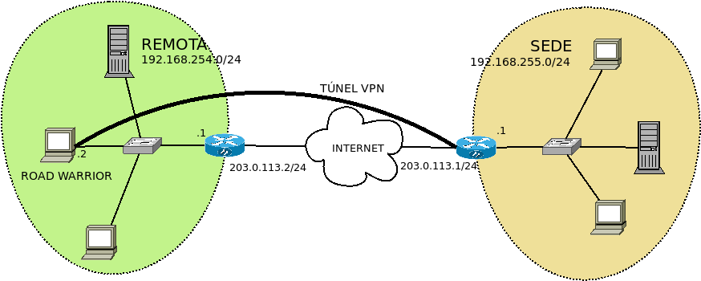
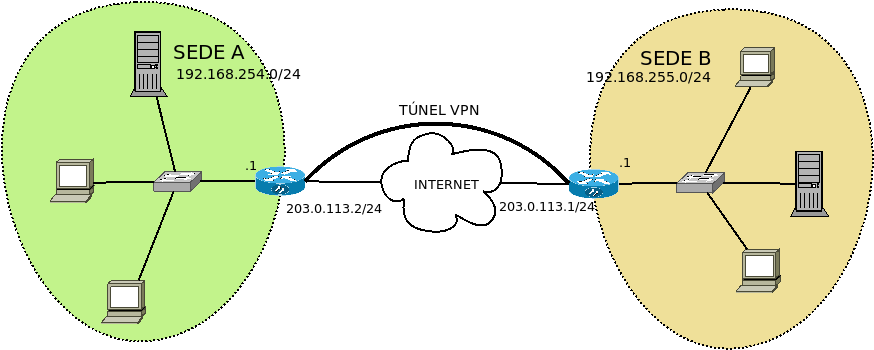

Configuración
=============
Debemos limitarnos a resolver la comunicación en capa 3. Podemos, eso sí,
distinguir si nuestra intención es conectar un equipo móvil con una sede o
intercomunicar dos sedes. La diferencia entre uno y otro caso se deben al
tratamiento que deseamos dar en la parte del cliente. Así, en el primer caso:

- La conexión será esporádica, ya que el equipo cliente no se encontrará
  permanentemente encendido.
- Lo habitual es que nuestra intención se limite a permitir exclusivamente el
  acceso del equipo móvil a la sede, y no el acceso de los equipos de la sede al
  equipo móvil, o el acceso del resto de equipos que se encuentran en la red del
  equipo móvil a la sede.
- Podría darse el caso de que deseáramos encauzar todo el tráfico a través del
  túnel (p.e. para burlar restricciones en la red del cliente).

En el segundo caso, en cambio:

- Al ser el cliente, a su vez, una sede, el extremo cliente será también
  permanente y, además, es bastante probable que a su vez queramos que se
  comporte como servidor de sus propios *guerreros de la carretera*.
- Por lo general, nuestra intención será que los equipos de ambas redes, todos,
  se puedan comunicar con los equipos de la otra sede.
- Lo normal es que cada sede conecte a internet a través de sus correspondientes
  puertas de enlace y que el túnel se dedique exclusivamente al tráfico que
  tiene por destino final la otra sede.

.. note:: :program:`wireguard` proporciona en espacio de usuario la orden
   :command:`wg` para configurar los aspectos de la interfaz virtual propios
   del túnel. Para otros más generales (asignar |IP|\ s o modificar el
   encaminamiento) deben usarse las herramientas habituales. Sin embargo, junto
   a esta orden, se incluye :program:`wg-quick`, un *script* de :program:`bash`
   que simplifica la creación del túnel, llevando a cabo automáticamente todas
   las tareas necesarias. Para este epígrafe de configuración básica nos servirá
   el *script*.

Sede-equipo móvil
-----------------
Supongamos el siguiente punto de partida:

con estos datos:

.. table::
   :class: wireguard-red

   +-------------+-------------------------------------+
   | Extremo     | Características                     |
   +=============+==================+==================+
   | Servidor    | Interfaz (eth0)  | 203.0.113.1      |
   |             +------------------+------------------+
   |             | Red              | 192.168.255.0/24 |
   |             +------------------+------------------+
   |             | Interfaz |VPN|   | 10.8.0.1/24      |
   +-------------+------------------+------------------+
   | Cliente     | Interfaz (eth0)  | 192.168.254.2    |
   |             +------------------+------------------+
   |             | Red              | 192.168.254.0/24 |
   |             +------------------+------------------+
   |             | Interfaz |VPN|   | 10.8.0.2/24      |
   +-------------+------------------+------------------+

Esto es, el servidor |VPN| es el router que da acceso a la red
*192.168.255.0/24* y el cliente un equipo móvil conectado a una red interna con
acceso a internet. Ciertamente el servidor |VPN| no tiene que ser
obligatoriamente el router, pero que lo sea simplifica la configuración.

Interfaces virtuales
''''''''''''''''''''
Lo primero es configurar en cliente y servidor sus respectivas interfaces
virtuales y ello pasa por generar las claves pública y privada de cada extremo.

.. rubric:: Cliente

Primero generamos las claves::

   # cd /etc/wireguard
   # wg genkey | tee privatekey | wg pubkey > publickey
   # cat privatekey
   WB4TAWIIlaOyULudlcdhqctTl/pdzO7m+6x4DhAP+0k=
   # cat publickey
   f2CH3QXHiXwFhdATcDi42DU+PUOC9Ky8BgkHBigY5H4=

Y después creamos la configuración de la interfaz en el fichero
:file:`/etc/wireguard/wg0.conf`:

.. code-block:: ini

   [Interface]
   Address = 10.8.0.2/24
   PrivateKey = WB4TAWIIlaOyULudlcdhqctTl/pdzO7m+6x4DhAP+0k=

Luego deberemos regresar a este fichero.

.. rubric:: Servidor

De nuevo, generamos un par de claves::

   # cd /etc/wireguard
   # wg genkey | tee privatekey | wg pubkey > publickey
   # cat privatekey
   kEANNMfztMtzgwFyyaWOou7+c8ZPD/lyGhmcM7oFtXA=
   # cat publickey
   /Pr37VgN7GVvizJw9FpCL62DSwocdNEf7lwfdDRZXj8=

Y a continuación definimos la interfaz en :file:`/etc/wireguard/wg0.conf`:

.. code-block:: ini

   [Interface]
   Address = 10.8.0.1/24
   ListenPort = 1194
   PrivateKey = kEANNMfztMtzgwFyyaWOou7+c8ZPD/lyGhmcM7oFtXA=
   #PostUp = iptables -t nat -A PREROUTING -i %i -j CONNMARK --set-mark 1
   #PostUp = iptables -t nat -A POSTROUTING -m connmark --mark 1 -j MASQUERADE
   #PostDown = iptables -t nat -D PREROUTING -i %i -j CONNMARK --set-mark 1
   #PostDown = iptables -t nat -D POSTROUTING -m connmark --mark 1 -j MASQUERADE

Hemos definido en esta ocasión el puerto de escucha (*1194/UDP*) para que el
cliente sepa con certeza a cuál debe conectar. En el cliente, como no se ha
definido se escogerá uno al azar.

Otro aspecto importante es el de acceso a la red interna *192.168.255.0/24*. Si
el servidor es también la puerta de enlace de la red interna, entonces no habrá
que hacer nada más, ya que estará ya definido para aceptar paquetes ajenos y,
además, cualquier paquete cuyo destino sea el exterior pasará por él y el sabrá
si tiene que enviarlo a través de la interfaz externa o a través de la interfaz
virtual. En cambio, si no es puerta de enlace será necesario incluir las cuatro
líneas comentadas que aseguran el enmascaramiento del tráfico saliente que
procede del |VPN| y, además, deberemos aceptar paquetes ajenos estableciendo a
**1** el parámetro :kbd:`net.ipv4.ip_forward`. Para ello podemos editar
:file:`/etc/sysctl.conf` y descomentar la línea:

.. code-block:: ini

  net.ipv4.ip_forward = 1

que tendrá efecto en el próximo reinicio, pero que podemos recargar con::

  # sysctl -p

Declaración del otro extremo
''''''''''''''''''''''''''''
El fichero :file:`/etc/wireguard/wg0.conf` no se ha completado aún porque, además
de la interfaz, se define la configuración del otro extremo del túnel. Por cada
extremo, debe incluirse una sección :kbd:`[Peer]`.

.. rubric:: Cliente

Dejaremos el fichero de este modo:

.. code-block:: ini

   [Interface]
   Address = 10.8.0.2/24
   PrivateKey = WB4TAWIIlaOyULudlcdhqctTl/pdzO7m+6x4DhAP+0k=

   [Peer]
   PublicKey = /Pr37VgN7GVvizJw9FpCL62DSwocdNEf7lwfdDRZXj8=
   Endpoint = 203.0.113.1:1194
   AllowedIPs = 10.8.0.1/32, 192.168.255.0/24
   #AllowedIPs = 0.0.0.0/0

Donde se ha añadido un :kbd:`[Peer]` para el servidor. Se declara su clave
pública, la dirección de conexión a través de :kbd:`Endpoint` y cuáles son las
redes de destino para las que se usará el túnel (:kbd:`AllowedIPs`). Tal y como
está la configuración, accederemos al propio servidor y la red local del
servidor; pero si usamos la línea comentada alternativa, convertiremos el
servidor |VPN| en la puerta predeterminada y accederemos a internet a través del
túnel, lo cual puede resultar útil si el cliente se encuentra en una red que nos
restringe accesos. Al levantar la interfaz, :program:`wireguard` se encargará de
modificar las reglas y tablas de encaminamiento para hacer esto posible.

.. note:: Si añadimos a :kbd:`[Interface]` la opción:

   .. code-block:: ini

      Table = off

   no se llevará a cabo modificación del encaminamiento y deberemos ser nosotros
   los que a mano alteremos el encaminamiento.

.. warning:: Asegúrese de que en en las redes indicadas en :kbd:`AllowedIPs` no
   se encuentra ninguna que incluya la |IP| expresada en :kbd:`Endpoint` o, de lo
   contrario, el túnel no funcionará.

.. rubric:: Servidor

En el servidor el añadido será éste:

.. code-block:: ini

   [Interface]
   Address = 10.8.0.1/24
   ListenPort = 1194
   PrivateKey = kEANNMfztMtzgwFyyaWOou7+c8ZPD/lyGhmcM7oFtXA=

   [Peer]
   PublicKey = f2CH3QXHiXwFhdATcDi42DU+PUOC9Ky8BgkHBigY5H4=
   AllowedIPs = 10.8.0.2/32

Obsérvese que en el servidor el único interés será alcanzar al cliente y no su
red, de ahí que no se añada más que la |IP| del otro extremo del túnel. Además,
no se define cuál es el otro extremo exactamente (:kbd:`Endpoint`) porque no
podemos hacerlo puesto que el puerto del cliente será aleatorio y porque no es
necesario si es el cliente el que intenta conectar primero. Así, pues, cuando
hagamos la primera prueba, tendremos que hacerla de cliente a servidor y no
servidor a cliente.

.. note:: Si el servidor aceptase más clientes móviles, bastaría con añadir más
   secciones :kbd:`[Peer]`.

Establecimiento del túnel
'''''''''''''''''''''''''
Para establecer el núcleo debemos hacer exactamente la misma acción en
cliente y servidor: levantar la interfaz. Para ello tenemos tres alternativas:

- Hacerlo de forma manual::

   # wg-quick up wg0
   # wg-quick down wg0

- Habilitarlo como servicio de :ref:`systemd <systemd>` para que la interfaz
  se levante automáticamente durante cada inicio::

   # systemctl enable wg-quick@wg0
   # systemctl start wg-quick@wg0

  aunque es probable que esto sólo nos interese en el caso del servidor.

- Editar el fichero :file:`/etc/network/interfaces` para poder utilizar
  :program:`ifupdown` en la gestión de la interfaz virtual::

   auto wg0
   iface wg0 inet manual
       pre-up wg-quick up $IFACE
       down   wg-quick down $IFACE
  
  aunque es probable que :kbd:`auto` sólo queremos escribirlo en la
  configuración del servidor. De este modo, la manipulación de la interfaz puede
  llevarse a cabo exactamente igual que como con el resto de interfaces::

   # ifup wg0
   # ifdown wg0

Establecido el túnel al configurar ambos extremos, podemos desde el cliente
probar la configuración::

   $ ping -c1 10.8.0.1
   $ wg show 
   interface: wg0
     public key: f2CH3QXHiXwFhdATcDi42DU+PUOC9Ky8BgkHBigY5H4=
     private key: (hidden)
     listening port: 43577

   peer: /Pr37VgN7GVvizJw9FpCL62DSwocdNEf7lwfdDRZXj8=
     endpoint: 203.0.113.1:1194
     allowed ips: 10.8.0.1/32
     latest handshake: 1 hour, 3 minutes, 32 seconds ago
     transfer: 604 B received, 3.71 KiB sen

También podemos comprobar que para llegar a *192.168.255.1* usamos el túnel y no
la puerta de enlace predeterminada::

   # ip route get 1.1.1.1
   1.1.1.1 via 192.168.254.1 dev eth0 src 192.168.254.2 uid 0 
       cache
   # ip route get 192.168.255.1
   192.168.255.1 dev wg0 src 10.8.0.2 uid 0 
       cache

Clientes adicionales
''''''''''''''''''''
Pueden conectarse varios clientes a un mismo servidor: basta con configurarlos
convenientemente y añadir nuevas secciones :kbd:`[Peer]` en el servidor.
Obviamente, cada cliente tendrá una |IP| distinta de la red del túnel::

   $ cat >> /etc/wireguard/wg0.conf
   
   [Peer]
   PublicKey = CLAVE-PUBLICA-DEL-NUEVO-CLIENTE
   AllowedIPs = 10.8.0.3/32

Ahora bien, para que se añada al servidor el cliente de forma efectiva, es
necesario releer el archivo y eso obliga a reiniciarlo. Si queremos evitarlo,
podemos pasarle en caliente las nuevas líneas a :program:`wireguard`::

   $ tail -n3 /etc/wireguard/wg0.conf | wg addconf wg0 /dev/fd/0

Sede-sede
---------
Este caso no es substancialmente distinto del anterior y nos lo podemos plantear
como aquel caso en que ambos puntos se configuran simétricamente.

Los datos son los siguientes:

.. table::
   :class: wireguard-red

   +-------------+-------------------------------------+
   | Extremo     | Características                     |
   +=============+==================+==================+
   | Servidor    | Interfaz (eth0)  | 203.0.113.1      |
   |             +------------------+------------------+
   |             | Red              | 192.168.255.0/24 |
   |             +------------------+------------------+
   |             | Internet |VPN|   | 10.8.0.1/24      |
   +-------------+------------------+------------------+
   | Cliente     | Interfaz (eth0)  | 203.0.113.2      |
   |             +------------------+------------------+
   |             | Red              | 192.168.254.0/24 |
   |             +------------------+------------------+
   |             | Internet |VPN|   | 10.8.0.2/24      |
   +-------------+------------------+------------------+

Como, además, suponemos que el túnel se establece entre las puertas de enlace,
no tenemos que preocuparnos por hacer enmascaramiento o crear entradas
adicionales en la tabla de encaminamiento.

.. rubric:: Cliente

.. code-block:: ini

   [Interface]
   Address = 10.8.0.2/24
   ListenPort = 1194
   PrivateKey = WB4TAWIIlaOyULudlcdhqctTl/pdzO7m+6x4DhAP+0k=

   [Peer]
   PublicKey = /Pr37VgN7GVvizJw9FpCL62DSwocdNEf7lwfdDRZXj8=
   Endpoint = 203.0.113.1/24
   AllowedIPs = 10.8.0.1/32, 192.168.255.0/24

En este caso, sí fijamos el puerto de escucha, no porque el caso lo requiera,
sino para facilitar que posibles clientes móviles puedan, a su vez, conectarse a
la sede

.. rubric:: Servidor

.. code-block:: ini

   [Interface]
   Address = 10.8.0.1/24
   ListenPort = 1194
   PrivateKey = kEANNMfztMtzgwFyyaWOou7+c8ZPD/lyGhmcM7oFtXA=

   [Peer]
   PublicKey = f2CH3QXHiXwFhdATcDi42DU+PUOC9Ky8BgkHBigY5H4=
   Endpoint = 203.0.113.2/24
   AllowedIPs = 10.8.0.2/32, 192.168.254.0/24

La única diferencia con la configuración *sede-equipo móvil* es que ahora sí
interesará hacer accesible a la red del otro extremo, de ahí que se haya añadido
:kbd:`AllowedIPs`. Adicionalmente, hemos declarado la dirección del otro punto,
ya que la conocemos y no cambiará.

