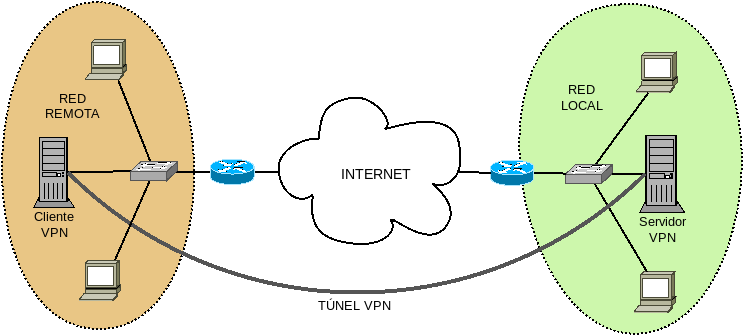
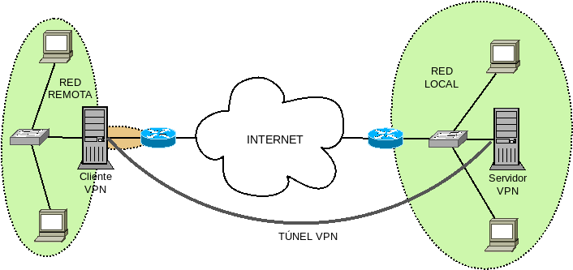
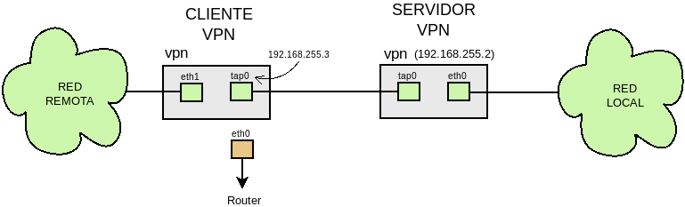

Conexión sede-sede
******************
El próposito en este caso es que el sistema remoto no sea un dispositivo (el
equipo móvil) sino toda una sede remota, esto es, una |LAN|. Un buen esquema de
lo que pretendemos es el siguiente:

Las diferencias fundamentales con la conexión sede-equipo móvil son:

* Tdos los dispositivos de la red remota (y no sólo el cliente |VPN|) deben ser
  capaces de conectar con la red local.

* Puede desearse también que los equipos de la red local conecten con los de la
  remota, si no todos los servicios se encuentran en la sede local.

* Es más que probable que controlemos la red remota y, por tanto, que no
  tengamos necesidad alguna de salir a internet a través del túnel |VPN|.

Para la configuración utilizaremos los siguientes principios:

#. Por el tunel |VPN| sólo circulará el tráfico destinado al otro lado (no lo
   usaremos para salir a internet).

#. Asignaremos una |IP| fija al cliente |VPN|.

#. Autenticaremos los clientes con certificado, lo que obliga a crear una entidad
   certificadora y acreditar también con ella el certificado de servidor.

.. note:: Las configuraciones pueden ser más sencillas si servidor, cliente o
   ambos actúan como puerta de enlace de sus respectivas redes. Para hacerlas
   más generales, no se presupondrá esto, salvo para el cliente en la
   :ref:`configuración de capa de enlace <ovpn-ss-c2>`.

Capa de red
===========
Para implementar esta solución crearemos estas tres redes:

+--------------------------------+---------------------------------------+
| Red                            | Máquina                               |
+=============+==================+=======================+===============+
| Local       | 192.168.255.0/24 | Servidor |VPN| (eth0) | 192.168.255.2 |
|             |                  +-----------------------+---------------+
|             |                  | Router Local          | 192.168.255.1 |
+-------------+------------------+-----------------------+---------------+
| Túnel |VPN| | 10.8.0.0/24      | Servidor |VPN| (tun0) |  10.8.0.1     |
|             |                  +-----------------------+---------------+
|             |                  | Cliente |VPN| (tun0)  |  10.8.0.2     |
+-------------+------------------+-----------------------+---------------+
| Remota      | 192.168.1.0/24   | Cliente |VPN| (eth0)  | 192.168.1.2   |
|             |                  +-----------------------+---------------+
|             |                  | Router remoto         | 192.168.1.1   |
+-------------+------------------+-----------------------+---------------+

La diferencia fundamental en la configuración es que, tanto servidor como
cliente, deben hacer de router entre su red y la red del otro extremo. Además,
dado que nuestra intención es que pueda haber túneles que conecten dos sedes,
tiene cierto sentido que las |IP|\ s asignadas a estos clientes que conectan
sedes sean fijas en vez de dinámicas.

.. _ss3-server:

Servidor
--------
Como configuración para el servidor, podemos usar :download:`esta
<files/s-ss_3.txt>`:

.. literalinclude:: files/s-ss_3.txt
   :language: bash

Teniendo presente la :ref:`configuración para capa 3 para un road warrior
<srw3-server>`, escudriñaremos las diferencias:`

* En este caso, la autenticación del cliente es a través certificado digital, no
  de contraseña. De hecho, el *CN* que hayamos definido al crear el certificado
  de cliente, será el nombre con el que el servidor identifique a tal cliente.
  Comno consecuencia, han desaparecido las líneas de configuración para la
  autenticación mediante contraseña.

* Deja de tener sentido también el enmascaramiento, ya que nuestra intención es
  que no solamente la red remota acceda a las máquinas de la red local, sino que
  las locales accedan también a las máquinas remotas. A menos, claro está, que
  la sede del servidor centralice todos los servicios. En ese caso, lo más
  conveniente es enmascarar como hicimos en el caso del *roadwarrior*.

* Como queremos que algunos clientes tengan |IP| fija (los que conectan sedes) y
  no (los equipos móviles), no basta con definir la directiva :code:`server`,
  como se hizo en el caso anterior:

  - Se fija la |IP| del servidor con :code:`ifconfig`.
  - Se define un rango que no ocupa toda la red con :code:`ifconfig-pool`.
  - Se define un subdirectorio llamado :file:`ccd-dir` dentro del cual se
    incluirán ficheros en que cada nombre coincide con el nombre de cada cliente
    con |IP| fija, dentro de cada uno de los cuales se establecerán sus |IP|\ s
    del siguiente modo:

    .. code-block:: bash

      # /etc/openvpn/ccd-dir/cliente1
      ifconfig-push 10.8.0.2 255.255.255.0

* En lo relativo al encaminamiento, es necesario declarar que la puerta de
  enlace es la |IP| del servidor |VPN|, decirle a los clientes cuál es la red
  local con :code:`push route` y añadir a la tabla de encaminamiento del
  servidor cómo llegar a la red remota. Si la redes remotas fueran varias,
  porque fueran varios los clientes, entonces habría que añadir varias entradas.

  .. note:: Si hay equipos móviles podemos optar, bien por incluir una entrada
     por cada equipo móvil, o bien hacer enmascaramiento como hicimos en el caso
     anterior.

Al margen del fichero de configuración, hay otra aspecto que debemos atender:
hemos añadido la ruta que permite conocer al servidor |VPN| cómo alcanzar la red
remota. Sin embargo, si no es la puerta de enlace de la red local, el resto de
máquinas locales no tendrán noticia de esta entrada y, en consecuencia, será
incapaces de conectar con la red remota. Esto se puede solucionar de dos formas:

   - Añadiendo una ruta estática a la puerta de enlace de la red local para que
     entregue los paquetes dirigidos a la red remota al servidor |VPN|\ [#]_.

   - Añadiendo la ruta estática a cada máquina de la red local lo cual puede muy
     fácilmente hacerse si todas reciben configuración dinámica mediante |DHCP|,
     incluyendo la :ref:`opción 121 <dhcp-static-routes>`.

.. _ss3-cliente:

Cliente
-------
Para la configuración del cliente podemos usar :download:`esta otro fichero
<files/c-ss_3.txt>`:

.. literalinclude:: files/c-ss_3.txt
   :language: bash

cuyas diferencias con la :ref:`configuración que requería el road warrior
<srw3-client>` se reduce a:

* Usar certificado para la autenticación.
* No usar el túnel como salida natural a internet. Como el servidor envía la
  ruta adecuada al cliente, no es necesario añadir ninguna directiva de
  encaminamiento.

Sin embargo, como en el caso del servidor, sólo el cliente añade la entrada
estática para saber llegar a la red local. Si queremos que el resto de máquinas
también lo tendremos que hacer una operación análoga a la que hicimos en el
servidor: modificar la tabla de encaminamiento de la puerta de enlace, o bien,
modificar la configuración |DHCP|.

.. _ovpn-ss-c2:

Capa de enlace
==============
Cuando el túnel se hace en la capa de enlace, la red remota puede participar de
la red local, de manera que todas las máquinas, locales y remotas, se encuentren
en la misma red lógica:

En la sede remota hemos situado el cliente |VPN| como puerta de enlace de la
red\ [#]_, aunque no es preceptivo. Tal disposición hace recomendable que el
cliente tenga dos interfaces físicas de red \ [#]_.

Como pretendemos que la configuración dinámica de los equipos la realice el
servidor |DHCP| situado en la sede local, la configuración es semejante a la
desarrollada para la conexión sede-equipo móvil, aunque hay alguna diferencia en
la sede remota que se trataran a su debido tiempo.

El esquema de las interfaces de cliente y servidor es el siguiente:

.. note:: Como en el caso de :ref:`la conexíón sede-equipo móvil en capa de red
   <srw2-server>` de la constituición de los puentes se encargarán los *script*
   que crean el túnel.

Servidor
--------
La configuración es una mezcla entre :ref:`la anterior para road warrior
<ss3-server>`, de la que tomamos la configuración estática del cliente y su autenticación mediante
certificado, y la configuración hecha para :ref:`la conexíón
sede-equipo móvil en capa de red <srw2-server>`. de la que aprovechamos el resto
para hacer :download:`la siguiente configuración <files/s-ss_2.txt>`:

.. literalinclude:: files/s-ss_2.txt
   :language: bash

Dentro de :file:`ccd-dir` podemos incluir la ip fija que queremos conceder al
cliente::

   # /etc/openvpn/ccd-dir/cliente1
   ifconfig-push 192.168.255.3 255.255.255.0

.. note:: El :download:`script <files/bridge.sh>` es exactamente el mismo que
   nos resolvió la parte de servidor en la conexión con un equipo móvil.

Cliente
-------
Las dos diferencias fundamentales respecto a la configuración para un equipo
móvilson:

* Debemos crear un puente que incluya la intefaz *TAP* virtual y la interfaz
  física que conecte con el resto de dispositivos de la red remota, excepto el
  router que da salida al exterior.
  
* Los dispositivos de la red remota toman su configuración de red del servidor
  |DHCP| de la red local.

Tal cosa puede resolverse con :download:`la siguiente configuración
<files/c-ss_2.txt>`:

.. literalinclude:: files/c-ss_2.txt
   :language: bash

Las particularidades más reseñables de esta configuración son:

#. La configuración fija de la interfaz (la |IP| se fija en el servidor).
#. La autenticación del cliente con certificado.
#. No se modifica el encaminamiento por defecto del cliente, por lo que seguirá
   saliendo a internet a través de su router cercano.
#. El :download:`script bridge.sh <files/bridge.sh>` ejecutado en la creación es el
   ya ejecutado en otros casos y se encarga de:

   + Exactamente lo mismo que en el servidor.
   + Enmascarar el tráfico que salga por la interfaz *eth0*, por razón que ya
     se verá.

   En este caso, sin embargo, necesita tres parámetros: la interfaz que conecta
   con el router, la interfaz que conecta con los clientes de la red remota y
   pasa a formar parte del puente, y el nombre del propio puente.

   .. warning:: Si queremos que los clientes remotos usen como puerta de enlace
      el router remoto, en vez de usar el túnel y salir por el router de la red
      local, es necesaria la instalación de :command:`ebtables`::

         # apt-get install ebtables

      del que se vale :program:`bridge.sh` para lograr este fin. En principio,
      debería bastar con ello ya que la carga del módulo homónimo debería ser
      automática al ejecutar la orden dentro del *script*. Sin embargo, la carga
      parece fallar por lo que muy posiblemente haya que forzar la carga del
      módulo durante el arranque del sistema::

         # echo "ebtables" >> /etc/modules

Esta configuración permite que circule el tráfico entre la red local y la red
remota conectada a la interfaz *eth1* del cliente |VPN|, como si de una misma
red física se tratara. Hay, sin embargo, un inconveniente:

Si deseamos obtener las direcciones |IP| para los dispositivos remotos del
servidor |DHCP| situado en la red remota, :program:`openvpn` eliminará la
información sobre la puerta de enlace, como ya se vio al tratar :ref:`la
configuración del cliente en la conexión sede-equipo móvil en capa de red
<srw2-client>`. La consecuencia es que los dispositivos obtendrán una dirección
|IP|, pero no sabrán cómo salir de la red, porque no habrá ninguna entrada que
defina la puerta de enlace. El modo más astuto de evitar este inconveniente es
usar la :ref:`opción DHCP 121 <dhcp-static-routes>` e incluir en ella la puerta
predeterminada. Si el servidor |DHCP| fuera :ref:`dnsmasq <dnsmasq>`, bastaría
con incluir la línea::

   dhcp-option=121,0.0.0.0/0,192.168.255.1

Ahora bien, lo lógico es poner como puerta de enlace el router de la red local,
ya que el servidor |DHCP| lo usan también los clientes de la red local. Esto, no
obstante, no es lo que queremos para los clientes de la red remota que, con esta
configuración, saldrán a internet pasando los paquetes a través del túnel. La
forma de evitar esto es hacer que los paquetes de los clientes remotos que
fueran a ser conmutados en el cliente |VPN| pasen a ser encaminados, porque así
éste los pasará por el túnel, si van a algún dispoitivo de la red local, y los
mandará a su puerta de enlace (el *router* remoto) si van a internet. De esta
manipulación se encarga :command:`ebtables` y su configuración la realiza el
:download:`script bridge.sh <files/bridge.sh>` proporcionado.

.. rubric:: Notas al pie

.. [#] Para que nos hagamos una idea, si añadiéramos esta ruta estática con
   :ref:`ip <ip>`, la orden debería ser::

      # ip route add 192.168.254.0/24 via 192.168.255.2

.. [#] De hecho, podríamos incluir el cliente |VPN| dentro del router, si este
   nos lo permitiera, como es el caso de aquellos que ejecutan un linux
   embebido.

.. [#] Podemos, por supuesto, hacer una configuración si el cliente |VPN| tiene
   una sola interfaz física. Pero en este caso, todos los dispositivos de la red remota
   pertenecerían a la red del router remoto (la pintada de naranja), y además
   deberían usar al cliente |VPN| como puerta de enlace.

.. |LAN| replace:: :abbr:`LAN (Local Area Network)`
