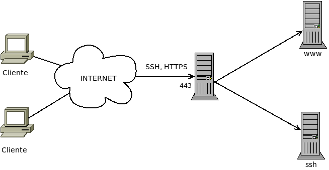

.. _multiplexor:

Multiplexores
*************
Un :dfn:`multiplexor` es un *proxy* capaz de recibir tráfico de distinta
naturaleza y dirigirlo cada cual a su servicio correspondiente:

Su función es la de permitir que un mismo puerto pueda ser compartido por varios
servicios distintos, comúnmente en previsión de que los clientes se encuentren
en redes que les restrinjan el acceso a determinados puertos. Lo habitual es que
el *multiplexor* se coloque en el puerto **443**, ya que es el puerto para
|HTTP|\ s y el tráfico web seguro suele permitirse en todas las redes.

En el esquema se han representado los servidores finales cada uno en su máquina
y, a su vez, en distinta máquina de la que corre el *multiplexor*, pero es
psoble también que *multiplexor* y servicios finales corran todos en el mismo
equipo.

Estudiaremos tres multiplexores:

* :program:`sslh`, que permite multiplexar tráfico |SSH|, |SSL| y Open\ |VPN|
  entre otros.
* :ref:`nginx <n-ginx>`, que puede usarse para otras funciones, pero que para
  esta tarea puede distinguir entre tráfico |SSL| y tráfico no |SSL|.
* :ref:`haproxy <haproxy>`, que puede usarse para otras funciones, pero puede servirnos
  para multiplexar |SSH|, |SSL| y Open\ |VPN|.

Los tres discriminan tráfico |TCP| por lo que Open\ |VPN| debería escuchar en un
puerto |TCP|, no |UDP|.

.. _sslh:

SSLH
====
El `servicio SSLH <http://www.rutschle.net/tech/sslh/README.html>`_ se
limita a multiplexar distintos tipos de tráfico por lo que tiene una
configuración muy sencilla. Para instalarlo::

   # apt install sslh

y todo consiste en que sea él el que escuche en las interfaces físicas
por las que se puede recibir tráfico externo. Suponiendo que los servicios
finales se encuentren en la misma máquina la configuración se reduce a editar el
fichero :file:`/etc/default/sslh` del siguiente modo:

.. code-block:: bash

   RUN=yes  # SSLH corre permanentemente, no a través de inetd.

   DAEMON=/usr/sbin/sslh  # Puede cambiarse por sslh-select

   DAEMON_OPTS="--user sslh --listen 172.22.0.2:443 \
                --ssh 127.0.0.1:22 --ssl 127.0.0.1:443 --openvpn 127.0.0.1:1194 \
                --pidfile /var/run/sslh/sslh.pid"

suponiendo que se escucha la interfaz física tiene la |IP| *172.22.0.2* y que se
desea multiplexar tráfico |SSH|, |SSL| y |VPN|. Las respectivos servicios deben
estar escuchando, al menos, en esas interfaces por los puertos indicados. Una
propuesta podría ser esta:

=============== ==================== =========
Servicio        Interfaz             Puerto
=============== ==================== =========
|SSH|           0.0.0.0                22/TCP
*OpenVPN*\ [#]_ 127.0.0.1            1194/TCP
|HTTP|\ s       127.0.0.1             443/TCP
*SSLH*          Todas excepto local   443/TCP
=============== ==================== =========

Si existen varias interfaces físicas entonces puede repetirse la opción
:kbd:`--listen` para incluirlas todas.

.. note:: Existen dos versiones del programa: :program:`sslh-fork` (o
   :program:`sslh` a secas) que utiliza un proceso para cada conexión y
   :program:`sslh-select` que usa un solo hilo para gestionar todas las
   conexiones. El primero consume más recursos, pero está mejor testeado y un
   error no afecta a todas las conexiones. A través de ``DAEMON`` puede
   utilizarse uno y otro ejecutable.

.. _nginx-multi:

nginx
=====

.. _haproxy-multi:

haproxy
=======

.. rubric:: Notas al pie

.. [#] Donde queramos poner a escuchar :program:`openvpn` depende de nuestras
   intenciones. Escoger el puerto **1194** responde a que ese es el puerto
   estándar para esa aplicación (de hecho, aparece referido en
   :file:`/etc/services`). Una buena estrategia es ponerlo a escuchar:

   + En el puerto *1194/UDP* en todas las interfaces.
   + En el puerto *1194/TCP* de la interfaz local, cuyo acceso será posible
     gracias al multiplexor.

.. |SSL| replace:: :abbr:`SSL (Secure Socket Layer)`
.. |TCP| replace:: :abbr:`TCP (Transmission Control Protocol)`
.. |UDP| replace:: :abbr:`UDP (User Datagram Protocol)`
