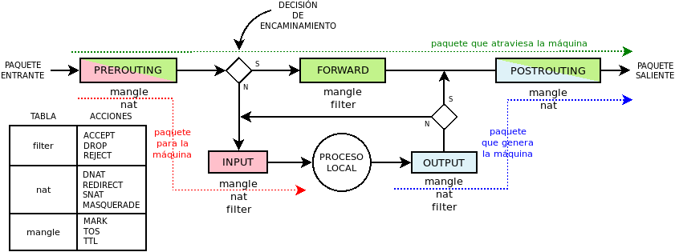

Conceptos básicos
*****************
.. note:: Centraremos las explicaciones en la principal herramienta:
   :program:`iptables`, y añadiremos al final algunas notas para
   :program:`ebtables` y :program:`arptables`. 

Es importante tener presente que el cortafuegos no sólo sirve para filtrar
tráfico no autoriza o indeseado, sino también para manipularlo cambiando los
datos de origen o destino, ya sean direcciones (|IP| o |MAC|) o puertos.

Funcionamiento
==============
Antes de analizar su sintaxis y casos de usos es fundamental entender cómo
funciona. :program:`iptables` dispone de cinco tablas (*nat*, *filter*,
*mangle*, *raw* y *security*, aunque las dos últimas no las trataremos) y una
serie de cadenas a las que se añaden las reglas del cortafuegos. Según entra,
sale o atraviesan los paquetes el equipo, se consultan para ellos estas cadenas,
por lo que es necesario conocer cuál es la ruta que siguen a fin de aplicar la
regla en la cadena correcta. Obsérvese la siguiente figura de izquierda a derecha.

Entiéndase que el "*proceso interno*", es cualquier proceso cliente o servidor
susceptible de enviar y recibir paquetes. Un servidor web o un navegador pueden
ser ejemplo de ello. Otro hito importante representando en la figura es el de "*decisión de encaminamiento*",
que define hacia dónde se dirige el paquete: si a un proceso de la propia
máquina o a una máquina externa. Obviamente, esta decisión viene determinada por
la dirección |IP| de destino. 

Hay tres tipos de paquetes:

**Paquetes destinados al cortafuegos**
   Representados por la línea roja, el primer conjunto de reglas que se
   comprueba con ellos son las incluidas en la cadena *PREROUTING*, llamada así
   porque se aplican tales reglas antes de tomar la decisión de encaminamiento.
   Pasadas las reglas, se toma la decisión que por nuestra suposición será un
   proceso interno, lo que implica comprobar las reglas de la cadena *INPUT*. Si
   el paquete no es filtrado por alguna de estas últimas reglas, el paquete
   alcanzará el proceso al que iba destinado y ahí acabará su vida.

**Paquetes en tránsito**
   Representados por la línea verde son los paquetes que alcanzan el
   cortafuegos, pero cuyo destino es otra máquina, por lo que utilizarán otra
   interfaz de red (excepcionalmente puede que sea la misma) para salir hacia su
   destino. En su caso la *decisión de encaminamiento* hace que sigan su curso
   atravesando la cadena *FORWARD*. Si logra atravesar esta cadena, comprobará
   a continuación *POSTROUTING*, pasada la cual se escoge según la dirección de
   destino la interfaz de salida y en paquete abandona la máquina.

**Paquetes generados por el cortafuegps**

Sintaxis
========

.. https://www.digitalocean.com/community/tutorials/a-deep-dive-into-iptables-and-netfilter-architecture

.. |MAC| replace:: :abbr:`MAC (Media Access Control)`

.. Logs alternativos:
   https://unix.stackexchange.com/questions/342855/how-to-customize-the-format-of-iptable-log-info
   https://wiki.wireshark.org/CaptureSetup/NFLOG
   http://www.luispa.com/archivos/704

.. _ipt-ipset:

