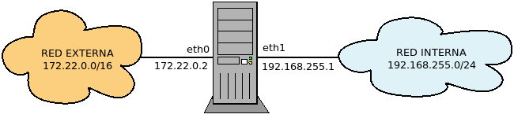
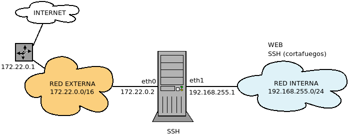
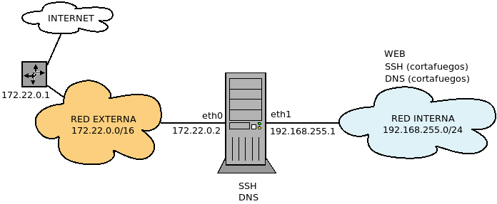
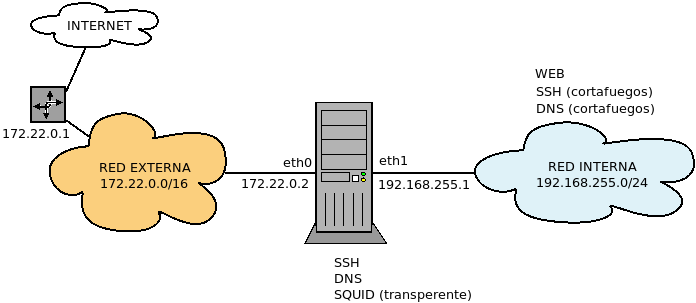
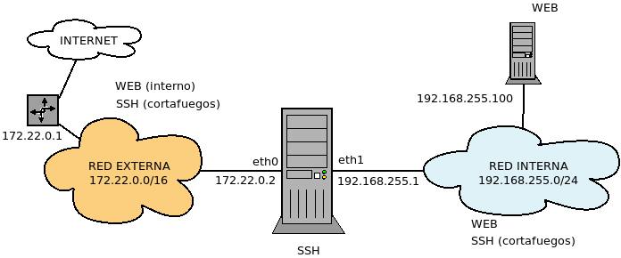
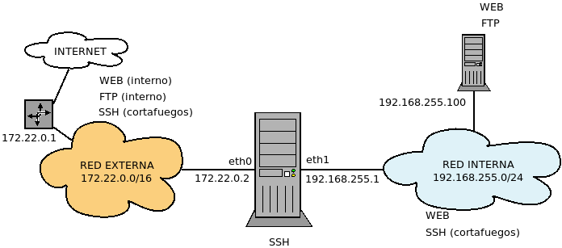

Uso práctico
************
Para introducirnos en :program:`iptables` es imprescindible entender cómo
analizar el estado de las conexiones e ilustrar su uso con ejemplos prácticos.
Por ello dividiremos este epígrafe en dos grandes secciones: una dedicada a casos
ejemplares y otra a casos prácticos. Antes, no obstante, es necesario introducir
los módulos dedicadas a analizar paquetes según la conexión a la que pertenezcan.

.. _iptables-conn:

.. table::
   :class: iptables-ext

   +-----------+---------------------+--------------------------------------------------------------------------------+
   | Extension | Opción              | Descripción                                                                    |
   +===========+=====================+================================================================================+
   | state     | --state             | :ref:`Tipo de paquete <iptables-packet-type>` según la conexión a la que       |
   |           |                     | pertenece. No es posible utilizar ni *DNAT* ni *SNAT*.                         |
   |           |                     +--------------------------------------------------------------------------------+
   |           |                     | iptables -A FORWARD --p tcp ! --syn -m state --state NEW -j DROP               |
   +-----------+---------------------+--------------------------------------------------------------------------------+
   | conntrack | --cstate            | :ref:`Tipo de paquete <iptables-packet-type>` según la conexión a la que       |
   |           |                     | pertenece.                                                                     |
   |           |                     +--------------------------------------------------------------------------------+
   |           |                     | iptables -A FORWARD --p tcp ! --syn -m conntrack --ctstate NEW -j DROP         |
   |           +---------------------+--------------------------------------------------------------------------------+
   |           | -ctdir              | Si el paqute es de ida (*ORIGINAL*) o de vuelta (*REPLY*)                      |
   |           |                     +--------------------------------------------------------------------------------+
   |           |                     | iptables -A FORWARD -m conntrack --ctdir REPLY -j RETURN                       |
   |           +---------------------+--------------------------------------------------------------------------------+
   |           | | --ctorigsrc       | Dirección original de origen o de destino en la ida (*-orig-*) o la vuelta     |
   |           | | --ctorigdst       | (*-repl-*).                                                                    |
   |           | | --ctreplsrc       +--------------------------------------------------------------------------------+
   |           | | --ctrepldst       | iptables -A FORWARD -i eth0 -m conntrack !  --ctorigdst 172.22.0.2 -j DROP     |
   |           +---------------------+--------------------------------------------------------------------------------+
   |           | | --ctorigsrcport   | Puerto original de origen o de destino en la ida (*-orig-*) o la vuelta        |
   |           | | --ctorigdstport   | (*-repl-*).                                                                    |
   |           | | --ctreplsrcport   |                                                                                |
   |           | | --ctrepldstport   |                                                                                |
   +-----------+---------------------+--------------------------------------------------------------------------------+

En conclusión, ambos módulos sirven para el mismo fin, pero *conntrack* es preferible  por brindar más posibilidades.

Casos ejemplares
================
Analizaremos tres casos particulares que permiten ilustrar el seguimiento de
conexiones.

Conexión a servidor genérico
----------------------------
Supongamos el siguiente caso:

en el que nuestro cortafuegos se interpone entre una red interna de clientes y
el exterior. Esta red externa puede o no ser internet. Lo que realmente
distingue a la red externa de la interna es que en la interfaz con la que
conecta el cortafuegos (*eth0*) se hace enmascaramiento, de manera que los
clientes internos son conscientes de que se comunican con el exterior, mientras
que las máquinas externas no son capaces de ver más allá de *eth0*. Por tanto,
partimos de que hay definida esta regla::

   # iptables -t nat -A POSTROUTING -o eth0 -j SNAT --to-source 172.22.0.2

Estudiemos dos casos de distintos de conexión de un cliente a un servidor:

- El caso en que un cliente interno quiere conectar con un servidor web externo.
- El caso en que un cliente externo quiere conectar con un servidor web de la
  red interna (supondremos su |IP| 192.168.255.10).

Además, supondremos una política de lista blanca::

   # iptables -P FORWARD DROP

**Servidor externo**
   Si es un cliente externo el que quiere acceder al exterior necesitaremos que
   las peticiones sean capaces de atravesar el cortafuegos::

      # iptables -A FORWARD -i eth1 -o eth0 -p tcp -m multiport --dports 80,443 -j ACCEPT

   Ahora bien, las respuestas también deben regresar, por lo que::

      # iptables -A FORWARD -i eth0 -o eth1 -m conntrack --ctstate ESTABLISHED -j ACCEPT

   En esta última regla, podemos ahorranos el sentido del tráfico, como 
   esta regla sea efectiva supone siempre permitir antes un tráfico nuevo, no tendrá efecto en el
   sentido contrario, mientras no permitamos algún tráfico entrante; y, si lo permitimos, entonces
   necesitaremos habilitar el tráfico establecido en ambos sentidos. Poniendo las dos reglas juntas
   resulta::

      # iptables -A FORWARD -i eth1 -o eth0 -p tcp -m multiport --dports 80,443 -j ACCEPT
      # iptables -A FORWARD -m conntrack --ctstate ESTABLISHED -j ACCEPT

   .. note:: Obviamente, no seremoa capaces de navegador si no somos capaces de
      resolver direcciones, por lo que también necesitaremos esta regla::

         # iptables -A FORWARD -i eth1 -o eth0 -p udp --dport 53 -j ACCEPT

**Servidor interno**
   La diferencia fundamental con el caso anterior es que los clientes externos
   desconocen por completo la existencia de la red interna, por lo que para
   conectar con el servidor intentarán hacerlo con el cortafuegos y será éste el
   que tenga redirigir la petición hacia el servidor web::

      # iptables -t nat -A PREROUTING -i eth0 -p tcp -m multiport --dports 80,443 -j DNAT --to-destination 192.168.255.10

   Ahora bien, debemos también permitir que el tráfico atraviese el
   cortafuegos::

      # iptables -A FORWARD -m conntrack --ctstate DNAT -j ACCEPT

   y no necesitamos más. Podríamos haber hecho el calco de la solución anterior,
   intercambiado el sentido del tráfico, pero es más concisa esta solución:
   dejamos atravesar el cortafuegos a aquel tráfico del que hemos hecho |DNAT|.
   Como no ponemos sentido, también el tráfico de vuelta pasará.

.. _iptables-ftp:

Conexión a servidor |FTP|
-------------------------
El protocolo |FTP| es un poco especialito, por decirlo de algún modo.
Habitualmente los protocolos de comunicación establecen un sólo canal de
comunicación. En cambio, el |FTP| establece dos canales de comunicación: uno de
control y otro para datos:

* El canal de control es el primero que se establece, de modo análogo a como se
  establece en el resto de protocolos: el cliente desde un puerto aleatorio por
  encima del *1024* se conecta al puerto *21* del servidor.
* El canal de datos se establece cuando se necesita enviar datos. Por ejemplo,
  un fichero descargado o subido, o bien, simplemente, la lista de ficheros
  disponibles en el servidor. El establecimiento de este segundo canal puede
  hacerse de dos maneras:

  Modo **activo**
   El servidor desde su puerto *20* establece la comunicación con un puerto
   aleatorio del cliente. Este puerto aleatorio es previamente comunicado al
   servidor a través del canal de control:

   .. image:: files/modoactivo.png

  Modo **pasivo**
   el cliente, desde el puerto siguiente al que usa para control, establece el
   canal de datos con un puerto aleatorio del servidor, que éste previamente le
   ha comunicado a través del canal de control

   .. image:: files/modopasivo.png

Los problemas de comunicación mediante |FTP|, los provoca la singularidad que
supone la existencia del canal de datos, sobre todo el modo activo, en que el
canal de datos lo inicia el servidor, no el cliente. iniciada por el cliente,
sino por el servidor. Los cortafuegos de inspección de estado son capaces de
lidiar con esto, gracias a que son capaces de distinguir conexiones y saber que
una conexión está relacionada con la otra (*RELATED*).

Partiendo de una politica de lista blanca, retomaremos el caso anterior, pero
suponiendo que la conexión se realiza con servidor |FTP|. En este caso, es
indispensable que el núcleo de *Linux* haga seguimiento de las conexiones |FTP|,
a fin de ser capaz de reconocer que el canal de datos está relacionado con su
correspondiente canal de control. para lo cual se requiere tener cargado el módulo::

   # modprobe nf_conntrack_ftp

y a partir de la versión *4.7* del núcleo fijar a *1* un parámetro del núcleo::

   # echo 1 > /proc/sys/net/netfilter/nf_conntrack_helper

Hay otra dificultad añadida, porque el cortafuegos situado entre la red interna y
la externa hace enmascaramiento y como consecuencia los máquinas externas creen
estar hablando con el cortafuegos y no con máquinas de la red interna:

* En el modo *activo* en el caso de servidor externo, éste intentará abrir el
  canal de datos con el cortafuegos, no con el cliente y es preciso añadir un
  |DNAT| adicional para este canal también. En principio, es fácil de
  solucionar, porque el puerto de origen es siempre el *20*.
* En el modo *pasivo* en el caso de servidor interno, el cliente externo
  intentará abrir el canal de datos con el cortafuegos no con el cliente y, de
  nuevo, es necesario añadir |DNAT| para este canal. El problema es que ni el
  puerto de origen ni el de destino estan prefijados y en consecuencia es
  imposible crear una regla estática para solucionar este problema.

Afortunadamente, existe un módulo en el núcleo de *Linux* capaz de detectar si
hubo |DNAT| en el canal de control y hacer automáticamente el |DNAT| necesario
en el canal de datos, sin que tengamos que escribir la regla adicional en
:program:`iptables`::

   # modprobe nf_nat_ftp

.. _iptables-ftp-modules:

.. note:: Para automatizar en el arranque la carga de los dos módulos y el
   cambio en el valor del parámetro del núcleo podemos hacer::

      # cat > /etc/modules-load.d/ftp.conf
      nf_conntrack_ftp
      nf_nat_ftp

      # echo "net.netfilter.nf_conntrack_helper = 1" >> /etc/sysctl.conf

Hecho lo cual, podemos comenzar.

**Servidor externo**
   El establecimiento del canal de control es análogo al establecimiento del
   canal de comunicación de cualquier servicio, por tanto::

      # iptables -A FORWARD -i eth1 -o eth0 -p tcp --dport 21 -j ACCEPT
      # iptables -A FORWARD -i eth0 -o eth1 -m conntrack --ctstate ESTABLISHED -j ACCEPT
   
   La forma de habilitar el canal de datos depende de si del modo. Si es activo,
   es el propio servidor el que lo abre, así que se podría habilitar así::

      # iptables -A FORWARD -i eth0 -o eth1 -m conntrack --ctstate RELATED,ESTABLISHED -j ACCEPT
      # iptables -A FORWARD -i eth1 -o eth0 -m conntrack --ctstate ESTABLISHED -j ACCEPT

   Si el modo es pasivo, el canal de datos lo abre también el cliente y las
   reglas son las siguientes::

      # iptables -A FORWARD -i eth1 -o eth0 -m conntrack --ctstate RELATED,ESTABLISHED -j ACCEPT
      # iptables -A FORWARD -i eth0 -o eth1 -m conntrack --ctstate ESTABLISHED -j ACCEPT

   La última de las cuales ya se había utilizado para establecer el canal de
   control y, por tanto, sobra. Finalmente, si deseamos habilitar ambos modos y
   simplificamos un poco las reglas sin comprometer la seguridad llegamos a que
   **basta con lo siguiente**::

      # iptables -A FORWARD -i eth1 -o eth0 -p tcp --dport 21 -j ACCEPT
      # iptables -A FORWARD -m conntrack --ctstate ESTABLISHED,RELATED -j ACCEPT

   es decir, que la *receta* es la misma que para otro servidor que
   use un sólo canal de comunicación con la salvedad de tener que añadir también
   el tráfico relacionado en la segunda regla.

**Servidor interno**
   El caso es análogo al anterior salvo por el hecho de que el sentido es el
   inverso y que, además, hay que hacer |DNAT| en la interfaz *eth0* para redirigir
   el tráfico al servidor interno. Si, por otro lado, tenemos en cuenta lo
   discutido para un servicio genérico y permitos pasar el tráfico con estado
   |DNAT|, llegamos a las siguientes reglas::

      # iptables -t nat -A PREROUTING -i eth0 -p tcp --dport 21 -j DNAT --to-destination 192.168.255.10
      # iptables -A FORWARD -m conntrack --ctstate DNAT -j ACCEPT
      # iptables -A FORWARD -m conntrack --ctstate ESTABLISHED,RELATED -j ACCEPT

Conexión a un servidor *antipático*
-----------------------------------
Consideremos la siguiente red:

.. image:: files/servcli.png

En esa el servidor web, sólo admite comunicaciones con el cortaguegos
(*192.168.255.1*), por lo que el cliente no puede comunicarse directamente con
él::

    # iptables -P INPUT DROP
    # iptables -P OUTPUT DROP
    # iptables -A INPUT -i lo -j ACCEPT
    # iptables -A OUTPUT -o lo -j ACCEPT
    # iptables -A INPUT -s 192.168.255.1 -j ACCEPT
    # iptables -A OUTPUT -d 192.168.255.1 -j ACCEPT

Por ello, el cliente deberá pedir las páginas al cortafuegos y éste
redirigir ese tráfico hacia el servidor web con esta regla::

   # iptables -t nat -A PREROUTING -i eth0 -p tcp -m multiport --dports 80,443 -d 192.168.255.1 \
      -j DNAT --to-destination 192.168.255.2

Si embargo, esto sólo cambia la |IP| de destino, no la de origen, que seguirá
siendo *192.168.255.3*. En consecuencia:

* El servidor no responderá, puerto que sólo se comunica con la *192.168.255.1*
  y la petición parece proceder de *192.168.255.3*.
* Aun en el supuesto de que respondiera, la |IP| de destino de la respuesta
  sería *192.168.255.3*, por lo que el servidor respondería directamente a esta
  |IP|. La consecuencia sería que nunca se desaría el |DNAT| y el cliente recibiría
  un paquete procedente de *192.168.255.2*, cuando habría esperado recibirlo de
  *192.168.255.1*. Como consecuencia, lo rechazaría.

La solución es hacer un |SNAT| a la salida de *eth0* para cambiar también la
|IP| de origen y que el servidor la devuelva al cortafuegos::

   #  iptables -t nat -A POSTROUTING -o eth0 -p tcp -m multiport --dports 80,443 \
         -m conntrack --ctstate DNAT -j SNAT --to-source 192.168.255.1

Obviamente, enmascaramos solamente los paquetes a los que previamente se aplicó
el |DNAT|.

.. table::
   :class: iptables-anti

   +----------+------------------------------+-----------------------------+-----------------------------+--------------------------+
   | Instante | Lugar                        | Origen                      | Destino                     | Comentario               |
   |          |                              +-------------+---------------+-------------+---------------+                          |
   |          |                              | Máquina     | IP            | Máquina     | IP            |                          |
   +==========+==============================+=============+===============+=============+===============+==========================+
   | 1        | Entre ciliente y cortafuegos | Cliente     | 192.168.255.3 | Cortafuegos | 192.168.255.1 | |DNAT| en *PREROUTING*   | 
   +----------+------------------------------+-------------+---------------+-------------+---------------+--------------------------+
   | 2        | Dentro del cortafuegos       | Cliente     | 192.168.255.3 | Servidor    | 192.168.255.2 | |SNAT| en *POSTROUTING*  |
   +----------+------------------------------+-------------+---------------+-------------+---------------+--------------------------+
   | 3        | Entre cortafuegos y servidor | Cortafuegos | 192.168.255.1 | Servidor    | 192.168.255.2 | Servidor recibe paquete  |
   +----------+------------------------------+-------------+---------------+-------------+---------------+--------------------------+
   | 4        | Entre servidor y cortafuegos | Servidor    | 192.168.255.2 | Cortafuegos | 192.168.255.1 | |DNAT| automático        |
   +----------+------------------------------+-------------+---------------+-------------+---------------+--------------------------+
   | 5        | Dentro del cortafuegos       | Servidor    | 192.168.255.2 | Cliente     | 192.168.255.3 | |SNAT| automático        |
   +----------+------------------------------+-------------+---------------+-------------+---------------+--------------------------+
   | 6        | Entre cortafuegos y cliente  | Cortafuegos | 192.168.255.1 | Cliente     | 192.168.255.3 | Cliente recibe paquete   |
   +----------+------------------------------+-------------+---------------+-------------+---------------+--------------------------+

Obsérvese que el cliente envía un paquete (instante 1) y recibe otro (instante
6) que, como es natural. tiene las |IP| de origen y destino intercambiadas. Por
su parte el servidor recibe un paquete del cortafuegos (instante 3) y responde
a éste (instante 4).

Casos prácticos
===============
Para ilustrar cómo puede usarse :program:`iptables`  haremos la configuración de
algunos casos simples. En todos ellos se presupondrá una política de lista
blanca y que a la salida del cortafuegos hacia la red externa se hace
enmascaramiento,

Acceso simple
-------------
Se dispone de un cortafuegos con |SSH| instalado para configurarlo
exclusivamente desde la red interna. Los clientes internos deberían ser capaces
de navegador.

.. literalinclude:: files/caso1.sh
   :language: bash

.. note:: La inclusión del tráfico relacionado en la última no es estrictamente
   necesaria, pero es conveniente ya que las respuestas de un servidor
   rechazando una conexión son tráfico relacionado. Por ello, si lo incluimos
   recibiremos inmediatamente este rechazo, en vez de que acabe fallando la
   conexión por temporización.

Acceso con |DNS| propio
-----------------------
A diferencia del caso anterior, para optimizar el ancho de banda se instala un
servidor |DNS| en el cortafuegos.

.. literalinclude:: files/caso2.sh
   :language: bash

Acceso mediante :program:`squid` (modo transparente)
----------------------------------------------------
A la configuración anterior se añade que se quiere forzar a que la navegación no
segura se haga a través de un *proxy* :program:`squid` configurado en modo
transparente en el cortafuegos. Supóngase que el puerto de escucha de
:program:`squid` es el 3128.

.. literalinclude:: files/caso3.sh
   :language: bash

Acceso mediante :program:`squid` (modo directo)
-----------------------------------------------
La misma configuración, pero en este caso, :program:`squid` se configura en modo
directo en el puerto 8080 tanto para tráfico web seguro como no seguro.

.. image:: files/caso4.png

.. literalinclude:: files/caso4.sh
   :language: bash

Servidor web interno
--------------------
El supuesto es parecido al primero (una red interna a la que se quiere permitir
navegar), pero añade la existencia de un servidor web interno en 192.168.255.100
al que se quiere permitir acceso desde el exterior.

.. literalinclude:: files/caso5.sh
   :language: bash

Servidores web y |FTP| internos
-------------------------------
El servidor interno añade un servicio |FTP|.

.. warning:: Recuerde que para que funcione la detección del tráfico |FTP|
   relacionado, se requieren :ref:`algunas operaciones previas <iptables-ftp-modules>`.

.. literalinclude:: files/caso6.sh
   :language: bash

.. |DNAT| replace:: :abbr:`DNAT (Destination NAT)`
.. |SNAT| replace:: :abbr:`SNAT (Source NAT)`
