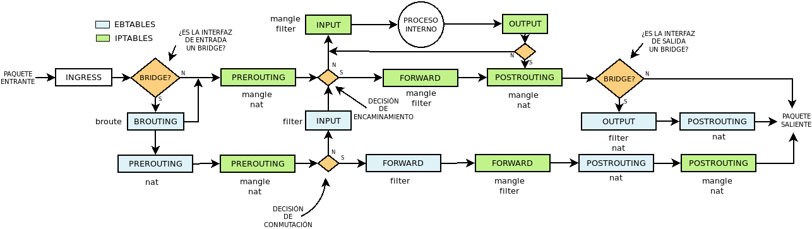

Conceptos
=========

.. _nftables-families:

Familias
--------
:program:`nftables` permite manipular tráfico encaminado, conmutado y |ARP| por
lo que cuando se definen tablas y cadenas es necesario especificar para qué
familia de tráfico se crean:

.. table::
   :class: nftables-family

   ========== =============== ==========================================================
    Familia    Gestinado por   Descripción
   ========== =============== ==========================================================
    ip         iptables        Para |IP|\ v4.
    ip6        ip5tables       Para |IP|\ v6.
    inet       {ip,ip6}tables  Para las dos familias anteriores.
    arp        arptables       Para tráfico |ARP|.
    bridge     ebtables        Para tráfico que atraviesa interfaces *bridge*.
    netdev     \-              Pará tráfico que acaba de procesar la tarjeta de red.
   ========== =============== ==========================================================

.. _nftables-hooks:

Enganches (*hooks*)
-------------------
Los :dfn:`enganches` son los puntos dentro del flujo del tráfico en los que se
puede analizar éste. Puesto que el *framework* es el mismo
(:program:`netfilter`), los enganches podemos verlos en el esquema que
presentamos para :ref:`ebtables <ebtables>`:

.. todo:: Cambiar este gráfico por otro basado en `este otro
   <https://www.craoc.fr/articles/nftables/#route-chain>`_.

Todos los enganches no tienen sentido para todas las familias:

.. table::
   :class: nftables-hooks

   ============= ======================
    Enganche      Familia              
   ============= ======================
    ingress       netdev               
    prerouting    ip, ip6, bridge      
    input         ip, ip6, bridge, arp 
    forward       ip, ip6, bridge
    output        ip, ip6, bridge, arp
    postrouting   ip, ip6, bridge
   ============= ======================

.. note:: El enganche correspondiente a *BROUTING* no esta implementado.

.. _nftables-types:

Tipos
-----
Los :dfn:`tipos`  de las cadenas indican cuál es el cometido de las reglas que
contendrá la cadena:

.. table::
   :class: nftables-type

   +--------+---------------+----------+------------------------------------------------+
   | Tipo   | Enganches     | Familias | Propósito                                      |
   +========+===============+==========+================================================+
   | filter | Todos         | Todos    | Filtrar paquetes.                              |
   +--------+---------------+----------+------------------------------------------------+
   | nat    | | preroting,  | | ip,    | Realizar operaciones de |NAT|. Sólo se         |
   |        | | input,      | | ip6,   | se aplica sobre el primer paquete              |
   |        | | output.     | | inet   | de la conexión.                                |
   |        | | postrouting |          |                                                |
   +--------+---------------+----------+------------------------------------------------+
   | route  | | ip,         | output   | Permite implementar la funcionalidad del       |
   |        | | ip6         |          | `objetivo ROUTE`_ de :program:`iptables`.      |
   +--------+---------------+----------+------------------------------------------------+

.. _objetivo ROUTE: https://netfilter.org/documentation/HOWTO/netfilter-extensions-HOWTO-4.html#ss4.5

Creación del armazón
====================
Para poder escribir reglas necesitamos crear un armazón previo de tablas y
reglas que, a diferencia de :program:`iptables` está sin definir.

.. _nftables-tables:

Tablas
------
Tienen el propósito de albergar cadenas (que a su vez son contenedores de reglas),
pero no hay predefinida ninguna. Para crearlas basta con indicar de qué familia
son::

   # nft add table [<familia>] <nombre>

Si no se especifica familia, se sobrentiende :kbd:`ip`. Por ejemplo::

   # nft add table ip filter
   # nft add table nat

que crea dos tablas llamadas "filter" y "nat" para |IP|\ v4.

.. note:: Es posible usar :kbd:`create` en vez de :kbd:`add`. La única
   diferencia es que la primera alternativa falla cuando se intenta crear
   una tabla que ya existe::

      # nft create table filter
      Error: Could not process rule: File exists
      create table ip filter
      ^^^^^^^^^^^^^^^^^^^^^^^
      # echo $?
      1
      # nft add table filter
      # echo $?
      0

   En la creación de cadenas también es valida esta nota.

Podemos listar las tablas definidas::

   # nft list tables
   table ip filter
   table ip nat

O listas las reglas dentro de una cadena con::

   # nft list table [<familia>] <nombre>

En nuestro caso::

   # nft list table filter
   table ip filter {
   }
   # nft list table ip nat
   table ip nat {
   }

Por último, para borrar una tabla creada::

   # nft delete table [<familia>] <nombre>

Por ejemplo::

   # nft create table inet efimera
   # nft list table inet efimera
   table inet efimera {
   }
   # nft delete table inet efimera

Ahora bien, antes de la versión 3.18 del kernel, para poder borrar una tabla,
ésta no debía contener cadenas y. si las contienía, debía vaciarse primero::

   # nft flush table [<familia>] <nombre>

Es también intersante saber que podemos deshabilitar temporalmente una tabla, lo
que supone que no se comprobaran las reglas de sus cadenas::

   # nft add table filter { flags dormant\;}

.. _nftables-chains:

Cadenas
-------
Las :dfn:`cadenas` son, simplemente, colecciones de reglas y, como en el caso de
:program:`iptables` hay de dos tipos:

- Las :dfn:`cadenas base` que son las cadenas que se enganchan al flujo y que se
  comprueban cuando el paquete llega a uno de esos enganches. En
  :program:`iptables` estas cadenas ya estaban definidas, pero en
  :program:`nftables` es el adminsitrador el encargado de crearlas y
  engancharlas.
- Las :dfn:`cadenas de usuario` cuyas reglas se comprueban sólo cuando alguna regla
  salta a ellas. No están pues enganchadas al flujo, sino referidas en otra
  cadena. Su naturaleza, pues, es la misma que en :program:`iptables`.

Para crear el segundo tipo de cadenas, amén del nombre, sólo hay que indicar la
familia y la tabla para la se crea la cadena::

   # nft add chain [<family>] <table> <nombre> 

Por ejemplo::

   # nft add chain filter INVALIDO
   # nft list table filter
   table ip filter {
           chain INVALIDO {
           }
   }

Esta cadena, aun conteniendo reglas, será totalmente inútil hasta que al menos
desde una cadena base no saltemos a ella para que operen las reglas que
contiene.

Las *cadenas base*, sin embargo, exigen para su creación indicar más
propiedades::

   # nft add chain [<family>] <table> <nombre> { type <tipo> hook <enganche> priority <prio>\; [policy <politica>] }

esto es:

* El :ref:`tipo de cadena <nftables-types>`.
* A qué :ref:`punto del flujo se enganchan <nftables-hooks>`.
* Cuál es la prioridad de la cadena. La prioridad sirve para saber, dentro de un
  enganche al que hay asociados varias cadenas cuál es el orden en que deben
  procesarse. Es un número entero (también negativo), de manera que cuanto menor
  sea, mayor será la prioridad y, por tanto, antes se procesará la cadena.
* La política se refiere a la política de aceptación o rechazo, esto es,
  *accept* o *drop*. Si no se especifica, se sobreentiende *accept*. En caso de
  aceptación, el paquete continuará fluyendo (aunque no comprobará más reglas de
  esa cadena); en caso de rechazo, el paquete se descartará sin más.

Por ejemplo::

   # nft add chain filter INPUT { type filter hook input priority 0\; }
   # nft add chain filter FORWARD { type filter hook forward priority 0\; }
   # nft add chain filter OUTPUT { type filter hook output priority 0\; }

estas tres instrucciones crearían unas tablas para filtrar paquetes equivalentes
a las existentes en :program:`iptables`.

Como referencia. a partir de :program:`nftables` v0.9.1 pueden usarse nombres para
prioridades predefinidas\ [#]_:

.. table::
   :class: iptables-prio

   ========== =========== =================================== =============
    Nombre     Prioridad   Familia                             Enganche
   ========== =========== =================================== =============
    raw          -300      ip, ip6, inet                       Todos
    mangle       -150      ip, ip6, inet                       Todos
    dstnat       -100      ip, ip6, inet                       prerouting
    filter          0      ip, ip6, inet, arp, netdev          Todos
    security       50      ip, ip6, inet                       Todos
    srcnat        100      ip, ip6, inet                       postrouting
   ========== =========== =================================== =============

Y para la familia *bridge*:

.. table::
   :class: iptables-prio

   ========== =========== =========== =============
    Tabla      Prioridad   Familia     Enganche
   ========== =========== =========== =============
    dstnat     -300        bridge      prerouting
    filter     -200        bridge      Todos
    out         100        bridge      output
    srcnat      300        bridge      postrouting
   ========== =========== =========== =============
   
En el caso de que se cree una cadena enganchada a *ingress* es necesario,
además, definir la interfaz a la que se conectará::

   # nft add table netdev ingress
   # nft add chain netdev ingress INGRESS {type filter hook ingress device eth0 priority 0\;}

Para borrar cadenas basta con::

   # nft delete chain [<family>] <table> <nombre>

Por ejemplo::

   # nft delete chain netdev ingress INGRESS

aunque no podrá borrarse hasta que no esté completamente vacía, lo cual puede
hacerse borrando reglas una a una o de un tirón con::

   # nft flush chain [<family>] <table> <nombre>

.. rubric:: Notas al pie

.. [#] Véase la página de manual de :manpage:`nftables(8)` o el `texto que
   acompaña
   <http://git.netfilter.org/nftables/commit/?id=c8a0e8c90e2d1188e6fcdd8951b295722e56d542>`_
   la aceptación del parche. Los valores derivan de los `predefinidos en
   iptables
   <https://wiki.nftables.org/wiki-nftables/index.php/Configuring_chains#Base_chain_priority>`_.

..  https://www.redeszone.net/tutoriales/seguridad/nftables-firewall-linux-configuracion/
   

.. |ARP| replace:: :abbr:`ARP (Address Resolution Protocol)`
.. |NAT| replace:: :abbr:`NAT (Network Address Translation)`
