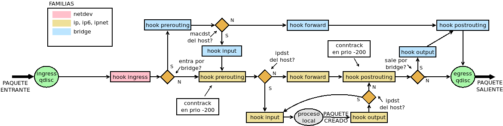

************
Uso avanzado
************

.. _nftables-marcas:

Marcas
******
Las :dfn:`marcas` son señales que pueden establecerse sobre los paquetes a fin
de reconocerlos más adelante en el flujo. Por ejemplo, en un enganche de la
familia *bridge* somos capaces de reconocer cuál es la interfaz física (el
puerto) por el que entró un paquete, mientras que un enganche de la familia
*ip*, sólo somos capaces de reconocer la :ref:`interfaz bridge <bridge>`
virtual. Si marcamos los paquetes en el primer enganche, seremos capaces de
reconocer el puerto de entrada en el segundo consultando la marca.

Hay dos tipos de marcas:

- La :dfn:`marca de paquete` que es aquella que se establece individualmente
  para cada paquete. En realidad, las marcas no se escriben sobre el propio
  paquete, sino sobre su representación en :program:`netfilter`, por lo que no
  podrá ser consultada fuera del propio cortafuegos.

- La :dfn:`marca de conexión` que es aquella que se establece sobre la conexión
  a la que pertenece un paquete. En consecuencia, es consultable desde el resto
  de paquetes que pertenecen a la marca. Es común que se establezca en un
  enganche de tipo *nat* en el primer paquete.

.. table::
   :class: nftables-matches

   +-----------+---------------+----------------------------------------------+
   | Criterio  | Argumento     | Descripción                                  |
   +===========+===============+==============================================+
   | meta      | mark          | Comprueba la marca del paquete.              |
   |           |               +----------------------------------------------+
   |           |               | meta mark 0x1                                |
   |           +---------------+----------------------------------------------+
   |           | mark set      | Establece la marca sobre el paquete.         |
   |           |               +----------------------------------------------+
   |           |               | meta mark set 0x1                            |
   +-----------+---------------+----------------------------------------------+
   | ct        | mark          | Comprueba la marca de la comexión.           |
   |           |               +----------------------------------------------+
   |           |               | ct mark 0x1                                  |
   |           +---------------+----------------------------------------------+
   |           | mark set      | Establece la marca sobre la conexión.        |
   |           |               +----------------------------------------------+
   |           |               | ct mark set 0x1                              |
   +-----------+---------------+----------------------------------------------+

Por ejemplo, si queremos limitar el caudal de tráfico |SSH|, pero sólo de los
clientes que se conectan a nuestro servidor por *eth0*:

.. code-block:: bash

   table netdev filter {
      chain INGRESS {
         type filter hook ingres device eth0 priority filter

         tcp dport ssh meta mark set 1
      }

      chain INPUT {
         type filter hook input priority filter

         meta mark 1 limit over 512 kbytes/second drop
      }
   }

Colecciones
***********
Incluimos bajo este epígrafe las herramientas de que dispone :program:`nftables`
para agrupar elementos

.. _nftables-sets:

Conjuntos
=========
En :program:`nftables` hay dos tipos de conjuntos:

* **Anónimos** que son aquellos invariables que se añaden directamente a las
  reglas y, sin ponerles nombre, ya se han introducidos en algunos ejemplos::

   # nft add rule filter INPUT tcp dport {http, https} accept

  este, por ejemplo, es un conjunto anónimimo que almacena dos puertos: el
  **80** y el **443**. El conjunto se ha creado así y así permanecerá mientras
  exista la regla.

* **Nominados**, que se asocian a tablas y pueden usarse en las reglas. Estos
  conjuntos implementan las posibilidades de :ref:`ipset <ipset>` en
  :command:`iptables`. A ellos dedicaremos el epígrafe.

Los *conjuntos nominados* se crean asociándole una tabla, dotándolos de un
nombre y declarando qué tipo de dato contendrán. Por ejemplo::

   # nft add table filter
   # nft add set filter www {type inet_service\;}

Por ahora nos hemos limitado a crear un conjunto llamado "www" que puede
contener puertos. Podría haber contenido también:

.. table::
   :class: nftables-set-type

   =============== =====================================
    Tipo            Descripción
   =============== =====================================
    ipv4_address     Direcciones |IP|\ v4
    ipv6_address     Direcciones |IP|\ v6
    ether_address    Direcciones |MAC|.
    inet_proto       Protocolos 
    inet_service     Puertos de conexión.
    mark             Marcas.
    ifname           Nombres de interfaces.
   =============== =====================================

Para usarlo basta anteponer una arroba al nombre::

   # nft add chain filter INPUT "{type filter hook input priority 0;}"
   # nft add rule filter INPUT tcp dport @www counter

aunque aún no contiene ningún puerto. Además del tipo, pueden añadirse otras
características al crear el conjunto:

.. table::
   :class: nftables-set-caract

   +----------------+----------+--------------------------------------------------------------------------------------+
   | Característica | Opción   | Descripción                                                                          |
   +================+==========+======================================================================================+
   | type           | Tipo de los elementos que constituyen el conjunto.                                              |
   +----------------+-------------------------------------------------------------------------------------------------+
   | timeout        | Tiempo de vida de los elementos que se añaden. Pasado éste, desaparecen automáticamente.        |
   |                | Implica que se puedan indicar tiempo de vida al añadir elementos.                               |
   +----------------+-------------------------------------------------------------------------------------------------+
   | elements       | Añade los elementos de la lista al conjunto                                                     |
   |                +-------------------------------------------------------------------------------------------------+
   |                | nft add set filter hosts \\"{type ipv4_addr; elements={1.1.1.1, 1.0.0.1};}\\"                   |
   +----------------+----------+--------------------------------------------------------------------------------------+
   | flags          | constant | El contenido del conjunto no puede cambiar mientras esté vinculado a alguna regla.   |
   |                +----------+--------------------------------------------------------------------------------------+
   |                | dynamic  | Crea conjuntos dinámicos, que añaden elementos directamente desde las reglas. Lo     |
   |                |          | trataremos en el :ref:`epígrafe dedicado a meters <nftables-meters>`.                |
   |                +----------+--------------------------------------------------------------------------------------+
   |                | interval | El conjunto contiene intervalos, no elementos individuales.                          |
   |                +----------+--------------------------------------------------------------------------------------+
   |                | timeout  | Al añadir elementos, se puede indicar el tiempo de vida de cada elemento             |
   |                +----------+--------------------------------------------------------------------------------------+
   |                | | nft add set filter hosts \\"{type ipv4_addr; flags constant, timeout;}\\"                     |
   |                | | nft add element filter hosts {1.1.1.1 timeout 1m}                                             |
   +----------------+----------+--------------------------------------------------------------------------------------+
   | size           | Cantidad máxima de elementos que puede contener el conjunto.                                    |
   +----------------+----------+--------------------------------------------------------------------------------------+

Podemos añadir elementos::

   # nft add element filter www {http, https}
   # nft list set filter www
   table ip filter {
      set www {
         type inet_service
         elements = { http, https }
      }
   }

aunque también pueden añadirse automáticamente a través de las reglas. Por
ejemplo, así controlaríamos las máquinas que nos ha hecho :program:`ping` en la
última hora::

   # nft add set filter pines {type ipv4_addr; timeout 1h; size 65535}
   # nft add rule filter INPUT icmp type echo-request add @pines {ip saddr}

.. warning:: Cuando se añaden elementos de este modo, es más que conveniente
   fijar un tamaño máximo y un tiempo de vida del elemento en el conjunto.

Los conjuntos con nombre puede eliminarse::

   # nft delete set filter www

siempre y cuando no estén vinculados a ninguna regla.
   
.. ¿"add rule ... delete @set" en los normales o en los dinámicos?
   https://lwn.net/Articles/806177/

.. _nftables-concat:

Concatenaciones
===============
Las :dfn:`concatenaciones` permiten agrupar selectores (o sea, condiciones) para
tratarlas de modo conjunto. Como operador se usa el punto ("."). Por ejemplo::

   # nft add filter FORWARD ip saddr . ip daddr {10.0.0.4 . 10.0.0.8, 10.0.0.5 . 10.0.0.10} counter

En este caso, el selector vandŕa tanto para si la conexión es entre *10.0.0.4* y
*10.0.0.8* como si es entre *10.0.0.5* y *10.0.0.10*.

Esta es una expresión literal, pero podría haberse construido también un
conjunto nomimal concatenado los dos valores necesarios::

   # nft add set filter orig-dest {type ipv4_addr . ipv4_addr\;}
   # nft add element filter orig-dest {10.0.0.4 . 10.0.0.8, 10.0.0.5 . 10.0.0.10}
   # nft add filter FORWARD ip saddr . ip daddr @orig-dest counter

También es posible concatenar las claves en los mapas y disccionarios.

.. seealso:: Échele un vistazo al `epigrafe de concatenaciones de la wiki de
   nftables
   <https://wiki.nftables.org/wiki-nftables/index.php/Concatenations>`_.

.. _nftables-maps:

Mapas
=====
Los :dfn:`mapas` son conjuntos de valores a los que se accede a través de una clave.
Como en el caso de los conjuntos:

- Pueden ser **anónimos** o **nominados**.
- Pueden utilizarse en las sentencias de las reglas.
- Puede modificarse su contenido manualmente.

Y a diferencia de ellos, no pueden añadirse elementos a través de reglas. Para
utilizarlos debe hacerse lo siguiente::

   dnat to tcp dport map {80: 192.168.1.100, 8888: 192.168.1.101}
   counter name tcp dport map @conn

es decir, debe colocarse primero la expresión que define el valor y después la
expresión que define la clave. El primero es un ejemplo de mapa anónimo y el
segundo de mapa con nombre don se requiere hacer algunas definiciones previas::

   # nft add counter filter c22
   # nft add counter filter c28
   # nft add map filter conn {type inet_service: counter}
   # nft add element filter conn {ssh: c22, http: c80}

Y ahora sí, podria usarse el mapa::

   # nft add rule filter INPUT ct state new counter name tcp dport map @conn

.. _nftables-vmap:

Diccionarios
============
Los :dfn:`diccionarios` son mapas en que los valores son acciones terminalesi (excepto
*reject*). Por ejemplo, esta regla salta dependiendo del tipo de tráfico a una u
otra cadena de usuario::

   # nft add rule filter ct state new tcp port vmap {ssh: jump SSH, ftp: jump FTP}

También es posible hacer diccionarios nominados.

.. _nftables-meters:

Conjuntos dinámicos
===================
Cuando en las reglas usamos :ref:`objetos de inspección de estado
<nftables-stateful-objects>`, en particular, :ref:`caudales <nftables-limit>` y
:ref:`cuotas <nftables-quota>`, como por ejemplo::

   # nft add rule filter output tcp sport ssh quota over 100 mbytes drop

el objeto (la cuota en este caso) se actualiza y se comprueba cada vez que se
hay tráfico de descarga que provocan nuestro clientes del servicio |SSH|. Esta
cuota es general y, cualquier cliente que descargue algo, contribuirá a
aumentarla. En principio, si nuestra intención fuera establecer una cuota
individual por cliente, deberíamos incluir tantas regla distintas como clientes
tengamos::

   # nft add rule filter output tcp sport ssh ip daddr 1.1.1.1 quota over 10 mbytes drop
   # nft add rule filter output tcp sport ssh ip daddr 1.1.1.2 quota over 10 mbytes drop
   # etc...

esto es inviable, pero los *conjuntos dinámicos* vienen a resolvernos la
papeleta. Un :dfn:`conjunto dinámico` es aquel conjunto que relaciona un
elemento con un objeto de inspección de estado, de manera que al actualizar
la presencia del objeto en el conjunto actualiza también su objeto
correspondiente.

Tienen dos formas de expresarse:

* Hasta la versión *0.9.0* (que es precisamente la que trae *Buster*) a través
  de la palabra clave :kbd:`meter`.
* A partir de la *0.9.1* a través del *flag* :kbd:`dynamic` al crear conjuntos.

Aunque :kbd:`meter` sigue existiendo, esta marcada como obsoleta por lo que
podría ocurrir que en el futuro desapareciera. Sea como sea, trataremos ambas

.. rubric:: dynamic

La nueva sintaxis es la que mejor ilustra el concepto que acabamos de explicar,
así que la expondremos antes. Definimos primero el conjunto::

   # nft add set filter sshquota "{type ipv4_addr; timeout 1h; flags dynamic; size 65535}"

para añadir después los elementos en la regla correspondiente. Con una política de *lista
blanca*, la regla quedaría así::

   # nft add filter OUTPUT tcp sport ssh add @sshquota {ip saddr quota 10 mbytes} accept

Y si fuera de *lista negra*::

   # nft add filter OUTPUT tcp sport ssh add @sshquota {ip saddr quota over 10 mbytes} drop

.. rubric:: meter

La obsoleta sintaxis con :kbd:`meter` no es excesivamente diferente, aunque no
defina explícitamente un conjunto. Con *lista blanca*, deberíamos hacer::

   # nft add filter OUTPUT tcp sport ssh \
      meter sshquota size 65535 {ip saddr timeout 5s quota 10 mbytes} accept

Con *lista negra*, el equivalente será::

   # nft add filter OUTPUT tcp sport ssh \
      meter sshquota size 65535 {ip saddr timeout 5s quota over 10 mbytes} drop

Em ambos casos, podremos consultar el contenido de "sshquota" con::

   # nft list meter filter sshquota

En conjunción con las concatenaciones los *conjuntos dinámicos* permiten la
implementación de las funcionalidades que ofrecen los módulos :ref:`hashlimit y
connlimit <iptables-limit>` de :program:`iptables`.

.. ¿Se puede usar en conjuntos dinámicos?
   # nft add rule filter OUTPUT tcp sport 22 add @sshquota {ip daddr timeout 20m quota over 10 mbytes} drop
   Según esto, parece que sí:
   https://netdevconf.info/2.1/slides/apr8/ayuso-netdev-netfilter-updates-canada-2017.pdf

.. _nftables-connlimit:

connlimit
---------
Dependiendo de cuáles sean las conexiones que queremos limitar, así tendremos
que obrar. Consideraremos una política de *lista blanca* en nuestro servidor:

**Conexiones totales de un servicio**
   Para limitar el número máximo de conexiones simultáneas a un servicio (p.e.
   un máximo de 5 conexiones a |SSH|)::

      # nft add rule filter INPUT ct state new tcp dport ssh \
         meter sshconn size 65535 {tcp dport ct count 5} accept

**Conexiones totales de un cliente**
   Para limitar el número máximo de conexiones que un cliente puede hacer
   a cualquier servicio::

      # nft add rule filter INPUT ct state new tcp dport ssh \
         meter sshconn size 65535 {ip saddr ct count 5} accept

**Conexiones totales desde un cliente a un servicio**
   Para limitar el número máximo de conexiones que un mismo cliente puede
   hacer a un servicio::

      # nft add rule filter INPUT ct state new tcp dport ssh \
         meter sshconn size 65535 {ip saddr . tcp dport ct count 2} accept

.. note:: Se usa :kbd:`meter` por compacidad. A partir de los ejemplos, la
   implementación con *dynamic* es trivial.

.. _nftables-hashlimit:

hashlimit
---------
El módulo *hashlimit* de :program:`iptables` permite limitar el flujo de paquete
según cual sea el origen o destino de las conexión. A diferencia de *limit*, que
limita el flujo de paquetes global. Para implementar esta funcionalidad en
:program:`nftables` basta con utilizar *limit* en conjunción con los conjuntos
dinámicos y la concatenación. Por ejemplo, para limitar la descarga a través de
|SSH| con cada cliente podemos hacer::

   # nft add rule filter OUTPUT tcp sport ssh \
      meter sshlimit size 65535 {tcp sport . ip daddr timeout 10s limit rate over 100kbytes/second} drop

que limitará a 100 KiB/s el tráfico de descarga para cada uno de los clientes.

.. _nftables-flowtables:

flowtables
===========
Las :dfn:`flowtables` son un mecanismo para acelerar el paso de los paquetes
por la máquina haciendo que fluyan directamente entre la entrada (el enganche
*ingress*) y la interfaz de salida sin tener que atravesar todo los enganches
intermedios:

.. image:: files/netfilter-flowtable.png

Para lograrlo, el paquete que abre conexión sí debe realizar el camino habitual,
especificar que los paquetes utilizarán el atajo y, obviamente lograr alcanzar
su destino.

.. warning:: Hasta la versión 0.8.0, los :ref:`conjuntos dinámicos
   <nftables-meters>` se denominaron *flowtables* y se usaba la palabra
   :kbd:`flowtable` en vez de :kbd:`meter`. Pese a ello, son dos conceptos
   absolutamente distintos: téngalo en cuenta si ve en internet algún ejemplo de
   uso antiguo.

Para ilustrarlo supongamos que a través del cortafuegos deseamos alcanzar un
servidor |SSH| que se encuentra en el otro extremo::

   table ip filter {
      flowtable sshpass {
         hook ingress priority 0
         devices = {eth0, eth1}
      }

      chain FORWARD {
         type filter hook forward priority 0
         policy drop

         tcp dport ssh flow add @sshpass 
         tcp dport ssh counter accept
         
      }
   }

donde se ha supuesto que *eth0* y *eth1* son las interfaces del router. En la
cadena *FORWARD*, declaramos que queremos que el tráfico |SSH| use "sshpass" y,
además, aceptamos el paquete para que llegue a su destino. Incluímos un contador
para comprobar que los siguientes paquetes de la conexión no lo aumentan, ya que
jamás pasan por la cadena. Si incluyeremas un contador para el tráfico de
réplica, veríamos que ocurre otro tanto.

La técnica también soporta |NAT|, de modo que si el servidor se encontrara en
una red interna que el cortafuegos oculta haciendo enmascaramiento a la salida
de *eth0*, seguiríamos pudiendo acelerar la intermediación de los paquetes::

   table ip filter {
      flowtable sshpass {
         hook ingress priority 0
         devices = { eth0, eth1 }
      }

      chain POSTROUTING {
         type nat hook postrouting priority 100

         oif "eth0" masquerade comment "Ocultamos la red 192.168.255.0/24"
      }

      chain PREROUTING {
         type nat hook prerouting priority -100

         iif "eth0" tcp dport 10022 dnat to 192.168.255.2:22 comment "DNAT al servidor SSH"
      }

      chain FORWARD {
         type filter hook forward priority filter
         policy drop

         ct status dnat flow add @sshpass comment "Aceleramos el tránsito hacia los servidores"
         ct status dnat accept
      }
   }

.. https://wiki.nftables.org/wiki-nftables/index.php/Flowtable
   https://github.com/torvalds/linux/blob/master/Documentation/networking/nf_flowtable.txt

.. _nftables-recent:

Emulación de recent
*******************

.. _nftables-bridge:

Bridges
*******
El tratamiento de las :ref:`interfaces bridge <bridge>` se hace también con
:command:`nft`. Ahora bien, si se observa el :ref:`diagrama de flujo
<netfilter-hooks>` (eliminando el flujo para tráfico |ARP|):

se comprobará que el tráfico que circula entre dos puertos de un mismo *bridge*
no se ve afectado por las reglas que se escriban para los puntos de enganche del
resto de las familias (excepto *netdev*, claro está). Podemos ratificarlo si
para una máquina con dos interfaces en puente definimos estar reglas:

.. code-block:: bash

   table ip filter {
      chain FORWARD {
         type filter hook forward priority filter;
         
         ip protocol icmp counter
      }
   }

   table bridge filter {
      chain FORWARD {
         type filter hook forward priority filter;
         
         ip protocol icmp counter
         iif eth0 ip protocol icmp counter
      }
   }

Al enviar un paquete |ICMP| desde una máquina conectada en un extremo a otra
colocada en el otro extremo, el contador de la tabla de la familia *ip* no
detectará ningún paquete, mientras que los contadores de la familia *bridge*,
sí.

Otro aspecto a tener en cuenta es que en las reglas que se encuentren en cadenas
de la familia *bridge* las interfaces serán los puertos del puente, es decir, si
se pretende establecer una condición con :kbd:`iif` la interfaz que deberá
proporcionarse será aquel puerto físico del puente por el que entró el paquete
(p.e. *eth0*). Sin embargo, si ese mismo paquete, estaba destinado para la propia
máquina que hace de puente y, en consecuencia, atraviesa enganches de la familia
*ip* (en concreto *prerouting* e *înput*) en las cadenas asociadas a tales
enganches, la interfaz de entrada no será el puerto físico, sino la interfaz
virtual *bridge*. Por tanto, la condición con :kbd:`iif` deberá hacerse con
*br0* (o comoquiera que se llame la interfaz).

Finalmente, si nuestra intención es forzar a que los paquetes sean encaminados,
no conmutados, la estrategia con :command:`nftables` es alterar en el paquete la
|MAC| de destino para que coincida con la de la interfaz *bridge*, obviamente
antes de que :program:`netfilter` lleve a cabo la comprobación para dirigir el
paquete hacia en enganche *forward* de la familia *bridge*. Así pues, si nuestra
intención fuera encaminar siempre el tráfico |ICMP| que entra por el puerto
*eth0*, podríamos hacer:

.. code-block:: bash

   table bridge filter {
      chain PREROUTING {
         type filter hook prerouting priority dstnat

         iif eth0 icmp type echo-request ether daddr set de:ad:be:ef:27:d4 \
                                         meta pkttype set unicast \
                                         meta mark set 0x1
      }
   }

suponiendo que *de:ad:be:ef:27:d4* sea la |MAC| de nuestra interfaz puente.
Hemos aprovechado, además, para marcar tales paquetes por si más adelante
necesitamos hacer referencia a tales paquetes. 

Sí, además, tuviéramos intención de apropiarnos del paquete podríamos
redirigirlo:

.. code-block:: bash

   table ip nat {
      chain PREROUTING {
         type nat hook prerouting priority dstnat
         meta mark 1 redirect
      }
   }

.. note:: A fecha de redacción\ [#]_, no hay soporte aún para manipular el
   tráfico |ARP| que accede por un :ref:`bridge <bridge>` (:kbd:`arpreply`).
   Véase `esta referencia
   <https://wiki.nftables.org/wiki-nftables/index.php/Supported_features_compared_to_xtables#arpreply>`_.

.. _nftables-arp:

Tráfico |ARP|
*************
Lo que podemos hacer con este tráfico es, básicamente, dejar de responder a
peticiones |ARP| o evitar aceptar respuestas |ARP|.

.. image:: files/arptables.png

.. todo:: Añadir algunos ejemplos.

.. rubric:: Notas al pie

.. [#] Febrerp de 2020

.. |ICMP| replace:: :abbr:`ICMP (Internet Control Message Protocol)`
.. |MAC| replace:: :abbr:`MAC (Media Access Control)`
.. |NAT| replace:: :abbr:`NAT (Network Address Translation)`
.. |ARP| replace:: :abbr:`ARP (Address Resolution Protocol)`
