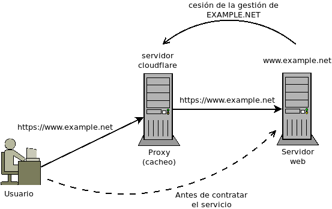

.. _DoS:

*************
Ataques |DoS|
*************
Los ataques |DoS| persiguen la interrupción de un servicio, por lo general:

* aprovechando alguna vulneralidad del propio servicio que provoca que no responda
  bien ante paquetes malformados; o
* generando tráfico malicioso que sobrecarga al servidor.
* sobrepasando los límites de los recursos dedicados a proporcionar el servicio.
  En este segundo caso, es habitual que el ataque se produzca simultáneamente
  desde múltiples fuentes a la vez, lo que se conoce como |DDoS|, esto es, como
  |DoS| distribuido.

Métodos
*******

**SYN flood** (Inundación *SYN*):
   En el protocolo |TCP| el establecimiento de la conexión supone la emisión de
   un primer paquete *SYN*, al que debe responder el servidor con otro paquete
   *SYN/ACK* al cual a su vez responderá de nuevo el cliente con un paquete
   *ACK* que confirma el establecimiento:

   .. image:: files/TCP.png

   Este ataque consiste en enviar múltiples paquetes *SYN*, pero sin responder a
   los paquetes *SYN/ACK* del servidor, de modo que el servidor se queda
   esperando a que el cliente acabe de confirmar la conexión. Puede
   complementarse falseando la |IP| de origen, a fin de que el servidor envíe
   los paquetes *SYN/ACK* a una tercera máquina ajena al ataque, que no
   responderá tampoco, ya que jamás envío un paquete *SYN* a ese servidor. La
   consecuencia del ataque es que el servidor queda esperando durante cierto
   tiempo los mensajes que confirmar las conexiones lo que puede llevar al
   límite de conexiones posibles. Si en el ínterim un cliente legítimo intenta
   comenzar una conexión |TCP|, el servidor será incapaz de responder.

**ICMP flood** (Inundación |ICMP|):
   Consiste en consumir el ancho de banda del servidor enviándole paquetes de
   *ping*. Como en el caso anterior, puede falsearse la |IP| de origen para
   evitar recibir las respuestas.

   Relacionado con el protocolo |ICMP|, aunque no sea un ataque de inundación,
   está el *Ping de la Muerte*, que consiste en crear un paquete |IP| de tamaño
   mayor a 64K. En sistema antiguos, esto provocaba la caída del sistema, pero
   los sistemas modernos suelen estar inmunizados frente a este ataque.

**UDP flood** (Inundación |UDP|):
   Si el objetivo responde con paquetes |ICMP| a paquetes |UDP| enviados a
   puertos en los que no hay servicio, se puede ensayar este ataque que consiste
   en enviar paquetes |UDP| a puertos aleatorios del servidor. Como en los casos
   anteriores, se puede falsear la |IP| de origen para evitar recibir las
   respuestas |ICMP|.

Contramedidas
*************
#. Tener actualizado el servidor para evitar vulnerabilidades.
#. Rebajar la carga del servidor en cuestión utilizando distintas técnicas:

   - Limitar el flujo de paquetes que llegan al servicio mediante el
     cortafuegos.
   - Si el servidor es web, interponer un proxy que cachee tráfico dinámico para
     reducir la carga del servidor al generar las páginas o distribuir la
     consulta entre varios servidores sincronizados.

.. _iptables-limit:

Flujo de paquetes
=================
La técnica de limitar el flujo de paquetes es bastante burda y, simplemente,
asegura que el servidor no colapsará por consumir todos sus recursos en atender
peticiones. Es burda, decimos, porque desecha tráfico indiscriminadamente sin
atender a si es malicioso o no.

Para explicar su implementación, supongamos que tenemos un :ref:`cortafuegos con
iptables <iptables>` que protege al servidor en cuestión y que tiene un regla
que redirige el tráfico web al servidor interno::

   # iptables -t nat -A PREROUTING -i eth0 -p tcp -m multiport --dport http,https -j DNAT --to-destination 192.168.1.1

En estas condiciones (y suponiendo lista blanca), podemos limitir el tráfico que
llega de forma efectivamente del siguiente modo:

.. code-block:: bash

   # SYN flood
   iptables -A FORWARD -i eth0 -p tcp --syn -m limit --limit 5/s --limit-burst 10 -j ACCEPT

   # ICMP flood
   iptables -A INPUT -i eth0 -p icmp --icmp-type echo-request -m limit --limit 1/s -j ACCEPT

   # UDP flood
   iptables -A INPUT -i eth0 -p udp -m limit --limit 10/s -j ACCEPT

   # Conexiones con el servidor WEB
   iptables -A FORWARD -i eth0 -m conntrack --ctstate DNAT -m limit --limit 10/s --limit-burst 15 -j ACCEPT
   iptables -A FORWARD -i eth0 -m conntrack --ctstate DNAT -m connlimit --connlimit-upto 3 -j ACCEPT
   iptables -A FORWARD -i eth0 -m conntrack --ctstate DNAT -m hashlimit \
                               --hashlimit-upto 5/s --hashlimit-burst 10 --haslimit-mode srcip,dstip -j ACCEPT

Por supuesto, los límites dependerán de nuestro ancho de banda y de la capacidad
del servidor, así que es conveniente explicar cómo funcionan.
:program:`iptables` dispone de tres módulos que permiten limitar el flujo de
conexiones:

``limit``
   que establece límites generales para el flujo de paquetes.

``connlimit``
   que establece límites para conexiones simultáneas entre un cliente (o un
   grupo de clientes) y un servidor (o grupo de servidores). Por tanto, no
   limita ratios.

``hashlimit``
   que establece límites para el flujo de forma más granular ya que se pueden
   establecerse distintos criterios actuando conjuntamente (|IP| de origen, |IP|
   destino, puerto de origen o puerto de destino). Si no se establece ninguno
   actúa como ``limit``.

*limit* y *hashlimit* funcionan de forma semenjante: se establece un ratio medio
(``--limit``, ``--hashlimit-upto``) y un límite máximo para las ráfagas
(``--limit-burst``, ``--hashlimit-burst``) y el sistema funciona de forma
semejante a como lo haría un embudo:

.. image:: files/limit.png

El ratio representa el caudal de desagüe, pero el embudo posee un vaso que
permite verter puntualmente más agua hasta un límite máximo. Cada paquete viene
representado en el dibujo por una bolita, de modo que se pueden acomular como
máximo el número de paquetes indicado con ``--*limit-burst``, lo que permite
absorber una ráfaga intensa.

Proxy
=====
Interponer un *proxy* entre los usuarios y el servidor web añade las siguientes
ventajas:

* Puede incluirse en la máquina con el proxy un mecanismo que restrinja las
  conexiones entrantes al servidor web o aquellas que considere maliciosas, tal
  como se hace en el punto anterior.

* Se pueden cachear páginas y recursos en el proxy para aligerar la carga y
  ahorrar ancho de banda del servidor\ [#]_. Esto, sin embargo, se topa con un
  inconveniente si queremos que el tráfico sea cifrado (|HTTP|\ s): el *proxy*
  intermedio es incapaz de entender la información que circula a través de él y,
  en consecuencia, no puede cachear. Por este motivo, el cifrado con el usuario
  se debe hacer en el propio *proxy* y, dependiendo de la confiabilidad de la
  red entre el proxy y el servidor web, hacer un nuevo cifrado entre ellos dos.

Para implementar esta solución, tenemos dos alternativas:

* Implementar una solución personal con *software* apropiado, como una combinación
  de :ref:`haproxy <haproxy>` y :ref:`varnish <varnish>`.

* Recurrir a una solución profesional externa como Cloudflare_.

Solución personal
-----------------

.. todo:: Construir la solución integrada con :program:`haproxy` y
   :program:`varnish`.

.. _dos-cloudflare:

Cloudflare_
-----------
Delegar la protección en Cloudflare_ es bastante sencillo y, además, hay un
`plan gratuito <https://www.cloudflare.com/es-es/plans/>`_. Nuestro esquema de
defensa es el siguiente:

Para lo cual necesitamos:

#. Ser propietarios de un dominio (supongamos que *example.net*).
#. Disponer de una máquina con IP pública e instalar en ella un servidor web
   con certificado autofirmado (si es que deseamos comunicación |HTTP|\ s, que
   será lo normal).
#. Darnos de alta en Cloudflare_ con una cuenta de correo.
#. Añadir la protección de Cloudflare_ para el dominio *example.net* lo cual
   exige la cesión a los servidores |DNS| de Cloudflare_ de la gestión de la
   zona. Para ello, debemos indicar a nuestro agente registrador que los
   servidores de dominio de la zona *example.net* sean los dos que nos indique
   Cloudflare_. Además, Cloudflare_ copiará el contenido de dicha zona, pero
   tendremos que esperar a que se complete la cesión, lo cual puede demorarse
   hasta 24 horas.

.. note:: Cloudflare_ nos proporciona automáticamente un certificado |SSL|
   gratuito válido, por lo que los navegadores de nuestro clientes podrán confiar
   en nuestro sitio.

Una vez activo en Cloudflare_ el dominio *example.net*, podremos alterar los
registros |DNS| de la zona desde el propio gestor de Cloudflare_ e indicar si
queremos que ese nombre esté protegido o no. Por ejemplo, podemos hacer que
*www.example.net* sí esté protegido, pero *example.net* no; para poder acceder
por |SSH| con este segundo nombre a nuestro servidor.

.. seealso:: Una guía con capturas de este proceso se encuentra en
   `creativolandia.com <https://creativolandia.com/cloudflare-tutorial-paso-a-paso-como-configurarlo/>`_

El panel de gestión nos proporciona una configuración de seguridad
predeterminada en el que merece la pena gulismear para adaptarla a nuestras
necesitades.

.. seealso:: En `este tutorial de bloggeris.com
   <https://www.bloggeris.com/tutorial-cloudflare-cdn/>`_ se comentan algunas
   posibilidades de la configuración de seguridad.

Nótese que al situarse Cloudflare_ en medio de la comunicación y dedicarse a
cifrar entre él y el cliente con su propio certificado y a recifrar entre él y
nuestro servidor web, siempre tiene acceso a los contenidos sin cifrar y en
consecuencia cacheará contenidos que se presten a ello (los estáticos, por
ejemplo) en función de las directrices que reciba del servidor (cabeceras
``Cache-Control:`` y ``Expires:``). Por tanto, no sólo asegura el servicio, sino
que sirve para acelerarlo.

Por último, una medida de seguridad adicional que podemos implementar con ayuda
de :ref:`iptables <iptables>` es impedir el acceso a web a nuestro servidor
desde máquinas distintas a la de la red de Cloudflare_. Los rangos de |IP| que
pertenecen a esta compañía `están publicados en su propia página
<https://www.cloudflare.com/ips/>`_.

.. rubric:: Notas al pie

.. [#] Obviamente, esto sería posible si el ancho de banda del proxy es mayor
   que el ancho de banda del servidor.

.. |DoS| replace:: :abbr:`DoS (Denial of Service)`
.. |DDoS| replace:: :abbr:`DDoS (Distributed Denial of Service)`
.. |TCP| replace:: :abbr:`TCP (Transmission Control Protocol)`
.. |UDP| replace:: :abbr:`UDP (User Datagram Protocol)`
.. |ICMP| replace:: :abbr:`ICMP (Internet Control Message Protocol)`
.. |SSL| replace:: :abbr:`SSL (Secure Socket Layer)`

.. _cloudflare: https://www.cloudflare.com/
