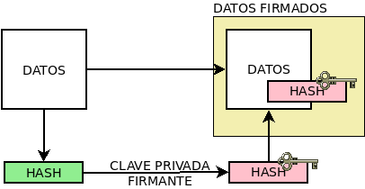

.. _tecnicas-crypto:

**************************
Operaciones criptográficas
**************************
Estudiaremos bajo este epígrafe tres operaciones propies de la criptografía:

- Resumen criptográfico, gracias a las funciones *hash*.
- El cifrado y cuáles son los algoritmos que se usan para ello.
- La firma digital.

Remataremos con un apéndice práctico que indique cómo llevar a cabo estas tareas
en un sistema *Linux*.

.. _hash:

Resumen criptográfico
*********************
Las :dfn:`funciones hash` o :dfn:`funciones digest` o :dfn:`funciones resumen`
son funciones que, dada una entrada, generan una salida, llamada :dfn:`resumen`,
caracterizada porque:

+ siempre tiene el mismo tamaño, con independencia del tamaño de la entrada. Por
  tanto, si la función genera resúmenes de 256 *bits*, cualquier entrada se
  resumirá en 256 *bits*. La consecuencia de ello es que operan en un solo
  sentido, esto es, a partir del original obtenemos su resumen, pero a partir
  del resumen es imposible averiguar cuál era la información de partida.

+ es *determinista*, esto es, para una misma entrada la salida siempre es la
  misma.

+ se minimizan las :dfn:`colisiones`, esto es, se minimiza la posibilidad de
  obtener una misma salida para dos entradas distintas.

La actividad de resumir criptográficamente la información está relacionada con
el :ref:`objetivo de la integridad <crypto-objetivos>`, ya que dadas las
propiedades de las funciones *hash*, es prácticamente imposible que un contenido
que ha sufrido algún cambio, no cambie su resumen. En cualquier caso, aunque
puede hacerse sin más el resumen de un archivo o un flujo de datos, lo habitual
es que esta técnica criptográfica se integre dentro de la :ref:`firma digital
<firma-digital>`.

Entre las funciones de *hash* más conocidas se encuentran:

|MD5|
   Genera un resumen de 128 *bits* representado habitualmente por 32 dígitos
   hexadecimales. Es muy común usarlo como comprobación de la integridad de
   ficheros. Su seguridad está en entredicho, ya que presenta problemas de
   colisiones.

|SHA|
   Es una familia de funciones *hash* que ha ido sufriendo diversas revisiones:
   |SHA|\ -0, |SHA|\ -1, |SHA|\ -2 y |SHA|\ -3. Tanto |SHA|\ -0 como |SHA|\ -1
   generan resúmenes de 160 *bits*. Ambas se consideran inseguras y se
   desaconseja su uso. Para paliarlo, se desarrolló |SHA|\ -2, que implementa
   funciones *hash* de 224, 256, 364 y 512 *bits*. Se las conoce habitualmente
   como |SHA|\ -224, |SHA|\ -256, |SHA|\ -364 y |SHA|\ -512. |SHA|\ -3, por su
   parte, cambia internamente los algoritmos, pero está pensada para generar
   resúmenes de la misma longitud que |SHA|\ -2.

Cifrado
*******
Por :dfn:`cifrado` nos referimos particularmente a la acción de ofuscar cierta
información con el objeto de que pueda ser posteriormente desofuscada.
Si se ofusca con la intención de que sólo pueda deshacerla un tercero
expresamente autorizado, entonces el cifrado se encamina a la *privacidad* y
tenemos propiamente aquello que comúnmente se refiere como *cifrado*. En cambio,
si cualquier tercero puede desofuscar, el propósito no es la *privacidad*, y
entraríamos en el terreno de la :ref:`firma digital <firma-digital>`, que
trataremos más adelante.

Ya se ha comentado que los algoritmos modernos de cifrado se basan en el
secreto de la clave y no en el secreto del propio algoritmo, por lo que nos
centraremos en los algoritmos basados en clave. Atendiendo a ella hay dos tipos
de algoritmos.

**De clave simétrica**
   También conocidos como :dfn:`de clave privada` o de :dfn:`clave única`. Son
   aquellos en que se usa la misma clave para cifrar y descifrar.

**De clave asimétrica**
   También conocidos como :dfn:`de clave pública` o :dfn:`de doble clave`. Son
   aquellos que emplean una pareja de claves, de manera que si una se usa para
   cifrar la otra sirve para descifrar los mensajes cifrados con la primera.

Son comunes las técnicas que usan combinadamente clave simétrica y asimétrica,
lo cual se conoce como :ref:`cifrado híbrido <hibrido>`.

Cifrado simétrico
=================
En este tipo de cifrado se usa la misma clave tanto para cifrar como para
descifrar. Cuando las dos partes se encuentran alejadas, ese, precisamente, es
su punto débil, ya que exige que la clave se encuentre en ambos extremos con
anterioridad a la comunicación, lo cual puede lograrse:

- Encontrándose físicamente ambas partes para intercambiar en mano la clave,
  lo cual es costoso en tiempo y en recursos.
- Transmitiendo previamente la clave en claro, lo cual es sumamente arriesgado
  porque puede provocar su intercepción y la inutilidad del cifrado posterior.

Obviando lo anterior, el factor decisivo en la robustez de la clave es su
longitud: cuanto más larga sea, más difícil es averiguarla por fuerza bruta.
Por ejemplo, una clave de **8** *bits* sólo puede tener 2\ :sup:`8`, o sea,
**256** valores distintos, lo que implica que podría adivinarse con un máximo
de **256** intentos.

Algunos algoritmos de cifrado simétrico muy conocidos son:

|DES|
   Considerado actualmente inseguro para la capacidad computacional de los
   ordenadores modernos, ya que tiene una longitud de sólo **56** *bits*.
   Su sucesor directo es el 3\ |DES| (Triple |DES|) que usa el triple de
   longitud para la clave (**168** bits), aunque también se ha ido desplazando
   en favor de otros algoritmos.

|AES|
   Sustituyó al algoritmo anterior y tiene una longitud de **256** *bits*. Es
   más rápido y, además, no se le conocen vulnerabilidades. Es modernamente el
   algoritmo de clave simétrica más utilizado\ [#]_.
   
Existen otros algoritmos como `Twofish
<https://es.wikipedia.org/wiki/Twofish>`_, `Serpent
<https://es.wikipedia.org/wiki/Serpent>`_
o `Blowfish <https://es.wikipedia.org/wiki/Blowfish>`_.

.. _asimetrico:

Cifrado asimétrico
==================
Se basa en el uso de una pareja de claves, una privada y otra pública generada
a partir de ella, que se caracterizan por que lo que se haya cifrado con una
sólo es posible descifrarlo con la otra. Por ello:

+ La clave **privada** debe mantenerla en secreto su propietario.
+ La clave **pública** se comunica a los demás.

De este modo, cuando se desease enviar un mensaje secreto a un destinatario, se
podría usar la clave *pública* de éste, ya que tal mensaje sólo podría
ser descifrado usando su clave *privada* correspondiente, que sólo está en
posesión del destinatario. Por ello, el cifrado con la clave *pública*,
garantizaría la privacidad.

Por otra parte, si un emisor usase su clave **privada** para cifrar, el mensaje
podría descifrarse con su clave *pública* correspondiente. Como la clave
*pública* es, eso mismo, pública, no sirve para salvaguardar ninguna privacidad,
pero sí para asegurar que el emisor del mensaje es el dueño de las claves.
Afinaremos esto más adelante\ [#]_.

Los algoritmos más conocidos de cifrado asimétrico son:

|RSA|
   Es el primer sistema criptográfico de clave asimétrica y aún se considera
   válido (esto es, suficientemente seguro) tanto para cifrar y como firmar
   digitalmente. Por lo general, utiliza claves con una longitud entre 1024 y
   4096 *bits*.

   Los :ref:`certificados digitales <cert-digital>` X.509 y |PGP| suelen incluir
   claves generadas con este algoritmo\ [#]_.

|DSA|
   Es otro sistema criptográfico de clave asimétrica que en la actualidad se
   considera débil, por lo que se desaconseja su uso para cifrar información\
   [#]_. Sus claves tienen una longitud entre 512 y 1024 *bits*.

   Variantes de este sistema que mejoran la fortaleza de las claves y, por
   tanto, permiten su uso para cifrado, son:

   * |ECDSA|, que usa `criptografía de curva elíptica
     <https://es.wikipedia.org/wiki/Criptograf%C3%ADa_de_curva_el%C3%ADptica>`_.

   * |EdDSA|, que usa también criptografía de curva elíptica. y se desarrolló
     para mejorar la velocidad de cifrado sin sacrificar velocidad. Un tipo
     particular de este sistema es *Ed22519*, que permiten usar las últimas
     versiones de :program:`openssh`.

La desventaja fundamental del cifrado asimétrico frente al simétrico es su costo
computacional: para un mismo nivel de seguridad requiere claves más largas y,
además, para una misma longitud de clave es más costoso en tiempo. Este hecho
hace que en la práctica el cifrado asimétrico sólo se utilice para cifrar una
cantidad de información muy pequeña.

.. _hibrido:

Cifrado híbrido
===============
El :dfn:`cifrado híbrido` consiste en el uso combinado de cifrado simétrico y
asimétrico para sortear:

+ La debilidad intrínseca de requerir la clave simétrica en ambos extremos de la
  comunicación.
+ El mayor costo computacional del cifrado asimétrico, que lo hace sólo apto
  para cifrar poca información.

Se fundamenta en cifrar la información con un algoritmo simétrico y
reservar el costoso cifrado asimétrico exclusivamente para ofuscar la clave
simétrica utilizada. De este modo, para el grueso (la propia información) se usa
el cifrado más económico; y el costoso se reserva para una cantidad infima de
datos (la clave simétrica que muy posiblemente no pase de 512 *bytes*). Así
pues:

+ Si queremos intercambiar un archivo, generamos primero una clave simétrica con
  la que ciframos el archivo y luego ciframos tal clave con la clave pública de
  aquel al que queremos enviar el archivo. Hecho esto, remitimos el conjunto
  compùesto por archivo cifrado y clave simétrica cifrada.

  .. _clave-sesion:

+ En un comunicación, utilizamos en una primera fase cifrado asimétrico oon el
  fin de establecer un canal seguro por el cual transmitir al otro extremo una
  clave simétrica, denominada :dfn:`clave de sesión`. Una vez que esta clave
  esté en ambos extremos, podemos proseguir la comunicación utilizando cifrado
  simétrico. Esta es la base de todos los :ref:`protocolos seguros de red
  <proto-seguro>`.

.. todo:: Incluir en la disertación el `protocolo criptográfico de
   Diffie-Hellman <https://es.wikipedia.org/wiki/Diffie-Hellman>`_. Puede
   tomarse como referencia `esta respuesta en stackexchange.com
   <https://crypto.stackexchange.com/a/6309>`_.

.. Plantearlo como un problema de intercambio de la clave simétrica y dos
   soluciones: el intercambio RSA (problema de la persistencia de la clave
   privada) y el intercambio Diffie-Hellman (problema de MITM). Información de:

   - https://security.stackexchange.com/a/76907
   - https://security.stackexchange.com/a/205689
   - https://www.ccn.cni.es/index.php/es/docman/documentos-publicos/boletines-pytec/378-pildorapytec-nov2020-seguridad-tls/file
   - https://security.stackexchange.com/a/41226
   - https://ciberseguridad.com/guias/recursos/intercambio-claves-diffie-hellman/
   - https://crypto.stackexchange.com/a/6309

Conclusiones
============
En vista de todo lo ya expuesto, lo adecuado al cifrar es usar:

a. Cifrado **simétrico** sobre:

   + Información que no se requiere transmitir (p.e. :ref:`cifrado de disco <disk-encrypt>`).
   + Información que se transmite siempre que la clave simétrica se transmita
     cifrada asimétricamente, lo cual ya hemos definido como :ref:`cifrado híbrido <hibrido>`.

b. Cifrado **asimétrico** sobre una muy pequeña cantidad de información:

   + Una clave simétrica que se desea transmitir, que es el complemento del
     :ref:`cifrado híbrido <hibrido>` que se acaba de citar. Para cifrar la
     clave simétrica se utiliza la clave pública de su destinatario legítimo ,
     puesto que sólo él será capaz de descifrarla.
   + Un resumen generado con una función *hash*. Este acción de cifrado, sin
     embargo, es propia de la *firma digital*; y la entenderemos a continuación.

.. _firma-digital:

Firma digital
*************
En el mundo *analógico*, una firma manuscrita sobre papel es una marca que
certifica que los términos expresados en un texto son ratificados por los
firmantes. Por tanto, dejando al margen posibles falsificaciones, certifica la
identidad de los participantes (autenticidad) y el contenido del texto
(integridad).

Correspondientemente, una :dfn:`firma digital` (o :dfn:`firma electrónica`) es
una técnica criptográfica que permite asegurar que unos datos (un archivo, un
mensaje de correo, un flujo de datos) no han cambiado desde el momento en que
los validaron uno o más suscribientes. Por ejemplo, el emisor de un correo
electrónico puede firmar un mensaje para que el destinatario puede estar seguro
de que él es el autor del mensaje y de que éste no ha sido alterado durante el
proceso de comunicación.

La *firma digital* no es una operación atómica como las dos anteriores (resumir
y cifrar), sino un conjunto de acciones de resumen y cifrado que permiten
asegurar la identidad del emisor y la integridad del mensaje. Esquemáticamente,
firmar consiste en:

+ Obtener :ref:`un resumen <hash>` de los datos mediante una función *hash*.
+ Cifrar tal resumen con la clave privada del firmante.
+ Añadir metainformacion relevante sobre la operación como el momento de
  tiempo en que se lleva a cabo o la clave pública del firmante.
+ Transmitir (o almacenar) el conjunto de datos originales, resumen cifrado y
  metainformación. 

Ante esto, un tercero (por ejemplo, el destinatario de un mensaje de correo
firmado), es capaz de certificar que el origen es quien dice ser, ya que
descifrará el resumen con la clave pública de éste y, por otra parte, podrá
comprobar si los datos conservan su integridad gracias al propio resumen
descifrado\ [#]_.

Apéndice práctico
*****************
Para poner en práctica los conceptos anteriores utilizaremos fundamentalmente
Open\ |SSL|. También podríamos usar |GnuPG|, que implementa el estándar `OpenPGP
<https://www.openpgp.org/>`_; pero, dado que este estándar se usa
fundamentalmente en el correo electrónico, introduciremos la orden en el
:ref:`epígrafe correspondiente <email-seguro>`.

.. _entropia:

.. note:: En caso de que hagamos pruebas en una máquina virtual puede que sea
   conveniente aumentar la entropía del sistema para mejorar y acelerar la
   creación de claves asimétricas. Para lograrlo puede obrarse del siguiente
   modo\ [#]_::

      $ cat /proc/sys/kernel/random/entropy_avail  # Entropía inicial
      234
      # apt install rng-tools
      # echo 'HRNGDEVICE=/dev/urandom' >> /etc/default/rng-tools
      # echo 'RNGDOPTIONS="--fill-watermark=90%"' >> /etc/default/rng-tools
      # invoke-rc.d rng-tools start
      # cat /proc/sys/kernel/random/entropy_avail
      2159

.. index:: md5sum
.. index:: shasum, sha256sum, sha384sum, sha512sum

.. _md5sum:
.. _shasum:

Resúmenes
=========
Para la generación de resúmenes *hash* de ficheros y flujos de texto, existen
dos órdenes fundamentales: :command:`md5sum` y la familia de comandos
:program:`shasum` (:command:`sha256sum`, :command:`sha384sum`,
:command:`sha512sum`), que comparten una misma interfaz, con lo que es
indiferente ilustrar el uso de una u otra orden. Suelen encontrarse todas
instaldas en el sistema.

La generación del resumen puede hacerse del siguiente modo::

   $ echo "Hola, caracola" > saludo1.txt
   $ md5sum saludo1.txt
   b18a245aba5384920d7f6a488d725181  saludo1.txt

.. note:: Si se incluyen varios ficheros como argumento, se calculará el resumen
   de cada uno de ellos.

También es posible calcular el resumen de un flujo de datos::

   $ echo "Hola, caracola" | sha256sum
   d261be2aa264d38cad717fa8493dacc0b3f33f949869d39ecf7611689fb617ad  -

Habitualmente, los resúmenes generados se almacenan, a fin de que puedan servir
más adelante para comprobar la integridad de los ficheros::

   $ md5sum saludo1.txt saludo2.txt > saludos.md5

Con posterioridad, podrá comprobarse la integridad del siguiente modo\ [#]_::

   $ LC_ALL=C md5sum -c saludos.md5
   saludo1.txt: OK
   saludo2.txt: OK

.. note:: Si se almacenó el resumen de un flujo de datos (obsérvese que aparece
   un "\-", en vez de el nombre del fichero), puede comprobarse que otro flujo es
   el mismo pasándolo a través de la entrada estándar::

      $ echo "Hola, caracola" | md5sum > flujo.md5
      $ echo "Hola, caracola" | LC_ALL=C md5sum -c flujo.md5
      -: OK

También es posible utilizar para este fin (aunque no es lo habitual) las
herramientas que usaremos después para ilustrar el cifrado y la firma digital:

* :ref:`GnuPG <gnupg>`::

      $ gpg --print-md sha512 fichero.txt

  e incluso hay una opción que calcula los resúmenes según todos los algoritmos
  disponibles::

      $ gpg --print-mds fichero.txt

* :ref:`OpenSSL <openssl>`::

      $ openssl dgst -sha512 fichero.txt

.. _openssl:

Cifrado simétrico
-----------------
Una forma de llevarlo a cabo es esta::

   $ openssl enc -aes256 -pbkdf2 -a -in fichero.txt -out fichero.txt.enc

que utiliza |AES|\ -256 para el proceso y genera un cifrado en `base64
<https://es.wikipedia.org/wiki/Base64>`_ gracias a la opción `-a`. Para
descifrar basta con añadir la opción :kbd:`-d` y, obviamente, utilizar como
entrada el texto cifrado::

   $ openssl enc -aes256 -a -d -in fichero.txt.enc -out fichero-recuperado.txt

.. note:: Tanto :kbd:`-in` como :kbd:`-out` son opcionales y, si no se
   especifican, se entenderá que la entrada es la entrada estándar y la salida
   la salida estándar.

.. note:: La clave simétrica para el cifrado/descifrado se pide de forma
   interactiva. Puede proporcionarse en la propia orden incluyendo la opción
   :kbd:`-pass`::

      $ openssl enc -aes256 -pbkdf2 -a -pass pass:clave-secreta -in fichero.txt -out fichero.txt.enc

.. _openssl-asi:

Cifrado asimétrico
------------------
Llevarlo a cabo requiere generar un par de claves (|RSA| en concreto\ [#]_)::

   # openssl genrsa -aes128 -out privkey.pem 4096
   # openssl rsa -in privkey.pem -pubout -out pubkey.pem

Las órdenes generan un par de claves |RSA| (:file:`privkey.pem` y
:file:`pubkey.pem`) de 4096 *bits*. Para proteger la clave privada con una
contraseña (esto es, con una clave simétrica) hemos usado la opción
:kbd:`-aes128`. Esto último es un simple mecanismo de seguridad para que sea
imposible usar la clave privada sin conocer esta contraseña. Así, en caso de
robo, el ladrón aún deberá averiguarla.

.. note:: Las claves que se piden interactivamente pueden pasarse a través de
   las opciones :kbd:`-passin` o :kbd:`-passout` (vease :manpage:`openssl(1ssl)`
   para más información)

.. _formato-pem:

.. note:: Ambas claves usan para su información `notación ASN.1
   <https://es.wikipedia.org/wiki/ASN.1>`_ codificada en el formato binario
   |DER| que a continuación se recodifica en Base64_ para que resulte un archivo
   imprimible. Lo mismo sucede con certificados digitales, archivos de firmas,
   etc. que iremos viendo a lo largo de este apéndice. Es por ello que todos
   los archivos tienen un aspecto semejante al consultarse con un :ref:`cat
   <cat>`::

      $ cat pukey.pem
      -----BEGIN PUBLIC KEY-----
      MIIBIjANBgkqhkiG9w0BAQEFAAOCAQ8AMIIBCgKCAQEAxEUMJf+6dKU85GxWtbZv
      gSwYqCMfydr7Pj0zNEd4QYEVnkqIny3qkreC5iBX1Afg1yl2XYDCI0IJW8iQ6e24
      jS0FZkkHkbOjGMNwpyevdTNEItu0njgrl34HQ+fN89kauZQQUd32uaBW+QX4+zfl
      pvRscvFNHkd90uLOzVymvx7n9xdNx+AScDdVpDz6Q/I9J2nB5YUSOemQiS3NpOLv
      R7uEae0cPpEczuqX2kJzhxf+A/yteaJIR3fwZ4zcCNwsDRBhLSwXtYsYywdtNvf6
      A1ZgmYPr7ZbqlWvd4BfROZNZlvm+OOVN1B51Z1GoSBGOTu/A6ZiRZGArveRUujtD
      JwIDAQAB
      -----END PUBLIC KEY-----

   esto es, unas marcas de comienzo y final cuya leyenda exacta depende de qué
   se haya codificado (en el ejemplo, una clave pública) y una serie de
   caracteres imprimibles que son la citada Base64_ del formato binario |DER|.
   En ocasiones :command:`openssl` nos ofrece un modo de hacer legible la
   información almacenada y para el caso de claves |RSA|, lo hace::

      $ openssl rsa -in privkey.pem -text -noout
      $ openssl rsa -in pubkey.pem -pubin -text -noout

   Obsérvese que ambas claves son pareja porque tienen el mismo módulo (que se
   puede consultar independientemente sustituyendo :kbd:`-text` pòr
   :kbd:`-modulus`)\ [#]_.

Con ellas podemos cifrar y descifrar **pequeños**\ [#]_ ficheros. Usando la
clave pública para cifrar y la privada para descifrar::

   # echo "Hola" > saludo.txt
   # openssl rsautl -encrypt -inkey pubkey.pem -pubin -in saludo.txt -out saludo.enc
   # openssl rsautl -decrypt -inkey privkey.pem -in saludo.enc
   Hola

¿Podemos cifrar con la privada y descifrar con la pública? También::

   # openssl rsautl -sign -inkey privkey.pem -in saludo.txt -out saludo.enc
   # openssl rsautl -verify -inkey pubkey.pem -pubin -in saludo.enc
   Hola

.. note:: Si en vez de un un simple par de claves, tenemos un :ref:`certificado
   digital <cert-digital>`, aún podremos realizar estas operaciones sustituyendo
   :kbd:`-pubin` por :kbd:`-certin`

Firma digital
-------------
Partiendo de las claves |RSA| ya generadas en el apartado anterior
(:file:`privkey.pem`, :file:`pubkey.pem`), podemos hacer una primera
aproximación tomando la :ref:`descripción de lo que es la firma digital
<firma-digital>`::

   $ echo "Este es el contenido del fichero que firmo" > fichero.txt
   $ sha256sum fichero.txt | tee /dev/tty | openssl rsautl -sign -inkey privkey.pem -out fichero.sign
   47ebcc00b179c0f1fc8f45fec4a3e6a55fbb1aeddd8a5bb6ee52c5d7f57d1d3a  fichero.txt

Ya tenemos el archivo original (:file:`fichero.txt`) y la firma
(:file:`fichero.sign`) generada con la clave privada. Con ellos dos y la clave
publica correspondiente, podemos comprobar integridad e identidad::

   $ sha256sum fichero.txt
   47ebcc00b179c0f1fc8f45fec4a3e6a55fbb1aeddd8a5bb6ee52c5d7f57d1d3a  fichero.txt
   $ openssl rsautl -verify -inkey pubkey.pem -pubin -in fichero.sign
   47ebcc00b179c0f1fc8f45fec4a3e6a55fbb1aeddd8a5bb6ee52c5d7f57d1d3a  fichero.txt

Dado que coincide el resumen del archivo con la firma descifrada con la clave
pública, podemos concluir que el archivo no ha cambiado y que lo certificó el
propietario de la clave. En cualquier caso esto es sólo una aproximación al
concepto ya que en una firma también es importante cuándo se produjo y con esta
firma manual es imposible saberlo.

En realidad, para firmar con más comodidad, aunque nos abstraigamos del
concepto::

   $ openssl dgst -sha256 -sign privkey.pem -out fichero.sign fichero.txt

Y para verificar la firma::

   $ openssl dgst -sha256 -verify pubkey.pem -signature fichero.sign fichero.txt 
   Verified OK

.. note:: Cuando lo que se tiene no es un simple par de claves, sino un
   :ref:`certificado digital <cert-digital>` aún puede hacerse este proceso
   extrayendo previamente la clave pública del certificado::

      $ openssl x509 -in micert.pem -pubkey -nooout > pubkey.pem

   aunque lo más adecuado, en realidad, sería firmar con :ref:`S/MIME <smime>` y
   :ref:`OpenPGP <gnupg>`.

.. rubric:: Notas al pie

.. [#] |AES| fue el ganador de un concurso organizado en 1997 por la |NIST| para
   escoger un nuevo algoritmo de cifrado simétrico en sustitución de |DES|. De
   hecho, su nombre original es *Rijndael*, el nombre |AES| lo tomó de haberse
   constituido como el estándar.
.. [#] Se ha usado en este párrafo y el anterior el condicional, porque
   teóricamente esto es así. En la práctica, el cifrado con clave asimétrica es
   muy costoso comptuacionalmente, así que se recurre a una argucia (el :ref:`cifrado
   híbrido <hibrido>`) pero reducir al máximo la cantidad de información
   que se cifra con clave asimétrica.
.. [#] Pero no es obligatorio. Puedo probar a generar un certificado partiendo
   de una clave privada |ECDSA| generada con Open\ |SSL| como se ilustra en el
   :ref:`epígrafe en que se describe cómo convertir claves SSH en un formato
   inteligible por OpenSSL <openssh-openssl>` 
.. [#] De hecho, `OpenSSH <https://www.openssh.com/>`_, para su versión 7,
   `deshabilitó el uso de DSA
   <https://www.gentoo.org/support/news-items/2015-08-13-openssh-weak-keys.html>`_.
.. [#] Pero para que todo esto no haga aguas es necesario confiar en que la clave
   pública es de aquel de quien parece ser. Resolveremos este último escollo al
   introducir el concepto de :ref:`certificado digital <cert-digital>`.
.. [#] Usar, sin embargo, el propio kernel para la generación de la
   entropía no es muy recomendable. Debería usarse el dispositivo
   hardware (/dev/hwrng), pero en la máquina virtual es posible que
   no esté. Para :program:`qemu` véase
   `su wiki <https://wiki.qemu.org/Features/VirtIORNG>`_.
.. [#] Se fuerza a que la orden se ejecute en inglés, para que el resultado se
   exprese como *OK* o *FAILED*. En castellano, la leyenda se expresa de forma
   muy farragosa.
.. [#] Podríamos también generar claves de curva elíptica. Hay algún ejemplo
   en el :ref:`epígrafe en que se comparan las claves SSH con las generadas por
   OpenSSL <openssh-openssl>`.`
.. [#] La clave pública se compone de un módulo y un exponente
.. [#] Recordemos que el cifrado asimétrico está pensado para aplicarse sobre
   una cantidad muy pequeña de información (un resumen o una clave simétrica).
   La orden, de utilidad únicamente teórica, nos permite usar cifrado
   asimétrico puro sobre un archivo arbitrario, pero si este es grande generará
   un error (*data too large for key size*). Lo realista si queremos pasar a un
   tercero el archivo es utilizar cifrado híbrido (p.e. aplicando el :ref:`estándar
   S/MIME <smime>` con el proprio :command:`openssl`).

.. |DES| replace:: :abbr:`DES (Data Encryption Standard)`
.. |AES| replace:: :abbr:`AES (Advanced Encryption Standard)`
.. |RSA| replace:: :abbr:`RSA (Rivest, Shamir y Adleman)`
.. |DSA| replace:: :abbr:`DSA (Digital Signature Algorithm)`
.. |ECDSA| replace:: :abbr:`ECDSA (Elliptic Curve Digital Signature Algorithm)`
.. |EdDSA| replace:: :abbr:`EdDSA (EDwards-curve Curve Digital Signature Algorithm)`
.. |GnuPG| replace:: :abbr:`GnuPG (GNU Provacy Guard)`
.. |MD5| replace:: :abbr:`MD5 (Message Digest Algorithm 5)`
.. |SHA| replace:: :abbr:`SHA (sechure Hash Algorithm)`
.. |PGP| replace:: :abbr:`PGP (Pretty Good Privacy)`
.. |SSL| replace:: :abbr:`SSL (Secure Socket Layer)`
.. |FNMT| replace:: :abbr:`FNMT (Fabrica Nacional de Moneda y Timbre)`
.. |PKCS| replace:: :abbr:`PKCS (Public-Key Cryptography Standards)`
.. |DER| replace:: :abbr:`DER (Distinguised Encoding Rules)`
.. |NIST| replace:: :abbr:`NIST (National Institute of Standards and Technology)`

.. _GnuPG: https://www.gnupg.org/
.. _keyservers: http://www.keyserver.net/
.. _Base64: https://es.wikipedia.org/wiki/Base64
