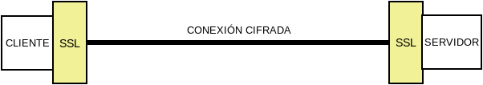
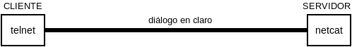
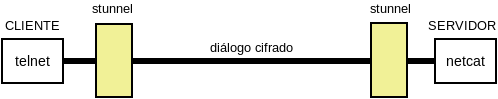

Aplicaciones de la criptografía
*******************************
Hasta este epígrafe se han ilustrado los principios básicos de la criptografía y
las órdenes básicas para llevarlos a cabo. A partir de ahora, el tema estará
dedicado a exponer aplicaciones prácticas reales de la criptografía en el
cifrado, la comprobación de la integridad de los datos o la certificación de la
identidad del otro extremo (véanse los :ref:`objetivos de la criptografía
<crypto-objetivos>`).

Trataremos tres:

* La :ref:`firma digital <firma-digital>`.
* El :ref:`cifrado de discos <disk-encrypt>`.
* Los :ref:`protocolos seguros de red <ssl>`.

.. _firma-digital:

Firma digital
=============
Una *firma digital* es al mundo digital lo que la firma manuscrita al papel, la
cual certifica la identidad de quien firma y que se está de acuerdo con los
términos de lo firmado.

Para llevar a cabo la *firma digital* de unos datos (un fichero o un mensaje de
correo, por ejemplo) se obra del siguiente modo:

+ Se obtiene un resumen de los datos mediante una función *hash*.
+ Se cifra tal resumen con la clave privada del firmante.
+ Se envían los datos (o se almacena el fichero) junto al resumen cifrado.

Ante esto, un tercero (por ejemplo, el destinatario de un mensaje de correo
firmado), es capaz de certificar que el origen es quien dice ser, ya que
descifrará el resumen con la clave pública de éste y, por otra parte, podrá
comprobar si los datos conservan su integridad gracias al propio resumen
descifrado.

Conceptualmente, pues, es bastente sencillo y podemos ilustrar los pasos
anteriores haciendo uso de la :ref:`orden gpg <gnupg.1>`::

   $ echo "Este es el contenido del fichero que firmo" > fichero.txt
   $ gpg --detach-sign --default-key mi_cuenta@example.com -o fichero.sig fichero.txt

De esta manera tenemos un fichero original (:file:`fichero.txt`) y su resumen
cifrado digitalmente con nuestra clave privada en :file:`fichero.sign`. Si
analizamos el fichero de firma::

   $ gpg --list-packets fichero.sign
   :signature packet: algo 1, keyid 53175AA29C972B7B
           version 4, created 1543050622, md5len 0, sigclass 0x00
           digest algo 10, begin of digest 04 9e
           hashed subpkt 33 len 21 (issuer fpr v4 040968BBC05C39A4DD2A43BD53175AA29C972B7B)                                                  
           hashed subpkt 2 len 4 (sig created 2018-11-24)
           hashed subpkt 28 len 23 (signer's user ID)
           subpkt 16 len 8 (issuer key ID 53175AA29C972B7B)
           data: [3071 bits]

veremos algunas características de la firma, como:

* qué algoritmo de clave simétrica se usó, el **1**, que se corresponde con una
  clave asimétrica |RSA|, válida tanto para firma como para cifrado. El
  significado de los códigos puede encontrarse en el :rfc:`4880`, y en concreto
  en la `sección 9.1 <https://tools.ietf.org/html/rfc4880#section-9.1>`_.

* qué clave se usó: la *53175AA29C972B7B*, que efectivamente es la nuestra:

  .. code-block:: console
     :emphasize-lines: 4

     $ gpg --keyid-format long -list-keys
     /home/usuario/.gnupg/pubring.kbx
     --------------------------------
     pub   rsa3072/53175AA29C972B7B 2018-11-21 [SC] [expires: 2020-11-20]
           040968BBC05C39A4DD2A43BD53175AA29C972B7B
     uid                 [ unknown] Soy el que soy <mi_cuenta@example.com>
           sub   rsa3072/4B1F09C9B84F038E 2018-11-21 [E] [expires: 2020-11-20]

* con qué algoritmo se resumió el fichero, el **10**, que es *SHA512* según 
  `la sección 9.4 <https://tools.ietf.org/html/rfc4880#section-9.4>`_ del
  :rfc:`4880`.

Si hacemos llegar **ambos** archivos a un tercero, y éste posee nuestra clave
pública, podrá verificar nuestra identidad gracias al cifrado de la firma y la
integridad del fichero gracias al resumen que contiene esta::

   $ gpg --verify fichero.sign fichero.txt
   [...]
   Primary key fingerprint: 0409 68BB C05C 39A4 DD2A  43BD 5317 5AA2 9C97 2B7B
   $ echo $?
   0

Todo parece perfecto... pero hay un pequeño problema. ¿Cómo está seguro el
tercero de que la clave pública que posee es realmente de quien dice ser y no
otro que suplanta su identidad? Para subsanar este último escollo existen los
*certificados digitales*.

.. note:: Retenga el adagio de que la clave pública del destinatario se usa para
   cifrar, y la clave privada del emisor para firmar.

.. rubric:: Certificado digital

.. note:: Tratamos los *certificados digitales de clave pública*, por lo que a
   partir de ahora hablaremos, simplemente, de *certificados digitales*.

Un :dfn:`certificado digital` es un documento firmado digitalmente por una
*autoridad de certificación* que asocia unos datos de identificación con una
clave pública. Esto, pues, resuelve el problema de suplantacion: sabemos que la
clave pública pertenece a quien dice pertenecer, porque un tercero, la autoridad
de certificación, en el que tenemos absoluta confianza, lo acredita y ha firmado
para ello.

Esquematizando, pues, un *certificado digital* se compone:

* Una pareja de claves.
* La identidad del propietario de dichas claves.
* La firma digital de una autoridad de certificación sobre la clave pública y
  los datos identificativos.

La verificación de unos datos firmados con certificado añade un paso previo a lo
explicado anteriormente:

+ De la firma digital de los datos, se deduce la clave pública del autor de
  estos y el hecho de estar firmada por la autoridad de certificacación
  asegura que esta clave pública es realmente del autor.
+ Se usa el resumen contenido en la firma para verificar la integridad del
  mensaje.

Así todo queda resuelto. Ahora bien, ¿quién es esta autoridad de certificación y
por qué es digna de confianza?

.. todo:: Actividad de firma digital en mensajes de correo con Thunderbird_ y su
   plugin Enigmail_. Las claves deben haberse generarse con :program:`gnupg` y
   haberse subido la clave pública a un servidor de claves. Suele tardar en
   propagarse, así que conviene hacerlo en dos días.

.. rubric:: Autoridad de certificación

Una :dfn:`autoridad de certificación` (a partir de ahora, |CA|) es aquella
entidad de confianza encargada de emitir (y revocar) certificados digitales. El
proceso típico de emisión es el siguiente:

#. El interesado realiza una solicitud a la |CA|, por lo general a través de
   un servicio web, en que se recogen los datos identificativos y se genera una
   pareja de claves. Ahora bien, como la identidad del interesado no ha podido
   verificarse, la |CA| genera una petición |CSR|.

#. El interesado se acerca físicamente a la oficina de una |RA| (autoridad de
   registro) a fin de confirmar ante ésta que es quien dice ser.

#. La |RA| notifica a la |CA| tal verificación, con lo que esta pone a
   disposición del interesado (p.e. a través del servicio web que utilizó
   primeramente) el certificado solicitado.

#. El interesado obtiene el certificado y lo instala en su sistema (navegador,
   cliente de correo, etc).

.. image:: files/certificados.png

Para llevar a cabo esta tarea la propia |CA| dispone de un certificado, de
manera que con su clave privada firma los certificados que emite. La
infraestructura de autoridades, no obstante, no es plana, sino jerárquica
Cuando. la |CA| es una |CA| raíz, este certificado es autofirmado, lo que
significa que nadie certifica digitalmente la identidad de la |CA|. Ahora bien,
una entidad puede generar certificados finales (para una persona, para un
servidor web o para una aplicación *software*) o certificados para |CA|
subordinadas, las cuales a su vez podrán firmar certificados.

.. note:: En España la autoridad de certificación que usan la inmensa mayoría de
   las administraciones públicas es la `Fábrica Nacional de Moneda y Timbre
   <http://www.cert.fnmt.es>`_.  Muchas particulares españoles también usan esta
   autoridad para sus certificados personales, gracias a una `extensa red de
   oficinas de registro <http://mapaoficinascert.appspot.com/>`_ (|RA|) que
   incluye oficinas de la seguridad social, de la agencia tributaria o
   ayuntamientos.

Un ejemplo de esta jerarquía es el :ref:`certificado gratuito para servidores
web <certbot>`. Lo emite LetsEncrypt_, cuyo certificado a su vez esta firmado
por `Digital Signature Trust`_, que sí es una |CA| raíz::

   $ openssl x509 -in cert.pem -text -noout | egrep -E '^\s*(?Issuer|Subject):'
           Issuer: O = Digital Signature Trust Co., CN = DST Root CA X3
           Subject: C = US, O = Let's Encrypt, CN = Let's Encrypt Authority X3

Para que los sistemas puedan verificar la autenticidad de un certificado es
necesario que dispongan de las claves públicas de las |CA|. Por ello, las
aplicaciones o, más modernamente, los propios sistemas operativos, traen las
claves públicas de las autoridades que consideran de confianza. Por ejemplo,
*debian*, incluye el paquete `ca-certificates
<https://packages.debian.org/search?keywords=ca-certificates>`_, que las
contiene.

Por último, es necesario señalar que, para asegurar la validez de un
certificado, no basta sólo con comprobar si el certificado no ha caducado y
hacer uso de la firma pública de la |CA|. Un certificado puede haberse revocado
antes de caducar y, en consecuencia, dejar de ser válido antes de tiempo. Por
eso, las |CA| deben ofrecer un servicio para la comprobación de estas
revocaciones.

.. seealso:: Para ver cómo firmar mensajes de correo en :ref:`mutt <mutt>` con
   el certificado de la |FNMT|, puede consultar :ref:`este epígrafe <mutt-fnmt>`.

.. _disk-encrypt:

Cifrado de discos
=================
Aunque ya hemos ilustrado :ref:`cómo cifrar un fichero individual <gnupg.1>`,
este procedimiento es absolutamente impracticable, ya que exige cada vez que se
quiera realizar la modificación del contenido, un descrifrado y un cifrado
manual. En la práctica, lo que se hace es utilizar sistemas de ficheros
virtuales que almacenan cifrada la información y que al montarse sobre un
directorio, muestran la información descifrada. El montaje exige la introducción
de la contraseña simétrica de cifrado. Hay dos metodologías asociadas a
esta idea:

#. El cifrado de dispositivos de bloques completos (p.e. una partición), que usa
   :abbr:`LUKS (Linux Unified Key Setup)` (véase `dm-crypt
   <https://wiki.archlinux.org/index.php/Dm-crypt_(Espa%C3%B1ol)>`_ para más
   información).

#. El cifrado del contenido de un directorio arbitrario, que, junto a FUSE_, es
   la aproximación que usa software como:

   * encfs_, que ha sido el *software* más usado, pero que es actualmente
     desaconsejable por sus problemas de seguridad.
   * cryfs_, que tiene la limitación de `no permitir aún el cambio en la
     contraseña de cifrado <https://github.com/cryfs/cryfs/issues/84>`_.
   * gocryptfs_, que será el que utilicemos por no tener la limitación
     anterior.

Todo el *software* con este segundo enfoque se utiliza básicamente del
mismo modo, de modo que pueden identificarse las siguientes operaciones básicas:

* La creación del directorio cifrado, que exigirá el establecimiento de la clave
  simétrica de cifrado.

* El montaje de dicho directorio introduciendo la clave; y el desmontaje.

* El cambio de la clave.

Lo ilustraremos mediante :program:`gocryptfs`, para cuya instalación debemos
hacer::

   # apt install gocryptfs fuse

Operativa manual
----------------
Es sumamente sencilla. Suponiendo que el directorio cifrado sea
:file:`~/cipher`, podemos crearlo con::

   $ gocryptfs -init ~/cipher

que nos pedirá interactivamente la contraseña (la clave simétrica) con que se
cifrarán los datos. Con ella podremos realizar el montaje del siguiente modo::

   $ gocryptfs ~/cipher ~/plain

lo cual mostrará dentro de :file:`~/plain` los contenidos descifrados, después de
que facilitemos la clave. De esta forma, el usuario podrá trabajar de forma
transparente sobre :file:`~/plain`, mientras el *software* se encarga de almacenar
los datos cifrados dentro de :file:`~/cipher`. Al acabarse el trabajo, puede
desmontarse el directorio::

   $ fusermount -u ~/plain

Puede, además, modificarse la clave simétrica de cifrado (incluso cuando el
directorio está montado)::

   $ gocryptfs -passwd ~/cipher

Operativa automatizada
----------------------
Lo óptimo y cómodo, cuando se desea que los usuarios tengan la posibilidad de
tener un directorio cifrado, es que las operaciones se hagan de modo
automático, de manera que al acceder al sistema el usuario tenga montado el
directorio que da acceso a los datos sin cifrar y que al dejarlo, se produzca
el desmontaje. Para lograrlo puede plantearse la siguiente estrategia:

#. En la medida en que el usuario no opera sobre el directorio cifrado, se lo
   ocultaremos anteponiendo a su nombre un punto. Por tanto, en vez de llamarlo
   :file:`~/cipher` lo llamaremos, por ejemplo, :file:`~/.Cifrado`. Al
   directorio que muestra los datos en claro, le daremos el mismo nombre pero
   sin anteponer el punto (:file:`~/Cifrado`).

#. Haremos que la clave de cifrado coincida con la contraseña de usuario, lo
   cual propicia que durante el proceso de autenticación con :ref:`PAM <pam>`
   podamos usar la contraseña introducida para montar automáticamente el
   directorio.

Establecido esto, basta con escribir un *script* que se encargue de hacer estas
operaciones, cuyo :download:`código se enlaza <files/mgocryptfs>` y dejarlo en
:file:`/usr/local/bin/mgocryptfs`::

   # mv /patH/donde/este/mgocryptfs /usr/local/bin
   # chmod +x /usr/local/bin/mgocryptfs

y preparar |PAM| para que se ejecute al abrir y cerrar sesión en el sistema. La
forma más limpia de hacerlo es creando un :download:`plugin de configuración
como éste <files/pam-gocryptfs>` que puede habilitarse del siguiente modo::

   # mv /path/donde/este/pam-gocryptfs /usr/share/pam-configs
   # pam-auth-update

El *script*, además, incluye un aspecto accesorio más: sólo afecta a los
usuarios que pertenezcan al grupo *crypto*, de modo que si queremos que un
usuario monte automáticamente un directorio para guardar cifrados los datos,
necesitaremos antes haberlo incluido en este directorio.

Por último, está el problema del cambio de contraseña. Tal y como está
configurado por defecto, cuando un usuario del grupo *crypto* accede al sistema
y no tiene directorio de cifrado, éste se crea utilizando la contraseña de
acceso. En consecuencia, contraseña y clave de cifrado coinciden y todo
funciona correctamente. Ahora bien, si se nos antoja cambiar nuestra
contraseña, la clave de cifrado seguirá siendo la antigua, por lo que para que
el montaje automático continúe funcionado, también deberemos cambiar la clave
de forma separada. Para ello podemos crear un *script* que haga de envoltorio a
la orden que usemos para cambiar la contraseña. Por ejemplo, si es :ref:`passwd
<passwd>`, una posible solución (no demasiado elegante, todo sea dicho) es
:download:`ésta <files/passwd>`.

Protocolos seguros de red
=========================
Para la comunicación entre extremos se han desarrollado protocolos que cifran la
comunicación. y, por lo general, usan cifrado híbrido. Los más habituales son:

|SSH|
-----
Surgió como reemplazo al protocolo *telnet* que se usaba para la administración
remota de servidores. Sin embargo, no se limita a esto y es capaz de ofrecer
otros servicios seguros como la :ref:`transferencia de ficheros <ssh-ftp>` o la
:ref:`tunelización de otras comunicaciones <tunel-ssh>` (funcionalidad esta análoga
a la que ofrece :ref:`SSL <ssl>`).

.. seealso:: Hay :ref:`todo un epígrafe <adm-rem>` dedicado a la configuración de un
   servicio |SSH|.

|VPN|
-----
No es propiamente un protocolo, sino una red privada virtual, esto es una
tecnología de comunicación entre redes de ordenadores que permite, a través de
una red publica (internet), la conexión segura punto a punto entre dos redes
locales de ordenadores. Esta conexión puede ser efectuada en capa 3, en cuyo
caso las dos redes extremas serán redes distintas; o en capa 2, en cuyo caso el
enlace conectará las dos redes extremas como dos segmentos de una misma red.

Para establecer una |VPN| no hay un único protocolo, sino toda pléyade de
protocolos que se pueden agrupar en tres familias: el obsoleto |PPTP|, las que
usan IPSec y las que usan |SSL|.

.. seealso:: Hay :ref:`un extenso epígrade <vpn>` dedicado a la configuración de
   :ref:`OpenVPN <openvpn>`.

.. _ssl:

|SSL|/|TLS|
-----------
En realidad son el mismo protocolo, ya que |TLS| es el sucesor de |SSL|, aunque
es común que se le siga denominando |SSL|. Básicamente es un protocolo que
permite encapsular de modo seguro otro protocolo de red. Surgió en 1994 para
encapsular el protocolo |HTTP| (y crear |HTTP|\ s) en los navegadores Netscape_.

|SSL| es independiente del protocolo no seguro que cifre y, simplemente,
establece un encapsulamiento cifrado bajo el cual circula el protocolo plano sin
modificaciones. Su funcionamiento básicamente es el siguiente:

* Los extremos establecen la conexión segura intercambiando las claves según lo
  explicado en el cifrado híbrido, de manera que cuando la clave simétrica se
  encuentra en ambos extremos, el túnel está listo para funcionar.
* En el cliente, la comunicación en el protocolo arbitrario se cifra gracias a
  |SSL| y se envía al servidor donde el protocolo |SSL| se encarga de descifrar
  y entregar la comunicación en claro al servidor.
* La respuesta del servidor se cifra, se envía a través de la red, y al llegar
  al cliente, se descifra y se entrega al cliente.

Podemos pues considerar al protocolo |SSL| como un mero intérprete que se
encarga de cifrar la comunicación al salir y descifrarla al entrar.

Por tanto, servidor y cliente siguen comunicándose a través del mismo protocolo
en claro. Lo que suele ocurrir, no obstante, es que ambos, servidor y cliente,
lleven incorporada la capacidad de cifrar con |SSL|. Por ejemplo, en una
comunicación |HTTP|\ s, que no es más que |HTTP| sobre |SSL|, se comunican
directamente navegador con servidor web, porque son ellos dos mismos lo que
también cifran y descifran. Sin embargo, esto no tiene por qué ser así. Es
bastante común el siguiente esquema:

.. image:: files/https.png

en el que no es el servidor web el que cifra usando el protocolo |SSL|, sino un
proxy web intermedio. Este proxy web inverso, se encuentra en la misma máquina
que el servidor o en una máquina de la misma red, por lo que no se compromete la
seguridad y facilita que se pueda colocar entre él y el servidor web, un proxy
de cacheo como varnish_ que, con una buena política, permite agilizar el
servicio de páginas dinámicas.

.. _starttls:

.. rubric:: STARTTLS

El uso de |SSL| tiene, sin embargo, un inconveniente: al tener que establecerse
previamente el túnel seguro, dentro del cual circula el protocolo en claro, es
necesario utilizar un puerto distinto de escucha, ya que o se escucha para
establecer una comunicación con el protocolo en claro o se escucha para
establecer un canal seguro. Esa es la razón por la que los servidores web
escuchan habitualmente en el puerto **80** (|HTTP|) y en el puerto **443**
(|HTTP|\ s).

.. table:: **Puertos de escucha**
   :class: starttls

   ================ =============== =======================================
   Puerto original   Puerto seguro   Propósito
   ================ =============== =======================================
   |SMTP|/25         |SMTP|\ S/465   Envío de correo electrónico.
   |HTTP|/80         |HTTP|\ S/443   Servicio web.
   |POP3|/110        |POP3|\ S/995   Buzón de correo electrónico.
   |IMAP|/143        |IMAP|\ S/993   Buzón de correo electrónico.
   |LDAP|/389        |LDAP|\ S/636   Servicio de directorio.
   ================ =============== =======================================

Para evitarlo, se ideó :dfn:`STARTTLS` que es una extensión para los protocolos
en claro (|SMTP|, |IMAP|, |LDAP|, etc.) que permite negociar el cifrado, de
manera que servidor y cliente establecen comunicación con el protocolo
correspondiente y negocian para que la comunición pase a cifrarse con |SSL|.
Gracias a ello, no es necesario ocupar dos puertos distintos y la comunicación,
segura o no, puede realizarse siempre por el puerto tradicional. No obstante:

* A diferencia de lo que ocurre en el resto de protocolos, en la comunicación
  web, sigue sin usarse STARTTLS. En los demás, se ha ido abandonando el uso del
  protocolo seguro por la negociación del cifrado.
* En el protocolo |SMTP| suelen usarse dos puertos: el **25** para comunicación
  entre servidores, por lo general, sin autenticación; y el **587** para
  comunicación con autenticación cliente-servidor. En cualquier caso, nada tiene
  que ver esto con el cifrado, puesto que en ambos puertos se suele habilitar la
  negociación del cifrado mediante STARTTLS.

.. rubric:: Certificados de servidor

Al basarse en |SSL| en cifrado híbrido es necesario que el servidor disponga
de certificado digital para que se pueda realizar el cifrado asimétrico que
permite el intercambio de la clave de sesión y que, además, el cliente pueda
confirmar que un tercero no suplanta al servidor.

.. seealso:: Consulte cómo :ref:`obtener un certificado de servidor válido con
   Let's Encrypt <certbot>`.

.. rubric:: Pruebas prácticas

Es posible ilustrar cómo funciona el protocolo |SSL| en servidores con algunas
órdenes sencillas. Por ejemplo, para comunicarnos sin cifrado a un servidor que
usa un protocolo en claro, podemos usar, simplemente, :command:`telnet`:

.. code-block:: console
   :emphasize-lines: 6, 15

   $ telnet smtp.gmail.com 587
   Trying 108.177.15.108...
   Connected to gmail-smtp-msa.l.google.com.
   Escape character is '^]'.
   220 smtp.gmail.com ESMTP r12sm6291342wrq.3 - gsmtp
   EHLO localhost
   250-smtp.gmail.com at your service, [81.0.56.71]
   250-SIZE 35882577
   250-8BITMIME
   250-STARTTLS
   250-ENHANCEDSTATUSCODES
   250-PIPELINING
   250-CHUNKING
   250 SMTPUTF8
   QUIT
   221 2.0.0 closing connection r12sm6291342wrq.3 - gsmtp
   Connection closed by foreign host.

Si queremos conectarnos usando |SSL| para que previamente se establezca el canal
seguro, podemos usar :command:`openssl`:

.. code-block:: console
   :emphasize-lines: 10, 19

   $ openssl s_client -connect smtp.gmail.com:465 -quiet
   depth=2 OU = GlobalSign Root CA - R2, O = GlobalSign, CN = GlobalSign
   verify return:1
   depth=1 C = US, O = Google Trust Services, CN = Google Internet Authority G3
   verify return:1
   depth=0 C = US, ST = California, L = Mountain View, O = Google LLC, CN =
   smtp.gmail.com
   verify return:1
   220 smtp.gmail.com ESMTP h16sm24225437wrb.62 - gsmtp
   EHLO localhost
   250-smtp.gmail.com at your service, [81.0.56.71]
   250-SIZE 35882577
   250-8BITMIME
   250-AUTH LOGIN PLAIN XOAUTH2 PLAIN-CLIENTTOKEN OAUTHBEARER XOAUTH
   250-ENHANCEDSTATUSCODES
   250-PIPELINING
   250-CHUNKING
   250 SMTPUTF8
   QUIT
   221 2.0.0 closing connection h16sm24225437wrb.62 - gsmtp
   read:errno=0

Si, por el contrario, queremos negociar el establecimiento del cifrado con
STARTTLS, podemos usar también :command:`openssl` indicándole que use STARTTLS:

.. code-block:: console
   :emphasize-lines: 10, 19

   $ openssl s_client -connect smtp.gmail.com:587 -starttls smtp -quiet
   depth=2 OU = GlobalSign Root CA - R2, O = GlobalSign, CN = GlobalSign
   verify return:1
   depth=1 C = US, O = Google Trust Services, CN = Google Internet Authority G3
   verify return:1
   depth=0 C = US, ST = California, L = Mountain View, O = Google LLC, CN =
   smtp.gmail.com
   verify return:1
   250 SMTPUTF8
   EHLO localhost
   250-smtp.gmail.com at your service, [81.0.56.71]
   250-SIZE 35882577
   250-8BITMIME
   250-AUTH LOGIN PLAIN XOAUTH2 PLAIN-CLIENTTOKEN OAUTHBEARER XOAUTH
   250-ENHANCEDSTATUSCODES
   250-PIPELINING
   250-CHUNKING
   250 SMTPUTF8
   QUIT
   221 2.0.0 closing connection 200sm9064552wmw.31 - gsmtp
   read:errno=0

Por último, podemos ilustrar cómo |SSL| cifra con independencia del protocolo en
claro, utilizando stunnel_ y :ref:`netcat <netcat>`. Es claro que sí hacemos en
una máquina (que hará de servidor)::

   $ nc -l -p 12345

y en otra que haga de cliente::

   $ telnet servidor 12345

podremos establecer un diálogo entre ambas máquinas. El diálogo viajará
absolutamente en claro:

Pero podemos interponer :program:`stunnel` para que se encargue de cifrar la
comunicación en ambos extremos:

Aunque para simplificar, en el lado del cliente usaremos :command:`openssl` en
vez de :command:`telnet` para ahorrarnos el uso de :program:`stunnel` en uno de
los extremos.

Para empezar, en la máquina que se encargue de ser el **servidor** debemos
instalar::

   # apt install stunnel4 ssl-cert

*ssl-cert* lo instalamos, simplemente, para poder crear un certificado autofirmado
de servidor sin excesiva dificultad::

   # make-ssl-cert /usr/share/ssl-cert/ssleay.cnf /etc/stunnel/stunnel.pem

Hecho lo cual, podemos crear esta configuración dentro de
:file:`/etc/stunnel/nc.conf` (el nombre es irrelevante: basta con su extensión
sea *.conf*):

.. code-block:: ini

   [netcat-seguro]
   client = no
   cert = /etc/stunnel/stunnel.pem
   accept = IP.DEL.SERVIDOR:12345
   connect = localhost:12345

Esta configuración, simplemente, usa el certificado creado para cifrar los
datos que se ofrezcan en el puerto **12345** de la interfaz de *loopback* y
exponerlos cifrados en la interfaz real por el mismo puerto.

Además, debemos habilitar el servicio editando el fichero
:file:`/etc/default/stunnel4`:

.. code-block:: bash

   ENABLED=1

y reiniciándolo::

   # invoke-rc.d stunnel4 restart

Hecho lo cual, podemos ejecutar :command:`netcat`, pero haciendo que escuche en
la interfaz de *loopback*::

   # nc -l -p 12345 -s localhost

Por su parte, en el cliente, podremos establecer el diálogo cifrado del
siguiente modo::

   # openssl s_client -connect IP.DEL.SERVIDOR:12345 -quiet

.. |CA| replace:: :abbr:`CA (Certification Authority)`
.. |CSR| replace:: :abbr:`CSR (Certificate Signing Request)`
.. |RA| replace:: :abbr:`RA (Registration Authority)`
.. |FNMT| replace:: :abbr:`FNMT (Fábrica Nacional de Moneda y Timbre)`
.. |RSA| replace:: :abbr:`RSA (Rivest, Shamir y Adleman)`
.. |TLS| replace:: :abbr:`TLS (Transport Layer Security)`
.. |SSL| replace:: :abbr:`SSL (Secure Socket Layer)`
.. |PPTP| replace:: :abbr:`PPTP (Point-tp-Point Tunneling Protocol)`
.. |POP3| replace:: :abbr:`POP3 (Post Office Protocol v3)`
.. _LetsEncrypt: https://letsencrypt.org/
.. _Digital Signature Trust: https://www.identrust.com/

.. _Thunderbird: https://www.thunderbird.net/es-ES/
.. _Enigmail: https://enigmail.net/index.php/en/
.. _FUSE: https://es.wikipedia.org/wiki/Sistema_de_archivos_en_el_espacio_de_usuario
.. _encfs: https://github.com/vgough/encfs
.. _cryfs: https://www.cryfs.org/
.. _gocryptfs: https://nuetzlich.net/gocryptfs/
.. _Netscape: https://es.wikipedia.org/wiki/Netscape_
.. _varnish: https://varnish-cache.org/
.. _stunnel: https://www.stunnel.org/
