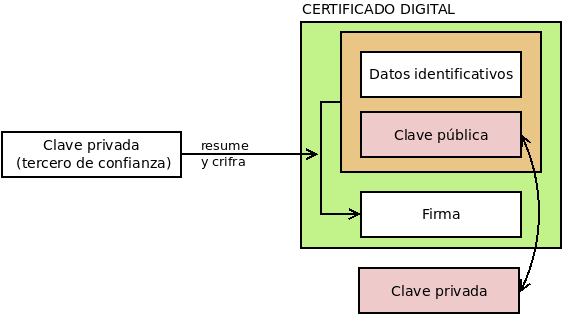

.. _firma-digital:

Firma digital
*************
Una :dfn:`firma digital` es al mundo digital lo que la firma manuscrita al
papel, esto es, algo que certifica que los términos expresados en un texto
son ratificados por la persona firmante.

Para llevar a cabo la *firma digital* de unos datos (un fichero o un mensaje de
correo, por ejemplo) se obra del siguiente modo:

+ Se obtiene :ref:`un resumen <hash>` de los datos mediante una función *hash*.
+ Se cifra tal resumen con la clave privada del firmante.
+ Se transmiten los datos (o se almacenan) junto al resumen cifrado (la firma).

Ante esto, un tercero (por ejemplo, el destinatario de un mensaje de correo
firmado), es capaz de certificar que el origen es quien dice ser, ya que
descifrará el resumen con la clave pública de éste y, por otra parte, podrá
comprobar si los datos conservan su integridad gracias al propio resumen
descifrado.

Conceptualmente, pues, es bastante sencillo y podemos ilustrar los pasos
anteriores haciendo uso de la :ref:`orden gpg <gnupg.1>`::

   $ echo "Este es el contenido del fichero que firmo" > fichero.txt
   $ gpg --detach-sign --default-key mi_cuenta@example.com -o fichero.sig fichero.txt

De esta manera tenemos un fichero original (:file:`fichero.txt`) y su resumen
cifrado digitalmente con nuestra clave privada en :file:`fichero.sign`. Si
analizamos el fichero de firma::

   $ gpg --list-packets fichero.sign
   :signature packet: algo 1, keyid 53175AA29C972B7B
           version 4, created 1543050622, md5len 0, sigclass 0x00
           digest algo 10, begin of digest 04 9e
           hashed subpkt 33 len 21 (issuer fpr v4 040968BBC05C39A4DD2A43BD53175AA29C972B7B)                                                  
           hashed subpkt 2 len 4 (sig created 2018-11-24)
           hashed subpkt 28 len 23 (signer's user ID)
           subpkt 16 len 8 (issuer key ID 53175AA29C972B7B)
           data: [3071 bits]

veremos algunas características de la firma, como:

* qué algoritmo de clave asimétrica se usó, el **1**, que se corresponde con una
  clave asimétrica |RSA|, válida tanto para firma como para cifrado. El
  significado de los códigos puede encontrarse en el :rfc:`4880`, y en concreto
  en la `sección 9.1 <https://tools.ietf.org/html/rfc4880#section-9.1>`_.

* qué clave se usó: la *53175AA29C972B7B*, que efectivamente es la nuestra:

  .. code-block:: console
     :emphasize-lines: 4

     $ gpg --keyid-format long -list-keys
     /home/usuario/.gnupg/pubring.kbx
     --------------------------------
     pub   rsa3072/53175AA29C972B7B 2018-11-21 [SC] [expires: 2020-11-20]
           040968BBC05C39A4DD2A43BD53175AA29C972B7B
     uid                 [ unknown] Soy el que soy <mi_cuenta@example.com>
           sub   rsa3072/4B1F09C9B84F038E 2018-11-21 [E] [expires: 2020-11-20]

* con qué algoritmo se resumió el fichero, el **10**, que es *SHA512* según 
  `la sección 9.4 <https://tools.ietf.org/html/rfc4880#section-9.4>`_ del
  :rfc:`4880`.

Si hacemos llegar **ambos** archivos a un tercero, y éste posee nuestra clave
pública, podrá verificar nuestra identidad gracias a descifrar la firma y la
integridad del fichero gracias al resumen que contiene esta::

   $ gpg --verify fichero.sign fichero.txt
   [...]
   Primary key fingerprint: 0409 68BB C05C 39A4 DD2A  43BD 5317 5AA2 9C97 2B7B
   $ echo $?
   0

.. note:: Retenga el adagio de que la clave pública del destinatario se usa para
   cifrar, y la clave privada del emisor para firmar.

Documentos |PDF|
================
Según la hemos presentado aquí, la firma de un archivo es otro archivo que
contiene el resumen cifrado con la clave privada del firmante. De este modo,
cualquier archivo puede ser firmado. Por supuesto, un |PDF| podría firmarse
así. Sin embargo, este tipo de archivos dispone de un campo interno en el que
incluir la firma (o las firmas si hay varios firmantes), lo que permite al
archivo contener su propia verificación. Este es el modo estándar de firmar
documentos |PDF| y no el general descrito más arriba. Además, no se usa
meramente un par de claves, sino un :ref:`certificado digital <cert-digital>`,
que trataremos más adelante.

.. todo:: Por lo que se `deduce de sus notas de publicación
   <https://poppler.freedesktop.org/releases.html>`_, la orden :command:`pdfsig`
   incluida en la suite de manipulación de archivos |PDF|
   :program:`poppler-utils` incorpora la posibilidad de firmar documentos a
   partir de la versión **21.01** (la verificación ya la soporta desde hace
   tiempo).

   Sería recomendable incluir una pequeña guía de cómo se hace la firma y la
   verificación con esta herramienta (e incluir un ejercicio aprovechando el
   certificado personal).

Claves |PGP|
============
La firma digital es ampliamente usada en los mensajes de correo electrónico.
En estos se firma tanto un conjunto de cabeceras escogidas\ [#]_ como el cuerpo
del mensaje y los adjuntos. Creada la firma, se incorpora como un adjunto
adicional al mensaje.

Lo habitual es que se usen claves |PGP|, un estándar desarrollado para el
cifrado y firma de mensajes de correos electrónicos, cuya generación,
importación y exportación de claves :ref:`practicamos al tratar el cifrado
asimétrico <gpg-pgp>`. Obviamente, el proceso de firma de un mensaje no exige
su elaboración *artesanal*, sino que los clientes de correo como :ref:`mutt
<mutt>` o Thunderbird_ incorporan esta funcionalidad para que el proceso sea
sencillo.

.. note:: También es posible firmar y cifrar mensajes con determinados servicios
   de *webmail* y la extensión adecuada del navegador. Por ejemplo, en
   :program:`Chrome` existe la extensión Mailenvelope_ que permite el cifrado de
   mensajes para los principales sitios de webmail (Gmail_, Yahoo_, Outlook_,
   etc.).

.. seealso:: Aunque menos frecuente, también es posible firmar mensajes con
   :ref:`certificados X.509 <cert-digital>`. En :ref:`este epígrafe
   <mutt-fnmt>`, puede consultar cómo firmar mensajes de correo en :ref:`mutt
   <mutt>` con el certificado personal emitido por la |FNMT|.

.. _cert-digital:

Certificado digital
===================
.. note:: Tratamos los *certificados digitales de clave pública*, por lo que a
   partir de ahora hablaremos, simplemente, de *certificados digitales*.

A pesar de qué la suplantación de identidad parece resuelta, puesto que poder
descifrar una firma con una clave pública supone que el firmante sea el
propietario de tal clave pública, hay aún una debilidad: ¿cómo puede el
verificador estar seguro de que tal clave pública pertenece a quien parece
pertenecer? A fin de cuentas, la suplantación ha podido producirse en el momento
de la entrega de la clave pública y, si ha sido así, todo el proceso de
verificación de la identidad estará viciado. Para subsanar este último escollo
existen los *certificados digitales*.

Un :dfn:`certificado digital` es un documento compuesto por unos datos
identificativos y una clave pública, y firmado digitalmente por una
:dfn:`autoridad de certificación` (|CA|), que acredita que la clave pertenece a
quien los datos identificativos refieren. Si esta |CA| es de absoluta confianza,
entonces no habrá duda de quién es el propietario de la clave pública y
desaparecerá el riesgo de suplantación. Los certificados suelen basarse en el
`estándar X.509 <https://www.ssl.com/faqs/what-is-an-x-509-certificate/>`_
definido en el :rfc:`5280`.

Esquematizando, pues, un *certificado digital* se compone:

* Una pareja de claves.
* La identidad del propietario de dichas claves.
* La firma digital de una autoridad de certificación sobre la clave pública y
  los datos identificativos.

Así pues, cuando se firma con un certificado digital el receptor del mensaje
puede, además de comprobar la integridad del mensaje saber con total seguridad
que la clave publica que ha usado para tal comprobación pertenece a quien parece
pertenecer.

Ahora bien, ¿quién es esta *autoridad de certificación* y por qué es digna de
confianza? Una :dfn:`autoridad de certificación` (a partir de ahora, |CA|) es
aquella entidad de confianza encargada de emitir (y revocar) certificados
digitales. Para llevar a cabo esta tarea la propia |CA| dispone de un
certificado, de manera que con su clave privada firma los certificados que
emite. La estructura es jerárquica y el certificado de una |CA| intermedia
estará avalado por la firma de otra |CA| de rango superior. Sin embargo, la
relación jerárquica no puede ser infinita por lo que al final siempre existirán
unas |CA| raíz cuyos certificados son autofirmados, esto es, son certificados a
que los que nadie ha avalado digitalmente. La confianza en los certificados raíz
se debe a que los propios sistemas operativos y navegadores web los incorporan
de serie, porque de algún modo los fabricantes de este tipo de *software* habrán
efectuado la verificación.  Así, *Debian* incluye el paquete `ca-certificates
<https://packages.debian.org/search?keywords=ca-certificates>`_ con certificados
raíz que reconoce como confiables.

Un ejemplo de esta jerarquía es el :ref:`certificado gratuito para servidores
web <nginx-https>` emitido por `Let's Encrypt`_ (descargable en `esta dirección
<http://r3.i.lencr.org/>`_), cuyo certificado a su vez está firmado por `Digital
Signature Trust`_ (la cual sí es una |CA| raíz)::

   $ wget -qO letsencrypt.cer "http://r3.i.lencr.org/"
   $ openssl x509 -inform der -in letsencrypt.cer -subject -issuer -noout
   subject=C = US, O = Let's Encrypt, CN = R3
   issuer=O = Digital Signature Trust Co., CN = DST Root CA X3

Sea como sea, las |CA| generan certificados finales:

+ Para otra |CA| subordinada.
+ Para una persona física.
+ Para una aplicación de *software*
+ Para un servidor.

Los certificados, no obstante, no son eternos, sino que la |CA| los acredita por
un plazo determinado, por lo que son sólo válidos entre una fecha inicial
(normalmente la fecha en que se generan) y una fecha final que varía según el
tiempo de validez por el que se certifiquen. Ambas fechas se incluyen dentro de
los datos identificativos.

.. rubric:: Instalar certificados raíz adicionales

Si se necesita instalar certificados raíz en el sistema (los certificados raíz
de la |FNMT| no han sido reconocidos hasta fechas recientes y un *Linux* antiguo
no los tendrá), podemos seguir el siguiente procedimiento:

#. Se guarda el certificado público en formato |PEM| (codificado en Base64_)
   dentro de :file:`/usr/local/share/ca-certificates/` con extensión ``.crt``::

      # cp acraiz.pem /usr/local/share/ca-certificates/acraiz.crt

#. Se ejecuta::

      # update-ca-certificates

   que se encargará de instalarlo convenientemente en :file:`/etc/ssl/certs`.

Certificados personales
-----------------------
El proceso típico de emisión de un certificado personal es el siguiente:

#. El interesado realiza una solicitud a la |CA|, por lo general a través de
   un servicio web, en que se recogen los datos identificativos y se genera una
   pareja de claves. Ahora bien, como la identidad del interesado no ha podido
   verificarse, la |CA| genera una petición |CSR|.

#. El interesado se acerca físicamente a la oficina de una |RA| (autoridad de
   registro) a fin de confirmar ante ésta que es quien dice ser.

#. La |RA| notifica a la |CA| tal verificación, con lo que esta pone a
   disposición del interesado (p.e. a través del servicio web que utilizó
   primeramente) el certificado solicitado.

#. El interesado obtiene el certificado y lo instala en su sistema (navegador,
   cliente de correo, etc).

.. image:: files/certificados.png

.. note:: En España la autoridad de certificación que usan la inmensa mayoría de
   las administraciones públicas es la `Fábrica Nacional de Moneda y Timbre
   <http://www.cert.fnmt.es>`_.  Muchas particulares españoles también usan esta
   autoridad para sus certificados personales, gracias a una `extensa red de
   oficinas de registro <http://mapaoficinascert.appspot.com/>`_ (|RA|) que
   incluye oficinas de la seguridad social, de la agencia tributaria o
   ayuntamientos.

Por último, es necesario señalar que, para asegurar la validez de un
certificado, no basta sólo con comprobar si el certificado no ha caducado y
hacer uso de la firma pública de la |CA|. Un certificado puede haberse revocado
antes de caducar y, en consecuencia, dejar de ser válido antes de tiempo. Por
eso, las |CA| deben ofrecer un servicio para la comprobación de estas
revocaciones. Por ejemplo, la |FNMT| ofrece este servicio de forma gratuita\
[#]_ mediante el protocolo estándar |OCSP| descrito en el :rfc:`6960`.

.. seealso:: Échele un ojo a la `entrada de este blog donde habla del
   asunto
   <http://blog.marcnuri.com/ocsp-validar-estado-de-revocacion-de-certificados-fnmt-mediante-protocolo-ocsp-y-openssl/>`_
   y se cuenta cómo verificar los certificados emitidos por la |FNMT| usando
   :command:`openssl`.

Certificados de servidor
------------------------
Estos certificados avalan la identidad de una máquina, esto es, que una máquina
(o un conjunto de máquinas, si estamos ante un servicio distribuido) responde a
un determinado nombre |DNS|. Así, por ejemplo, cuando conectamos a la `página
oficial de la Presidencia del Gobierno <https://www.lamoncloa.gob.e>`_, su
certificado de servidor avala que la máquina con la que conectamos es
:kbd:`www.lamoncloa.gob.es` y no una impostora que ha logrado que conectemos a
ella :ref:`envenenando nuestro DNS <dns-spoofing>`. 

En los certificados de servidor, lo que se acredita no es una identidad física,
sino uno o varios nombres, por lo que si consultamos uno (tal como se explica
en el próximo epígrafe), nos toparemos con que::

   $ openssl x509 -in /etc/ssl/certs/letsencrypt-fullchain.cer \
         -issuer -subject -ext subjectAltName -noou
   issuer=C = US, O = Let's Encrypt, CN = R3
   subject=CN = lets2.iescdl.es
   X509v3 Subject Alternative Name: 
       DNS:azure.iescdl.es, DNS:lets.iescdl.es, DNS:lets2.iescdl.es

La obtención de estos certificados necesita que la máquina acredite su
identidad, esto es, que el dueño de la máquina acredite que posee el nombre
|DNS| al que quiere asociarla. Hay distintos niveles de acreditación ya que
quizás no sólo interesa acreditar la propiedad del nombre |DNS|, sino, por
ejemplo, también la propiedad del nombre comercial de la empresa para la que se
quiere crear un sitio web. Para el nivel más básico de acreditación, esto es,
aquel en que sólo se pretende acreditar la propiedad sobre el nombre |DNS|, es
posible la acreditación puramente telemática. Para ella, existe definido el
protocolo |ACME|, descrito en :ref:`este epígrafe sobre nginx
<nginx-https>`. 

.. note:: Tenga presente que, aunque descritos dentro de la configuración de un
   servidor web, estos certificados X.509 son válidos para cualquier protocolo
   seguro basado en |SSL|/|TLS|.

Formatos de certificados X.509
------------------------------
Los certificados digitales se presentan en distintos formatos de archivo que
conviene conocer, porque en ocasiones para hacer una determinada operación o
utilizarlo con cierta aplicación lo necesitaremos en uno concreto. Además, de la
descripción de estos formatos incluimos, a modo de vademécum, las órdenes más
comunes con :program:`openssl` para transformar del formato |PEM| (el estándar
común en el *software* libre) al resto de formatos y viceversa\ [#]_:

|PEM|
   Es el estándar desarrollado por los :rfc:`1421`, :rfc:`1422`, :rfc:`1423` y
   :rfc:`1424` y muy usado por aplicaciones de *software* libre (p.e. los
   certificados de servidor de :ref:`nginx <n-ginx>` o :program:`apache` se
   almacenan usando este estándar). Cuando se aseguran mediante cifrado
   simétrico, sólo se cifra la parte privada. Los archivos |PEM| son en realidad
   contenedores de certificados de manera que a menudo contienen sólo la parte
   privada de un certificado, o sólo la parte pública, o el certificado completo
   (parte pública y privada), o el completo y toda la cadena de claves públicas
   de las |CA|\ s intermedias necesarias para verificar el certificado.

   Este estándar genera archivos (normalmente imprimibles mediante codificación
   Base64_) y suele presentarse bajo estas extensiones:

   * ``.pem`` tanto cuando contienen sólo el certificado público (y,
     opcionalmente, también los de la autoridad de certificación) como cuando
     contienen además el privado. Los certificados están codificados en Base64_.
   * ``der`` cuando contienen sólo la parte pública o la parte privada, pero se
     encuentran codificados en |DER|.
   * ``.key`` cuando el fichero contiene sólo la parte privada.
   * ``.cer`` y ``.crt`` cuando contiene sólo la parte pública.

   Los distintos certificados dentro del archivo son fácilmente distinguibles
   porque su codificación Base64_ se prologa con la marca :kbd:`----BEGIN
   CERTIFICATE----` y se cierra con :kbd:`-----END CERTIFICATE-----` y con una
   leyenda similar también se prologa y cierra la parte privada.

   No obstante lo anterior, en ocasiones el certificado no se presenta
   codificado en Base64_ sino codificado en forma binaria (formato |DER|). De
   hecho, la codificación en Base64_ se obtiene a partir de la binaria añadiendo
   las leyendas de prólogo y de cierre ya descritas\ [#]_.

   Cuando el certificado está en esta forma |DER|, el archivo sólo puede
   contener o la parte pública o la parte privada, ya que no hay marcas
   :kbd:`BEGIN`/:kbd:`END` que puedan separar los distintos certificados.
   :command:`openssl` presupone que la codificación es Base64_, así que cuando
   se trabaja con este formato no hay que expresar que tiene esta codificación
   ("*pem*" como la llama el programa). En cambio, cuando utilicemos la
   codificación |DER| necesitaremos indicarlo expresamente con :kbd:`-inform
   der`, si es un archivo de entrada, o :kbd:`-outform der`, si es un archivo de
   salida.

   Algunas operaciones habituales con este tipo de certificado son:

   #. Ver los datos del certificado público::

         $ openssl x509 -in CERTIFICADO.pem -text -noout

      .. warning:: Si el archivo contiene varias claves públicas, sólo mostrará
         la primera en el archivo. Siga leyendo para saber cómo ver todas.

   #. Generar un archivo ``.p12`` a partir de los archivos ``.pem`` y ``,key``::

         $ openssl pkcs12 -export -out CERTIFICADO.p12 -in CERTIFICADO.pem -inkey CERTIFICADO.key

      Si el archivo ``.pem`` contiene ambas partes pública y privada, basta con
      incluir este único fichero como argumento de :kbd:`-in` y prescindir de
      :kbd:`-inkey`.  El archivo con la parte pública debe contener al menos la
      clave pública del certificado, pero también puede contener la de la
      autoridad de certificación. Si el certificado de la autoridad está en
      archivo distinto, pero se quiere incluir dentro del resultado puede
      referirse este tercer archivo mediante la opción :kbd:`-CAfile`.

      .. note:: Como se necesita introducir una clave para descifrar el
         contenido de :file:`CERTIFCADO.key` y otra para cifrar
         :file:`CERTIFICADO.p12`\ [#]_ se pedirán interactivamente las dos
         claves.  Si se quieren pasarlas por la línea de órdenes utilice las
         opciones :kbd:`-passin` y :kbd:`-passout` y consulte la sección "Pass
         Plhare Options" de :manpage:`openssl(1)`.

   #. Transformar el certificado público |PEM| al formato |PKCS| #7::

         $ openssl crl2pkcs7 -nocrl -certfile CERTIFICADO.pem -out CERTIFICADO.p7b

   #. Ver todos los certificados públicos contenidos en el archivo |PEM|.
      Esto se logra traduciendo el certificado al formato |PKCS| #7 primero,
      porque para este formato :command:`openssl` sí muestra la información
      sobre todos::

        $  openssl crl2pkcs7 -nocrl -certfile CHAIN.pem | openssl pkcs7 -print_certs -text -noout

   #. Transformar el certificado público |PEM| en Base64_ a codificacióbn |DER|::

         $ openssl x509 -in CERTIFICADO.pem -outform der -out CERTIFICADO.crt

   #. Trasformar la clave privada |PEM| en Base64_ a codificación |DER|::

         $ openssl rsa -in CERTIFICADO.key -outform der -out CERTIFICADO.key.der

      .. warning:: El formato resultante no estará cifrado y, por tanto, la
         clave privada estará totalmente desprotegida.

   #. Ver los datos del certificado público (si usa codificación |DER|)::

         $ openssl x509 -inform der -in CERTIFICADO.crt -text -noout

   #. Trasformar un certificado público |DER| a Base64_::

         $ openssl x509 -inform der -in CERTIFICADO.crt -outform pem -out CERTIFICADO.pem

   #. Trasformar la parte privada en codificación |DER| a Base64_ protegiéndola
      con un cifrado |AES|\ 256)::

         $ openssl rsa -inform der -in CERTIFICADO.key.der -outform pem -aes256 -out CERTIFICADO.key

      .. note:: Consulte :manpage:`openssl-rsa(1)` para ver qué otros parámetros
         cifran la clave con algoritmos distintos.

|PKCS| #12 (``.p12`` o, a veces, ``.pfx``)
   Formato originario de Microsoft_ que se acabó estandarizando mediante el
   :rfc:`7292` y contiene tanto la clave pública como la privada del
   certificado. En este formato toda la información contenida esta cifrada con
   una clave simétrica (a diferencia del |PEM| que sólo cifra la privada) y es
   el que suelen usar los navegadores para exportar e importar los certificados
   personales de los usuarios.

   Operaciones habituales:

   #. Convertir el archivo ``.p12`` al formato |PEM| en un sólo archivo::

         $ openssl pkcs12 -in CERTIFICADO.p12 -out CERTIFICADO.pem

   #. Ídem pero separando en dos archivos la clave pública y la privada::

         $ openssl pkcs12 -in CERTIFICADO.p12 -nocerts -out CERTIFICADO.key
         $ openssl pkcs12 -in CERTIFICADO.p12 -nokeys -out CERTIFICADO.pem

      .. note:: Al generar el |PEM| con el certificado público se puede querer
         no incluir los certificados públicos de las autoridades de
         certificación (añadiendo :kbd:`-clcerts`) o, justo lo contrario, y sólo
         incluir los certificados públicos de |CA| (añadiendo :kbd:`-cacerts`).

   #. Ver los datos del certificado público (no hay forma directa, así que hay
      que traducir a |PEM| y obtener la información de la traducción)::

         $ openssl pkcs12 -in CERTIFICADO.p12 -clcerts -nokeys | openssl x509 -text -noout

|PKCS| #7
   Formato estandarizado a través del :rfc:`2315` que sólo contiene la parte
   pública del certificado. Suele usarse en sistemas *Windows* y aplicaciones
   escritas en Java. Utiliza las extensiones:

   * ``.p7b`` cuando está codificado en Base64_. En este caso el archivo puede
     contener varios certificados públicos prologado y cerrado cada uno de ellos
     con una leyenda semejante a la que vimos para el caso del formato |PEM|.

   * ``.p7c`` cuando contiene un único certificado público en codificación
     |DER|. En este caso, debemos usar la opción :kbd:`-inform der` para
     informar a :command:`openssl`.

   Operaciones habituales:

   #. Consultar los datos de los certificados incluidos::

         $ openssl pkcs7 -in CERTIFICADO.p7b -print_certs -text -noout

      .. note:: A diferencia de cuando se trata con el formato |PEM|, la
         opción :kbd:`-print_certs` para este tipo de formato muestra la
         información de todos los certificados incluidos en el archivo.

   # Consultar el dato del certificado codificado en |DER|::

         $  openssl pkcs7 -inform der -in CERTIFICADO.p7c -print_certs -text -noout

   #. Transformar el certificado |PKCS| #7 al formato |PEM|::

         $ openssl pkcs7 -in certificate.p7b -print_certs -out certificate.pem

.. seealso:: Como referencia para este apartado se ha usado la `extensa
   respuesta a una pregunta formulada en serverfault
   <https://serverfault.com/questions/9708/what-is-a-pem-file-and-how-does-it-differ-from-other-openssl-generated-key-file>`_

.. _info-cert:

Destripando certificados
------------------------
Ya se ha establecido que un certificado consta de:

+ Una **parte pública** compuesta por unos datos identificativos y una clave pública
  firmada por una |CA|.
+ Una **parte privada** constituida por una clave privada, cifrada o no por una
  clave simétrica.

Consultar la información contenida en la parte pública puede proporcionar datos
muy jugosos sobre el propio certificado y eso es lo que haremos con
:command:`openssl`, ya que aunque el formato |PEM| sea imprimible la información
está codificada en base64, por lo que un :ref:`cat <cat>` es de poca ayuda. La
orden ya se encuentra escrita en el epígrafe anterior::

   $ openssl x509 -in CERTFICADO.pem -text -noout

Si aplicamos esta orden sobre, por ejemplo, un certificado de servidor emitido por  `Let's
Encrypt`_ obtendremos lo siguiente:

.. literalinclude:: files/azure-lets.pem
   :language: none

Observando la salida se distinguen dos partes:

- Los datos en sí (:kbd:`Data`).
- La firma de tales datos (:kbd:`Signature Algorithm`) para lo cual han usado 
  como :ref:`función hash el algoritmo sha256 <hash>`.

Dentro de los datos podemos distinguir:

* Datos propiamente identificativos como su número de serie o la identidad del
  propietario del certificado (``Subject``).
* Datos referentes al propio certificado como su validez o quién es el firmante
  (``Issuer``)\ [#]_.
* La clave pública del certificado (``Subject Public Key Info``).

Uno de los campos (``X509v3 extensions``) contiene campos adicionales con
información de cualquiera de los tres tipos anteriores. Algunos de estos campos
ofrecen información interesante como:

+ La |URL| en la que comprobar si el certificado está revocado (``Authority
  Information Acces``).
+ Un identificador para el propio certificado (``X509v3 Subject Key Identifier``).
+ El identificador para el certificado con que la |CA| firmó (``X509v3 Authority
  Key Identifier``).

La opción ``-text`` de :command:`openssl` devuelve toda la información, pero
podemos afinar (véase :manpage:`openssl-x509(1)`)::

   $ openssl x509 -in CERTIFICADO.pem -subject -noout
   subject=CN = lets2.iescdl.es
   $ openssl x509 -in CERTIFICADO.pem -dates -noout
   notBefore=Jan 18 10:03:44 2021 GMT
   notAfter=Apr 18 10:03:44 2021 GM
   $ openssl x509 -in CERTIFICADO.pem -issuer -noout
   issuer=C = US, O = Let's Encrypt, CN = R3
   $ openssl x509 -in CERTIFICADO.pem -pubkey -noout
   -----BEGIN PUBLIC KEY-----
   MIIBIjANBgkqhkiG9w0BAQEFAAOCAQ8AMIIBCgKCAQEA4LrdwliOk4GMcmKKk0R/
   RkK9iDO4Vr56azwv3Z/2UI+e/9QIZ0sg9UVXM24mIbslzGppi3uSzqauiy9GMYyr
   A7WbwTFbgU3Q6WnNkqgoFd7bOUxaEhnQlfcTu4yor5x/tLH/worocmFAXhIy9jrE
   yVzR/XqKutVIWKhPuefnrXvLR1oYWv2bW/zED03IHNRcTyZNa8udOfDCZyqaHjM8
   4bnlgoiMAmP5Ar4J7Qdeht5cIBY4ZNmCmTHKWSjbEFW7h6hl7HiHh8+gd6X6SqZW
   GAAYPU/RjkkwZF9GNK5RcxxRXhjKGkwMO9IKlZ8gHYNplR2yuHujVsUR+IcRl9MS
   wwIDAQAB
   -----END PUBLIC KEY-----

Los campos propios de la extensión también pueden obtenerse, aunque hay que
recurrir a :manpage:`x509v3_config(5)` para saber cuáles son sus nombres::

   $ openssl x509 -in CERTIFICADO.pem -ext authorityInfoAccess -noout
   Authority Information Access: 
       OCSP - URI:http://r3.o.lencr.org
       CA Issuers - URI:http://r3.i.lencr.org

En este caso, el campo nos indica cuál es la |URL| con el servicio |OCSP| donde
podemos comprobar si el certificado está revocado y dónde se encuentra el
certificado con el que firmo este certificado. No obstante lo anterior,
:command:`openssl` ya ofrece una opción para obtener directamente la |URL| con
el servicio |OCSP|::

   $ openssl x509 -in CERTIFICADO.pem -ocsp_uri -noout
   http://r3.o.lencr.org

.. _verif-cert:

Verificación
------------
:command:`openssl` proporciona la suborden ``verify`` para verificar la validez
de un certificado en lo referente a las fechas y a la firma de la |CA|. Aún, sin
embargo, faltaría comprobar si el certificado está revocado para lo cual hay que
consultar a la propia |CA| a través de |OCSP|.

Supongamos que tenemos el certificado :file:`CERTIFICADO.pem` del epígrafe
anterior emitido por `Let's Encrypt`_, la orden::

   $ openssl verify CERTIFICADO.pem

comprobará si el certificado es válido utilizando las certificados raíz
instalados en el sistema (en una *Debian* en :file:`/etc/ssl/certs`). Sin
embargo, en este caso el certificado firmante de `Let's Encrypt`_ no es un
certificado raíz, ya que esta actúa como una |CA| subordinada. Por tal motivo,
fallará y requeriremos obtener también el certificado firmante. Es probable que
:file:`CERTIFICADO.pem` también contenga el de `Let's Encrypt`\ [#]_, pero si no
fuera el caso, podríamos obtenerlo muy fácilmente de la  |URL|
`http://r3.i.lencr.org <http://r3.i.lencr.org>`_ según nos informa el propio
certificado. Con ambos certificados podríamos reintentar la verificación con::

   $ openssl verify -CAfile FIRMANTE.pem CERTIFICADO.pem

Esta comprobación ya funcionará, porque el certificado firmante sí está firmado
a su vez por un certificado raíz que posee el sistema. Si no fuera así,
podríamos ir añadiendo los sucesivos certificados de las |CA| intermedias dentro
de :file:`FIRMANTE.pem`.

Hay algunas variantes interesantes a esta orden:

* La opción :kbd:`-no-CApath` evita que se usen los certificados raíz instalados
  en el sistema. La verificación obligaría, pues, a incluir en
  :file:`FIRMANTE.pem` también el certificado raíz de la |CA| pertinente.

* La opción :kbd:`-partial_chain` permite hacer la verificación aunque no se
  tenga la cadena completa de |CA|. Por consiguiente::

   $ openssl verify -no-CApath -partial_chain -CAfile FIRMANTE.pem CERTIFICADO.pem

  podría verificar el certificado, aunque :file:`FIRMANTE.pem` no contuviera
  también el certificado raíz.

Lo anterior, no obstante, no puede verificar si el certificado ha sido revocado
y, por tanto, es a pesar de todo inválido. Para ello hay que recurrir a la |CA|
y en el caso de `Let's Encrypt` la verificación es sencilla porque ofrece el
servicio a través del estándar |OCSP|::

   $ openssl ocsp -url "$(openssl x509 -in CERTIFICADO.pem -ocsp_uri -noout)" \
        -issuer FIRMANTE.pem -cert CERTIFICADO.pem
   WARNING: no nonce in response
   Response verify OK
   azure.pem: good
           This Update: Jan 21 11:00:00 2021 GMT
           Next Update: Jan 28 11:00:00 2021 GMT

Obsérvese que hay que proporcionar la |URL| con el servicio, el certificado que
se desea comprobar y el certificado firmante. Un certificado revocado, por su
parte, podría ser verificado, porque está correctamente firmado y no está
caducado::

   $ openssl verify -CAfile FIRMANTE.pem CERTIFICADO.pem
   CERTFICADO.pem: OK

pero al comprobarse su validez ante la autoridad certificadora::

   $ openssl ocsp -url "$(openssl x509 -in CERTIFICADO.pem -ocsp_uri -noout)" \
        -issuer FIRMANTE.pem -cert CERTIFICADO.pem
   WARNING: no nonce in response
   Response verify OK
   CERTIFICADO.pem: revoked
           This Update: Jan 25 11:34:36 2021 GMT
           Next Update: Feb  1 11:34:36 2021 GMT
           Revocation Time: Jan 18 17:40:13 2021 GMT

nos descubriría que el certificado ha sido revocado; y, por tanto, es
inadmisible.

.. warning:: Cerciórese de que el archivo |PEM| del certificado firmante no
   contiene también el propio certificado u obtendrá un :kbd:`Unauthorized
   (6)`. 

Generación
----------
.. https://fam.tuwien.ac.at/~schamane/_/blog/2019-07-18_selfsigned_subjectaltname.htm
.. https://deliciousbrains.com/ssl-certificate-authority-for-local-https-development/
.. https://gist.github.com/Soarez/9688998
.. https://adfinis.com/en/blog/openssl-x509-certificates/
.. https://www.digicert.com/kb/ssl-support/openssl-quick-reference-guide.htm
.. https://wiki.infn.it/cn/ccr/x509/home/utenti/server/manuale

.. warning:: Para obtener certificados aceptables, ya sean personales o de
   servidor, debe recurrise a una |CA| reconocida, ya que tanto los unos como
   los otros pueden obtenerse de forma sencilla gratuitamente. Este epígrafe
   carece realmente de interés práctico real\ [#]_, pero sirve para conocer cómo
   funciona *por dentro* la solicitud de un certificado.

El procedimiento de generación de certificados es siempre el mismo:

1. Se genera la clave privada del certificado
2. Se crea una solicitud de certificado |CSR|.
3. Con la solicitud anterior y el certificado firmante (incluida su necesaria
   clave privada) se genera el certificado público.

Antes, no obstante, crearemos un archivo de configuración :download:`ssl.conf
<files/ssl.conf>`.

.. warning:: El archivo contiene un directiva que es un peligro de seguridad:

   .. code:: ini

      copy_extension = copy

   Esta directiva implica que las extensiones que añadamos en la solicitud se
   copiarán en el certificado firmado. ¿Por qué es esto un peligro? Porque las
   solicitud, en general, la realiza el interesado y. si nosotros (la CA) las
   copiamos en el certificado final, éste puede añadir algo indiseable (como
   ):kbd:`CA:TRUE` para que el certificado le sirva para validar otros
   certficados). Pero como en nuestro caso, vamos a hacer nosotros mismos 
   tanto la solicitud como la expedición, no hay este problema.

El archivo permite simplificar las respuestas al hacer una solicitud y define
cuáles serán las extensiones que contengan los certificados. Preparemos el
directorio de trabajo::

$ mkdir -p store/{{new,}certs,crl,keys,csr}
$ echo 1000 > store/serial
$ touch store/index.txt

Empecemos pues:

**Certificado raíz**
   Tiene la particularidad de que estará autofirmado::

      $ openssl genrsa -out store/ca.key 4096
      $ openssl req -new -config ssl.conf -key store/ca.key -out store/csr/ca.csr
      $ openssl x509 -req -sha256 -in store/csr/ca.csr -signkey store/ca.key \
          -days 3650 -extfile ssl.conf -extensions e_ca -out store/ca.crt

   Esto nos permote obtener el certificado raíz (:file:`store/ca.crt`) con su
   clave privada (:file:`store/ca.key`), que coinciden con las que hemos
   indicado en el archivo de configuración.

**Certificado personal**
   Conceptualmente es lo hacer lo mismo, aunque con diferencias::

      $ openssl genrsa -aes256 -out store/keys/$(cat store/serial).key 2048
      $ openssl req -new -key store/keys/$(cat store/serial).key -out store/csr/$(cat store/serial).csr \
         -subj="/C=ES/GN=MI NOMBRE/SN=MIS APELLIDOS/CN=APELLIDOS NOMBRE/emailAddress=midir@ecci.on"
      $ openssl ca -config ssl.conf -batch -extensions e_personal -infiles store/csr/$(cat store/serial).csr

   Básicamente el proceso es el mismo, pero:

   * La clave privada, puesto que es un certificado personal, la ciframos
     (:kbd:`-aes256`).
   * En vez de introducir de forma intereactiva los datos para generar el
     "Subject", lo incluimos en la orden de solicitud.
   * Aunque podrámos usar la suborden :command:`x509` para firmar el
     certificado a partir de la solicitud\ [#]_, utilizamos la suborden
     :command:`ca` que organiza mejor la actividad de nuestra |CA|, modificando
     el nñúmero de serie según vamos creando los certificados y creando un
     registro con todos los certificados que hemos ido generando.

**Certificado de servidor**
   La generación es semejante al de un certificado personal::

      $ openssl genrsa -out store/keys/$(cat store/serial).key 2048
      $ openssl req -new -key store/keys/$(cat store/serial).key -out store/csr/$(cat store/serial).csr \
         -subj="/CN=www.example.net" -addext "subjectAltName=DNS:www.example.net,DNS:alt.example.net"
      $ openssl ca -config ssl.conf -batch -extensions e_server -infiles store/csr/$(cat store/serial).csr

   aunque:

   * Naturalmente, no ciframos la clave privada.
   * Incluimos los nombres alternativos para el certificado en la solicitud.

.. rubric:: Notas al pie

.. [#] En principio el :rfc:`3156` sólo protege el cuerpo del mensaje.  Puede
       echarle una lectura a `Protected Headers for Cryptographic E-mail
       <https://tools.ietf.org/id/draft-autocrypt-lamps-protected-headers-01.html>`

.. [#] Gratuito actualmente. Durante mucho el servicio fue de pago y
       restringido.
.. [#] Las órdenes sólo exponen cómo hacer conversiones entre formatos y ver los
       datos del certificado. Por supuesto, se hay otras operaciones interesantes
       como crear certificados o verificar su validez.
.. [#] La opción :kbd:`-nodes` deja la clave privada sin cifrar, pero
       posiblemente no sea una buena idea.
.. [#] En un certificado autofirmado ``Subject`` e ``Issuer`` coincidirán.
.. [#] Hasta el punto es así, que si tenemos un certificado en codificación
       binaria, podemos transformarlo manualmente a su forma en Base64_ así::

          $ { echo '-----BEGIN CERTIFICATE-----'
              base64 -w64 CERTIFICADO.cer
              echo '-----END CERTIFICATE-----'; } > CERTFICADO.pem

.. [#] Basta con hacer un :ref:`cat <cat>` y ver si hay uno o dos certificados
       en el archivo.

.. [#] Aunque no en todos los casos. Por ejemplo, para la instalación de un
   :ref:`servidor OpenVPN <openvpn>` se utiliza la técnica de crear una |CA|
   raíz para generar el certificado del servidor y los clientes. Eso sí, está
   ya todo preparado para que no haya que pelearse directamente con
   :program:`openssl`.

.. [#] En la orden habría que añadir cuál es el certificado de la |CA|. Algo
   así::

      $ openssl x509 -req -sha256 -in store/csr/personal.csr -CA store/ca.crt -CAkey store/ca.key \
          -CAcreateserial -days 365 -extfile ssl.conf -extensions personal -out personal.crt

.. |CA| replace:: :abbr:`CA (Certification Authority)`
.. |CSR| replace:: :abbr:`CSR (Certificate Signing Request)`
.. |RA| replace:: :abbr:`RA (Registration Authority)`
.. |FNMT| replace:: :abbr:`FNMT (Fábrica Nacional de Moneda y Timbre)`
.. |RSA| replace:: :abbr:`RSA (Rivest, Shamir y Adleman)`
.. |PGP| replace:: :abbr:`PGP (Pretty Good Privacy)`
.. |PKCS| replace:: :abbr:`PKCS (Public-Key Cryptography Standards)`
.. |PEM| replace:: :abbr:`PEM (Private Enhanced Mail)`
.. |DER| replace:: :abbr:`DER (Distinguished Encoding Rules)`
.. |OCSP| replace:: :abbr:`OCSP (Online Certificate Status Protocol)`
.. |AES| replace:: :abbr:`AES (Advanced Encryption Standard)`
.. |URL| replace:: :abbr:`URL (Uniform Resource Locator)`
.. |PDF| replace:: :abbr:`PDF (Portable Dcument Format)`
.. |ACME| replace:: :abbr:`ACME (Automated Certificate Management Environment)`
.. |TLS| replace:: :abbr:`TLS (Transport Layer Security)`
.. |SSL| replace:: :abbr:`SSL (Secure Socket Layer)`

.. _Digital Signature Trust: https://www.identrust.com/
.. _Let's Encrypt: https://letsencrypt.org/
.. _Mailenvelope: https://www.mailvelope.com/en
.. _Gmail: https://gmail.google.com
.. _Outlook: https://www.outlook.com
.. _Yahoo: https://mail.yahoo.com
.. _Thunderbird: https://www.thunderbird.net
.. _Microsoft: https://www.microsoft.com
.. _Base64: https://es.wikipedia.org/wiki/Base64
