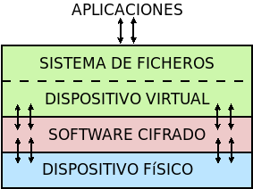
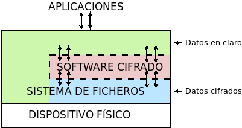

.. _disk-encrypt:

Cifrado de discos
*****************
Aunque ya hemos ilustrado :ref:`cómo cifrar un archivo individual <gnupg.1>`,
este procedimiento sólo es útil si se quiere portar un archivo y es
absolutamente impracticable si lo que se pretende es almacenar archivos en
disco, ya que exige cada vez que se quiera realizar la modificación del
contenido, un descifrado y un cifrado manual. En la práctica, lo que se hace es
cifrar la totalidad o parte de un sistema de archivos a fin de que todo lo
incluido en esa zona este cifrado y no ser leído (o escrito) a menos que se
conozca la contraseña. Para ponerlo en práctica hay tres estrategias.

#. El cifrado de dispositivos de bloques completos (p.e. una partición), que usa
   :abbr:`LUKS (Linux Unified Key Setup)`.

#. El cifrado del contenido de un directorio arbitrario, que, junto a FUSE_, es
   la aproximación que usa software como:

   * encfs_, que ha sido el *software* más usado, pero que es actualmente
     desaconsejable por sus problemas de seguridad.
   * cryfs_, que tiene la limitación de `no permitir aún el cambio en la
     contraseña de cifrado <https://github.com/cryfs/cryfs/issues/84>`_.
   * gocryptfs_, que será el que utilicemos por no tener la limitación
     anterior.

#. Usar las capacidades de cifrado del propio sistema de archivos, si el que
   usamos las tiene. En el caso de *ext4*, éste soporta cifrado desde la versión
   4.1 del kernel de *Linux*.

Cifrado de bloques (|LUKS|)
===========================
Mediante esta técnica el software hace de intermediario entre los bloques
físicos y los bloques de un dispositivo virtual cifrando en las escrituras y
descifrando en las lecturas.

En consecuencia:

- Ciframos un dispositivo de bloques entero.
- Como el cifrado es independiente del sistema de archivos, se puede utilizar
  cualquier sistema de archivos.
- Permite no sólo el cifrado de datos, sino el cifrado del sistema entero,
  preparando convenientemente el sistema (caso que no abordaremos aquí, pero que
  puede consultarse, por ejemplo, en un `artículo de la wiki de Archlinux
  <https://wiki.archlinux.org/index.php/Dm-crypt_(Espa%C3%B1ol)/Encrypting_an_entire_system_(Espa%C3%B1ol)#Modalidad_plain_de_dm-crypt>`_).

Abordaremos el caso más sencillo de querer cifrar una partición física, para lo
cual debemos primero instalar el *software* de cifrado::

   # apt install cryptsetup

.. rubric:: Operativa manual

Lo primero es mapear una partición física\ [#]_ (p.e. :file:`/dev/sda6`) sobre
un dispositivo virtual::

   # cryptsetup -y -v luksFormat /dev/sda6  # Requerirá una contraseña
   # cryptsetup open /dev/sda6 cifrado      # Debemos proporcionar la contraseña

Esto generará el dispositivo virtual de bloques :file:`/dev/mapper/cifrado`,
sobre el cual podemos actuar como si se tratara de un dispositivo físico, o
sea::

   # mkfs.ext4 -L DATOSECRETOS /dev/mapper/cifrado
   # mount /dev/mapper/cifrado /mnt

Si en algún momento quisiéramos desmontar todo::

   # umount /mnt
   # cryptsetup close cifrado

.. rubric:: Operativa automatizada

Que el administrador deba llevar a cabo estas operaciones cada vez que se
arranca el sistema, no es algo operativo. Para semiautomatizar el montaje
durante el arranque podemos añadir la asociación entre el dispositivo físico y
el virtual en :file:`/etc/crypttab`::

   # echo "cifrado /dev/sda6 none" >> /etc/crypttab

y la asociación entre el dispositivo virtual y el punto de montaje en
:file:`/etc/fstab`::

   # echo "/dev/mapper/cifrado /mnt ext4 defaults 0 0" >> /etc/fstab

El montaje será semiautomático, porque durante el proceso de arranque deberemos
digitalizar la contraseña. Es posible, también, en vez de que la clave sea
interactiva, guardarla en un archivo. Es más, |LUKS| dispone de ocho slots para
almacenar claves alternativas. Ahora mismo sólo habría una:

.. code-block:: console
   :emphasize-lines: 19

   # cryptsetup luksDump /dev/sda6
   LUKS header information     
   Version:        2          
   Epoch:          8    
   Metadata area:  16384 [bytes]
   Keyslots area:  16744448 [bytes]
   UUID:           e26d3cf8-20a7-422f-ac8f-83340e63725f                
   Label:          (no label)                                           
   Subsystem:      (no subsystem)
   Flags:          (no flags)

   Data segments:                                                       
     0: crypt           
           offset: 16777216 [bytes]
           length: (whole device)
           cipher: aes-xts-plain64
           sector: 512 [bytes]
       
   Keyslots:                                                            
     0: luks2                                                           
           Key:        512 bits                                         
           Priority:   normal                                           
           Cipher:     aes-xts-plain64
           Cipher key: 512 bits
           PBKDF:      argon2i
           Time cost:  4
           Memory:     98948
           Threads:    1
           Salt:       a0 a1 57 4c 30 6a af e5 de 76 d5 d8 a9 f0 11 b7 
                       ac b5 c6 90 d0 1d 4e 92 4d 1c 4b b5 4c 07 97 70 
           AF stripes: 4000
           AF hash:    sha256
           Area offset:32768 [bytes]
           Area length:58048 [bytes] 
           Digest ID:  0

   Tokens:              
   Digests:                                                             
     0: pbkdf2                                                          
           Hash:       sha256
           Iterations: 39337 
           Salt:       2b c9 51 10 c7 29 4b 63 35 a4 83 63 bc 36 46 2f 
                       49 92 af dd 32 a8 7c 9d 19 08 51 80 1b 58 6f 56 
           Digest:     0c 52 b0 1d 8c 80 2e 6b 45 0a c8 ac 4a b2 e9 a2 
                       f4 bf 81 e6 5a 00 c4 42 af 10 21 9c 3a 92 fe 6c
                                                                        
con lo que podemos añadir al mismo sistema otra clave que esté en un archivo.
Para ello, vamos primero a generar esa clave, constituida por 512 *bytes*
totalmente aleatorios::

   # dd < /dev/urandom > /root/luks.key bs=512 count=1

que, podemos consultar en formato hexadecimal, así::

   # od -v -An -tx1 /root/luks.key  # Consultamos la clave
   dc 12 ae d8 2c b5 4e 12 56 a9 35 b4 5f a6 29 b9
   [...]

Con la clave ya en el archivo :file:`/root/luks.key`, podemos añadirla a un
*slot*::

   # cryptsetup luksAddKey /dev/sda6 /root/luks.key
   # cryptsetup luksDump /dev/sda6
   [...]
   Keyslots:                                                            
     0: luks2                                                           
           Key:        512 bits                                         
           Priority:   normal                                           
           Cipher:     aes-xts-plain64                                  
           Cipher key: 512 bits
           PBKDF:      argon2i
           Time cost:  4
           Memory:     98948
           Threads:    1
           Salt:       a0 a1 57 4c 30 6a af e5 de 76 d5 d8 a9 f0 11 b7 
                       ac b5 c6 90 d0 1d 4e 92 4d 1c 4b b5 4c 07 97 70 
           AF stripes: 4000
           AF hash:    sha256
           Area offset:32768 [bytes]
           Area length:258048 [bytes] 
           Digest ID:  0
     1: luks2
           Key:        512 bits
           Priority:   normal
           Cipher:     aes-xts-plain64
           Cipher key: 512 bits
           PBKDF:      argon2i
           Time cost:  4
           Memory:     100952
           Threads:    1
           Salt:       b1 63 a9 24 aa cc f5 9c b4 6c 8a 8b 27 7a cb 2c 
                       72 cd f8 d9 68 b9 1b f4 43 c7 d6 b5 20 81 47 c5 
           AF stripes: 4000
           AF hash:    sha256
           Area offset:290816 [bytes] 
           Area length:258048 [bytes] 
           Digest ID:  0
   [...]

Por último, si en :file:`/etc/crypttab` modificamos la línea para que se use el
archivo::

   cifrado     /dev/sda6      /root/luks.key

durante el arranque no se pedirá ninguna clave y el sistema se encontrará
montado al acabar la secuencia.

.. warning:: Ahora bien, ¿para qué ciframos una partición si dejamos la
   clave para su descifrado en un archivo de otra partición sin cifrar?

Lo interesante de lo anterior es, simplemente, comprobar que se puede guardar la
clave en un archivo y usarlo para no tener que escribirla interactivamente. Y
ello es útil, si almacenamos el archivo en un dispositivo externo como un pincho
|USB| que procuremos retirar y llevarnos lejos de la máquina cuando no la
usemos. Además, es conveniente ocultar ese archivo para que pase desapercibido
si alguien se hace con nuestro pincho. A este respecto, lo más juicioso es
guardar los 512 *bytes* de la clave en algún espacio libre del pincho |USB| y
ajeno a los sistemas de archivos que pueda haber en él:

- Si el particionado es |DOS|, podemos utilizar los últimos 512 bytes del espacio
  entre el |MBR| y la primera partición, ya que al principio de ese espacio
  puede haber código de un gestor de arranque como |GRUB|.

- Si el particionado es |GPT|, podemos utilizar los últimos 512 bytes del espacio
  que se reserva para definir particiones, ya que es bastante improbable que en
  el pincho hayamos creado más de 124 particiones.

Pongamos este segundo caso de ejemplo. En un disco |GPT|:

* El primer sector es un |MBR| ficticio (512B)
* El segundo sector es la cabecera |GPT| (512B)
* A continuación hay espacio para 128 definiciones de particiones cada una
  de las cuales ocupa 128 bytes (16KiB).

En consecuencia el comienzo del disco ocupa 17KiB o lo que es lo mismo 34
sectores, así que podemos ocupar el sector **34** para almacenar nuestra clave,
con el único costo de que \"sólo\" podremos definir 124 particiones, lo cual,
ciertamente, no parece ningún problema.

Supongamos que el pincho se encuentra en :file:`/dev/sdb`\ [#]_::

   # gdisk -l /dev/sdb
   [...]
   Number  Start (sector)    End (sector)  Size       Code  Name
      1             416          103003   50.1 MiB    EF00  EFI System Partition
      2          103008        30719966   14.6 GiB    0700  Microsoft basic data

Vamos a crear una clave aleatoria de 512 bytes directamente sobre su sector
**34**::

   # dd < /dev/urandom > /dev/sdb bs=512 count=1 seek=33

y, creada, la añadimos a un *slot*::

   # { echo "secreto" ; dd < /dev/sdb bs=512 count=1 skip=33; } | cryptsetup luksAddKey /dev/sda6 -

donde "secreto" es la contraseña que introdujimos al crear el dispositivo
cifrado y que nos servía para hacer el montaje interactivo. Añadida esta clave,
podemos probar si funciona del siguiente modo::

   # dd < /dev/sdb bs=512 count=1 skip=33 | cryptsetup open /dev/sda6 cifrado --key-file=-

que debe generar el dispositivo virtual y, si continua la línea en
:file:`/etc/fstab`, montarnos directamente la partición sobre :file:`/srv`. Ya
tenemos la mitad del trabajo hecho, ya que aún falta que al arrancar el sistema
busque el dispositivo, lo monte y lleve a cabo justamente esta operación.

Para ello, debemos crear una regla para :program:`udev`, que al detectar el
dispositivo |USB| lance un script::

   # cat > /etc/udev/rules.d/70-usb.rules
   SUBSYSTEMS=="usb", ACTION=="add", ATTRS{idVendor}=="abcd", ATTRS{idProduct}=="1234", \
      KERNEL=="sd?", SYMLINK+="usbkey", RUN+="/usr/local/bin/unlock.sh"

La regla identifica el dispositivo en el que hemos guardado la clave a través
de su *idVendor* e *idProduct* que se pueden consultar fácilmente al hacer::

   $ lsusb
   [...]
   Bus 002 Device 002: ID abcd:1234 Unknown
   [...]

Además, aprovechamos la regla para añadir un enlace simbólico :file:`/dev/usbkey` que apunte
al dispositivo. Con este nombre podremos referirnos al dispositivo dentro del *script*::

   #!/bin/sh
   RT="/dev/sda6"
   DEVICE="/dev/usbkey"
   ENCVOL="cifrado"
   MOUNTP="/srv"

   {
      until [ -b "$PART" ]; do sleep .5; done
      dd < "$DEVICE" bs=512 count=1 skip=33 | \
         cryptsetup open "$PART" "$ENCVOL" --key-file=-
   } &

Por último, en :file:`/etc/crypttab` no debe existir referencia alguna, ya
que es el *script* el que realiza la operación de crear el dispositivo cifrado.
En :file:`/etc/fstab`, sí podemos dejar la línea, pero añadiendo la opción
*nofail*, para que no falle el montaje y pare el arranque en caso de que no se
encuentre el pincho::

   /dev/mapper/cifrado /srv   ext4   defaults,nofail  0 0

.. note:: Esta estrategia está tomada de `esta entrada de /dev/blog
   <https://possiblelossofprecision.net/?p=300>`_ y sólo es válida si se cifra
   una partición de datos y no la partición del sistema. Si se lleva a cabo el
   cifrado del sistema, es necesario recurrir a otra estrategia totalmente
   distinta basada en manipular la imagen `initramfs
   <https://wiki.gentoo.org/wiki/Initramfs/Guide/es>`_.

Cifrado de directorio (:command:`gocrypts`)
===========================================
Esta estrategia permite cifrar un directorio entero, de modo que todo sobre lo
que trabajemos dentro de él se almacenará cifrado de forma transparente. Se basa
en el uso de un *software* intermedio que, antes de almacenar datos en el
sistema de archivos o tras leerlos de él, cifra o descifra la información.

En consecuencia:

- Cifrado sobre el sistema de archivos existen un directorio.
- El cifrado es también independiente del sistema de archivos.
- Sólo nos permite cifrar datos, no el sistema completo.

Todo el *software* con este segundo enfoque se utiliza básicamente del mismo
modo, de modo que pueden identificarse las siguientes operaciones básicas:

* La creación del directorio cifrado, que exigirá el establecimiento de la clave
  simétrica de cifrado.

* El montaje de dicho directorio introduciendo la clave; y el desmontaje.

* El cambio de la clave.

Lo ilustraremos mediante :program:`gocryptfs`, para cuya instalación debemos
hacer::

   # apt install gocryptfs fuse

.. rubric:: Operativa manual

Es sumamente sencilla. Suponiendo que el directorio cifrado sea
:file:`~/cipher`, podemos crearlo con::

   $ gocryptfs -init ~/cipher

que nos pedirá interactivamente la contraseña (la clave simétrica) con que se
cifrarán los datos. Con ella podremos realizar el montaje del siguiente modo::

   $ gocryptfs ~/cipher ~/plain

lo cual mostrará dentro de :file:`~/plain` los contenidos descifrados, después de
que facilitemos la clave. De esta forma, el usuario podrá trabajar de forma
transparente sobre :file:`~/plain`, mientras el *software* se encarga de almacenar
los datos cifrados dentro de :file:`~/cipher`. Al acabarse el trabajo, puede
desmontarse el directorio::

   $ fusermount -u ~/plain

Puede, además, modificarse la clave simétrica de cifrado (incluso cuando el
directorio está montado)::

   $ gocryptfs -passwd ~/cipher

.. rubric:: Operativa automatizada

Lo óptimo y cómodo, cuando se desea que los usuarios tengan la posibilidad de
tener un directorio cifrado, es que las operaciones se hagan de modo
automático, de manera que al acceder al sistema el usuario tenga montado el
directorio que da acceso a los datos sin cifrar y que al dejarlo, se produzca
el desmontaje. Para lograrlo puede plantearse la siguiente estrategia:

#. En la medida en que el usuario no opera sobre el directorio cifrado, se lo
   ocultaremos anteponiendo a su nombre un punto. Por tanto, en vez de llamarlo
   :file:`~/cipher` lo llamaremos, por ejemplo, :file:`~/.Cifrado`. Al
   directorio que muestra los datos en claro, le daremos el mismo nombre pero
   sin anteponer el punto (:file:`~/Cifrado`).

#. Haremos que la clave de cifrado coincida con la contraseña de usuario, lo
   cual propicia que durante el proceso de autenticación con :ref:`PAM <pam>`
   podamos usar la contraseña introducida para montar automáticamente el
   directorio.

Establecido esto, basta con escribir un *script* que se encargue de hacer estas
operaciones, cuyo :download:`código se enlaza <files/mgocryptfs>` y dejarlo en
:file:`/usr/local/bin/mgocryptfs`::

   # mv /patH/donde/este/mgocryptfs /usr/local/bin
   # chmod +x /usr/local/bin/mgocryptfs

y preparar |PAM| para que se ejecute al abrir y cerrar sesión en el sistema. La
forma más limpia de hacerlo es creando un :download:`plugin de configuración
como éste <files/pam-gocryptfs>` que puede habilitarse del siguiente modo::

   # mv /path/donde/este/pam-gocryptfs /usr/share/pam-configs
   # pam-auth-update

El *script*, además, incluye un aspecto accesorio más: sólo afecta a los
usuarios que pertenezcan al grupo *crypto*, de modo que si queremos que un
usuario monte automáticamente un directorio para guardar cifrados los datos,
necesitaremos antes haberlo incluido en este directorio.

Por último, está el problema del cambio de contraseña. Tal y como está
configurado por defecto, cuando un usuario del grupo *crypto* accede al sistema
y no tiene directorio de cifrado, éste se crea utilizando la contraseña de
acceso. En consecuencia, contraseña y clave de cifrado coinciden y todo
funciona correctamente. Ahora bien, si se nos antoja cambiar nuestra
contraseña, la clave de cifrado seguirá siendo la antigua, por lo que para que
el montaje automático continúe funcionado, también deberemos cambiar la clave
de forma separada. Para ello podemos crear un *script* que haga de envoltorio a
la orden que usemos para cambiar la contraseña. Por ejemplo, si es :ref:`passwd
<passwd>`, una posible solución (no demasiado elegante, todo sea dicho) es
:download:`ésta <files/passwd>`.

.. _crypto-ext4:

Cifrado de directorio (con *ext4*)
==================================
Desde la versión *4.1* del *kernel* de Linux, *ext4* soporta el cifrado
transparente, así que podemos utilizar las capacidades del propio sistema de
archivos para cifrar de forma transparente uno o alguno de sus directorios.

En consecuencia:

- Es el propio sistema de archivos el que se encarga del cifrado, lo que mejora
  el rendimiento respecto a la solución anterior.
- El sistema de archivos debe ser forzosamente *ext4*. Otros sistemas de
  archivos también pueden soportar cifrado, pero en ese caso, tendremos que
  estudiar cómo se cifra con ellos.
- Como el anterior, es un método apropiado para cifrar datos de usuario.

Antes de empezar es necesario:

#. Comprobar que el tamaño de página que usa el sistema y el tamaño de bloque
   del sistema de archivos son iguales\ [#]_::

      # getconf PAGE_SIZE
      4096
      # tune2fs -l /dev/sda5 | awk '$0 ~ /^Block size:/ {print $NF}'
      4096

   .. note:: Suponemos que el sistema de archivos en el que queremos cifrar algunos
      directorios es :file:`/home` y que éste se encuentra sobre la partición
      :file:`/dev/sda5`

#. Habilitar el cifrado para el sistema de archivos::

      # tune2fs -l /dev/sda5 | grep -q crypt && echo "Habilitado"
      # tune2fs -O encrypt /dev/sda5
      # tune2fs -l /dev/sda5 | grep -q crypt && echo "Habilitado"
      Habilitado

#. Instalar el *software* adecuado::

      # apt install fscrypt libpam-fscrypt

   En puridad sólo necesitamos el primer paquete, pero el segundo permite
   desbloquear de forma transparente los directorios cifrados al autenticarse el
   usuario en el sistema.

.. rubric:: Preparación

Antes de cifrar cualquier directorio es necesario crear las estructuras
necesarias::

   # fscrypt setup
   # fscrypt setup /
   # fscrypt setup /home

La primera orden crea la configuración :file:`/etc/fscrypt.conf`, la segunda es
necesaria si se quiere usar la contraseña del propio usuario como clave para el
cifrado; y la tercera se requiere para poder usar otro tipo de claves para el
cifrado.

.. rubric:: Operativa

Para cifrar un directorio basta con que el usuario haga::

   $ mkdir ~/privado
   $ fscrypt encrypt ~/privado --source=pam_passphrase

que usará como clave su propia contraseña de usuario. Además, de preparar el
directorio para que se almacenen los datos cifrados, lo *desbloquea*, lo que
significa que podremos escribir y leer dentro de él de forma transparente,
aunque lo datos se guarden cifrados::

   $ fscrypt status ~/privado
   "/home/usuario/privado/" is encrypted with fscrypt.

   Policy:   822664193b8152b4
   Unlocked: Yes

   Protected with 1 protector:
   PROTECTOR         LINKED   DESCRIPTION
   1095888ae485002d  Yes (/)  login protector for usuario

La ventaja de usar la contraseña de usuario es doble:

- Al autenticarse en el sistema, todos los directorios cifrados con la
  contraseña de usuario, se desbloquearán automáticamente.
- Al modificar la contraseña de usuario, cambiará solidariamente la clave de
  cifrado de todos esos directorios.

También puede usarse una clave distinta a la de usuario::

   $ mkdir ~/secreto
   $ fscrypt encrypt ~/secreto --source=custom_passphrase
   $ fscrypt status ~/secreto
   "/home/usuario/secreto/" is encrypted with fscrypt.

   Policy:   2aca13a317cf9195
   Unlocked: Yes

   Protected with 1 protector:
   PROTECTOR         LINKED  DESCRIPTION
   9572560fc543c9b5  No      custom protector "1234"
   
En este caso se ha usado una frase personalizada de nombre "1234". En futuros
reinicios, el directorio estará bloquedo y habrá que desbloquearlo
explícitamente proporcionando la contraseña::

   $ fscrypt unlock ~/secreto

Por otro lado, si se quiere cambiar la contraseña, habrá que ejecutar lo
siguiente::

   $ fscrypt metadata change-passphrase --protector=/home:9572560fc543c9b5

.. rubric:: Cifrado del propio directorio de usuario

Un caso muy socorrido es cifrar el directorio personal del usuario con la clave
del propio usuario. Esta tarea debe llevarla a cabo el administrador y es
conveniente que se lleve a cabo en el proceso de alta del usuario. En cualquier
caso, puede obrarse del siguiente modo::

   # mkdir /home/usuario.new
   # chown usuario:usuario /home/usuario.new
   # fscrypt encrypt /home/usuario.new --user=usuario
   # cp -aT /home/usuario /home/usuario.new
   # rm -rf /home/usuario
   # mv /home/usuario.new /home/usuario

El tercer paso exige que el administrador proporcione la contraseña del usuario,
o sea, que la conozca. Esto en realidad no es problema, porque después de la
operación, el usuario podrá modificar la contraseña. El quinto paso, en puridad,
requeriría el uso de una herramienta como :program:`shred` para eliminar todo
rastro de los archivos sin cifrar. 

.. note:: Lo lógico si se desea que los usuarios tengan cifrado su directorio
   es crear un *script* para que el alta incluya el cifrado de tal directorio.

.. rubric:: Notas al pie

.. [#] También puede ser un volumen lógico de |LVM|.
.. [#] Si se observa con atención, la primera partición no empieza en 34.
   Sino más adelante. Es posible, puesto que la parte destinada a la definición
   de particiones puede ser mayor. Sin embargo, ese |USB| procede de una imagen
   híbrida y es probable que empiece después, porque antes se ha situado el
   código de un gestor de arranque. En cualquier, como |GPT| obliga a que como
   mínimo se puedan definir 128 particiones, si escribimos en el sector 34,
   no nos cargaremos nada.
.. [#] Al crear el sistema de archivos, :ref:`mkfs.ext4 <mkfs.ext4>` escoge un
   tamaño de bloque. Normalmente el tamaño es **4096**, pero puede ser menor, si
   la partición es muy pequeña. En cualquier caso, puede forzarse el tamaño con
   la opción :kbd:`-b`.

.. |LVM| replace:: :abbr:`LVM (Logical Volume Management)`
.. |LUKS| replace:: :abbr:`LUKS (Linux Unified Key Setup)`
.. |USB| replace:: :abbr:`USB (Universal Serial Bus)`
.. |MBR| replace:: :abbr:`MBR (Master Boot Record)`
.. |GPT| replace:: :abbr:`GPT (GUID Partition Table)`
.. |GRUB| replace:: :abbr:`GRUB (GRand Unified Bootloader)`
.. |DOS| replace:: :abbr:`DOS (Disk Operating System)`

.. _FUSE: https://es.wikipedia.org/wiki/Sistema_de_archivos_en_el_espacio_de_usuario
.. _encfs: https://github.com/vgough/encfs
.. _cryfs: https://www.cryfs.org/
.. _gocryptfs: https://nuetzlich.net/gocryptfs/
