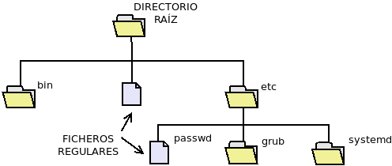

Gestión de archivos
*******************
Los datos almacenados en las memorias de almacenamiento (discos duros, tarjetas
de memoria, etc.) se almacenan de forma permanente y, aunque también lo hacen en
formato binario, la manera de hacerlo es totalmente distinta a la que se
practica en la memoria principal. Como, además, los dispositivos de
almacenamiento son muy dispares, el sistema operativo se encarga de abstraer al
usuario y las aplicaciones de las particularidades del acceso y la escritura a
través de la *gestión de archivos*.

Esta gestión la llevan a cabo los |SSOO| a través de un componente denominado
:dfn:`sistema de archivos`\ [#]_., cuyas principales funciones son:

- Estructurar la información en archivos y directorios (contenedores de archivos).
- Asignar espacio en el dispositivo a los archivos.
- Permitir el acceso a estos archivos.
- Gestionar el espacio libre disponible.

Para los usuarios y las aplicaciones los datos almacenados en los dispositivos,
no lo están en un espacio dividido en bloques sobre los que hay que leer o
escribir, sino que se agrupan en archivos, de manera que un archivo es un
conjunto de datos que constituyen una unidad, la cual:

- Ocupa cierto espacio en el dispositivo.
- Tiene un nombre para poder referirla. Su localización física (los bloques que
  ocupa) es indiferente para aplicaciones y usuarios, ya que el nombre es la
  referencia que usarán para acceder a ellos.
- Tiene asociadas unas propiedades que determinan cómo pueda llegar a ser usado.
- Constituye bien un programa, bien una información que debe ser interpretada
  por un programa para que pueda ser útil. Por ejemplo, un archivo puede ser una
  foto, que requerirá un visor de imágenes para poder ser vista; o un documento
  |PDF| que requerirá de un programa capaz de interpretarlos y mostrarlos, etc.

Organización del dispositivo
============================
Para que se puedan leer y escribir ficheros sobre un dispositivo, se requiere
primero dividirlo en partes que reciben el nombre de :dfn:`particiones`\ [#]_. A
cada partición es posible asignarle un sistema de archivos distinto, que haga a
la partición apta para la contención de archivos y directorios. Al proceso de
dotar de un sistema de archivos a una partición se le denomina :dfn:`formatear`.

Una vez creado el sistema operativo, el sistema operativo será capaz de definir
una serie de operaciones sobre archivos como crear, borrar, mover, modificar o
leer, que serán las que ordenen usuario y aplicaciones sobre el
dispositivo y que podrán ser completadas gracias al controlador del dispositivo.

Sistemas de archivos
====================
Existen distintos :dfn:`sistemas de archivos` que serán usados dependiendo del
sistema operativo instalado en el equipo. Por lo general, los sistemas
operativos soportan varios sistemas de archivos, aunque usan preferente uno o
varios sobre el resto.

Los sistemas de archivos pueden disponer o carecer de ciertas características:

**Tamaño máximo** (*MA*/*MS*)
   Los sistemas de archivos tienen limitados el tamaño máximo de archivo
   y el tamaño máximo del propio sistema de ficheros. En los que se usan
   modernamente, estos tamaños son lo suficientemente grandes como para no ser
   una preocupación, excepto en el sistema |FAT|, que aún se usa por su
   simplicidad en dispositivos externos de almacenamiento (4 GiB en ambos
   casos).

**Journaling**
   Cuando disponen de *journaling* los sistemas de archivos son capaces de
   gestionar transacciones\ [#]_. El *journaling* sirve para combatir la
   corrupción de datos, por lo que un sistema que carezca de él será más
   propenso a corromperse ante un apagado inesperado de la máquina.

**Seguridad**
   Un sistema de archivos habilita la seguridad de los ficheros cuando incluye
   en las propiedades de los archivos qué acciones sobre el propio fichero
   pueden hacer los distintos usuarios. Se profundizará en este aspecto al tratar
   :ref:`el próximo epígrafe <seg-ssoo>`.

**Fragmentación**
   Como en el caso de la memoria principal, las escrituras y borrados provocan
   la fragmentación de los datos en los sistemas de ficheros. Por lo general,
   estos siguen estrategias para minimizar y corregir la fragmentación. Una
   excepción, es |FAT| que no dispone de estos mecanismos y que, en
   consecuencia, tiende a presentar una gran fragmentación.

**Cuotas** (*Q*)
   Las cuotas permiten establecer cuál es el uso máximo que un usuario puede
   hacer del sistema de archivos. Por ejemplo, habilitaría para que no pudiera
   ocupar más de 1GiB en total. Por supuesto, requiere que el sistema tenga
   implementada la seguridad, porque de lo contrario no se podrá conocer a quién
   pertenece el archivo.

**Compresión** (*Z*)
   La compresión propicia que los ficheros, de forma transparente, se almacenen
   comprimidos en el sistema de archivos, lo que permite ahorrar espacio de
   almacenamiento.

**Instantáneas**
   Esta característica da la posibilidad de guardar el estado exacto de un
   sistema de archivos en un instante dado. Esto permitiría retrotraerse a ese
   instante en cualquier momento futuro.

**Espacios virtuales**
   Es la capacidad del sistema de archivos para constituir una partición virtual
   (llamada volumen) uniendo distintas particiones físicas de un mismo disco o
   discos distintos.

**Cifrado**
   El sistema de archivos puede también tener la capacidad de cifrar los datos
   de forma transparente al almacenarlos sin necesidad de *software* adicional.

**RAID**
   La capacidad de constituir un sistema |RAID| posibilita crear almacenamientos
   tolerantes a fallos o mejorar los rendimientos de lectura y escritura.
   Consulte :ref:`la sección del manual de linux dedicada a RAIDs <raid>`
   para más información.

.. table:: Sistemas de ficheros habituales
   :class: filesystems

   =========== ======================== ======  ====== === === === === === === === === ===
    Nombre      Sistema operativo\ [#]_  MA      MSA    J   S   Q   F   Z   I   E   C   R
   =========== ======================== ======  ====== === === === === === === === === ===
    FAT16       MSDOS                    4GiB    4GiB  \-  \-  \-  \-  \-  \-  \-  \-  \-
    FAT32       Windows 9\*              4GiB   16TiB  \-  \-  \-  \-  \-  \-  \-  \-  \-
    HPFS        OS/2                     2GiB    2TiB  \-  \-  \-   X  \-  \-  \-  \-  \-
    NTFS        Rama NT de Windows      16EiB   16EiB   X   X   X   X   X  \-  \-   X  \-
    ext2        Linux (obsoleto)         2TiB   32TiB  \-   X   X   X  \-  \-  \-  \-  \-
    ext4        Linux                   16TiB    1EiB   X   X   X   X  \-  \-  \-   X  \-
    btrfs       Linux                   16EiB   16EiB   X   X   X   X   X   X  \-  \-   X
    HFS         MacOs clásico            2GiB    2TiB  \-  \-  \-   X  \-  \-  \-  \-  \-
    HFS+        MacOS v10                8EiB    8EiB   X   X   X   X  \-  \-  \-  \-  \-
    JFS         AIX                      4PiB   32PiB   X   X   X   X   X  \-  \-  \-  \-
    UFS\ [#]_   Solaris, \*BSD           8ZiB    8ZiB   X   X   X   X  \-  \-  \-  \-  \-
    ZFS         Solaris, FreeBSD        16EiB   256ZiB  X   X   X   X   X   X   X   X   X
   =========== ======================== ======  ====== === === === === === === === === ===

Además, para los |CD|\ s se utiliza un sistema de ficheros particular
estandarizado denominado *CDFS*, también conocido por la norma *ISO* en que se
define: ISO-9660.

.. note:: También existen sistemas de archivos en red como |NFS| o |CIFS|, cuya
   utilidad es hacer accesible un sistema de ficheros remoto. Se escapan al
   propósito de este módulo.

Archivos
========
Todos los archivos tienen un **nombre** que los identifica inequívocamente. Cómo sea
el nombre dependerá del sistema de fichero en particular. En muchos sistemas
modernos la longitud está limitada a 255 *bytes*, aunque en otros más antiguos
como |FAT|, la longitud era muchos más reducida: 8 *bytes* para el nombre en sí
y 3 para la extensión.

Además, es común que los nombres se descompongan en nombre y extensión, aunque en
muchos ficheros esta descomposición es a efectos prácticos más que porque el
sistema de ficheros haga tal división. La extensión está constituida por los
caracteres que siguen al último carácter punto. Por ejemplo:

.. table::
   :class: ej-nombres

   ================ ============= ===========
   Nombre completo   Nombre        Extensión
   ================ ============= ===========
   protesta.pdf      protesta      pdf
   index.html        index         html
   retrato.jpg       retrato       jpg
   capitulo.1.txt    capitulo.1    txt
   ================ ============= ===========

y sirve para identificar el tipo de contenido del archivo y, en consecuencia,
con qué programa debe tratarse.

.. seealso:: Puede echarle un ojo a las `extensiones más habituales
   <https://es.wikipedia.org/wiki/Extensi%C3%B3n_de_archivo>`_.

Tipos
-----
Hay, fundamentelmente, dos tipos de archivos:

**Regulares**
   Son los archivos que contienen información, bien porque contiene un programa
   total o parcialmente, bien porque contienen datos cuya finalidad es que sean
   procesados por un programa.

**Directorios**
   Son archivos cuya misión es ser contenedores de archivos de cualquier tipo,
   incluidos otros directorios.

También es común en los sistemas de archivos encontrar un tercer tipo:

**Enlaces**
   Son simplemente enlaces hacia otros archivos. Esto permite ubicar un mismo
   contenido a través de dos ubicaciones distintas.

Además, en los sistemas UNIX todo se representa mediante un archivo, por lo que
existen todo un conjunto de **archivos especiales** cuya misión no es almacenar
información, sino representar dispositivos físicos o virtuales de E/S. De este
modo existen:

**De bloque**
   Son archivos que representan :ref:`dispositivos de bloques <disp-block>`. Por
   ejemplo, en un linux el archivo :file:`/dev/sda` es un archivo de bloques que
   representa el primer disco duro (dispositivo físico de bloques).

**De caracteres**
   Son archivos que representan :ref:`dispositivos de caracteres <disp-char>`. Por
   ejemplo, en un linux el archivo :file:`/dev/psaux` es un archivo de
   caracteres que representa al ratón (dispositivo físico de caracteres).

**De tubería**
   Son archivos que representan *tuberías* (*pipelines* en la terminología
   inglesa), las cuales son un canal para comunicar dos procesos de un mismo
   sistema entre sí de modo que los datos de salida de uno pasan como datos de
   entrada al otro.

**De socket**
   Son archivos que representan *sockets*, los cuales actúan como canal de
   comunicación entre dos o más procesos de un mismo sistema.

Estructura
----------
Los archivos en el sistema de archivos se estructuran gracias a los directorios,
que permiten agrupar dentro de ellos archivos. De este modo, todo archivo está
incluído dentro de un directorio. En consecuencia, un directorio (que es un
archivo) también se encuentra incluido dentro de otro directorio, al que se
denomina :dfn:`directorio padre`. Para que el nivel de directorios no sea
infinito debe existir un directorio que no tenga directorio padre, o mejor
dicho, sea directorio padre de sí mismo: a este directorio cuyo padre es él
mismo se le denomina :dfn:`directorio raíz` del sistema de ficheros y de él
parte la estructura que adopta la forma de un árbol invertido, de ahí el nombre
de árbol de directorios:

Para identificar inequivocamente a un archivo no se usa exclusivamente el
nombre, ya que puede haber dos ficheros distintos de igual nombre en distintos
directorios, sino el nombre con la ruta para llegar a él. Hay dos rutas:

- La **ruta absoluta**, que es la lista ordenada de directorios a partir del
  directorio raíz que debe seguirse para alcanzar el archivo. Por ejemplo, para
  llegar al archivo :file:`passwd` hay que pasar por el directorio raíz, el
  directorio :file:`etc` y, finalmente, se alcanza el archivo. En los sistemas
  *UNIX* el directorio raíz se representa como :file:`/` que es justamente el
  carácter que también se usa para separar los elementos de la lista. Por ese
  motivo la ruta es: :file:`/etc/passwd`. En un sistema *Windows*, en cambio,
  el caracter es :file:`\\`, así que la ruta se expresa: :file:`\\etc\\passwd`.
  Como la ruta absoluta de un fichero es única para cada fichero, este puede ser
  un identificador válido para referir al fichero.

- La **ruta relativa**, que es la ruta para llegar al fichero partiendo del
  directorio en que nos encontremos trabajando. Como podemos cambiar de
  directorio de trabajo, la ruta relativa no es única, sino que cambia según
  cuál sea este directorio de trabajo.

.. note:: Abundaremos enormemente en esto al estudiar de forma práctica los
   sistemas operativos.

.. rubric:: Notas al pie

.. [#] O *sistema de ficheros*. Es común usar indistintamente el término
   archivo o fichero en castellano.
.. [#] Cómo y cuántas particiones pueden realizarse se abordará con detalle en
   la próxima unidad.
.. [#] Una transacción está compuesta por varias acciones cuyo conjunto debe
   considerarse atómico, esto es, o se llevan a cabo todas o no debe llevarse a
   cabo ninguna. El concepto es ampliable a otros aspectos de la informática.
   Para entenderlo consideremos una venta: vender un producto implica por un
   lado apuntar el cobro y por otro lado restarlo del inventario. Deben llevarse
   a cabo las dos acciones, porque de lo contrario habrá un descuadre.
.. [#] Los sistemas referidos son los sistemas que lo tienen como sistema
   de ficheros habitual, no los que son capaces de soportarlo.
.. [#] |UFS| deriva del sistema de fichero de Berkeley usado en el |BSD|
   original. En algunos sistemas como Solaris o FreeBSD ha sido sustituido por
   |ZFS|.

.. |SSOO| replace:: :abbr:`SSOO (Sistemas Operativos)`
.. |PDF| replace:: :abbr:`PDF (Portable Document Format)`
.. |UFS| replace:: :abbr:`UFS (Unix File System)`
.. |BSD| replace:: :abbr:`BSD (Berkeley Software Distribution)`
.. |ZFS| replace:: :abbr:`ZFS (Zettabyte File System)`
.. |FAT| replace:: :abbr:`FAT (File Allocation Table)`
.. |NFS| replace:: :abbr:`NFS (Network File System)`
.. |CIFS| replace:: :abbr:`CIFS (Common Internet File System)`
.. |APIC| replace:: :abbr:`APIC (?)`
.. |CD| replace:: :abbr:`CD (Compact Distk)`
