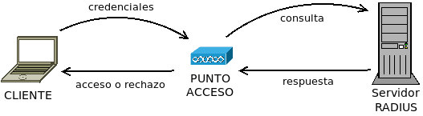

Sistemas activos de seguridad
*****************************

.. _radius:

Servidor RADIUS
===============
:dfn:`RADIUS` es un protocolo de autenticación que permite a un dispositivo de
red consultar las credenciales entregadas por un cliente a fin permitir o
rechazar su ingreso.

Para llevar a cabo su labor los servidores |RADIUS| disponde de la lista de
credenciales (pares usuario/contraseña) válidos) y la lista de dispositivos de
red autorizados a hacerle consultas.

`Freeradius <https://freeradius.org/>`_ es un proyecto de *software* libre que
implementa un servidor |RADIUS|.

.. _seg-proxy:

Servidor *proxy*
================
Un :dfn:`proxy` es una máquina que hace de intermediario en la comunicación
entre un cliente y un servidor. Estas comunicaciones se establecen con
protocolos de capa de aplicación y, en consecuencia, los *proxies* interceptan y
gestionan tráfico de aplicación. Hay distintos servidores *proxy*, dependendo
de cuál sea el tráfico para el que intermedien. Por ejemplo:

- *Proxy* |DNS|, que es el servicio que se encarga de obtener de un servidor |DNS|
  las resoluciones de nombres solicitadas por sus clientes y cachearlas a fin de
  acelerar las solicitudes posterioes. :ref:`dnsmasq` es un ejemplo de *proxy*
  de este tipo.

- *Proxy* |ARP| que consiste en la intermediación de un router a las peticiones
  |ARP| de las máquinas de una subred sobre máquinas de otra subred, enviando su
  propia dirección |MAC| a fin de que estas dirijan hacia él los paquetes para
  las máquinas de la otra subredi. Esto evita tener que añadir en los clientes la
  entrada correspondiente en la tabla de ecnaminamiento.

- *Proxies* web que intermedian en las peticiones |HTTP| y |HTTP|\ s, son los más
  habituales y a los que dedicaremos el resto del epígrafe.

Si nos ceñimos al sentido de la intermediación, Hay dos tipos de servidores *proxy*:

.. _proxy-web:

- Los :dfn:`servidores proxy` (a secas), que son aquellos que intermedian entre
  los clientes de una red y distintos servidores externos.

  .. image:: files/proxy.png

  Ciñéndonos al tráfico web, el *proxy* se encarga de intermediar entre las
  peticiones que los clientes locales hacen a los distintos servidores externos
  con el fin de:

  - Establecer permisos de acceso, cuotas o anchos de banda según los distintos
    usuarios.
  - Filtrar contenidos que la organización considere inapropiados.
  - Filtrar contenido considerado *spam* o *publicidad intrusiva*.
  - Cachear contenido a fin de acelerar las respuestas y ahorrar ancho de banda.

  Las tres últimas tareas exigen vigilar el tráfico circulante, lo cual es
  posible cuando el tráfico es |HTTP|, ya que la información circula sin cifrar
  y, por tanto, es accesible al *software* que se ejecute en el proxy*. Cuando
  el tráfico es, en cambio, |HTTP|\ s la información está cifrada y, en
  principio, son imposibles de llevar a cabo. Sin embargo, la :ref:`extensión
  SNI <sni>` de |TLS| envía, al menos, el nombre de dominio sin cifrar, lo cual,
  posbilita las labores de filtrado, simepre que este se base esclusivamente en
  el nombre del dominio.

  Como alternativa de filtrado a través del nombre de dominio, pueden usarse los
  :ref:`sumideros DNS <seg-sinkhole>`.

.. _proxy-web-inverso:

- Los :dfn:`servidores proxy inversos`, que son aquellos que intermedian entre
  todos los potenciales clientes y los servidores web para los que el *proxy*
  haga de intermediario. La diferencia, pues, entre éstos y los normales es que
  mientras los *proxies* a secas intermedian entre un conjunto limitado de
  clientes (los de la red local) y cualquier servidor web, los *proxies* inversos
  intemedian entre cualquier cliente y el conjunto limitado de servidores web
  para los que actúa de intermediario.

  .. image:: files/proxyinverso.png

  Los *proxies* web inversos llevan a cabo, principalmente, las siguientes
  tareas:

  - Si son varios los servidores de respaldo, el balanceo de carga entre todos
    ellos.
  - La absorción de tráfico excesivo (p,e, de ataques |DoS|).
  - El cacheo selectivo de páginas para agilizar las respuestas. Por ejemplo, se
    pueden cachear cuidadosamente contenidos dinámicos a fin de aligerar la
    carga de trabajo del servidor web. En caso de que el tráfico sea |HTTP|\ s,
    esto implica trasladar el punto extremo de la conexión cifrada al propio
    *proxy*.

  .. warning:: El *proxy* web inverso no tiene por qué encontrarse en la misma
     red local del servidor (o los servidores) web como el gráfico da a antender
     Sí es la situación habitual cuando el *proxy* es gestionado por la misma
     organización que el servidor *web*, pero no lo es en absoluto si se
     contrata el servicio (p.e. el servicio `cloudflare
     <https://www.cloudflare.com/>`).

.. todo:: Queda pendiente desarrollar el :ref:`epígrafe práctico sobre proxies
   <proxies>`. Cuando llegue el momento, muy probable habrá que pasar el texto
   de este epígrafe allí como introducción y dejar aquí una simple referencia.

.. _seg-sinkhole:

Sumideros |DNS|
===============
Si no se pretende controlar el acceso de los usuarios, sino simplemente filtrar
contenidos, son una alternativa bastante sencilla y mucho más ligera al filtrado
de dominios mediante la |SNI|.

.. seealso:: Consulte el epígrafe sobre :ref:`bloqueo DNS <dnsmasq-bloqueo>` para
   saber en qué consisten.

*Honeypots*
===========
Un :dfn:`honeypot` (*tarro de miel*) es un sistema especialmente diseñado para
atraer ataques con el fin de monitorizar y estudiar los ataques y desviar la
atención del atacante sobre el sistema principal.

.. _ids:

Análisis de la red
==================
Para analizar el estado de la red se usan diversas herramientas:

**Monitores**
   Los :dfn:`sniffers` son aplicaciones que capturan el tráfico circulante. No
   se lo apropian sino que se hace una copia con el fin de almacenarlo y
   estudiar luego cuál es su contenido. :ref:`tcpdump <tcpdump>` o
   :ref:`wireshark <wireshark>` son ejemplos de aplicaciones de este tipo.
   
**Inspectores de puertos**
   Son aplicaciones que analizan cuáles son los puertos en donde escuchan
   aplicaciones y cuáles son estas. Para el análises desde la propia máquina se
   usa :ref:`ss <ss>` y para el análisis desde distinta máquina :ref:`nmap <nmap>`.

**Sondas**
   Son aplicaciones que comprueban la conectividad. Entre ellas pueden citarse
   las órdenes :command:`ping` o :command:`traceroute`/:command:`tracepath`.

**Sistemas de detección de intrusos**
   Son aplicaciones que analizan y recopilan el tráfico de la red, buscan en
   esos datos patrones típicos de análisis y, si los encuentran, o envían un
   aviso al administrador (|NIDS|) o desencadenan una respuesta contra el ataque
   (|NIPS|).

   La complejidad de estos sistemas supone que consuman muchos recursos, ya que
   necesitan capturar y analizar constantemente información, y responder con
   celeridad.

Cortafuegos
===========
Su estudio se pospone al :ref:`tema siguiente <seg-firewall>`.

.. |NIDS| replace:: :abbr:`NIDS (Network Intrusion Detection System)`
.. |NIPS| replace:: :abbr:`NIPS (Network Intrusion Prevention System)`
.. |RADIUS| replace:: :abbr:`RADIUS (Remote Authentication Dial-In User Service)`
.. |ARP| replace:: :abbr:`ARP (Address Resolution Protocol)`
.. |MAC| replace:: :abbr:`MAC (Media Access Control)`
.. |TLS| replace:: :abbr:`TLS (Transport Layer Security)`
.. |DoS| replace:: :abbr:`DoS (Deny of Service)`
.. |SNI| replace:: :abbr:`SNI (Server Name Indication)`
