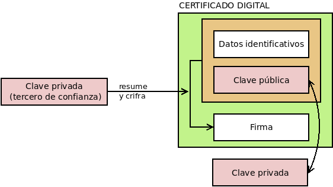
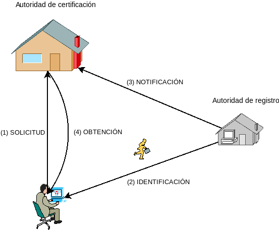

.. _cert-digital:

Certificado digital
*******************
.. note:: Tratamos los *certificados digitales de clave pública*, por lo que a
   partir de ahora hablaremos, simplemente, de *certificados digitales*.

Antes de pasar a las aplicaciones prácticas propiamente dichas, nos detendremos
en un concepto que usarán comúnmente tales aplicaciones. Téngase presente que a
pesar de que la suplantación de identidad parece resuelta gracias al cifrado
asimétrico, puesto que poder descifrar una firma supone que el firmante sea el
propietario de tal clave pública, hay aún una debilidad: en muchos casos, no
basta con haberse asegurado de que el remitente es el propietario de la clave,
sino que además se necesita conocer quién es realmente (p.e. una persona con
nombre y apellidos). La información de quién es nos la puede proporcionar el
firmante directamente, pero ¿cómo podemos estar seguros de que no nos miente?
¿Qué garantías tenemos de que ese propietario es quien dice ser?  Para subsanar
este último escollo existen los *certificados digitales*.

Concepto
========
Un :dfn:`certificado digital` es un documento compuesto por una clave pública
(asociada a una clave privada) y unos datos que identifican al propietario de
tales claves, todo él firmado por un tercero que avala la veracidad de tal
identificación.

.. note:: En consecuencia, la función de un certificado digital es acreditar la
   identidad del propietario de una clave pública; y esta es su aportación a los
   :ref:`fundamentos criptográficos que vimos en el apartado anterior
   <tecnicas-crypto>`. Así pues, cuando un proceso criptográfico requiera la
   acreditación de la identidad  (p.e. :ref:`firmar un documento oficial
   <firm-doc>`) habrá certificado; en cambio, cuando el proceso no requiere tal
   acreditación (p.e. un :ref:`transacción de criptomoneda <blockchain>`),
   bastará con la existencia de un par de claves pública y privada.

Es importante tener presente que lo que hemos denominados *datos identificativos*
en el esquema no son exclusivamente datos referentes a la identidad del
propietario del certificado, sino que son también metadatos relativos al propio
certificado como cuáles son las fechas entre las que el certificado es válido o
cuáles son las finalidades lícitas para las que se puede usar. Por ejemplo, un
certificado puede o no estar habilitado para firmar otros certificados (es decir
para actuar como tercero de confianza).

De esta forma, el propietario no cede a los demás una simple clave pública, sino
un documento acreditativo (el certificado) para asegurar la legitimidad de la
clave. Es obvio que el problema de suplantación no se soluciona simplemente por
adjuntar los datos de identificación, sino porque un tercero avala la relación
entre la clave y la identidad firmando el conjunto. Por tanto, hemos trasladado
el problema de **confianza** desde las claves del propietario a las claves del
tercero firmante. Así, pues, la pregunta ahora es: *¿cómo confiamos en el tercero?*

Estrategias de confianza
========================
Hay dos estrategias para conferir confianza a un tercero:

.. _web-trust-strat:

#. Una **red de confianza** totalmente descentralizada en que las relaciones de
   confianza entre los propietarios de las claves se establecen de igual a igual.
   Así, si dos propietarios --"Pepe" y "Paco"-- están seguros de la veracidad del
   certificado del otro (por ejemplo, por un encuentro físico), podrán firmarse
   los certificados y establecer una relación de confianza directa. Un tercer
   propietario llamado "Manolo", que no haya entrado en contaco con "Paco", pero
   si con "Pepe", tendrá una relación de confianza directa con "Pepe" y, en
   consecuencia, también podrá confiar en la veracidad del certificado de "Paco",
   puesto que "Pepe" lo avala y él confía en "Pepe" (relación de confianza
   indirecta). Los :ref:`certificados PGP <openpgp>`, de los que discutiremos al
   tratar el :ref:`correo electrónico <email-seguro>`, fundamentan su
   confiabialidad en *una red de confianza*.

   .. image:: files/webtrust.png

   .. _pki-strat:

#. Una infraestructura |PKI|, que es una estructura jerárquica de confianza. En
   ella, el tercero que acredita la identidad del propietario del certificado es
   una :dfn:`autoridad de certificación` (|CA|). Esta |CA| a su vez gozará de
   confianza, porque otra |CA| de nivel superior la haya acreditado firmándole el
   certificado. Los `certificados X.509
   <https://www.ssl.com/faqs/what-is-an-x-509-certificate/>`_, definidos en el
   :rfc:`5280`, basan su confianza en |PKI|.

   .. image:: files/PKI.png

El resto de la exposición se centra en esta segunda estrategia jerárquica. Las
primera estrategia sólo es ampliamente utilizada en el correo electrónico, por
lo que la trataremos al hablar sobre :ref:`el cifrado y la firma de mensajes de
correo electrónico <email-seguro>`.

.. _pki:

Infraestructura |PKI|
=====================
.. note:: Centraremos nuestra atención exclusivamente en los `certificados
   X.509`_, aunque una infraestructura de este naturaleza puede hacerse con otro
   tipo de certificados. Por ejemplo, los :ref:`certificados SSH <ssh-auth-certs>` fundamentan su
   confiabilidad también en una infraestructura |PKI|. Se tratará de ellos al
   analizar la :ref:`aplicación de la criptografía en la autenticación
   <auth-crypto>`.  Para la conversión entre claves generadas con Open\ |SSH| y
   Open\ |SSL| puede consultar el :ref:`epígrafe dedicado a ello
   <openssh-openssl>`.

Retomando lo expuesto hasta ahora, un *certificado digital* se compone de:

* Una clave pública.
* Unos datos identificativos referentes al propietario de la clave y al propio
  certificado.
* La firma digital de una *autoridad de certificación* sobre la clave pública y
  los datos identificativos, que avala la relación entre la clave y la
  identidad de su propietario.

Ahora bien, ¿quién es esta *autoridad de certificación* y por qué es digna de
confianza? Una :dfn:`autoridad de certificación` (a partir de ahora, |CA|) es
aquella entidad de confianza encargada de emitir (y revocar) certificados
digitales. Para llevar a cabo esta tarea la propia |CA| dispone de un
certificado, de manera que con su clave privada asociada firma los certificados
que emite. La estructura es jerárquica y el certificado de una |CA| intermedia
estará avalado por la firma de otra |CA| de rango superior. Sin embargo, la
relación jerárquica no puede ser infinita por lo que al final de la cadena de
confianza siempre existirán unas |CA| raíz cuyos certificados son autofirmados,
esto es, certificados que nadie ha avalado digitalmente. La confianza en los
certificados raíz se debe a que los propios sistemas operativos y navegadores
web los incorporan de serie, porque de algún modo los fabricantes de este tipo
de *software* habrán efectuado la verificación. Así, *Debian* incluye el paquete
:deb:`ca-certificates` con certificados raíz que reconoce como confiables.

.. note:: Aunque un certificado raíz puede en teoría firmar certificados de
   usuario, en la práctica una infraestructura |PKI| tiene siempre al menos un
   certificado intermedio.

Un ejemplo de esta jerarquía es el :ref:`certificado gratuito para servidores
web <nginx-https>` emitido por `Let's Encrypt`_ (descargable en `esta dirección
<http://r3.i.lencr.org/>`_), cuyo certificado a su vez está firmado por `Digital
Signature Trust`_ (la cual sí es una |CA| raíz)\ [#]_::

   $ wget -qO letsencrypt.cer "http://r3.i.lencr.org/"
   $ openssl x509 -inform der -in letsencrypt.cer -subject -issuer -noout
   subject=C = US, O = Let's Encrypt, CN = R3
   issuer=O = Digital Signature Trust Co., CN = DST Root CA X3

Sea como sea, las |CA| generan distintos tipos de certificados:

+ Para otra |CA| subordinada.
+ Para persona física o jurídica.
+ Para firma de código.
+ Para servidor en red.

.. _cert-clases:

Además, suelen clasificar los certificados que emite dependiendo del grado de
verificación que haya exigido, del grado de seguridad de las claves que use o
de a quienes vayan dirigidos (para persona física, para administración pública,
etc). Tales clasificaciones no siguen unas mismas reglas, pero suelen coincidir
en la nomenclatura: "Clase 1", "Clase 2", "Clase 3", etc. donde mayor es el
cardinal cuanto mayor el grado de seguridad. Por ejemplo, una clasificación
podría ser la siguiente:

**Clase 1**
   Certificado que acredita parcialmente la identidad mediante algún mecanismo
   telemático. Por ejemplo, acredita la dirección de correo electrónico de una
   persona o el nombre de dominio a un servidor. Sin embargo, no queda
   constancia fehaciente de quién es la persona física propietaria del correo o
   quién el propietario del dominio.

**Clase 2**
   Exige una acreditación fehaciente de la identidad, generalmente mediante
   asistencia física. Con un certificado de esta clase sí se puede asociar un
   certificado personal a una persona física o un nombre de dominio a su empresa
   propietaria.

   Los certificados personales expedidos por la |FNMT| podrían ser un ejemplo de
   esta clase.

**Clase 3**
   Para su expedición se exige el más alto grado de acreditación.y se usan los
   algoritmos y claves más potentes.

.. note:: Legalmente, en España el Ministerio competente reconoce una seríe de
   |CA| cualificadas para emitir certificados con los cuales la firma digital
   tiene exactamente la misma validez legal que la firma manuscrita (más
   adelante :ref:`trataremos brevemente el estatus legal <firma-legal>`), Una
   de estas |CA| es |CERES|, departamento de la `Fábrica Nacional de Moneda y
   Timbre <http://www.cert.fnmt.es>`_, que emite en España una buena parte de
   los certificados para persona física gracias a una `extensa red de oficinas
   de registro <http://mapaoficinascert.appspot.com/>`_ (|RA|) que incluye
   oficinas de la Seguridad Social, de la Agencia Tributaria o ayuntamientos.

Certificados personales
-----------------------
Son, obviamente, certificados de :ref:`clase 2 <cert-clases>` (requieren una
verificación física de la identidad) y su proceso típico de emisión es el
siguiente:

#. El interesado genera localmente un par de claves y hace ante la |CA| una
   solicitud de certificado (llamada |CSR|), por lo general a través de un
   servicio web. La solicitud incluye la clave pública y los datos
   identificativos del solicitante (pero, obviamente, no la clave privada, porque
   esa nunca debe quedar en posesión de nadie más que del propietario). La |CA|,
   no obstante, no puede atender inmediatamente la petición, ya que debe
   corroborar antes la identidad del solicitante.

#. El interesado se acerca físicamente a la oficina de una |RA| (autoridad de
   registro) a fin de confirmar que es quien indicó en su solicitud. Una
   :dfn:`autoridad de registro` no es más que una entidad en la que delega la
   |CA| la verificación de la identidad de los solicitantes.

#. Completada la verificación, la |RA| confirma a la |CA| la identidad del
   solicitante, momento a partir del cual ésta puede ya crear el certificado
   a partir de la |CSR| y algunos datos adicionales que añada (p.e. la fecha de
   caducidad)

#. El interesado vuelve al dispositivo en el que hizo la solicitud y completa
   el proceso descargando el certificado desde el servicio de la |CA| y
   añadiendo a éste la clave privada almacenada localmente. El resultado es un
   :ref:`archivo p12 <cert-p12>` o su instalación directa en el navegador o el
   sistema operativo que estuviera usándose. Obsérvese que es necesario volver
   al dispositivo inicial, porque es en él donde se encuentra almacenada la
   clave privada.

Por último, es necesario señalar que, para asegurar la validez de un
certificado, no basta sólo con comprobar si el certificado no ha caducado y la
cadena de confianza a través de las firmas que contienen los certificados de la
cadena. Un certificado puede haberse revocado antes de caducar y, en
consecuencia, dejar de haber sido válido antes de tiempo. Por eso, las |CA|
mantienen unas listas de revocación (|CRL|) en que incluyen todos aquellos
certificados revocados con la fecha efectiva de revocación y la causa por la que
se produjo; y es preciso a efectos de corroborar la validez de un certificado
consultar tal lista. Para facilitarlo, las |CA| suelen ofrecer un servicio de
consulta a través del estándar |OCSP| descrito en el :rfc:`6960`.

.. seealso:: Más adelante realizaremos una :ref:`verificación completa de la
   validez de un certficado <verif-cert>`.

Certificados de servidor
------------------------
Avalan la identidad de una máquina, esto es, que una máquina (o un conjunto de
máquinas, si estamos ante un servicio distribuido) responden a un determinado
nombre |DNS|. Así, por ejemplo, cuando conectamos a la `página oficial de la
Presidencia del Gobierno <https://www.lamoncloa.gob.es>`_, su certificado de
servidor avala que la máquina con la que conectamos es
:kbd:`www.lamoncloa.gob.es` y no una impostora que ha logrado que conectemos a
ella :ref:`envenenando nuestro DNS <dns-spoofing>`. 

En los certificados de servidor, lo que se acredita no es una identidad física,
sino uno o varios nombres, por lo que si consultamos uno (tal como se explica
en el próximo epígrafe), nos toparemos con que::

   $ openssl x509 -in /etc/ssl/certs/letsencrypt-fullchain.crt -subject -ext subjectAltName -noout
   subject=CN = lets2.iescdl.es
   X509v3 Subject Alternative Name: 
       DNS:azure.iescdl.es, DNS:lets.iescdl.es, DNS:lets2.iescdl.es

La obtención de estos certificados necesita que la máquina acredite su
identidad, esto es, que acredite que el nombre |DNS| resuelve a su |IP|. Hay
distintos niveles de acreditación ya que quizás no sólo interesa acreditar la
propiedad del nombre |DNS|, sino, por ejemplo, también la propiedad del nombre
comercial de la empresa para la que se quiere crear el sitio web (véanse las
:ref:`clases de certificado <cert-clases>`). Para el nivel más básico de
acreditación, esto es, aquel en que sólo se pretende acreditar la propiedad
sobre el nombre |DNS|, es posible la acreditación puramente telemática. Para
ella, existe definido el protocolo |ACME|, descrito en :ref:`este epígrafe
sobre nginx <nginx-https>`. 

.. note:: Tenga presente que, aunque descritos dentro de la configuración de un
   servidor web, estos certificados X.509 son válidos para cualquier protocolo
   seguro basado en |SSL|/|TLS|.

Para descargar el certificado asociado a un sitio web podemos usar el subcomando
:manpage:`s_client` de Open\ |SSL|:

#. Para obtener el certificado del servidor::

      $ openssl s_client -servername www.iescastillodeluna.es -connect www.iescastillodeluna.es:443 < /dev/null > cert.pem
      depth=2 C = US, O = Internet Security Research Group, CN = ISRG Root X1
      verify return:1
      depth=1 C = US, O = Let's Encrypt, CN = R3
      verify return:1
      depth=0 CN = iescastillodeluna.es
      verify return:1
      DONE

   Además, obtendremos la verificación de toda la cadena de confianza. La opción
   :kbd:`-servername` permite pasar :ref:`el valor de la extensión SNI <sni>`.

#. Para comprobar la cadena de confianza sin obtener el certificado podemos añadir
   un par de opciones más::

      $ openssl s_client -quiet -no_ign_eof -servername www.iescastillodeluna.es -connect www.iescastillodeluna.es:443 < /dev/null
      depth=2 C = US, O = Internet Security Research Group, CN = ISRG Root X1
      verify return:1
      depth=1 C = US, O = Let's Encrypt, CN = R3
      verify return:1
      depth=0 CN = iescastillodeluna.es
      verify return:1
      DONE

   .. note:: Esta acción permite verificar el certificado y toda su cadena de
      confianza de forma equivalente a la que se describe :ref:`algo más
      adelante <verif-cert>` para archivos de certificados. Es bastante cómoda,
      pero sólo nos sirve si se obtiene el certificado de un servidor.

#. Para obtener la cadena completa de certificados basta con añadir
   la opción :kbd:`-showcerts` a la primera orden::

      $ openssl s_client -showcerts -servername www.iescastillodeluna.es -connect www.iescastillodeluna.es:443 < /dev/null > fullchain.pem
      depth=2 C = US, O = Internet Security Research Group, CN = ISRG Root X1
      verify return:1
      depth=1 C = US, O = Let's Encrypt, CN = R3
      verify return:1
      depth=0 CN = iescastillodeluna.es
      verify return:1
      DONE

   .. _csplit-pem:

   Esto, no obstante, generará un |PEM| con todos los certificados
   concatenados. Si queremos obtenerlos por separado, podemos pasar
   la salida por :ref:`csplit <csplit>`::

      $ openssl s_client -showcerts -servername www.iescastillodeluna.es -connect www.iescastillodeluna.es:443 < /dev/null | \
         csplit -fcert -b%02d.pem -sz - '%^-----B%' '/^-----B/' '{*}'

   que generará los archivos :file:`cert00.pem`, :file:`cert01.pem`, etc, cada
   uno de los cuales contiene un certificado público. Como :ref:`openssl
   <openssl>` obtiene los certificados de abajo arriba, el primer archivo
   contendrá el certificado de servidor, el segundo el certificado de la |CA|
   que firmo éste último y así sucesivamente.

   .. note:: :ref:`csplit <csplit>` es una orden que permite dividir un archivo en
      varios utilizando un patrón. En nuestro caso usamos :kbd:`/^-----B/`,
      porque todos los certificados y claves privadas concatenados en un
      archivo |PEM| (que veremos a continuación) empiezan por una línea de la
      forma ":kbd:`-----BEGIN`". Es importante tenerlo presente, porque esta
      misma orden podemos usarla directamente sobre un archivo |PEM|::

         $ csplit -fcert -b%02d.pem -sz varioscertificados.pem '%^-----B%' '/^-----B/' '{*}'

.. _X.509:

Formatos
--------
Los certificados digitales se presentan en distintos formatos de archivo que
conviene conocer, porque en ocasiones para hacer una determinada operación o
utilizarlo con cierta aplicación lo necesitaremos en uno concreto. Además, de la
descripción de estos formatos incluimos, a modo de vademécum, las órdenes más
comunes con :program:`openssl` para transformar del formato |PEM| (el estándar
común en el *software* libre) al resto de formatos y viceversa\ [#]_:

|PEM|
   Es el estándar desarrollado por los :rfc:`1421`, :rfc:`1422`, :rfc:`1423` y
   :rfc:`1424` y muy usado por aplicaciones de *software* libre (p.e. los
   certificados de servidor de :ref:`nginx <n-ginx>` o :program:`apache` se
   almacenan usando este estándar). Cuando se aseguran mediante cifrado
   simétrico, sólo se cifra la clave privada. Los archivos |PEM| son, en realidad,
   contenedores de certificados, de manera que a menudo contienen sólo la clave
   privada, o sólo un certificado, o el certificado y la clave privada,
   o el certificado, la clave privada y toda la cadena de certificados
   de las |CA|\ s intermedias necesarias para la verificación.

   Este estándar genera archivos (normalmente imprimibles mediante codificación
   Base64_) y suele presentarse bajo estas extensiones:

   * ``.pem`` tanto cuando contienen sólo el certificado (y,
     opcionalmente, también los de la autoridad de certificación) como cuando
     contienen, además, la clave privada. Los certificados están codificados en Base64_.
   * ``der`` cuando contienen sólo el certificado o la clave privada, pero se
     encuentran codificados en |DER|.
   * ``.key`` cuando el fichero contiene sólo la clave privada.
   * ``.cer`` y ``.crt`` cuando contiene sólo el certificado.

   Los distintos certificados dentro del archivo son fácilmente distinguibles
   porque su codificación Base64_ se prologa con la marca :kbd:`----BEGIN
   CERTIFICATE----` y se cierra con :kbd:`-----END CERTIFICATE-----` y con una
   leyenda similar también se prologa y cierra la clave privada. No obstante lo
   anterior, en ocasiones el certificado no se presenta codificado en Base64_
   sino codificado en forma binaria (formato |DER|). De hecho, la codificación
   en Base64_ se obtiene a partir de la binaria añadiendo las leyendas de
   prólogo y de cierre ya descritas\ [#]_.

   Cuando el certificado está en esta forma |DER|, el archivo sólo puede
   contener o el certificado o la clave privada, ya que no hay marcas
   :kbd:`BEGIN`/:kbd:`END` que puedan separar los distintos certificados.
   :command:`openssl` presupone que la codificación es Base64_, así que cuando
   se trabaja con este formato no hay que expresar que tiene esta codificación
   ("*PEM*" como la llama el :command:`openssl`). En cambio, cuando utilicemos la
   codificación |DER| necesitaremos indicarlo expresamente con :kbd:`-inform
   der`, si es un archivo de entrada, o :kbd:`-outform der`, si es un archivo de
   salida.

   Algunas operaciones habituales con este tipo de certificado son:

   #. Ver los datos públicos del certificado::

         $ openssl x509 -in CERTIFICADO.pem -text -noout

      .. warning:: Si el archivo contiene varios certificados públicos, sólo
         mostrará el primero presente en el archivo. Siga leyendo para saber
         cómo ver el resto.

      .. _openssl-hash-subject:

   #. Generar el *hash* del campo "*Subject*"::

         $ openssl x509 -in CERTIFICADO.pem -hash -noout

      .. note:: Este *hash* es el que se usa para generar el nombre del enlace
         simbólico en :file:`/etc/ssl/certs`. Véase más adelante :ref:`catálogo
         de certificados <catalogo-cert>`.

      También es posible generar el *hash* del campo "*Issuer*"\ [#]_::

          $ openssl x509 -in CERTIFICADO.pem -issuer_hash -noout

   #. Comprobar que una clave privada (en :file:`CERTIFICADO.key`) corresponde
      a un certificado (en :file:`CERTIFICADO.pem`)::

         $ openssl x509 -in CERTIFICADO.pem -modulus -noout | md5sum
         513830b5a6d44284ac84deb1566f34b6  -
         $ openssl rsa -in CERTIFICADO.key -modulus -noout | md5sum
         513830b5a6d44284ac84deb1566f34b6  -

      Si coinciden (como es el caso), entonces la clave privada es la
      correspondiente.

   #. Generar un archivo ``.p12`` a partir de los archivos ``.pem`` y ``,key``::

         $ openssl pkcs12 -export -in CERTIFICADO.pem -inkey CERTIFICADO.key -out CERTIFICADO.p12

      supuesto que tengamos certificado y clave privada en distinto archivo. Si
      están contenidas en el mismo |PEM| basta la opción :kbd:`-in`.
      El archivo con el certificado puede contener también el certificado de
      la(s) autoridad(es) de certificación. Si el certificado de la autoridad
      está en archivo distinto, pero se quiere incluir dentro del resultado
      puede referirse este tercer archivo mediante la opción :kbd:`-CAfile`.

      .. note:: La orden requerirá interactivamente, en principio. dos
         claves: una para descifrar la clave privada contenida en el |PEM| y
         otra para cifrar :file:`CERTIFICADO.p12`\ [#]_. 
         Para pasar por la línea de órdenes las claves (útil en *scripts*)
         utilice las opciones :kbd:`-passin` y :kbd:`-passout` y consulte la
         sección "Pass Phrase Options" de :manpage:`openssl(1)`.

   #. Transformar el certificado |PEM| al formato |PKCS| #7::

         $ openssl crl2pkcs7 -nocrl -certfile CERTIFICADO.pem -out CERTIFICADO.p7b

   #. Ver todos los certificados contenidos en el archivo |PEM|.  Esto se logra
      traduciendo el certificado al formato |PKCS| #7 primero, porque para
      este formato :command:`openssl` sí muestra la información sobre todos::

        $  openssl crl2pkcs7 -nocrl -certfile CHAIN.pem | openssl pkcs7 -print_certs -text -noout

   #. Transformar el certificado |PEM| en Base64_ a codificación |DER|::

         $ openssl x509 -in CERTIFICADO.pem -outform der -out CERTIFICADO.crt

   #. Trasformar la clave privada |PEM| en Base64_ a codificación |DER|::

         $ openssl rsa -in CERTIFICADO.key -outform der -out CERTIFICADO.key.der

      .. warning:: El formato resultante no estará cifrado y, por tanto, la
         clave privada estará totalmente desprotegida.

   #. Ver los datos del certificado (si usa codificación |DER|)::

         $ openssl x509 -inform der -in CERTIFICADO.crt -text -noout

   #. Trasformar un certificado público |DER| a Base64_::

         $ openssl x509 -inform der -in CERTIFICADO.crt -outform pem -out CERTIFICADO.pem

   #. Trasformar la clave privada en codificación |DER| a Base64_ protegiéndola
      con un cifrado |AES|\ 256)::

         $ openssl rsa -inform der -in CERTIFICADO.key.der -outform pem -aes256 -out CERTIFICADO.key

      .. note:: Consulte :manpage:`openssl-rsa(1)` para ver qué otros parámetros
         cifran la clave con algoritmos distintos.

.. _cert-p12:

|PKCS| #12 (:kbd:`.p12` o, frecuentemente en *Windows*, :kbd:`.pfx`)
   Formato originario de Microsoft_ que se acabó estandarizando mediante el
   :rfc:`7292` y contiene tanto el certificado como la clave privada asociada.
   También puede contener certificados de |CA| intermedias. En este formato toda
   la información contenida esta cifrada con una clave simétrica (a diferencia
   del |PEM| que sólo cifra la clave privada) y es el que suelen usar los
   navegadores para exportar e importar los certificados personales de los
   usuarios.

   Operaciones habituales:

   #. Convertir el archivo :kbd:`.p12` al formato |PEM|\ [5]_ en un sólo archivo::

         $ openssl pkcs12 -in CERTIFICADO.p12 -out CERTIFICADO.pem

      .. note:: Si se quiere generar un archivo |PEM| por cada certificado (o
         clave privada) contenida en el :kbd:`.p12`, :ref:`podemos valernos de
         csplit como ya ilustramos antes <csplit-pem>`.

   #. Ídem, pero separando en dos archivos la clave pública y la privada::

         $ openssl pkcs12 -in CERTIFICADO.p12 -nocerts -out CERTIFICADO.key
         $ openssl pkcs12 -in CERTIFICADO.p12 -nokeys -out CERTIFICADO.pem

      .. note:: Al generar el |PEM| con el certificado se puede querer
         no incluir los certificados de las |CA| intermedias añadiendo
         :kbd:`-clcerts`; o justo lo contrario y sólo incluir los certificados
         intermedios (añadiendo :kbd:`-cacerts`).

   #. Ver los datos del certificado (no hay forma directa, así que hay
      que traducir a |PEM| y obtener la información de la traducción)::

         $ openssl pkcs12 -in CERTIFICADO.p12 -clcerts -nokeys | openssl x509 -text -noout

|PKCS| #7
   Formato estandarizado a través del :rfc:`2315` que sólo contiene el
   certificado (no la clave privada). Suele usarse en sistemas *Windows* y
   aplicaciones escritas en Java. Utiliza las extensiones:

   * ``.p7b`` cuando está codificado en Base64_. En este caso el archivo puede
     contener varios certificados públicos prologado y cerrado cada uno de ellos
     con una leyenda semejante a la que vimos para el caso del formato |PEM|.

   * ``.p7c`` cuando contiene un único certificado público en codificación
     |DER|. En este caso, debemos usar la opción :kbd:`-inform der` para
     informar a :command:`openssl`.

   Operaciones habituales:

   #. Consultar los datos de los certificados incluidos::

         $ openssl pkcs7 -in CERTIFICADO.p7b -print_certs -text -noout

      .. note:: A diferencia de cuando se trata con el formato |PEM|, la
         opción :kbd:`-print_certs` para este tipo de formato muestra la
         información de todos los certificados incluidos en el archivo.

   #. Consultar el dato del certificado codificado en |DER|::

         $  openssl pkcs7 -inform der -in CERTIFICADO.p7c -print_certs -text -noout

   #. Transformar el certificado |PKCS| #7 al formato |PEM|::

         $ openssl pkcs7 -in certificate.p7b -print_certs -out certificate.pem

.. seealso:: Como referencia para este apartado se ha usado la `extensa
   respuesta a una pregunta formulada en serverfault
   <https://serverfault.com/questions/9708/what-is-a-pem-file-and-how-does-it-differ-from-other-openssl-generated-key-file>`_

.. note:: Lo habitual es que los navegadores:

   * Usen el formato |PKCS|\ #12 para exportar e importar certificados
     personales (que incluyen la clave privada).

   * Usen el formato |PKCS|\ #7 para exportar e importar certificados de
     terceros (que, en consecuencia, no incluyen la clave privada).

.. _info-cert:

Anatomía del certificado
------------------------
Consultar la información contenida en el certificado puede proporcionar datos
muy jugosos sobre el propio certificado y eso es lo que haremos con
:command:`openssl`, ya que, aunque el formato |PEM| sea imprimible sólo
es información binaria codificada en Base64_, por lo que un :ref:`cat <cat>` es
de poca ayuda. La orden para consultar los datos del certificado ya se encuentra
escrita en el epígrafe anterior::

   $ openssl x509 -in CERTFICADO.pem -text -noout

Si aplicamos esta orden sobre, por ejemplo, un certificado de servidor emitido por  `Let's
Encrypt`_ obtendremos lo siguiente:

.. literalinclude:: files/azure-lets.pem
   :language: none

Observando la salida se distinguen dos partes:

- Los datos en sí (:kbd:`Data`).
- La firma de tales datos (:kbd:`Signature Algorithm`) para lo cual han usado 
  como :ref:`función hash el algoritmo sha256 <hash>`.

Dentro de los datos podemos distinguir:

* Datos propiamente identificativos como su número de serie o la identidad del
  propietario del certificado (``Subject``).
* Datos referentes al propio certificado como su validez o quién es el firmante
  (``Issuer``)\ [#]_.
* La clave pública del certificado (``Subject Public Key Info``).

Uno de los campos (``X509v3 extensions``) contiene campos adicionales con
información de cualquiera de los tres tipos anteriores. Algunos de estos campos
ofrecen información interesante como:

+ La |URL| en la que comprobar si el certificado está revocado (``Authority
  Information Access``).
+ Un identificador para el propio certificado (``X509v3 Subject Key Identifier``).
+ El identificador para el certificado con que la |CA| firmó (``X509v3 Authority
  Key Identifier``).

La opción ``-text`` de :command:`openssl` devuelve toda la información, pero
podemos afinar (véase :manpage:`openssl-x509(1)`)::

   $ openssl x509 -in CERTIFICADO.pem -subject -noout
   subject=CN = lets2.iescdl.es
   $ openssl x509 -in CERTIFICADO.pem -dates -noout
   notBefore=Jan 18 10:03:44 2021 GMT
   notAfter=Apr 18 10:03:44 2021 GM
   $ openssl x509 -in CERTIFICADO.pem -issuer -noout
   issuer=C = US, O = Let's Encrypt, CN = R3
   $ openssl x509 -in CERTIFICADO.pem -pubkey -noout
   -----BEGIN PUBLIC KEY-----
   MIIBIjANBgkqhkiG9w0BAQEFAAOCAQ8AMIIBCgKCAQEA4LrdwliOk4GMcmKKk0R/
   RkK9iDO4Vr56azwv3Z/2UI+e/9QIZ0sg9UVXM24mIbslzGppi3uSzqauiy9GMYyr
   A7WbwTFbgU3Q6WnNkqgoFd7bOUxaEhnQlfcTu4yor5x/tLH/worocmFAXhIy9jrE
   yVzR/XqKutVIWKhPuefnrXvLR1oYWv2bW/zED03IHNRcTyZNa8udOfDCZyqaHjM8
   4bnlgoiMAmP5Ar4J7Qdeht5cIBY4ZNmCmTHKWSjbEFW7h6hl7HiHh8+gd6X6SqZW
   GAAYPU/RjkkwZF9GNK5RcxxRXhjKGkwMO9IKlZ8gHYNplR2yuHujVsUR+IcRl9MS
   wwIDAQAB
   -----END PUBLIC KEY-----

Los campos propios de la extensión también pueden obtenerse, aunque hay que
recurrir a :manpage:`x509v3_config(5)` para saber cuáles son sus nombres::

   $ openssl x509 -in CERTIFICADO.pem -ext authorityInfoAccess -noout
   Authority Information Access: 
       OCSP - URI:http://r3.o.lencr.org
       CA Issuers - URI:http://r3.i.lencr.org

En este caso, el campo nos indica cuál es la |URL| con el servicio |OCSP| donde
podemos comprobar si el certificado está revocado y dónde se encuentra el
certificado con el que firmo este certificado. No obstante lo anterior,
:command:`openssl` ya ofrece una opción para obtener directamente la |URL| con
el servicio |OCSP|::

   $ openssl x509 -in CERTIFICADO.pem -ocsp_uri -noout
   http://r3.o.lencr.org

.. _verif-cert:

Verificación
------------
:command:`openssl` proporciona la suborden ``verify`` para verificar la validez
de un certificado en lo referente a las fechas y a la cadena de confianza de las |CA|.
Aún, sin embargo, el certificado puede ser invalido por haberse revocado. Por
ello, las |CA| mantienen una listas de revocación (|CRL| por sus siglas en
inglés), donde se registran los números de serie de los certificados que han sido revocados y en qué
momento se ha realizado tal operación. En consecuencia, cuando se verifica un
certificado también ha de comprobarse si éste está incluido en la |CRL|.

Como verificar la revocación mediante |CRL| exige descargar la lista y 
tiene que estar actualizada, existe el protocolo |OCSP| que permite consultar
directamente a la propia |CA| si el certficado está revocado. Esta es la
operación que pretendemos ilustrar bajo este epígrafe.

Supongamos que tenemos el certificado :file:`CERTIFICADO.pem` del epígrafe
anterior emitido por `Let's Encrypt`_, la orden::

   $ openssl verify CERTIFICADO.pem

comprobará si el certificado es válido utilizando los certificados raíz
instalados en el sistema (en una *Debian* en :file:`/etc/ssl/certs`). Sin
embargo, en este caso el certificado firmante de `Let's Encrypt`_ no es un
certificado raíz, ya que esta actúa como una |CA| subordinada. Por tal motivo,
fallará y requeriremos obtener también el certificado firmante. Es probable que
:file:`CERTIFICADO.pem` también contenga el de `Let's Encrypt`\ [#]_, pero si no
fuera el caso, podríamos obtenerlo muy fácilmente de la  |URL|
`http://r3.i.lencr.org <http://r3.i.lencr.org>`_ según nos informa el propio
certificado. Con ambos certificados podríamos reintentar la verificación con::

   $ openssl verify -CAfile FIRMANTE.pem CERTIFICADO.pem

Esta comprobación ya funcionará, porque el certificado firmante sí está firmado
a su vez por un certificado raíz que posee el sistema. Si no fuera así,
podríamos ir añadiendo los sucesivos certificados de las |CA| intermedias dentro
de :file:`FIRMANTE.pem`.

Hay algunas variantes interesantes a esta orden:

* La opción :kbd:`-no-CApath` evita que se usen los certificados raíz instalados
  en el sistema. La verificación obligaría, pues, a incluir en
  :file:`FIRMANTE.pem` también el certificado raíz de la |CA| pertinente.

* La opción :kbd:`-partial_chain` permite hacer la verificación, aunque no se
  tenga la cadena completa de |CA|. Por consiguiente::

   $ openssl verify -no-CApath -partial_chain -CAfile FIRMANTE.pem CERTIFICADO.pem

  podría verificar el certificado, aunque :file:`FIRMANTE.pem` no contuviera
  también el certificado raíz.

Lo anterior, no obstante, no puede verificar si el certificado ha sido revocado
y, por tanto, es a pesar de todo inválido. Para ello hay que recurrir a la |CA|
y en el caso de `Let's Encrypt` la verificación es sencilla porque ofrece el
servicio a través del estándar |OCSP|::

   $ openssl ocsp -url "$(openssl x509 -in CERTIFICADO.pem -ocsp_uri -noout)" \
        -issuer FIRMANTE.pem -cert CERTIFICADO.pem
   WARNING: no nonce in response
   Response verify OK
   azure.pem: good
           This Update: Jan 21 11:00:00 2021 GMT
           Next Update: Jan 28 11:00:00 2021 GMT

Obsérvese que hay que proporcionar la |URL| con el servicio, el certificado que
se desea comprobar y el certificado firmante. Si el certificado estuviera revocado,
la verificación se completaría con éxito::

   $ openssl verify -CAfile FIRMANTE.pem CERTIFICADO.pem
   CERTFICADO.pem: OK

pero al comprobarse su validez ante la autoridad certificadora:

.. code-block:: console
   :emphasize-lines: 5, 8

   $ openssl ocsp -url "$(openssl x509 -in CERTIFICADO.pem -ocsp_uri -noout)" \
        -issuer FIRMANTE.pem -cert CERTIFICADO.pem
   WARNING: no nonce in response
   Response verify OK
   CERTIFICADO.pem: revoked
           This Update: Jan 25 11:34:36 2021 GMT
           Next Update: Feb  1 11:34:36 2021 GMT
           Revocation Time: Jan 18 17:40:13 2021 GMT

nos descubriría que el certificado ha sido revocado y cuándo lo fue\ [#]_.
También se puede indicar cuál fue la razón de la revocación, como ocurre cuando
se revoca automáticamente un certificado digital de la |FNMT| por haberse pedido
otro posteriormente:

.. code-block:: console
   :emphasize-lines: 7

   $ openssl ocsp -url "$(openssl x509 -in josem.pem -ocsp_uri -noout)" \
        -issuer FIRMANTE.pem -cert josem.pem
   Response verify OK
   josem.pem: revoked
           This Update: Nov  6 13:10:47 2021 GMT
           Next Update: Nov  6 21:10:47 2021 GMT
           Reason: superseded
           Revocation Time: Nov  3 08:07:08 2021 GMT

.. warning:: Cerciórese de que el archivo |PEM| del certificado firmante no
   contiene también el propio certificado u obtendrá un :kbd:`Unauthorized
   (6)`. 

.. _cert-gen:

Creación de una |PKI|
---------------------
.. https://fam.tuwien.ac.at/~schamane/_/blog/2019-07-18_selfsigned_subjectaltname.htm
.. https://deliciousbrains.com/ssl-certificate-authority-for-local-https-development/
.. https://gist.github.com/Soarez/9688998
.. https://adfinis.com/en/blog/openssl-x509-certificates/
.. https://www.digicert.com/kb/ssl-support/openssl-quick-reference-guide.htm
.. https://wiki.infn.it/cn/ccr/x509/home/utenti/server/manuale

.. warning:: Para obtener certificados aceptables, ya sean personales o de
   servidor, debe recurrirse a una |CA| reconocida, ya que tanto los unos como
   los otros pueden obtenerse de forma sencilla gratuitamente. Este epígrafe
   carece realmente de interés práctico real\ [#]_, pero sirve para conocer cómo
   funciona *por dentro* la solicitud de un certificado.

El propósito del epígrafe es generar un certificado de |CA| raíz, un certificado
de |CA| intermedia firmado con el anterior y, finalmente, certificados de
usuario y de servidor firmados con el segundo certificado.

El procedimiento de generación de certificados es siempre el mismo:

1. Se genera la clave privada del certificado
2. Se crea una solicitud de certificado |CSR|.
3. Con la solicitud anterior y el certificado de la |CA| (incluida su necesaria
   clave privada) se genera el certificado público.

Antes, no obstante, crearemos un archivo de configuración :download:`ssl.conf
<files/ssl.conf>`.

.. warning:: El archivo contiene una directiva que es un peligro de seguridad:

   .. code:: ini

      copy_extension = copy

   Esta directiva implica que las extensiones que añadamos en la solicitud se
   copiarán en el certificado firmado. ¿Por qué es esto un peligro? Porque la
   solicitud, en general, la realiza el interesado y. si nosotros (la CA) las
   copiamos en el certificado final, éste puede añadir algo indeseable (como
   :kbd:`CA:TRUE`) para que el certificado le sirva para validar otros
   certificados). Pero como en nuestro caso, vamos a hacer nosotros mismos 
   tanto la solicitud como la expedición, no hay este problema.

El archivo permite simplificar las respuestas al hacer una solicitud y define
cuáles serán los campos de extensión que deben contener los certificados.
Preparemos el directorio de trabajo::

$ mkdir -p store/{{new,}certs,crl,keys,csr}
$ chmod 700 store/keys
$ echo 1000 > store/serial
$ touch store/index.txt

Empecemos pues:

**Certificado raíz**
   Tiene la particularidad de que estará autofirmado::

      $ openssl genrsa -aes256 -out store/ca.key 4096
      $ chmod 600 store/ca.key
      $ openssl req -new -config ssl.conf -key store/ca.key -out store/csr/ca.csr
      $ openssl x509 -req -sha256 -in store/csr/ca.csr -signkey store/ca.key \
          -days 3650 -extfile ssl.conf -extensions e_ca -out store/ca.crt

   Esto nos permite obtener el certificado raíz (:file:`store/ca.crt`) con su
   clave privada (:file:`store/ca.key`), cuyas rutas coinciden con las que hemos
   indicado en el archivo de configuración, lo que nos evitará a partir de ahora
   tener que especificarlas.

   .. note:: En el archivo :download:`ssl.conf <files/ssl.conf>` se incluyen dos
      secciones para definir los campos de extensión de un certificado de |CA|
      (:kbd:`[e_ca]` y :kbd:`[e_inter]`). La única diferencia entre ellos es
      el valor :kbd:`pathlen:0`. Este parámetro determina los niveles de
      confianza por debajo del certificado que lo contiene que pueden existir en
      la cadena. Si el valor es **0**, entonces no puede haber ningún nivel
      inferior y el certificado sólo podrá firmar certificados de usuario y no
      certificados para una |CA| intermedia subordinada.

**Certificado intermedio**
   Para esta |CA| subordinada crearemos su propia estructura de directorios,
   análoga a la anterior::

      $ mkdir -p store/sub1/{{new,}certs,crl,keys,csr}
      $ chmod 700 store/sub1/keys
      $ echo 1000 > store/sub1/serial
      $ touch store/sub1/index.txt

   Y, manteniendo el directorio de trabajo, generamos el certificado de la
   subordinada::

      $ openssl genrsa -out store/sub1/ca.key 4096
      $ chmod 600 store/sub1/ca.key
      $ openssl req -new -config ssl.conf -key store/sub1/ca.key -out store/csr/inter1.csr
      $ openssl ca -config ssl.conf -batch -notext -extensions e_inter -create_serial \
         -out store/sub1/ca.crt -infiles store/csr/inter1.csr

   .. openssl x509 -req -sha256 -in store/csr/inter.csr -CA store/ca.crt -CAkey store/ca.key \
       -CAcreateserial -days 3650 -extfile ssl.conf -extensions e_inter -out store/inter.crt

   Hay dos diferencias respecto al certificado raíz:

   + La clave privada de este certificado no la cifraremos por comodidad (falta
     la opción :kbd:`-aes256`), porque será el que usemos para cifrar todos los
     certificados de usuario. Obviamente, sería más conveniente sí cifrarla.
   + Cambia la orden para generar el certificado, a fin de que usemos el
     certificado raíz para firmarlo.

   Una vez generado el certificado intermedio, como nuestra intención es usarlo
   para generar los certificados de usuario, cambiamos de directorio de trabajo
   y hacemos que :file:`sub1` haga el papel de :file:`store`::

      $ cd store
      $ ln -s sub1 store

**Certificado personal**
   Al haber cambiado de directorio de trabajo, el certificado de la |CA|
   firmante, será el de la subordinada::

      $ openssl genrsa -aes256 -out store/keys/$(cat store/serial).key 2048
      $ openssl req -new -config ../ssl.conf -key store/keys/$(cat store/serial).key -out store/csr/$(cat store/serial).csr \
         -subj="/C=ES/GN=MI NOMBRE/SN=MIS APELLIDOS/CN=APELLIDOS NOMBRE/emailAddress=midir@ecci.on"
      $ openssl ca -config ../ssl.conf -batch -notext -extensions e_personal -infiles store/csr/$(cat store/serial).csr

   El certificado generado quedarán :file:`sub1/newcerts/1000.pem` y la clave
   privada correspondiente donde la creamos (:file:`sub1/keys/1000.key`).
   Obsérvese que:

   * En vez de introducir de forma interactiva los datos para generar el
     "Subject", lo incluimos como parámetro en la orden que genera la solicitud.
   * Volvemos a utilizar la suborden :command:`ca`, pero en esta ocasión no
     especificamos el certificado de salida. Esto tiene el efecto de generarnos
     el certificado con el nombre del identificador de serie (el **1000** en un
     comienzo) y, además, de crear un nuevo identificador (el **1001**) sin
     necesidad de incluir la opción :kbd:`-create_serial`. Además, se creará un
     índice que lista todos los certificados creados (:file:`store/index.txt`).

**Certificado de servidor**
   Utilizaremos la misma |CA| subordinada, aunque también podríamos generar una
   distinta y dedicar una a los certificados de usuario, y otra a los de
   servidor. La generación, en cualquier caso, es semejante al de un
   certificado personal::

      $ openssl genrsa -out store/keys/$(cat store/serial).key 2048
      $ openssl req -new -config ../ssl.conf -key store/keys/$(cat store/serial).key -out store/csr/$(cat store/serial).csr \
         -subj="/CN=www.example.net" -addext "subjectAltName=DNS:www.example.net,DNS:alt.example.net"
      $ openssl ca -config ../ssl.conf -batch -notext -extensions e_server -infiles store/csr/$(cat store/serial).csr

   aunque:

   * Naturalmente, no ciframos la clave privada.
   * Incluimos los nombres alternativos para el certificado en la orden de
     solicitud (de ahí que luego necesitemos copiarla al generar el certificado\
     [#]_).

**Revocación**
   Del modo ilustrado podemos seguir generando más certificados de usuario. Si
   generados los dos anteriores, comprobamos el archivo :file:`index.txt` que
   lista los certificados generados por la |CA| subordinada obtendremos::

      $ cat store/index.txt
      V  220317174209Z                 1000    unknown /C=ES/SN=APELLIDOS/GN=NOMBRE/CN=APELLIDOS NOMBRE/emailAddress=midir@ecci.on
      V  220317174342Z                 1001    unknown /CN=www.example.net

   esto es, la lista de los certificados generados. Para revocar el primero de
   ellos podemos hacer::

      $ openssl ca -config ../ssl.cnf -revoke store/newcerts/1001.pem -crl_reason keyCompromise

   lo cual provoca::

      $ cat store/index.txt
      V  220317174209Z                              1000    unknown /C=ES/SN=APELLIDOS/GN=NOMBRE/CN=APELLIDOS NOMBRE/emailAddress=midir@ecci.on
      R  220317174342Z  210317175803Z,keyCompromise 1001    unknown /CN=www.example.net

   Podríamos generar la |CRL|, aunque antes debemos generar
   :file:`store/crlnumber` (que cumple un papel semejante a :file:`store/serial`)::

      $ echo 1000 > store/crlnumber
      $ openssl ca -config ../ssl.conf -gencrl -out store/crl/$(cat store/crlnumber).crl

   Esto generará :file:`store/crl/1000.crl` que contiene la lista de
   certificados revocados::

      $ openssl crl -in store/crl/1000.crl -text -noout
      [...]
      Revoked Certificates:
          Serial Number: 1001
              Revocation Date: Mar 17 17:58:03 2021 GMT
              CRL entry extensions:
                  X509v3 CRL Reason Code: 
                      Key Compromise
      [...]

.. note:: `GnoMint <https://sourceforge.net/projects/gnomint/>`_ permite
   gestiornar gráficamente una infraestructura |PKI|.

.. gnomint ---> Certificados gráficos con Linux.

.. _catalogo-cert:

Catálogo de certificados
------------------------
Ya se ha afirmado que los certificados raíz son fiables a pesar de estar
autofirmados, porque el propio sistema operativo (o aplicación particular\
[#]_) los avala instalándolos de serie o a través de algún paquete oficial. Por
consiguiente, para que la entrategia |PKI| funcione, es necesario disponer
previamente de una colección de certificados a la cual se la denomina
:dfn:`catálogo de certificados`. Son tres\ [#]_ los catálogos más habituales:

#. El que usa el sistema *Windows* que por razones obvias no se trata en este
   manual (vea para más información `esta pregunta en superuser.com
   <https://superuser.com/questions/411909/where-is-the-certificate-folder-in-windows-7>`_),
   aunque se le echa un :ref:`vistazo superficial <cat-cert-windows>` en la
   :ref:`guía del módulo de Seguridad Informática <seg>`. 
#. El de OpenSSL_, que constituye el catálogo general del sistema en *Linux*.
   Muchas aplicaciones basadas en las librerías de OpenSSL_ lo usan (empezando
   por la propia orden :command:`openssl`)
#. El generado con la librería |NSS|\ 3, originaria de Netscape_, y que usan
   navegadores como Firefox_ o Chromium_\ [#]_.

Ciñéndonos a estos dos últimos. la diferencia fundamental entre ambos catálogos
es que el primero utiliza archivos |PEM| incluidos dentro de un directorio (o un
archivo |PEM| que contiene todos los certificados), mientras que el segundo
añade los certificados individuales a una base de datos y los gestiona a través
de ella.

.. seealso:: Puede encontrar información adicional en el artículo `NSS and
   OpenSSL Command Reference
   <https://fy.blackhats.net.au/blog/html/pages/nss_and_openssl_command_reference.html>`_.

.. seealso:: `Esta entrada de Adam Williamson
   <https://www.happyassassin.net/posts/2015/01/12/a-note-about-ssltls-trusted-certificate-stores-and-platforms/>`_
   proporciona abundante información sobre dónde se encuentran los certificados
   del catálogo de Open\ |SSL| y también de :deb:`gnutls-bin`\ [#]_.

.. _cert-general:

Catálogo general
++++++++++++++++
El catálogo general de *Debian* se encuentra en el directorio :file:`/etc/ssl/certs`,
el cual contiene cada uno de los certificados confiables (en realidad, enlaces
simbólicos cuyo nombre es el :ref:`hash de su campo "Subject"
<openssl-hash-subject>` apuntando adonde realmente se encuentran) y un archivo
:file:`ca-certificates.crt` en formato |PEM| que contiene concatenados todos los
certificados disponibles.  Adicionalmente, hay un archivo
:file:`/etc/ca-certificates.conf` en que se pueden vetar certificados (échele un
ojo al archivo para saber más sobre ello).

La orden :command:`update-ca-certificates` se encarga de recolectar los
certificados que se encuentren en :file:`/usr/share/certificates` y, además,
repasa el contenido de :file:`/usr/local/share/ca-certificates/` en busca de los
que deseemos añadir manualmente. Por tanto, si se necesitan añadir certificados
raíz adicionales basta con:

#. Se guarda el certificado público en formato |PEM| (codificado en Base64_)
   dentro de :file:`/usr/local/share/ca-certificates/` con extensión ``.crt``::

      # cp acraiz.pem /usr/local/share/ca-certificates/acraiz.crt

#. Se ejecuta::

      # update-ca-certificates

Para eliminar un certificado que previamente hubiéramos añadido basta borrarlo
de :file:`/usr/local/share/ca-certificates` y ejecutar::

   # update-ca-certificates  --fresh

.. _cert-nss:

|NSS|
+++++
Hay aplicaciones que usan la librería |NSS|\ 3 para la gestión del almacén de
certificados. Tal es el caso de navegadores como Chromium_, Firefox_ o la
orden :ref:`pdfsig <pdfsig>` para el soporte de firma digital en documentos
|PDF|. Este almacén tiene la forma de una base de datos (modernamente SQLite_).
Para la gestión de estos catálogos podemos instalar el paquete::

   # apt install libnss3-tools

que trae la orden :command:`certutil`. La gestión de un catálogo de certificados
no es complicada con ella.

Empecemos por crear un almacén de claves *ex-novo*::

   $ mkdir -p /tmp/nssdb
   $ certutil -d sql:/tmp/nssdb -N --empty-password

La opción :kbd:`--empty-password` deja sin cifrar las claves privadas que
puedan almacenarse. De no usarse, se nos pedirá una clave maestra con que se
cifrarán las claves privadas de los certificados de usuario\ [#]_. El catálogo se
encontrará, por ahora vacío, pero podemos importar un archivo |PKCS| #12 con::

   $ pk12util -d /tmp/nssdb -i micert.p12

lo cual importará no sólo el propio certificado, sino también todos los
certificados incluidos en ese archivo |PKCS|\ #12. Eso sí, si está incluido el
certificado raíz, éste no tendrá los atributos pertinentes, así que habrá que
añadírselos::

   $ certutil -d /tmp/nssdb -Mn 'AC RAIZ FNMT-RCM - FNMT-RCM' -t 'C,C,C'
 
Para referirnos a los certificados incluidos en el catálogo, se usa un nombre
("AC RAIZ FNMT-RCM - FNMT-RCM" en esta orden) que conoceremos si listamos cuáles
el contenido::

   $ certutil -d /tmp/nssdb -L

   Certificate Nickname                                         Trust Attributes
                                                                SSL,S/MIME,JAR/XPI
   PERICO_DE_LOS_PALOTES                                        u,u,u
   AC FNMT Usuarios - FNMT-RCM                                  ,,   
   AC RAIZ FNMT-RCM - FNMT-RCM                                  C,C,C

En este caso, hay un certificado de usuario que se reconoce como tal
(:kbd:`u,u,u`), porque la clave privada está también en la base de datos. Por
otro lado, una |CA| raíz debe tener los atributos :kbd:`C,C,C`.

Si se quiere añadir un certificado individual debe usarse :command:`certutil`.
Por ejemplo, si el :file:`.p12` no hubiera incluido el certificado raíz,
podríamos haberlo añadido con la orden::

   $ certutil -d /tmp/nssdb -An 'AC RAIZ FNMT-RCM - FNMT-RCM' -t 'C,C,C' -i raiz.pem

donde :file:`raiz.pem` está en formato |PEM| con codificación Base64_.

Si queremos ver la información de un certificado individual, podemos hacer::

   $ certutil -d /tmp/nssdb -Ln 'PERICO_DE_LOS_PALOTES'

lo cual nos mostrará su información legible tal como la muestra la opción
:kbd:`-text` de :ref:`openssl <openssl>`. Si en cambio deseamos obtenerlo en
formato |PEM| (para posteriormente tratarlo con :command:`openssl` por ejemplo),
debemos añadir la opción :kbd:`-a`::

   $ certutil -d /tmp/nssdb -aLn 'PERICO_DE_LOS_PALOTES' > perico.pem

También es posible consultar su cadena de confianza::

   $ certutil -d /tmp/nssdb -On 'PERICO_DE_LOS_PALOTES'

El nombre con que debemos referirnos al certificado ("PERICO_DE_LOS_PALOTES" en
este caso) nos puede resultar un poco engorroso. Podemos cambiarlo fácilmente::

   $ certutil -d /tmp/nssdb --rename -n 'PERICO_DE_LOS_PALOTES' --new-n 'PERICO'

El catálogo es independiente del :ref:`catálogo del sistema <cert-general>`,
por lo que, si se desea que las aplicaciones que usen este catálogo |NSS|
consulten los certificados que están en :file:`/etc/ssl/certs`, será
necesario el paquete :deb:`p11-kit-modules` y añadir el uso del módulo::

   $ modutil -dbdir /tmp/nssdb/ -add 'PKCS#11 Trust Module' -libfile /usr/lib/x86_64-linux-gnu/pkcs11/p11-kit-trust.so

De este modo, en nuestro catálogo de ejemplo será prescindible el certificado
"AC RAIZ FNMT-RCM - FNMT-RCM", porque éste debe estar incluido ya en el
catálogo general. Por tanto, podremos borrarlo::

   $ certutil -d /tmp/nssdb -Dn 'AC RAIZ FNMT-RCM - FNMT-RCM'

También puede interesarnos exportar como :kbd:`.p12` un certificado que se
encuentre en la base de datos::

   $ pk12util -d /tmp/nssdb -o micert_exportado.p12 -n 'PERICO'

Tanto Firefox_ como Chromium_\ [#]_ usan catálogos de este tipo en los que
almacenan los certificados añadidos a través del navegador (p.e. los
certificados personales). La gestión, a través de su interfaz gráfica, es
bastante sencilla, con lo que se hace innecesario el uso de
:command:`certutil`.  Presentan, no obstante, algunas diferencias:

+ Firefox_ trae su propia lista de certificados raíz y no consulta los del
  sistema. Por otra parte, cada perfil consulta un catálogo distinto que se
  encuentra en el propio directorio del perfil.
+ Chromium_, en cambio, sí carga los certificados del sistema y a éstos añade
  los que se hayan instalado en su catálogo |NSS|. Además, todos los perfiles
  creados por un mismo usuario comparten el catálogo cuya ruta es
  :file:`~/.pki/nssdb`.

.. _seg-cat-chromium:

.. note:: Por defecto, Chromium_ crea un catálogo |NSS| que no tiene cifradas
   las claves privadas contenidas, lo cual puede parecernos
   inseguro, puesto que con una sesión abierta un tercero podrá usar el
   certificado o incluso exportar una copia. No parece haber en su interfaz
   gráfica un modo de evitar o corregir esto, pero si al catálogo se le define
   una contraseña maestra, es capaz de preguntarnos por ella cuando la necesite.
   Utilizando :command:`certutil` podemos establecer una contraseña del
   siguiente modo (asegúrese de cerrar primero el navegador)::

      $ certutil -d ~/.pki/nssdb -W

   La orden nos pedirá primero la contraseña actual (que estará vacía por lo que
   basta con pulsar directamente :kbd:`Enter`). A continuación, podremos fijar
   la contraseña con la que deseamos cifrar y comprobarla abriendo en el
   navegador `chrome://settings/certificates <chrome://settings/certificates>`_.

.. rubric:: Notas al pie

.. [#] En realidad, esta conclusión está obsoleta. Las entidades detrás de
   `Let's Encrypt`_ acabaron por constituir una |CA| raíz (`Internet Security
   Research Group`_) que es la que ahora firma el certificado de |CA|
   intermedia::

      $ openssl x509 -inform der -in letsencrypt.cer -subject -issuer -noout
      subject=C = US, O = Let's Encrypt, CN = R3
      issuer=C = US, O = Internet Security Research Group, CN = ISRG Root X1

.. [#] Las órdenes sólo exponen cómo hacer conversiones entre formatos y ver los
       datos del certificado. Por supuesto, se hay otras operaciones interesantes
       como crear certificados o verificar su validez.
.. [#] Hasta el punto es así que, si tenemos un certificado en codificación
       binaria, podemos transformarlo manualmente a su forma en Base64_ así::

          $ { echo '-----BEGIN CERTIFICATE-----'
              base64 -w64 CERTIFICADO.cer
              echo '-----END CERTIFICATE-----'; } > CERTFICADO.pem

       Échele un ojo a :ref:`lo comentado para este formato al hablar de las
       claves RSA <formato-pem>`.

.. [#] Si el firmante es un certificado raíz puede resultarnos útil calcular su
   *hash* para a través de él identificarlo en el sistema (véase el
   :ref:`catálogo general del sistema <cert-general>`).

.. [#] Añadir la opción :kbd:`-nodes` deja la clave privada sin cifrar, pero
       posiblemente no sea una buena idea.
.. [#] En un certificado autofirmado ``Subject`` e ``Issuer`` coincidirán.
.. [#] Basta con hacer un :ref:`cat <cat>` y ver si hay uno o dos certificados
       en el archivo.
.. [#] Es importante tal fecha porque el certificado fue válido hasta ese
   momento. Por tanto, una firma formalizada con el certificado antes, es
   perfectamente válida.
.. [#] Aunque no en todos los casos. Por ejemplo, para la instalación de un
   :ref:`servidor OpenVPN <openvpn>` se utiliza la técnica de crear una |CA|
   raíz que genera el certificado del servidor y todos certificados para los
   clientes. Sin embargo, se incluye un *script* (en el paquete :deb:`easy-rsa`)
   para automatizar la generación de los certificados con lo que no es necesario
   utilizar (y conocer) :program:`openssl`.

.. [#] No hay un modo sencillo de incluir en la línea de la orden de generación
   del certificado los nombres alternativos, que sería lo suyo.

.. [#] Firefox_, por ejemplo, trae su propio catálogo de certificados raíz y no
   atiende a los que haya instalados en el sistema operativo. Chromium_, en
   cambio, sí lo hace.

.. [#] En realidad 4, si añadimos el catalogo propio de *MacOs* que se gestiona
   con `Keychain <https://kb.wisc.edu/helpdesk/page.php?id=2197>`_.

.. [#] Chromium_, en realidad, se comporta de distinto modo según actúe en
   *Linux* o en *Windows*. En este segundo usa exclusivamente el catálogo del
   sistema. En *Linux*, sin embargo, usa un :ref:`catálogo NSS <cert-nss>` para
   los certificados instalados con el propio navegador y consulta el catálogo
   del sistema para buscar certificados de |CA| raíz.

.. [#] Esta aplicación, como Open\ |SSL| también permite gestionar certificados
   y podríamos haber construido un apéndice práctico con ella en sustitución de
   Open\ |SSL|.

.. [#] Más adelante, no obstante, podrá añadirse (o cambiarse) la contraseña
   maestra para el  cifrado de las claves privadas. Véase :ref:`la nota de
   seguridad al catálogo de Chromium <seg-cat-chromium>`.

.. [#] Chromium_ en *Windows* usa directamente el catálogo proporcionado por
   el sistema e instala y desinstala certificados en él.

.. |CA| replace:: :abbr:`CA (Certification Authority)`
.. |CSR| replace:: :abbr:`CSR (Certificate Signing Request)`
.. |RA| replace:: :abbr:`RA (Registration Authority)`
.. |FNMT| replace:: :abbr:`FNMT (Fábrica Nacional de Moneda y Timbre)`
.. |RSA| replace:: :abbr:`RSA (Rivest, Shamir y Adleman)`
.. |PKCS| replace:: :abbr:`PKCS (Public-Key Cryptography Standards)`
.. |PEM| replace:: :abbr:`PEM (Private Enhanced Mail)`
.. |DER| replace:: :abbr:`DER (Distinguished Encoding Rules)`
.. |OCSP| replace:: :abbr:`OCSP (Online Certificate Status Protocol)`
.. |AES| replace:: :abbr:`AES (Advanced Encryption Standard)`
.. |URL| replace:: :abbr:`URL (Uniform Resource Locator)`
.. |PDF| replace:: :abbr:`PDF (Portable Dcument Format)`
.. |ACME| replace:: :abbr:`ACME (Automated Certificate Management Environment)`
.. |TLS| replace:: :abbr:`TLS (Transport Layer Security)`
.. |SSL| replace:: :abbr:`SSL (Secure Socket Layer)`
.. |NSS| replace:: :abbr:`NSS (Network Secure Services)`
.. |GnuPG| replace:: :abbr:`GnuPG (GNU Provacy Guard)`
.. |PKI| replace:: :abbr:`PKI (Public Key Infraestructure)`
.. |PGP| replace:: :abbr:`PGP (Pretty Good Privacy)`
.. |CRL| replace:: :abbr:`CRL (Certificate Revocation List)`
.. |CERES| replace:: :abbr:`CERES (CERtificación Española)`

.. _Digital Signature Trust: https://www.identrust.com/
.. _Let's Encrypt: https://letsencrypt.org/
.. _Microsoft: https://www.microsoft.com
.. _Base64: https://es.wikipedia.org/wiki/Base64
.. _Firefox: https://www.mozilla.org
.. _Chromium: https://www.chromium.org
.. _OpenSSL: https://www.openssl.org
.. _Netscape: https://es.wikipedia.org/wiki/Netscape_Navigator
.. _SQLite: https://www.sqlite.org
.. _Internet Security Research Group: https://www.abetterinternet.org
