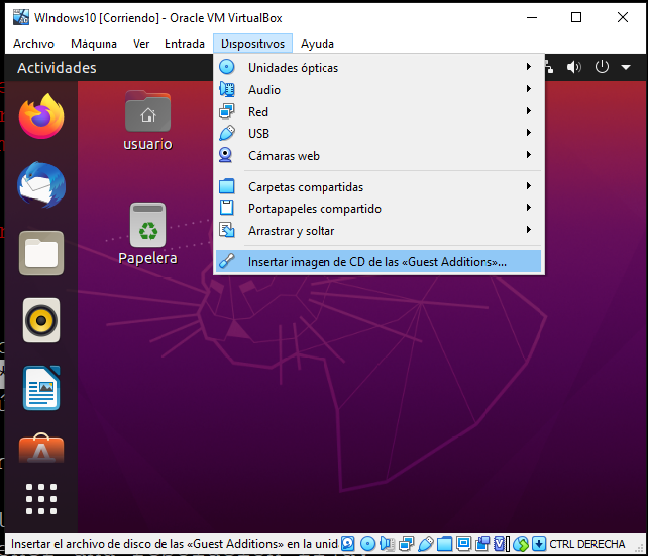

.. _virtualbox:

Virtualbox
**********
:program:`Virtualbox` es un *software* de virtualización de plataforma con
hipervisor de tipo 2 y aceleración por *hardware*. Posee una versión liberada
bajo licencia |GPL|, lo que posibilita que se encuentre disponible tanto en
*Windows* como en los repositorios de cualquier distribución de *Linux*.
Precisamente por esta disponibilidad, es la plataforma de virtualización que
hemos elegido para el curso.

Dispone de una interfaz gráfica bastante intuitiva, por lo que bajo este
epígrafe sólo apuntaremos algunos aspectos que conviene tener claros al
enfrentarnos a la interfaz.

.. note:: El epígrafe no pretende ser una guía del uso de
   :program:`Virtualbox`, sino una simple enumeración de aspectos que
   pueden resultar confusos o insospechables.

Tipo de máquina
===============
Al crear una nueva máquina virtual se puede escoger cuál es la plataforma
(|CPU| + |SO|). La elección del sistema operativo es irrelevante y sólo
sirve para que :program:`Virtualbox` escoja el icono con el que identificará
la máquina. En cambio, la |CPU| tiene importancia, ya que si escogemos una de
32 *bits*, se emulará ésta y, en consecuencia, sólo podremos instalar
*software* para la plataforma *x86*.

Red
===
:program:`Virtualbox` permite definir hasta cuatro interfaces de red para
una misma máquina virtual. Dependiendo de nuestras intenciones, nos
convendrá configurar cada una de ellas de una manera distinta. Hay varias
posibilidades:

* **Desconectada**: La interfaz de red, existe, pero desconectada.
* **Adaptador puente**: La interfaz de red se encuentra en la misma red
  que la interfaz real a la que se asocia. Esto nos permite exponer la
  máquina en la red como si de una máquina real se tratara.
* **NAT**: La máquina virtual se sitúa en una red interna que accede
  al exterior a través del propio software de :program:`Virtualbox`, que hace
  de router |SNAT| y servidor |DHCP|. La red interna , por tanto,
  es inaccesible desde el exterior o desde otra máquina virtual.
* **Red NAT**: Parecida a la anterior, pero se permite indicar el nombre
  de la red interna en la que se encuentra la máquina virtual, de modo
  que, si al crear una segunda máquina virtual, se configura la red de
  esta forma y se escoge el mismo nombre de red, ambas máquinas se
  encontrarán dentro de la misma red y podrán comunicarse entre sí.
* **Red interna**: Como la anterior, pero :program:`Virtualbox` no
  hace ninguna labor de encaminamiento, por lo que la red está totalmente
  aislada del exterior. Podemos comunicarla con el exterior, de todos
  modos, creando una máquina con dos interfaces de red que haga la labor de
  *router*: una de las interfaces se coloca en la red interna y la otra
  en alguna de las modalidades que sí tiene acceso al exterior.
* **Adaptador solo anfitrión**: Crea una red constituida exclusivamente
  por el anfitrión y los huéspedes.

* **Controlador genérico**.

.. note:: Para virtualizar la tarjeta de red, es mejor escoger como modelo de
   *hardware* "virtio-net", que, en realidad, no virtualiza una tarjeta, sino
   que es una solución de :ref:`paravirtualización <paravirt>`. La ventaja de
   usarlo es el rendimiento (obvio, si se trata de paravirtualización) y que es
   el único que permite arrancar por red si usamos como firmware |UEFI|. Ahora
   bien, si el sistema huésped es *Windows*, no dispondremos de los *drivers*
   durante la instalación y habrá que instalarlos a posteriori desde el
   `proyecto KVM <http://www.linux-kvm.org/page/WindowsGuestDrivers>`_. El modo
   más fácil de instalación es usar la *ISO* proporcionada en `este enlace
   <https://docs.fedoraproject.org/en-US/quick-docs/creating-windows-virtual-machines-using-virtio-drivers/index.html#virtio-win-direct-downloads>`_.

Discos
======
Lo habitual es que los discos del sistema huésped sean archivos del sistema
anfitrión. :program:`Virtualbox` soporta varios formatos:

Tipos
-----
* Su formato nativo denominado |VDI|.
* |VMDK|, que es el formato abierto propio de :program:`VMware`.
* |VHD|, que es el formato que creó *Microsoft* para su abandonado programa
  de virtualización `Virtual PC
  <https://es.wikipedia.org/wiki/Windows_Virtual_PC>`_.
* *RAW*, que es, simplemente, un archivo que contiene *byte* a *byte* el
  contenido del disco virtual.

.. note:: :program:`Virtualbox` no soporta :ref:`Qcow2, el formato nativo de
   QEmu <qemu-discos>`, pero :program:`QEmu` sí el de Virtualbox por lo que para
   hacer conversiones entre estos dos formatos :ref:`podemos recurrir a la orden
   qemu-img <qemu-discos-conv>`.

Lo más adecuado es usar el formato |VDI| por ser el nativo, aunque los cuatro
enunciados son suficientemente portables a otros sistemas de virtualización.
Eso sí, al ser el último un formato crudo, su tamaño será siempre igual al del
disco que virtualiza. mientras que los otros tres son capaces de ocupar en
disco sólo el espacio que efectivamente ocupa su contenido\ [#]_.

.. note:: Cambiar el formato de un disco (p.e. para usarlo en otro *software*
   de virtualización distinto) exige utilizar la utilidad
   :program:`vboxmanage` de línea de comandos. Por ejemplo:

   .. code-block:: console

      $ vboxmanage clonemedium original.vdi destino.vmdk --format VMDK 

   aunque si el original es el formato crudo debe usarse esta otra:

   .. code-block:: console

      $ vboxmanage convertfromraw original.img destino.vdi --format VDI

Formato |VDI|
-------------
Al utilizar el formato nativo para discos, tendremos posilidad de usar
algunas utiilidades muy interesantes:

* Las **instantáneas**, que permiten guardar el estado de una máquina en un
  instante preciso, lo cual posibilita volver a él en el futuro.

* Cambiar el **tipo** de disco, que en principio es "Normal". Uno muy
  útil es "Multiconexión", que permite utilizar un mismo disco como
  plantilla para varias máquinas distintas. Así, podemos instalar un
  un sistema operativo en un disco (o sea, en un archivo |VDI|) y una vez
  completada la instalación, liberar el disco y pasarlo a tipo "Multiconexión".
  Una vez sea  de este tipo, para tener una máquina con el sistema recién
  instalado nos bastará con conectar el disco a una nueva máquina virtual
  y podremos usar simultáneamente el disco en todas las máquinas en las que lo
  desemos.

Tanto las instantáneas como los discos derivados de uno en *multiconexión*
generan archivos |VDI| enlazados con el |VDI| del que proceden (la genealogía
puede consultarse en la sección "Administrador de medios virtuales"). Cuando se
quieren mezclar en un sólo archivo |VDI| varios niveles de archivos enlazados
basta con:

.. code-block:: console

   $ vboxmanage clonemedium uuid-larguisimo-del-ultimo-nivel.vdi compacto.vdi --format VDI

Arranque
========
Por defecto, las máquinas virtuales llevan a cabo, un :ref:`arranque BIOS
<arranque>`. Es posible también virtualizar un arranque |UEFI| marcando en la
sección de configuración relativa a la placa base, la opción correspondiente.

.. warning:: Marcar la opción |EFI|, tiene consecuencias adicionales: la
   secuencia de arranque definida en la interfaz gráfica de
   :program:`Virtualbox` dejará de tener efecto y la secuencia vendrá definida
   en la propia virtualización del arranque |EFI| al que se puede acceder.
   pulsando la tecla :kbd:`F2` justamente tras el encendido de la máquina. Lo
   habitual es que el último sistema operativo instalado se autodefina como el
   sistema arrancado por defecto con lo que puede darse el caso de que tengamos
   que recurrir a la tecla para poder arrancar desde cedé.

Añadidos al huésped
===================
La primera operación tras la instalación del sistema huésped, debe ser la
instalación de las "*Guest Additions*" disponibles como imagen *ISO* a través
de la entrada "Dispositivos" del menú superior de la aplicación.

.. warning:: Para que en un huésped *Linux* pueda llevarse a cabo la instalación
   correctamente es necesario que el sistema tenga instaladas previamente las
   cabeceras del núcleo y el paquete :deb:`make`::

      # apt install linux-headers-`uname -r` make

   También es necesario el compilador :deb:`gcc`. Dependiendo de la distribución
   que tengamos puede ser necesario añadirlo de forma explícita a la orden
   anterior.

   En cualquier caso, si una vez instaladas, las adiciones parecen no funcionar,
   pruebe a intentar arrancar::

      # /opt/VBoxGuestAdditions-*/init/vboxadd restart

   y mire si se obtienen errores.

La instalación de estos añadidos tiene algunas ventajas:

#. El entorno gráfico huésped se ajustará automáticamente al espacio de la
   ventana de virtualbox, en vez de tener una resolución fija.

#. Si podrá copiar y pegar desde anfitrión a huésped y viceversa si en los
   ajustes de la máquina particular (``General>Advanced``), se fija
   el portapapeles compartido como bidireccional.

   .. image:: files/portapapeles.png

#. Se podrá compartir archivos fácilmente entre anfitrión y huésped con
   sólo definir carpetas compartidas.

   .. image:: files/compartida.png

   aunque, dependiendo de su sistema operativo, tendremos que hacer alguna
   configuración más en el huésped:

   * Si es *Windows*, la carpeta aparecerá como una carpeta de red y basta con
     que esté habilitado el descubrimiento de estas carpetas para que la veamos
     sin más dificultades.

   * Si es *Linux*, la casuística es mayor:

     - En uno de escritorio con entorno gráfico, la carpeta se montará directamente,
       pero de modo que sólo los miembros del grupo *vboxsf* (que se crea al
       instalar estas adiciones) tendrás permisos de lectura y escritura en él.
       Por tanto, deberemos añadir al usuario sin privilegios a este grupo.

     - En un sistema más básico en el que no se monten automáticamente sistemas
       de archivos, deberá montarse el recurso compartido a mano::

         # mkdir -p /media/anfitrion
         # mount.vboxsf -o gid=vboxsf,dmode=770,fmode=660 NombreCompartido /media/anfitrion

       donde "NombreCompartido" será el nombre de carpeta que haya especificado
       en :program:`Virtualbox` (en la captura :kbd:`Anfitrión`) y las opciones
       proporcionadas emulan el comportamiento descrito para los sistemas en que
       se monta automáticamente la carpeta: sólo los usuarios del grupo *vboxsf*
       tienen acceso al recurso. Una alternativa al montaje manual es añadir una
       entrada en :ref:`/etc/fstab <fstab>` para que se monte la carpeta al
       arrancar el sistema:

      .. code-block:: none

         NombreCompartido  /media/anfitrion  vboxsf gid=vboxsf,dmode=770,fmode=660  0 2

Exportación
===========
Para trasladar una máquina virtual de un sistema anfitrión a otro tenemos dos
posibilidades:

* Exportar la máquina a un archivo en formato |OVA|, que luego puede importarse
  fácilmente a otro lugar. Tiene el inconveniente de que no respeta las instantáneas
  que hayamos podido crear y sólo generará en la máquina de destino un |VDI| con
  el "estado actual" de la máquina virtual.

* Copiar el directorio que contiene la máquina virtual en el sistema anfitrión
  de destino y "Añadir" una nueva máquina virtual utilizando el archivo
  :file:`.vbox`  que define la máquina y está contenido en tal directorio.
  El problema de este método es que debemos comprobar si todo lo que necesitamos
  está contenido dentro. Por ejemplo, si utilizamos un disco en *multiconexión*,
  tal disco es muy probable que se encuentre fuera del directorio y habría que
  copiarlo también y, quizás, editar el archivo :file:`.vbox` (es un |XML|) para
  modificar la ruta y que :program:`Virtualbox` sea capaz de encontrarlo.

.. rubric:: Notas al pie

.. [#] Esto no es exactamente cierto, ya que el archivo también necesitará
   contener su metainformación y su tamaño reflejará espacio antiguamente
   ocupado, aunque se haya liberado luego.

.. |GPL| replace:: :abbr:`GPL (GNU General Public License)`
.. |CPU| replace:: :abbr:`CPU (Central Processing Unit)`
.. |SO| replace:: :abbr:`SO (Sistema operativo)`
.. |SNAT| replace:: :abbr:`SNAT (Source NAT)`
.. |VDI| replace:: :abbr:`VDI (Virtual Disk Image)`
.. |VMDK| replace:: :abbr:`VMDK (Virtual Machine DisK)`
.. |VHD| replace:: :abbr:`VHD (Virtual Hard DisK)`
.. |OVA| replace:: :abbr:`OVA (Open Virtual Appliance)`
.. |UEFI| replace:: :abbr:`UEFI (Unified Extensible Firmware Interface)`
.. |EFI| replace:: :abbr:`EFI (Extensible Firmware Interface)`
.. |XML| replace:: :abbr:`XML (eXtensible Markup Language)`
