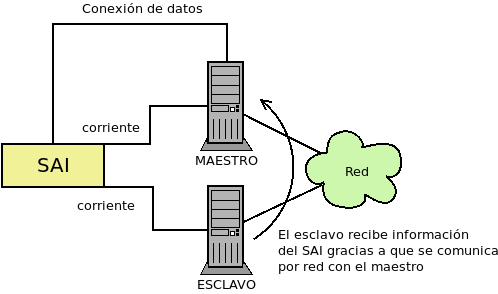

.. _sai:

|SAI|
*****

.. seealso:: Esto es tan sólo una guía para la configuración práctica de un
   |SAI|.  Es conveniente que eche una lectura al :ref:`epígrafe que incluye
   una introducción teórica <suministro-electrico>`.

Los |SAI|\ s cumplen su función de defensa sin necesidad de configuración
alguna, ahora bien, si queremos que los equipos atiendan sus alarmas y obren en
consecuencia, sí es preciso configurar el servidor. Es común que para este
propósito el propio |SAI| proporcione *software*, incluso con versión para
Linux, pero lo conveniente es procurarse uno para el que tenga soporte Nut_,
que tiene paquete en las principales distribuciones.

Por lo general, los |SAI|\ s disponen de una conexión serie o |USB| a través de
la cual pueden conectarse a un equipo que recibe los avisos en sus cambios de
estado, al que denominaremos *maestro*. Los dos supuestos que estudiaremos son:

#. El |SAI| sólo proporciona protección al equipo con el que se comunica
   (*maestro*).
#. El |SAI| proporciona protección al *maestro* y a uno o varios equipos
   adicionales (*esclavos*).

¿Qué |SAI| configuramos?
========================
Utilizaremos un `Salicru SPS 500 ONE <https://m.salicru.com/sais/sps-one.html>`_
del que el enlace proporciona alguna información y `un manual
<https://www.salicru.com/files/documentacion/ek80800(1).pdf>`_ con información
técnica bastante relevante, como que el modelo de 500 |VA| incorpora una única
batería de 4,5 Ah\ [#]_.

.. warning:: Si no dispone de |SAI| alguno, aún :ref:`puede probar la
   configuración <sin-sai>`.

Maestro
=======
En el *maestro*, tras llevar a cabo su alimentación a través del |SAI| y conectarlo
por |USB|, necesitamos **instalar** dos servicios diferentes:

- :program:`nut-server`, que se encarga de atender las comunicaciones del |SAI|
  y generar mensajes que es capaz de procesar el servicio de monitorización.
- :program:`nut-client`, que monitoriza los mensajes de :program:`nut-server` y
  permite definir las acciones que queremos llevar a cabo en base a ellos.
  
Para hacerlo basta con instalar el metapaquete *nut*::

   # apt install nut

Los ficheros de configuración se encuentran todos dentro de :file:`/etc/nut` y
es dentro de ese directorio donde tenemos que hacer todos los cambios.

En :file:`nut.conf` es preciso indicar en qué modo actúa el servidor:

.. code-block:: bash

   MODE=standalone  # Para el primer caso (sin esclavos)
   #MODE=netserver  # Para el segundo caso (con esclavos)

Al final de :file:`ups.conf` debemos definir cuál es el |SAI| que configuramos.
Para un `Salicru SPS One`, por ejemplo:

.. code-block:: ini

   [salicru]
   driver = blazer_usb
   port   = auto
   desc   = "Salicru SPS One 900VA"

"salicru" es el nombre que le hemos adjudicado a nuestro |SAI|: podemos escoger
cualquier otro. Es preciso editar :file:`upsd.conf` para indicar en dónde
escuchará el servidor:

.. code-block:: nginx

   LISTEN 127.0.0.1 3493  # Para modo standalone (primer caso)
   #LISTEN 0.0.0.0 3493   # Para modo netserver (primer caso)

Además, es preciso definir los usuarios con permisos en :file:`upsd.users`:

.. code-block:: ini

   # Administrador con capacidad para configurar opciones
   [admin]
   password = secretpass
   actions = SET
   instcmds = ALL

   # Usuario que es capaz de monitorizar
   [monuser]
   password = secretpass2
   upsmon master
   upsmon slave      # Sólo necesario en el caso 2.

Con estas acciones, habremos configurado completamente el servidor. Ahora bien,
en el propio *maestro* debe actuar también el cliente monitor, de modo que
configuraremos el fichero :file:`upsmon.conf`:

.. code-block:: nginx

   MONITOR salicru@localhost 1 monuser secretpass2 master

   # Comando que queremos que se ejecute al producirse
   # alguna notificación por parte de nut-server
   NOTIFYCMD /usr/local/bin/notifyme.sh

   # Modificamos algunos mensajes de aviso
   NOTIFYMSG ONLINE        "SAI '%s' recibe alimentacion"
   NOTIFYMSG ONBATT        "SAI '%s' usa la bateria"
   NOTIFYMSG LOWBATT       "SAI '%s' tiene muy poca carga de bateria"
   NOTIFYMSG FSD           "SAI '%s' ordena el apagado"
   NOTIFYMSG COMMOK        "Se ha establecido comunicacion con SAI '%s'"
   NOTIFYMSG COMMBAD       "Se ha perdido comunicacion con SAI '%s'"
   NOTIFYMSG SHUTDOWN      "SAI '%s' comienza su propio apagado"
   NOTIFYMSG REPLBATT      "La bateria de SAI '%s' debe reemplazarse"
   NOTIFYMSG NOCOMM        "SAI '%s' no esta disponible"

   # Qué hacer ante un aviso (los no definidos son SYSLOG+WALL)
   NOTIFYFLAG ONLINE       SYSLOG+WALL+EXEC
   NOTIFYFLAG ONBATT       SYSLOG+WALL+EXEC
   NOTIFYFLAG LOWBATT      SYSLOG+WALL+EXEC
   NOTIFYFLAG NOCOMM       SYSLOG
   NOTIFYFLAG NOPARENT     SYSLOG
   NOTIFYFLAG REPLBATT     SYSLOG+EXEC 

Esta configuración requiere explicación:

* ``MONITOR`` indica cómo conectar con el |SAI|.
* ``NOTIFYCMD`` es la orden que se ejecutará al comunicar :program:`nut-server`
  alguno de los eventos. El *script* sólo se ejecuta para aquellos avisos
  marcados con ``EXEC`` y deberemos escribirlo nosotros sabiendo que tiene
  definida la variable de entorno *NOTIFYTYPE* con el tipo de evento y que su
  primer argumento es el mensaje indicado en ``NOTIFYFLAG``. Un *script*
  que mande un mensaje de correo al administrador\ [#]_, puede ser este:

  .. code-block:: bash

     #!/bin/sh

     USUARIO="root"

     echo "
     From: root@localhost
     To: $USUARIO
     Subject: Mensaje del SAI -  $NOTIFYTYPE

     $*" | /usr/sbin/sendmail -t

* Los ``NOTIFYMSG`` traducen los mensajes en inglés predeterminados para cada
  tipo de evento.

* Los ``NOTIFYFLAG`` definen cómo se trata cada tipo de evento:

  - Si es *SYSLOG*, se escribe en el fichero de registro el mensaje. Para
    consultar con posterioridad todos los mensajes del monitor puede usarse la
    orden::

      # journalctl -u nut-monitor

  - Si es *WALL*, se escribe el mensaje en el sistema (aparecerá en la consola
    a todo usuario que esté conectado).
  - Si es *EXEC*, se ejecutará el *script* definido con ``NOTIFYCMD``.
  - Si es *IGNORE*, que es incompatible con los otros tres, no se hará
    absolutamente nada.

Una vez establecida la configuración es necesario reiniciar ambos servidores::

   # invoke-rc.d nut-server restart
   # invoke-rc.d nut-client restart

y podemos comprobar el estado del |SAI| con la orden::

   # upsc salicru@localhost
   battery.charge: 100
   battery.voltage: 13.60
   battery.voltage.high: 13.00
   battery.voltage.low: 10.40
   battery.voltage.nominal: 12.0
   device.type: ups
   driver.name: blazer_usb
   driver.parameter.pollinterval: 2
   driver.parameter.port: auto
   driver.parameter.synchronous: no
   driver.version: 2.7.4
   driver.version.internal: 0.12
   input.current.nominal: 1.0
   input.frequency: 50.1
   input.frequency.nominal: 50
   input.voltage: 239.0
   input.voltage.fault: 239.0
   input.voltage.nominal: 230
   output.voltage: 239.0
   ups.beeper.status: enabled
   ups.delay.shutdown: 30
   ups.delay.start: 180
   ups.load: 22
   ups.productid: 5161
   ups.status: OL
   ups.type: offline / line interactive
   ups.vendorid: 0665

.. note:: Como el |SAI| altera los valores de estas variables (p.e. si se piede
   el suministro eléctrico el estado pasará a *OB*) es muy útil en estos casos
   la orden :ref:`watch <watch>`::

      # watch -dn1 "upsc salicru@localhost | grep -E '^(battery|ups)\.'"

   que mostrará solamente las variables *battery.\** y *ups.\** y refrescará
   automáticamente sus valores cada segundo.

Hay muchísimas otras variables que pueden consultarse en `la documentación de
Nut <https://networkupstools.org/docs/user-manual.chunked/apcs01.html>`_, pero
de las que este |SAI| no informa. De entre las que devuelve son interesantes:

* **ups.status**, que informa del estado en el que está trabajando la batería.
  Se encuentra en |OL|, es decir, recibiendo alimentación de la red. Si hubiera
  un apagón (o lo fingiésemos, desconectado el |SAI| de la red), pasaría al
  estado |OB|, es decir, usando la batería. Si la situación se prolongara en el
  tiempo, el estado pasaría a |LB|, es decir, batería baja, y es a partir de
  este estado que se envían las órdenes para que se apaguen ordenadamente los
  equipos.

  .. note:: Dependiendo del |SAI|, el estado |LB| está asociado a un nivel
     mínimo de carga, dado por la variable *battery.charge.low*, o un tiempo
     mínimo de autonomía dado por *battery.runtime.low*. Sin embargo, en este
     |SAI| no se informa de cuáles son esos niveles ni de cuál se usa.
     Simplemente, el |SAI| por un criterio que desconocemos exactamente alcanza
     el estado y envía tal información. En otros |SAI|\ s más configurables sí
     se nos podría informar e incluso se nos podría dejar alterar el criterio
     modificando el valor de la variable.

* **battery.charge**, que informa de cuál es el porcentaje de la batería. En
  este caso, la batería se encuentra totalmente cargada. Si desconectáramos
  el |SAI| de la red.

* **ups.load**, que informa de cuál es el porcentaje sobre la potencia total que
  representan las potencias de todos los dispositivos conectados a través del
  |SAI|. En este caso, es el 22%, lo que significa que si la potencia total que
  soporta el dispositivo es 240W, los dispositivos conectados están consumiendo
  unos 53W. Obviamente este porcentaje depende de cuál sea el trabajo que los
  dispositivos están realizando en cada momento, pero si estimamos cuál es la
  cifra en condiciones normales de trabajo, podemos sacar una buena
  :ref:`estimación de la autonomía de la batería <sai-autonomia>`.

Esclavo
=======
Un *esclavo* es un equipo cuya alimentación se realiza a través del |SAI|,
pero que no recibe sus comunicaciones, ya que estas se llevan a cabo a través de
|USB| con el *maestro*. Para que pueden acceder a tales comunicaciones, es
necesario instalarle el monitor y hacer que este se comunique con el servidor
del *maestro*.

Así, primero instalamos exclusivamente el cliente::

   # apt install nut-client

indicar en :file:`/etc/nut/nut.conf` que se trata de un cliente:

.. code-block:: bash

   MODE=netclient

y, finalmente, configuar en :file:`/etc/nut/upsmon.conf` el cliente monitor del
mismo modo que lo configuramos en el *maestro*, con la única diferencia de la
directiva ``MONITOR``:

.. code-block:: nginx

   MONITOR salicru@192.168.0.2 1 monuser secretpass2 slave

suponiendo que *192.168.0.2* sea la |IP| del *maestro*. Todo lo referente a la
monitorización en el *maestro* (como el *script* de aviso o la orden
:command:`upsc`), es aplicable al *esclavo*.

.. _sin-sai:

¿Qué narices hago sin |SAI|?
============================
Si no se dispone de un |SAI|, puede probarse la configuración gracias al `driver
dummy-ups <https://networkupstools.org/docs/man/dummy-ups.html>`_. Basta con
descargar un fichero que contiene los parámetros del |SAI| que pretendemos
comprar. Por ejemplo, en `esta página
<https://networkupstools.org/ddl/Salicru/SPS_One_700VA.html>`_ hay un par de ellos y definir el |SAI| del siguiente modo:

.. code-block:: ini

   [nosai]
   driver = dummy-ups
   port = /usr/local/share/nut/SPS_One_700VA.dev
   desc = "Salicru imaginario SPS One 700VA"

donde :kbd:`port` indica la ruta donde hemos guardado el fichero. La restante
configuración es idéntica a la hecha para cuando el |SAI| es real.

El *driver* relee el fichero cada cierto tiempo con lo que tenemos tres opciones
si queremos simular que nuestro |SAI| imaginario cambia su estado:

#. Una engorrosa que consiste en alterar directamente el fichero.

   .. warning:: Si intenta esta, no escriba en el fichero que el |SAI| está
      bajo de batería (:code:`ups.status: OB LB`), porque durante el arranque de
      la máquina, arranca el servicio de *nut* que inmediatamente apagará la
      máquina sin darle tiempo a rehacer la configuración.

#. Definir distintos valores para el |SAI| con el tiempo que media entre esos
   cambios:

   .. code-block:: none

      [... valores iniciales ...]
      TIMER 30
      ups.load: 10
      TIMER 60
      battery.charge: 80
      TIMER 50

   Para lo cual:

   .. code-block:: console

      # cat >> /usr/local/share/nut/SPS_One_700VA.dev
      TIMER 30
      ups.load: 10
      TIMER 60
      battery.charge: 80
      TIMER 50

   Ante un fichero de esta guisa, el servidor cargará los valores que haya en el
   fichero hasta la directiva :code:`TIMER 30`. Entonces esperará 30 segundos,
   pasados los cuales cambiará el valor de ``ups.load`` y esperará 1 minuto.
   Pasado, cambiará la carga de la batería (``battery.charge``) y esperará otros
   50 segundos. Pasados estos segundos, como se ha acabado el fichero, volverá
   al principio cargando los valores iniciales.

#. La más recomendable que consiste en alargar el tiempo de relectura del
   fichero (a 5 minutos, por ejemplo)::

     # echo "TIMER 300" >> /usr/local/share/nut/SPS_One_700VA.dev

   y usar el comando :command:`upsrw` para alterar sobre la marcha los valores::

     # upsrw -s ups.load=15 -u admin nosai

   lo cual nos pedirá la contraseña del usuario *admin* que definimos
   anteriormente con permisos para alterar variables. Durante cinco minutos
   podremos ir haciendo cambios sin que el *driver* vuelva a recargar los
   valores originales del fichero. Incluso podemos simular que el |SAI| está en
   las últimas para que el ordenador tome la determinación de apagarse::

     # upsrw -s ups.status="OB LB" -u admin nosai

.. rubric:: Notas al pie

.. [#] En cambio, si se abre el |SAI| podremos comprobar que hay espacio de
   sobra y puede colocarse también una batería de 7 ó 9 Ah de las muy habituales
   dimensiones 151mmx65mmx84mm, lo que aumentará su autonomía.

.. [#] Suponiendo, claro está, que se tenga instalado un servidor de correo en
   la máquina.

.. |UPS| replace:: :abbr:`UPS (Uninterruptible Power Supply)`
.. |USB| replace:: :abbr:`USB (Universal Serial Bus)`
.. |VA| replace:: :abbr:`VA (Voltiamperio)`
.. |OL| replace:: :abbr:`OL (On Line)`
.. |OB| replace:: :abbr:`OB (On Battery)`
.. |LB| replace:: :abbr:`LB (Low Battery)`

.. _Nut: https://networkupstools.org/

