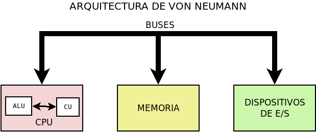

Hardware
********
Es la parte física del sistema informático. En consecuencia, está compuesto por
los elementos tangibles del sistema. A muy grandes rasgos sus componentes son:

+ Unidad de control de procesos o |CPU| (por sus siglas en inglés).
+ Memoria |RAM|.
+ Dispositivos de |E/S| o periféricos
+ Buses.

Componentes
===========
|CPU|
-----
La |CPU| o :dfn:`procesador` es el componente encargado de controlar y ejecutar
las operaciones que lleva a cabo el ordenador. Esta constituido por dos partes:

+ :dfn:`Unidad de control` (|CU|), que es la parte encargada de dirigir las
  operaciones, para lo cual dispone de una serie de registros:

  - :dfn:`Registro de instrucciones`, que es el encargado de almacenar la
    instrucción que se está ejecutando.

  - :dfn:`Registro-contador de programas`, que contiene la dirección de memoria
    donde se encuentra la siguiente instrucción a ejecutar.

  - :dfn:`Controlador y decodificador`, que se encarga de interpretar la
    instrucción.

  - :dfn:`Secuenciador`, que es el encargado de desmenuzar la instrucción en las
    microinstrucciones que la componen.

  - :dfn:`Reloj`, que proporciona una sucesión de impulsos eléctricos a
    intervalos regulares.

+ :dfn:`Unidad aritmético-lógica` (|ALU|) es la parte del procesador encargada
  de realizar las operaciones aritméticas (sumar, restar, multiplicar, dividir,
  exponenciación, etc.) y lógicas:

  .. table::
     :class: operaciones

     +---------------------------------+----------+
     | Operación                       | Símbolo  |
     +=============+===================+==========+
     | Comparación | Mayor que         |   >      |
     |             +-------------------+----------+
     |             | Mayor o igual que |  >=      |
     |             +-------------------+----------+
     |             | Menor que         |  <       |
     |             +-------------------+----------+
     |             | Menor o igual que |  <=      |
     |             +-------------------+----------+
     |             | Igual             |  =       |
     |             +-------------------+----------+
     |             | Distinto          |  !=      |
     +-------------+-------------------+----------+
     | Lógicas     | Y lógico          |  AND     |
     |             +-------------------+----------+
     |             | O lógico          |  OR      |
     |             +-------------------+----------+
     |             | No lógico         |  NOT     |
     |             +-------------------+----------+
     |             | O exclusivo       |  XOR     |
     +-------------+-------------------+----------+

Las características fundamentales a tener en cuenta en u8n microprocesador son:

- Su cantidad de **núcleos** (o *cores*). Cada núcleo es un procesador
  independiente que coopera con los restantes.

- Su **frecuencia de reloj** (medida en múltiplos del Hz) y que mide el número
  de (millones de) veces por segundo a la que el procesador es capaz de conmutar
  la corriente eléctrica. Esto determina la rapidez con la que el procesador es
  capaz de ejecutar instrucciones.

- El `tamaño de sus transistores
  <https://www.ticbeat.com/lab/conceptos-7nm-10nm-cpu/#:~:text=Los%20nan%C3%B3metros%20son%20la%20medida,procesadores%20de%20nuestros%20dispositivos%20electr%C3%B3nicos.>`_ que se mide en nanómetros. Cuanto menores
  sean, menor será el calentamiento y, en consecuencia, mayor el rendimiento.

- El **tamaño en que manipula datos** (p.e. las direcciones de memoria): 32 *bits*,
  64 *bits*

Existen dos grandes familias de arquitecturas de microprocesador:

+ |RISC|, que son procesadores con un conjunto simple de instrucciones. Siguen
  esta filosofía:

  * `ARM <https://es.wikipedia.org/wiki/Arquitectura_ARM>`_, que es la
    arquitectura que se usa en dispositivos móviles.

  * `PowerPC <https://es.wikipedia.org/wiki/PowerPC>`_, que fue la arquitectura
    que usó `Apple <https://es.wikipedia.org/wiki/Apple>`_ en sus ordenadores,
    antes de pasarse a `x86_64`_.

+ |CISC|, que son procesadores con un conjunto más complejo de instrucciones.
  Siguen esta filosofía:

  * x86_ desarrollado por Intel para 32 bits.
  * `x86_64`_ que es el sucesor para 64 bits y compatible con el anterior.

  Ambas arquitecturas han sido la predominantes en los ordenadores personales.

.. seealso:: Échele un ojo a este `artículo de xataka
   <https://www.xataka.com/componentes/cisc-frente-a-risc-una-batalla-en-blanco-y-negro>`_
   sobre ambas arquiecturas.

Memoria
-------
Es la encargada de almacenar tanto el *software* como los datos que manipula el
sistema informático. Dentro de lo que es memoria podemos distinguir entre:

- La *memoria de almacenamiento externo*, que es permanente y se encuentra en
  periféricos de almacenamiento como el disco duro o los *pendrives*, por lo que
  la trataremos más adelante.

- La memoria interna |ROM|, que es una memoria en principio de sólo lectura que
  contiene programas que permiten el arranque del ordenador. En general, los
  componentes físicos (una impresora, una *webcam*, etc.) poseen su *firmware*
  en memoria no volátil. Sin embargo, dado que este código también está sujeto a
  mejoras y actualizaciones, las actuales memorias |ROM| no son estrictamente de
  sólo lectura, sino que permiten su escritura ocasional. La placa base no es
  una excepción y contiene la |BIOS| (sistema básico de Entrada/Salida)
  que se encarga de cargar el sistema operativo.

  .. note:: Las placas base, además de memoria |ROM| disponen de un tipo de
     memoria |RAM| de muy bajo consumo, la |CMOS| que permite configurar algunos
     parámetros relacionados con la |BIOS|. Por ejemplo, cuál debe ser la
     secuencia de arranque.

- La memoria interna |RAM| que almacena temporalmente los programas y datos que
  procesa el ordenador. El procesador lee y procesa datos que se encuentran en
  esta memoria.: Se caracteriza por:

  + Ser **volátil**, esto es, perderse al apagar el dispositivo y dejarla de
    alimentar eléctricamente.
  + Ser más **rápida** que la memoria de almacenamiento externa.
  + Ser más **cara** que la memoria de almacenamiento externa.

  Está constituida por celdas de 1 *byte* capaces de almacenar información
  binaria. Cada celda tiene una dirección distinta (:dfn:`dirección de
  memoria`), para que el procesador sea capaz de leer y escribir en todas las
  celdas que componen la memoria. Por ese motivo, el tamaño que use el
  procesador para referir las direcciones de memoria, limita el tamaño máximo de
  memoria que puede utilizarse:

  - En los procesadores con arquitectura de 32 *bits*, al tener esta longitud
    las direcciones sólo se pueden referir 4GB de memoria |RAM|, ya que
    en 32 bits sólo se pueden referir 2\ :superscript:`32` celdas distintas.
    Como en cada celda es posible almacenar 1 byte, el memoria máxima referible
    es 2\ :superscript:`32` bytes o, lo que es lo mismo 4\*2\ :superscript:`10`\
    \*2\ :superscript:`10`\ \*2\ :superscript:`10` bytes, o sea,
    4*1024*1024*1024 bytes, esto es, 4 GB.

  - En los procesadores con arquitectura de 64 *bits*, no existe limitación en
    la práctica ya que ésta es muy elevada (16 EB).

  Ha habido distintos tipos de memoria |RAM|, aunque la actual se denomina |DDR|
  (doble tasa de transferencia de datos) que ya va por su cuarta generación:
  |DDR|\ 4.

Buses
-----
Los :dfn:`buses` son las líneas eléctricas u ópticas a través de las cuales se
comunican |CPU|, memoria y resto de dispositivos. Hay tres tipos de buses:

+ **Bus de datos** es la línea por la que intercambian datos la |CPU| y el resto
  de componentes.

+ **Bus de direcciones** sirve para comunicar la dirección de memoria o el
  dispositivo con el cual se intercambia información.

+ **Bus de control** sirve para que la |CPU| transmita a los dispositivos
  cuál es la orden a ejecutar y para que en sentido inverso se transmita
  la señal de estado resultante de tal ejecución.

Por otro lado, podemos distinguir también entre los **buses internos** (que
conectan los componentes internos) y los **buses de expansión** que conectan
la |CPU| con los periféricos.

Finalmente, en un *bus* la información puede fluir por una única línea *bit* a
*bit* (**bus en serie**) o por varias líneas por cada una de las cuales fluye un
*bit* (**bus en paralelo**). En principio, los buses en paralelo deberían ser
más rápidos, pero en la práctica es necdesario sincronizar los *bits* que llegan
por dístinta línea. En consecuencia, los *buses de expansión* modernos suelen
ser *en serie* (|PCI|-Express, |USB|, |SATA|) y no *en paralelo* (|AGP|, |IDE|\
[#]_ o |PCI| han quedado obsoletos).

Periféricos
-----------
Los :dfn:`periféricos` o :dfn:`dispositivos de E/S` son los dispositivos que
permiten interactuar al ordenador con el exterior. Puede distinguirse entre:

**Periféricos de entrada**
   Son aquellos que permiten introducir información en el ordenador. Por
   ejemplo, ratón o teclado.

**Periféricos de salida**
   Son aquellos que proporcionan información generada en el ordenador al
   exterior. Por ejemplo, impresora o pantalla.

**Periféricos de entrada/salida** (o de **comunicación**)
   Transmiten información al ordenador desde el exterior o en sentido contrario.
   Por ejemplo, una tarjeta de red.

**Periféricos de almacenamiento**
   Dispositivos que almacenan información de forma permanente como discos duros
   o *pendrives*.

Los periféricos requieren *software* para poder usarse:

- La parte del *software* que se encuentra en el propio periférico recibe el
  nombre de :dfn:`firmware`.
- La parte del *software* ejecutada por la propia |CPU| recibe el nombre de
  :dfn:`driver` o :dfn:`controlador`. 

.. _tipo-hardware:

Tipos de dispositivos hardware
==============================
Puede distinguirse entre:

**Superordenadores**
   Son ordenadores con una muy alta capacidad de procesamiento y memoria,
   destinados por lo general a tareas computacionales muy específicas en el
   ámbito de la investigación. `El sitio top500.org <https://www.top500.org>`_
   ofrece la lista de las 500 máquinas más potentes del planeta, aunque `esta
   página de la wikipedia <https://en.wikipedia.org/wiki/TOP500>`_, proporciona
   un resumen y detalla las diez primeras posiciones. Todos los superordenadores
   de la lista (los quinientos) corren Linux como sistema operativo. Los dos
   últimos superordenadores que no lo hacían, corrían *AIX*, pero desaparecieron
   de ella en 2017.

**Ordenadores centrales** (*mainframes*)
   Son ordenadores también con gran capacidad de procesamiento y memoria que
   usan grandes corporaciones y organismos para el manejo de ingentes cantidades
   de información.

**Servidores**
   Son ordenadores de capacidad mucho más reducida que la de los *mainframes*
   que dan servicio a un moderado número de usuarios.

**Ordenadores de escritorio**
   Son ordenadores personales usados como herramienta de trabajo en casa o en la
   empresa, o bien como estación para el manejo de los tipos anteriores de
   ordenador. Su capacidad de procesamiento es menor al de los anteriores.

**Dispositivos móviles**
   Son ordenadores de reducido tamaño, pensados para ser manejables y fácilmente
   transportables. Dentro de ellos englobamos a los ordenadores portátiles, las
   *tablets* y los *smartphones*. Por lo general, tienen unas capacidades algo
   menores que los ordenadores de escritorio, aunque pueden alcanzar su nivel; y
   han cobrado especial relevancia en los últimos años con la aparición de los
   *smartphones* que han desplazado a los ordenadores de escritorio en el gusto
   de los usuarios que utilizaban éstos como mera herramienta de consulta y
   comunicación.

**Otros dispositivos**
   Existen otro tipo de dispositivos que constituyen un sistema informático y
   disponen de sistema operativo, pero que se encargan de realizar tareas muy
   específicas:

   * Dispositivos de red (routers, switches).
   * Videoconsolas.
   * |NAS|.
   * SmartTVs.
   * etc.

.. rubric:: Notas al pie

.. [#] De hecho, la tecnología |IDE| también recibe el nombre de |PATA|, donde
   la "P" significa *paralelo*.

.. |CPU| replace:: :abbr:`CPU (Central Pprocessing Unit)`
.. |RAM| replace:: :abbr:`RAM (Random Access Memory)`
.. |E/S| replace:: :abbr:`E/S (Entrada/Salida)`
.. |CU| replace:: :abbr:`CU (Control Unit)`
.. |ALU| replace:: :abbr:`ALU (Arithmetic Logic Unit)`
.. |RISC| replace:: :abbr:`RISC (Reduced Instruction Set Computer)`
.. |CISC| replace:: :abbr:`CISC (Complex Instruction Set Computer)`
.. |ROM| replace:: :abbr:`ROM (Read-Only Access)`
.. |BIOS| replace:: :abbr:`BIOS (Basic Input-Output System)`
.. |CMOS| replace:: :abbr:`CMOS (Complementary Metal-Oxide-Semiconductor)`
.. |DDR| replace:: :abbr:`DDR (Double Data Rate)`
.. |NAS| replace:: :abbr:`NAS (Network Attached Storage)`
.. |PCI| replace:: :abbr:`PCI (Peripheral Component Interconnect)`
.. |AGP| replace:: :abbr:`AGP (Accelerated Graphics Port)`
.. |IDE| replace:: :abbr:`IDE (Integrated Drive Electronics)`
.. |SATA| replace:: :abbr:`SATA (Serial Advanced Technology Attachment)`
.. |PATA| replace:: :abbr:`PATA (Parallel Advanced Technology Attachment)`
.. |USB| replace:: :abbr:`USB (Universal Serial Bus)`

.. _x86: https://es.wikipedia.org/wiki/X86
.. _x86_64: https://es.wikipedia.org/wiki/X86-64
