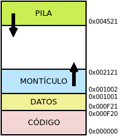

Gestión de memoria
******************
Antes de estudiar cómo gestiona el sistema operativo la memoria, es preciso
recordar dos aspectos ya señalados:

- La ejecución de todo programa supone que tanto su código como los datos que
  manipula se copien en la memoria |RAM|.
- La memoria está dividida en celdas cuyo contenido constituye una
  :dfn:`palabra`, por lo general de un byte, cada una de las cuales se
  referencia mediante una dirección de memoria única. Al total de la memoria se
  lo denomina :dfn:`espacio físico de memoria`. Por ejemplo, para una memoria
  |RAM| de 16 MiB, el espacio de memoria va desde la dirección ``0x000000`` a la
  dirección ``0xFFFFFF``:

  .. image:: files/espaciomemoria.png
  
  .. note:: Obsérvese que si la última dirección de memoria es la ``0xFFFFFF``,
     existen :math:`2^4*2^4*2^4*2^4*2^4*2^4 = 2^{24}` celdas de memoria. Como cada
     celda es de 1 *byte*, el tamaño de la memoria es de :math:`2^{24} =
     2^4*2^{10}*2^{10}` B o, lo que es lo mismo, 16 MB.

  A las direcciones que identifican a cada una de las celdas posibles del
  *espacio físico de memoria* se las denomina :dfn:`direcciones físicas de
  memoria`.

El espacio físico de memoria está bastante limitado (la memoria |RAM| es cara),
por lo que una labor muy importante del sistema operativo es gestionar cómo los
procesos utilizarán esta memoria.

Ocupación de memoria
====================
Al crear un proceso, sus necesidades de memoria son las siguientes:

- Un |PCB|, cuyos metadatos requiere el sistema operativo para gestionarlo.
- Un **espacio virtual de memoria** en el que se almacenan el código y
  los datos que manipula. El :dfn:`espacio virtual de memoria` de un proceso es
  la parte del *espacio físico de memoria* que ocupa dicho proceso. Las celdas
  de este espacio virtual se referencian mediante :dfn:`direcciones virtuales de
  memoria relativas`, relativas a su comienzo.
  
Estas *direcciones virtuales* son con las que trabaja internamente cada
proceso.por lo que es necesario hacer una traducción entre ellas y las
direcciones físicas. La encargada de ello es una parte del procesador llamada
:dfn:`Unidad de manejo de memoria` (|MMU| por sus siglas en inglés).

Por otra parte, el espacio virtual, a su vez, se compone de cuatro espacios:

+ **Código**, que es espacio reservado para las instrucciones del programa
  y que, obviamente, no varía a lo largo de la ejecución del proceso.

+ **Datos**, que se corresponden con los datos iniciales del programa
  y que, aunque puedan cambiar de valor, no cambian su tamaño.

+ **Montículo**, que contiene los datos que se creen dinámicamente durante
  la ejecución. Este espacio es dinámico y, por tanto, de tamaño variable
  durante la ejecución.

+ **Pila**, que contiene las llamadas anidadas a fragmentos distintos de código
  cada uno de los cuales tiene un contexto propio, esto es, un conjunto de datos
  distintos. Es necesario mantener la pila, porque un fragmento de código, sin
  haber terminado su ejecución, puede crear otro y pasar a ejecutar este. Como
  al terminar este segundo, se vuelve al primer fragmento, es necesario recordar
  por cuál instrucción iba la ejecución en el momento del salto y cuáles eran
  los datos que se manejaban entonces. Este espacio también es variable:
  comienza no ocupando memoria y crece y decrece durante la ejecución según haya
  más o menos contextos anidados.

Al comienzo del espacio virtual, esto es, en la dirección vierual ``0x0``, se
colocan el *código* y los *datos*, ambos espacios de tamaño fijo. El
*monticulo*, que al iniciar el programa no tendrá ningún tamaño empieza a crecer
a continuación y la *pila*, que también es variable, se coloca al final del
espacio y empieza a crecer hacia direcciones virtuales de memoria más bajas.

Técnicas
========
Existen distintas técnicas para alojar los procesos en memoria, dependiendo de
si un espacios virtual debe ocupar direcciones contiguas de memoria física, o
si los espacios virtuales pueden trocearse y cada trozo albergase en en
posiciones no contiguas de memoria física:

.. table:: Resumen de técnicas de gestión de memoria
   :class: gestion-memoria

   +-----------------+-----------------------+---------------+
   | Espacio virtual | Técnica               | Fragmentación |
   +=================+=======================+===============+
   | Indivisible     | Particiones fijas     | Interna       |
   |                 +-----------------------+---------------+
   |                 | Particiones dinámicas | Externa       |
   +-----------------+-----------------------+---------------+
   | Divisble        | Paginación            | Interna       |
   +                 +-----------------------+---------------+
   |                 | Segmentación          | Externa       |
   +-----------------+-----------------------+---------------+

Particiones
-----------
En esta solución la memoria se divide en bloques que ocupan direcciones
contiguas de memoria física, a los que se denomina :dfn:`partición`. Cada
partición comienza en una dirección de memoria, que se denomina :dfn:`registro
base` y tiene un tamaño concreto que determina cuál es su :dfn:`registro
límite`. En esta técnica a cada proceso se le asigna una única partición y una
partición sólo puede estar ocupada por un único proceso. El sistema operativo
se encarga de mantener el registro de dónde comienza cada partición, cuánto
tamaño tiene y qué proceso la está ocupando. Como todo proceso debe caber en un
partición, esto obliga a que los espacios virtuales de memoria sean pequeños
(como máximo el tamaño de la partición mayor).

El particionado puede ser de dos tipos:

**Fijo**
   La memoria se particiona de antemano, de manera que las particiones son
   fijas, aunque no todas tienen por qué tener el mismo tamaño. Su principal
   desventaja es que los espacios virtuales de los procesos no casan en tamaño
   exactamente con las particiones, por lo que la parte de la partición que no
   haya sido ocupada por el proceso al que se le ha asignado, no puede
   aprovecharse. Esta circunstancia se denomina :dfn:`fragmentación interna`.

   .. image:: files/part-fijas.png

**Dinámico**
   Las particiones se van creando ajustándose al tamaño de cada proceso. En
   este caso, no existe *fragmentación interna*; pero, cuando un proceso acabe,
   se liberará la partición que que ocupa proceso extinto y, por consiguiente,
   tiene el tamaño de su espacio virtual de memoria. Como un nuevo proceso es
   probable que requiera un tamaño distinto, quedan entonces también huecos de
   memoria entre particiones sin utilizar. En este caso se habla de
   :dfn:`fragmentación externa`.

   .. image:: files/part-dinamicas.png

Paginación
----------
En la técnica de las particiones cada proceso ocupa siempre direcciones de
memoria contiguas. La paginación, en cambio, no exige eso. En ella, el sistema
operativo divide el espacio de memoria física en bloques de tamaño fijo, a los
que se denomina :dfn:`frames`, y el espacio virtual de memoria de cada proceso
en bloques llamados :dfn:`páginas` que tienen el mismo tamaño que los *frames*.
Tanto páginas como *frames* se numeran correlativamente.

La técnica consiste en asociar a cada página un *frame* distinto, pero sin la
necesidad de que a las páginas de un proceso se le asignen *frames* contiguos.
Para ello el sistema operativo crea para cada proceso una tabla de paginación
que lleva el control de estas asignaciones. En el |PCB| deberá existir un
puntero a la correspondiente tabla de paginación.

La técnica sigue produciendo *fragmentación interna*, pero en mucha menor medida
que la técnica de particiones fijas, ya que las páginas son de manor tamaño que
las particiones.

.. image:: files/paginacion.png

Segmentación
------------
Esta técnica consiste en fragmentar el espacio virtual de memoria en bloques,
llamados :dfn:`segmentos` (que no tienen que tener igual tamaño) dentro de los
cuales se almacena información que comparta algo en común. Estos segmentos se
asignan a espacio en la memoria física que no tiene que ser contiguo, de manera
que el sistema operativo irá buscando huecos libres para ubicarlos.

El sistema operativo debe crear para cada proceso una tabla con todos los
segmentos de los que se compone indicando qué dirección física ocupa y cuál es
su tamaño. Esta técnica, como la de *particiones dinámicas* presenta
*fragmentación externa*, pero en mucha menor medida; puesto que los segmentos
son más pequeños que las particiones dinámicas.

Memoria virtual
---------------
Esta técnica, que se compagina con la de paginación o segmentación, permite
alojar en memoria |RAM| no todo el proceso, sino sólo las páginas o segmentos
del fragmento de código y los datos que se estén ejecutando; el resto se guarda
en memoria secundaria y se rescata de ella, cuando se necesite.

Ahora bien, como la memoria secundaria es muchísimo más lenta, la memoria
virtual sólo se usa en caso de que sea estrictamente necesario, esto es, cuando
el proceso que se quiere cargar en memoria necesita más espacio de la memoria
disponible. También es posible que el sistema decida que de otro proceso ya
cargado en memoria |RAM| todo o parte pase a memoria virtual. Al volver a la
memoria principal, no tendrá por qué ocupar las mismas direcciones de memorias.

La zona de la memoria secundaria que se usa como memoria de intercambio no es
caprichosa, es una zona especial reservada para tal fin que se llama memoria de
intercambio, memoria *swap* o, simplemente, *swap*. En los sistemas *Windows*
se usa un fichero definido para tal fin; en los sistemas *linux*, aunque es
posible el uso del fichero, es común, la creación de una partición especial en
el disco duro dedicada exclusivamente a este fin.

.. note:: Hacer demasiado uso de la memoria de intercambio penaliza el
   rendimiento, y es señal de que debemos ir pensando en aumentar la memoria
   |RAM| del equipo.

.. |PCB| replace:: :abbr:`PCB (Process Control Block)`
.. |RAM| replace:: :abbr:`RAM (Random Access Memory)`
.. |MMU| replace:: :abbr:`MMU (Memory Management Unit)`
