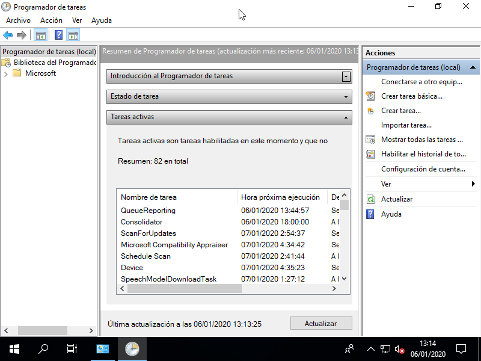

Configuración básica de *Windows* 10
************************************

.. note:: El contenido del tema es sólo una sucesión de aspectos a tratar.

Descripción del entorno de trabajo
==================================
+ Pantalla de inicio (:ref:`Práctica 1 <p5.1>`).
+ Barra de tareas.
+ Menú de inicio (:ref:`Práctica 2 <p5.2>`).
+ Temas y aspecto (:ref:`Práctica 2 <p5.2>`): resolución, monitores, etc.
+ Cambios de fecha e idioma.

Explorador de ficheros
======================
+ Estructura de directorios (:ref:`Práctica 3 <p5.4>`).
+ Extensiones de los archivos: asociación a programas, visualización de todas
  las extensiones.

Configuración de la red
=======================
Simplemente configurar el protocolo |TCP|/|IP| para conectar a la red.

Gestión del software
====================
+ Actualizaciones del propio sistema operativo: cuál es la política de
  actualizaciones, cómo se llevan a cabo.
+ Adición de características de *Windows*.
+ Instalación y desinstalación de aplicaciones a través de la tienda de
  *Microsoft*.
+ Instalación y desinstalación de programas obtenidos en la web.

Automatización de tareas
========================
Para programar tareas futuras, periódicas o que deben ejecutarse al producirse
alguna circunstancia (p.e. al iniciar sesión), debe utilizarse el
:program:`Programador de tareas` accesible a través de las "Herramientas
administrativas".

Crear una *tarea básica* es relativamente sencillo (puede consultar `este enlace
de genbeta sobre cómo programar tareas en Windows 10
<https://www.genbeta.com/paso-a-paso/como-programar-tareas-en-windows-10>`_).
La lista de tareas definidas por el usuario pueden consultarse en la
sección "Biblioteca del Programador de tareas", aunque, si no aparece, habrá que
actualizar la vista con el menú contextual.

Por otra parte, en el :program:`Administrador de tareas` hay una pestaña para
indicar qué aplicaciones quieren arrancarse durante el inicio.

.. include:: /guias/01.som/99.ejercicios/05.winI.rst

.. |TCP| replace:: :abbr:`TCP (Transmission Control Protocol)`
