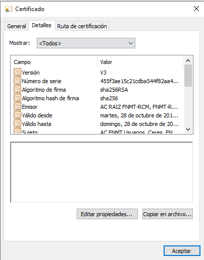

.. _seg-cripto:

Criptografía
************
La criptografía es uno de los pilares sobre los que se asienta gran parte de la
seguridad de la transmisión, del almacenamiento o de la autenticación. Es por
ello que se dedica una unidad completa a describir sus fundamentos y sus
aplicaciones más inmediatas.

Introducción
============
.. seealso:: Desarrollada dentro del manual en el :ref:`epígrafe correspondiente
   <intro-crypto>`.

Operaciones criptográficas
==========================
.. seealso:: Expuestas en el :ref:`epígrafe sobre operaciones criptográficas del
   manual <tecnicas-crypto>`. Las órdenes que se exponen en el apendice práctico
   no tienen utilidad directa, ya que es más que probable que no se
   usen en la práctica diaria habitual, pero no son excesivamente complicadas y
   pueden servir para ilustrar la parte teórica. Por tanto, su imaprtición
   depende del tiempo disponible.

Aplicaciones de la criptografía
===============================
El epígrafe está dedicado a exponer algunas de las aplicaciones más difundidas
de la criptografía:

Certificado digital
-------------------
.. seealso:: El desarrollo se encuentra en el :ref:`epígrafe sobre certificados
   digitales <cert-digital>`.

El epígrafe es largo y nuestro propósito debe ser entender convenientemente los
conceptos y saber consultar y verificar los certificados digitales. En consecuencia,
hay algunas partes de las que se puede **prescindir**:

* La :ref:`generación de certificados <cert-gen>` a partir de una |CA| propia.
  Si se tiene tiempo e interés y se considera que ayuda a entender la
  infraestructura |PKI|, puede practicarse la creación de una con GnoMint_.
* La :ref:`exposición sobre los catálogos de certificados <catalogo-cert>` en
  *Linux*.

.. note:: El epígrafe, como es normal, centra toda su atención en *Linux* y,
   para el caso de :ref:`certificados X.509 <X.509>` en Open\ |SSL|. Para
   complementar esas explicaciones, añadiremos aquí algunas breves notas sobre
   su gestión en *Windows*.

.. _cat-cert-windows:

.. rubric:: Certificados X.509 en *Windows*

La gestión de certificados en *Windows* se hace a través de un almacén que
proporciona el propio sistema operativo y que suelen consultar los programas
que los requieren (con la salvedad notoria del navegador :program:`Firefox`
que, como hace en *Linux* usa el suyo propio). El administrador de certificados
es accesible a través de la aplicación :program:`certmgr.msc`:

.. image:: files/certmgr.png

La aplicación da acceso a todos los certificados instalados: basta con buscar
el requerido (si es propio se encontrará  en "Personal") y pinchar dos veces en
él para acceder a su información:

Los certificados:

* Pueden **usarse** lo cual supondrá que la aplicación que los requiera los busque
  en el almacen y no sugiera usarlos. La clave privada almacenada puede estar
  cifrada o no según la importaramos en su momento. Por motivos de seguridad es
  mejor tenerla cifrada.

* Pueden **exportarse**. La exportación de un certificado es accesible a través de
  la opción :kbd:`Todas las tareas>Exportar...` del menú contextual que aparece al
  pinchar con el botón derecho sobre el certificado. Es de notar que dependiendo
  de cómo lo importáramos el almacen nos permitirá exportar el certificado público
  con la clave privada o excluirá de la importación esta última.

* Pueden **importarse**, para lo cual podemos recurrir a :kbd:`Acción>Todas las
  tareas>Importar...` o, simplemente, a pinchar sobre un archivo de certificado
  (un :kbd:`.p12`, por ejemplo). Esto abrirá el proceso de importación:

  .. image:: files/01captura.png

  que tiene algunos pasos interesantes:

  a. Aquel en que se pide la contraseña de protección del archivo y que como
     puede verse, nos permite:

     .. image:: files/04captura.png

     escoger dos opciones bastante interesantes:

     + Proteger la clave privada del certificado, para lo cual habrá que marcar
       la casilla señalada.
     + Marcar (o no) como exportable la clave. Si el archivo importado ya lo
       guardamos en otro lugar seguro, lo más prudente es no marcarlo.

  b. Si el certificado contenía una clave privada y decidimos protegerla,
     entonces la importación continuará con esta ventana:

     .. image:: files/06captura.png

     en la que si aceptamos, la importación acabará sin que la clave privada
     quede cifrada con una contraseña de seguridad. Lo prudente es pinchar
     sobre :kbd:`Nivel de seguridad` para escoger un nivel **alto**. En este
     caso, se nos pedirá la contraseña de cifrado:

     .. image:: files/08captura.png

     y nos aseguraramos de que nadie usará el certificado sin conocer la clave.

.. rubric:: Ejercicios

Una vez leído pueden hacerse:

* :ref:`ej-cert-dig`.

Protocolos seguros de red
-------------------------
Se desarrolla en el epígrafe :ref:`proto-seguro`.

Como ejercicios:

* :ref:`ej-protocolos-seguros`.

Autenticación
-------------
Su desarrollo se encuentra en el epígrafe :ref:`auth-crypto`. En ese epígrafe
se dan tres ejemplos de autenticación en dos servicios, |SSH| y |VPN|, que
están completamente documentados en el manual. Si se desea profundizar en
alguno, es preferible |SSH|, porque la instalación del servicio es sumamente
sencilla y la implementación de la infraestructura |PKI| bastante simple.

Firma de documentos
-------------------
De la :ref:`firma en documentos PDF <firm-doc>` interesa el hecho de que
se pueden firmar incrustando la firma en ellos y su estatus legal, pero sin
llegar a tratar el uso de la orden :ref:`pdfsig <pdfsig>`. Para una práctica, es
más apropiado por su sencillez la utilización de AutoFirma_ (o LibreOffice_) y
la `verificación en línea <https://valide.redsara.es>`_.

Correo electrónico
------------------
El :ref:`epígrafe correspondiente <email-seguro>` puede reducirse a conocer los
dos estándares para cifrado y firma (Open\ |PGP| y |S/MIME|) y a la firma con un
programa sencillo como Thunderbird_ o una extensión como las indicadas en el
epígrafe.

Hay un ejercicio propuesto para |GnuPG|, pero es probable que resulte demasiado
extenso y complicado:

* :ref:`ej-firm-dig`.

Cifrado de datos
----------------
Otra de las aplicaciones más habituales de la criptografía es la del cifrado de
datos almacenados en disco. No lo trataremos ahora, ya que se expondrá en la
unidad sobre :ref:`Seguridad en el almacenamiento <seg-alm>`.

Como ejercicios:

* :ref:`ej-cifrado-discos`.

.. |CA| replace:: :abbr:`CA (Certification Authority)`
.. |FNMT| replace:: :abbr:`FNMT (Fábrica Nacional de Moneda y Timbre)`
.. |GnuPG| replace:: :abbr:`GnuPG (GNU Provacy Guard)`
.. |PGP| replace:: :abbr:`PGP (Pretty Good Privacy)`
.. |S/MIME| replace:: :abbr:`S/MIME (Secure/Multipurpose Internet Mail Extensions)`
.. |PDF| replace:: :abbr:`PDF (Portable Dcument Format)`
.. |PKI| replace:: :abbr:`PKI (Public Key Infraestructure)`
.. |SSL| replace:: :abbr:`SSL (Secure Socket Layer)`

.. _AutoFirma: https://firmaelectronica.gob.es/Home/Descargas.html
.. _Thunderbird: https://www.thunderbird.net
.. _LibreOffice: https://www.libreoffice.org
.. _GnoMint: https://sourceforge.net/projects/gnomint/
