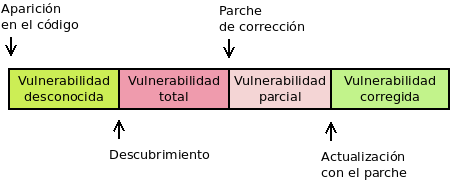

.. _seg-mantenimiento:

Mantenimiento de *software*
***************************
Es común (y alguno incluso afirmaría que inevitable) que el *software* (sistema
operativos y operaciones) presente vulnerabilidades, ya sea por su diseño o su
implementación. Estas vulnerabilidades, convenientemente aprovechadas por un
atacante mediante un :ref:`exploit <exploit>`, pueden derivar en un ataque.

.. note:: Un error en un programa se denomina :dfn:`bug`. Estos errores pueden
   derivar en problemas de funcionalidad o de seguridad. Las vulnerabilidades se
   refieren a errores de seguridad.

Es común hablar del :dfn:`ciclo de vida de una vulnerabilidad` que se extiende
que la vulnerabilidad aparece hasta que es completamente subsanada.

Cuando la vulnerabilidad es descubierta por algún atacante malicioso, existe un
periodo de tiempo en que la exposición del *software* es total, puesto que no
existe defensa contra los *exploits* que puedan diseñarse para explotar la
vulnerabilidad. Durante este periodo de tiempo se habla de *vulnerabilidades de
día cero*, *ataques de día cero* y *exploits de día cero*. El periodo, sin
embargo, puede no existir si la vulnerabilidad es descubierta, pero el
descubridor, en vez de aprovecharla, crea un parche para corregirla.

Tipos de vulnerabilidades
=========================
Las vulnerabilidades del *software* pueden clasificarse atendiendo a distintos
aspectos.

.. rubric:: Según su conocimiento

a. Vulnerabilidades **desconocidas**:

   + Vulnerabilidad realmente desconocida, de la que aún no tiene conocimiento
     ni el propio programador ni terceros.

   + Vulnerabilidad creada por el propio programador, generalmente una
     :dfn:`puerta trasera`, con el fin de aprovecharla durante el uso del
     programa por un tercero. Es obvio que, en cuanto es conocida, la aplicación
     cae en el descrédito y dejará de ser usada.

   + :dfn:`Vulnerabilidad de día cero`  (*0-day*), que es aquella descubierta por
     algún tercero, pero que no ha sido comunicada a aquellos que pueden
     corregirla.  Estas vulnerabilidades se mantienen en secreto para realizar
     :dfn:`ataques de día cero` mediante algún :dfn:`exploit de día cero`.

   Frente a una vulnerabilidad desconocida no hay contramedida eficaz.

#. Vulnerabilidades **conocidas**, que son aquellas que han sido puestas en
   conocimiento de quien tiene capacidad de corregirlas (habitualmente el
   programador). Por lo general, son descubiertas por el propio programador o
   por algún analista de seguridad. Éstas, a su vez, pueden:

   + Tener ya disponible un *parche* (*patch*) que las soluciona.  El
     :dfn:`parche` es un pedazo de código que sustituye al pedazo de código que
     provoca la vulnerabilidad. Es muy común que el propio descubridor lo
     proporcione, sobre todo si el *software* es libre y el error se debía a una
     implementación deficiente y no a un problema de diseño. En este caso, el
     parche se proporcionará aparte y será necesario aplicarlo a la versión
     oficial del programa. Por lo general, los parches que no presentan
     deficiencias acaban incorporándose al programa en la siguiente versión.

     Para evitar estas vulnerabilidades lo más eficaz es tener actualizado el
     *software* a la última versión estable. En sistemas muy críticos (lo cual
     no suele ser el caso de los sistemas de escritorios) esto
     quizás no baste y le sea necesario al administrador estar atento al sistema
     de notificación de errores que utilice su *software* (p.e. una lista de
     correo) y aplicar los parches correspondientes, mientras no haya versión
     correctora.

   + Que no exista solución aún para la vulnerabilidad y, en consecuencia, se
     esté expuesto a ataques que la aprovechen.

     En este caso, si la vulnerabilidad es grave, no habrá otra posibilidad que
     deshabilitar algunas funcionalidades relacionadas con la vulnerabilidad o,
     directamente, dejar de usar el programa.

`Common Vulnerabilities and Exposures`_ (|CVE|) es una lista que
registra y publica vulnerabilidades conocidas de *software* con un
identificador único, una descripción, cuáles son las versiones del programa
afectadas y cómo puede solucionarse o mitigarse.

Por otra parte, aunque no centrados únicamente en los errores de seguridad, esto
es, en las vulnerabilidades, los proyectos de *software* (tanto aplicaciones
como sistemas operativos), suelen tener algún mecanismo para el registro y el
seguimiento de sus errores. Este mecanismo suele ser una aplicación llamada
genéricamente :dfn:`bugtracker` o :dfn:`sistema de seguimiento de errores` (uno
muy conocido es `Bugzilla <https://www.bugzilla.org/>`_), aunque en ocasiones se
utilizan mecanismos más simples como las *issues* que permite registrar el sitio
`Github`_ para las aplicaciones alojadas en el.

.. rubric:: Según su gravedad

a. *Baja*, que es aquella que implica un riesgo o un impacto muy bajo.
#. *Media* o *moderada*, que es aquella con un impacto algo mayor, pero que
   puede ser paliada modificando la configuración o que son difícilmente
   aprovechables (p.e. porque requieran acceso físico a la máquina).
#. *Importante*, que es aquella fácilmente de aprovechar,
#. *Crítica*, que es aquella que, además, puede propiciar la propagación del
   *exploit* sin ni siquiera intervención del usuario.

.. note:: En realidad, esta clasificación puede hacerse de los
   errores en general, sean de funcionalidad o de seguridad.

Actualizaciones
===============
Una :dfn:`actualización` consiste en la instalación de una nueva versión de un
*software* existente en sustitución de la versión instalada. La actualización
puede, simplemente, incluir *parches* para corregir errores (de seguridad o de
funcionalidad) o nuevo código para ampliar funcionalidades\ [#]_.

Aunque no exista una regla fija, es muy común que las versiones de los programas
incluyan tres niveles en su numeración, p.e. :kbd:`2.3.12`. El tercer número
crece sólo al incluirse código que corrige errores; el segundo al incluir nuevo
código que añade alguna funcionalidad (aunque por añadidura también puede
corregir errores) y el primero crezca al introducir cambios más importantes aún.
Las versiones en las que sólo cambia el segundo nivel se llaman :dfn:`versiones
menores` y las versiones en las que cambia el primer número, :dfn:`versiones
mayores`. Así, por ejemplo, en el ejemplo indicado la versión mayor es la **2**,
la **2.3** es una versión menor de la versión **2**; y la versión **2.3.12** es
una versión de corrección de errores (*bugfix*). A la actualización que incluye
sólo la corrección de una o más vulnerabilidades se la denomina
:dfn:`actualización de seguridad`.

Es importante también tener en consideración que el *software* no es eterno y,
por tanto, en algún momento se abandona su mantenimiento, bien porque se ha
abandonado definitivamente su desarrollo, bien porque ha comenzado el desarrollo
de una nueva versión mayor y la antigua que considera obsoleta. En este segundo
caso, es común que los desarrolladores (sobre todo si se trata de un sistema
operativo) sigan incorporando correcciones a sus errores durante un determinado
tiempo y establezca una fecha final de ciclo de vida, después de la cual la
versión no recibirá ya más actualizaciones y el usuario o tendrá que aplicar y
adaptar el mismo los parches (en caso de que sea posible) o saber qué utiliza un
*software* desahuciado.

.. warning:: La instalación o las actualizaciones de cualquier *software*
   siempre han de realizarse a través de archivos obtenidos de una fuente fiable
   que puede ser:

   + El propio creador del *software* (a menos que el *software* en sí carezca
     de credibilidad) que lo ofrecerá a través de su página oficial.
   + Los repositorios del sistema operativo, como es el caso de las
     distribuciones de *Linux*, que se encargan de empaquetar aplicaciones y
     ofrecerlas como parte de la distribución.

   Obtener el *software* de forma ilegal o a través de terceros suele provocar
   la inclusión de troyanos que pueden comprometer la seguridad o el rendimiento
   del sistema.

En un sistema de escritorio lo más realista es esperar que el usuario no se
preocupe por buscar periódicamente las actualizaciones, sino facilitárselas de
manera más o menos automática.

Sistemas *Windows*
------------------
La última política de *Microsoft* al respecto de su *Windows* 10 es ofrecer
grandes actualizaciones (que incluyen modificaciones en la funcionalidad o el
comportamiento) cada seis meses, una en el primer semestre (marzo o abril
generalmente) y otra en el segundo semestre (septiembre u octubre,
generalmente). Entre tanto, pueden recibirse actualizaciones de seguridad que se
prolongarán durante 18 meses. Aunque en un primer momento las actualizaciones
periódicas eran obligatorias, a partir de 2019 Microsoft las ha convertido en
voluntarias.

La aplicación (o no) de estas actualizaciones semestrales, determina la versión
de *Windows* 10 (consultable a través del comando :kbd:`winver`). Por ejemplo,
la versión **2004** es un *Windows 10* que ha recibido la actualización de abril
(**04**)de 20\ **20**. Como el mes puede variar es común referirse genéricamente
a las actrualizaciones (sobre todo cuando se habla de alguna que aún no se ha
lanzado y por tanto se desconoce el mes exacto) como **21H1** (la primera
actualización de 2021), **21H2** (la segunda de 2021), etc.

El sistema de actualizaciones, pues, puede asimilarse a un sistema de versiones
estables de 6 meses, cada una de las cuales tiene un ciclo de vida de 18 meses
\ [#]_.

Estas actualizaciones, sin embargo, sólo se refieren al sistema operativo, y no
a las aplicaciones individuales ajenas a *Microsoft*; por lo que de instalar de
forma individual una aplicación debemos procurar obtenerla de una fuente segura.
En muchos casos, las propias aplicaciones comprueban al ejecutarse si existen
versiones más modernas y sugieren su instalación en caso de que así sea. Estas
instalaciones, pues, son ajenas a la actualización del sistema operativo.

Sistemas *Linux*
----------------
Los sistemas *Linux* contrariamente se instalan a través de distribuciones que
incluyen no sólo el sistema operativo, sino también la mayor parte de las
aplicaciones que serán necesarias. De hecho, lo habitual es que el usuario no
necesite otras aplicaciones fuera de las ofrecidas por la distribución. Por este
motivo, las actualizaciones del sistema incluirán también la actualización de
las aplicaciones.

.. seealso:: Para saber cómo actualizar el sistema consulte el :ref:`epígrafe
   sobre gestión de software <apt-get>`.

En cuanto a los ciclos de vida de las distribuciones hay dos grandes filosofías:

- Las :dfn:`distribuciones rolling`, que son distribuciones que no tienen
  versiones definidas, sino que van recibiendo constantemente actualizaciones,
  tanto de seguridad como de funcionalidad. Tal es el caso de algunas famosas
  como ArchLinux_ o Gentoo_.

- Las :dfn:`distribuciones con versión estable`, que son aquellas en que cada
  cierto tiempo se libera una nueva versión. Cuál sea este tiempo depende de
  cada distribución:

  + Fedora_ (la versión comunitaria de RedHat_) libera versiones cada 6 meses y
    cada una de ellas tiene sólo siete meses de mantenimiento (hay pues un mes
    de solapamiento entre la versión antigua y la nueva).
  + Centos_ (una versión clónica de la distribución comercial de RedHat_) libera
    versiones al tiempo que lo hace RedHat_ (el periodo no es fijo) y
    proporciona soporte durante diez años.
  + Debian_ libera versiones aproximadamente cada dos años, que gozan de
    mantenimiento durante cinco años\ [#]_. 
  + Ubuntu_ libera versiones cada seis meses (en abril y en octubre) que tienen
    9 meses de soporte. Sin embargo, cada dos años (es decir, una de cada cuatro
    versiones) tiene soporte extendido y su soporte dura 5 años. Estas versiones
    de soporte extendido son las liberadas en el mes de abril de los años pares.
    La última, por tanto, a fecha de esta redacción, es la *20.4* (abril de
    2020).

.. rubric:: Notas al pie

.. [#] En puridad, un *parche* también puede añadir funcionalidades, pero es
   común utilizar el término para referir correcciones y no añadidos. 

.. [#] Hay, sin embargo, ramas |LTSB| y |LTSC| con tiempos entre versiones y
   tiempos de soporte distintos. Consulte `este artículo de Genbeta
   <https://www.genbeta.com/windows/windows-10-ltsc-ltsb-que-hacen-que-algunos-creen-que-mejores-versiones-windows-10>`_.

.. [#] El esquema de versiones de Debian es bastante más complejo y, de hecho,
   las ramas de pruebas e inestables son versiones *rolling*. Consulte
   :ref:`cuál es exactamente <paq-vistazo>`.

.. _Common Vulnerabilities and Exposures: https://cve.mitre.org
.. _Github: https://github.com
.. _ArchLinux: https://www.archlinux.org
.. _Gentoo: https://gentoo.org
.. _Fedora: https://getfedora.org
.. _Redhat: https://www.redhat.com
.. _Debian: https://www.debian.org
.. _Ubuntu: https://www.ubuntu.com
.. _Centos: https://www.centos.org

.. |CVE| replace:: :abbr:`CVE (Common Vulnerabilities and Exposures)`
.. |LTSB| replace:: :abbr:`LTSB (Long Term Servicing Branch)`
.. |LTSC| replace:: :abbr:`LTSC (Long Term Servicing Channel)`
