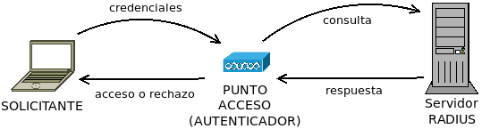

*****************************
Sistemas activos de seguridad
*****************************

.. _seg-radius:

Servidor |RADIUS|
*****************
|RADIUS| es un protocolo de autenticación que permite a un dispositivo de red
consultar las credenciales entregadas por un cliente a fin permitir o rechazar
su ingreso.

Para llevar a cabo su labor los servidores |RADIUS| disponen de la lista de
credenciales (pares usuario/contraseña) válidos) y la lista de dispositivos de
red autorizados a hacerle consultas.

.. seealso:: `Freeradius <https://freeradius.org/>`_ es un proyecto de
   *software* libre que implementa un servidor |RADIUS|. En :ref:`el apéndice
   correspondiente del manual se explica cómo configurarlo <radius>`.

.. _seg-proxy:

Servidor *proxy*
****************
.. seealso:: Consulte la :ref:`introducción teórica a los proxies <proxies>`.

.. _seg-sinkhole:

Sumideros |DNS|
***************
Si no se pretende controlar el acceso de los usuarios, sino simplemente filtrar
contenidos, son una alternativa bastante sencilla y mucho más ligera al filtrado
de dominios mediante la |SNI|.

.. seealso:: Consulte el epígrafe sobre :ref:`bloqueo DNS <dnsmasq-bloqueo>` para
   saber en qué consisten.

*Software* antispam
*******************

.. todo:: Explicar un poco el *software* acoplado a los servidores de correo que
   se encarga de filtrar el *spam*.

*Honeypots*
***********
Un :dfn:`honeypot` (*tarro de miel*) es un sistema especialmente diseñado para
atraer ataques con el fin de monitorizar y estudiar los ataques y desviar la
atención del atacante sobre el sistema principal.

.. _ids:

Análisis de la red
******************
Para analizar el estado de la red se usan diversas herramientas:

**Monitores**
   Los :dfn:`sniffers` son aplicaciones que capturan el tráfico circulante. No
   se lo apropian, sino que se hace una copia con el fin de almacenarlo y
   estudiar luego cuál es su contenido. :ref:`tcpdump <tcpdump>` o
   :ref:`wireshark <wireshark>` son ejemplos de aplicaciones de este tipo.
   
**Inspectores de puertos**
   Son aplicaciones que analizan cuáles son los puertos en donde escuchan
   aplicaciones y cuáles son estas. Para el análisis desde la propia máquina se
   usa :ref:`ss <ss>` y para el análisis desde distinta máquina :ref:`nmap <nmap>`.

   .. todo:: Crear algún ejercicio con :ref:`ss <ss>` para conocer los puertos
      abiertos.

**Sondas**
   Son aplicaciones que comprueban la conectividad. Entre ellas pueden citarse
   las órdenes :command:`ping` o :command:`traceroute`/:command:`tracepath`.

**Sistemas de detección de intrusos**
   Son aplicaciones que analizan y recopilan el tráfico de la red, buscan en
   esos datos patrones típicos de análisis y, si los encuentran, o envían un
   aviso al administrador (|NIDS|) o desencadenan una respuesta contra el ataque
   (|NIPS|).

   La complejidad de estos sistemas supone que consuman muchos recursos, ya que
   necesitan capturar y analizar constantemente información, y responder con
   celeridad.

.. _seg-firewall:

Cortafuegos
***********
Un :dfn:`cortafuegos` es la parte del sistema informático encargada de bloquear
el tráfico no autorizado y permitir el autorizado. Puede implementarse tanto por
*hardware* como por *software* (o por una combinación de ambos) y, por lo
general, fiscalizan todo el tráfico entrante en la |LAN| procedente de internet
con el fin de llevar a cabo su cometido. También es común que analicen el
tráfico procedente de la propia |LAN| con destino a los servidores internos.

Tipos
=====
#. Atendiendo al soporte de implementación pueden ser:

   **Hardware**
      Son aquellos en que el cortafuegos es un dispositivo dedicado diseñado
      específicamente para ese fin. Por ejemplo, este que mostramos por cortesía
      de Wikimedia_:

      .. image:: https://upload.wikimedia.org/wikipedia/commons/thumb/6/6f/Firewall-X400.png/640px-Firewall-X400.png

   **Software**
      Son aquellos implementados por *software* que se ejecuta sobre un sistema
      operativo de propósito general sin estar ligado a un *hardware* concreto.

#. Atendiendo al objeto de protección:

   **De red**
      Son aquellos cuyo propósito es proteger a una red de ataques,
      generalmente, externos.

   **Personales**
      Son aquellos cuyo propósito es defender a un equipo personal (por lo
      general, de escritorio).

#. Atendiendo a su funcionamiento:

   .. _fw-stateless:
   
   **De filtrado estático** (*stateless*)
      También denominados :dfn:`cortafuegos sin inspección de estado`, son
      aquellos que toman la decisión de filtrado atendiendo solamente a la
      información que pueden encontrar dentro del propio paquete (cabecera
      |IP|, cabecera |UDP| o |TCP|, etc.). No registran, pues, conexiones
      ni analizan el paquete como parte de su conexión.

   .. _fw-stateful:

   **De filtrado dinámico** (*stateful*)
      También denominados :dfn:`cortafuegos con inspección de estado`,
      son aquellos que son capaces de analizar el paquete dentro del flujo
      de información (la conexión) al que pertenecen, por lo que son capaces
      de tomar decisiones no sólo basándose en la información contenida dentro
      del propio paquete. Podrías, pues, decir que la decisión se basa no sólo
      en el paquete, sino también en su contexto (la conexión a la que
      pertenece).

      Para ser capaces de llevar este *filtrado dinámico*, estos cortafuegos
      necesitan mantener un registro del estado de las conexiones.

      .. note:: Tanto este tipo como el anterior sólo analizan hasta la
         información de la capa de transporte.

   **De capa de aplicación**
      Son cortafuegos de filtrado dinámico que analizan la conexión también en
      la capa de aplicación, identificando cuál es el protocolo de esta capa y
      estableciendo sus reglas según las propiedades de dicho protocolo. Su
      inspección es más compleja y, en consecuencia, más lenta; y muy
      comúnmente se implementen como :dfn:`proxies`, esto es, como un
      cortafuegos que analiza exclusivamente uno o unos pocos protocolos
      de capa de aplicación, de manera que para el análisis de las capas
      inferior se usa, además, otro cortafuegos de filtrado dinámico.

   .. note:: No es nuestro propósito analizar *proxies* bajo este
      epígrafe, porque existe :ref:`otro epígrafe dedicado a ellos
      <proxies>`.

Estrategias de filtrado
=======================
Al configurar un cortafuegos hay dos *estrategias* o (*políticas*) de filtrado:

**Lista negra**
   Consiste en prohibir expresamente el tráfico indeseado, de suerte
   que el resto estará permitido.
   
**Lista blanca**
   Consiste en permitir expresamente el tráfico deseado, de suerte que el resto
   está prohibido.

La segunda estrategia es mucho más segura, pero es más compleja de implementar.

Estudio práctico
================
Los principales sistemas operativos incluyen de serie cortafuegos:

- Las versiones modernas de *Windows* (tanto las de cliente como las de
  servidor) incluyen en *Windows Defender* un cortafuegos.
- Los principales sistemas |BSD| modernos (*FreeBSD*, *NetBSD*) han
  adoptado pf_, el cortafuegos desarrollado en *OpenBSD*.
- En *Linux* se está migrando desde :ref:`IPtables <iptables>` a su sucesor
  :ref:`nftables <nftables>`.

.. seealso:: Para la revisión de los dos cortafuegos actuales de *Linux*,
   consulte :ref:`el epígrafe dedicado a ellos <firewall>`.

.. |NIDS| replace:: :abbr:`NIDS (Network Intrusion Detection System)`
.. |NIPS| replace:: :abbr:`NIPS (Network Intrusion Prevention System)`
.. |RADIUS| replace:: :abbr:`RADIUS (Remote Authentication Dial-In User Service)`
.. |SNI| replace:: :abbr:`SNI (Server Name Indication)`
.. |LAN| replace:: :abbr:`LAN (Local Area Network)`
.. |TCP| replace:: :abbr:`TCP (Transmission Control Protocol)`
.. |UDP| replace:: :abbr:`UDP (User Datagram Protocol)`
.. |BSD| replace:: :abbr:`BSD (Berkeley Software Distribution)`

.. _Wikimedia: https://commons.wikimedia.org/
.. _pf: https://www.openbsd.org/faq/pf/index.html
