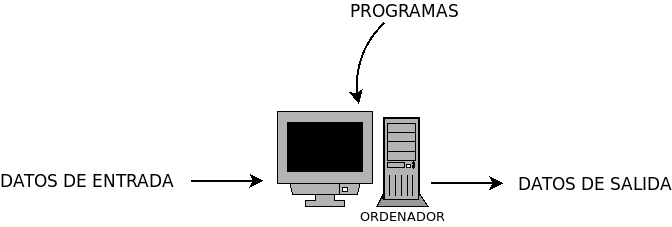

.. _som-si:

El sistema informático
**********************
La palabra *informática* procede de la fusión de los términos "INFORMación" y
"autoMÁTICA":

.. code-block:: none

   informática = INFORMación autoMÁTICA

Podemos definir la :dfn:`informática` como la disciplina que se estudia el
tratamiento automático de la información.

Por su parte, un :dfn:`sistema informático` es un sistema capaz de almacenar y
procesar automáticamente información y se encuentra consitutido por tres
componentes:

- Los **componentes físicos** o *hardware*.

- Los **componentes lógicos** o *software*, dentro del cual pueden distinguirse:

  + *Software base*: sistema operativo y firmware.
  + Las aplicaciones informáticas.

- El **personal informático**.

Un sistema informático actúa del siguiente modo:

El procesamiento para la obtención de la salida a partir de la entrada la llevan
a cabo los componentes físicos del S.I. gracias a la ejecución de programas que
no son más que un conjunto ordenado de instrucciones, que persiguen la
consecución de un determinado fin. Los programas con propósito común pueden
agruparse formando aplicaciones informáticas.

.. toctree::
   :maxdepth: 2
   :glob:

   [0-9]*
