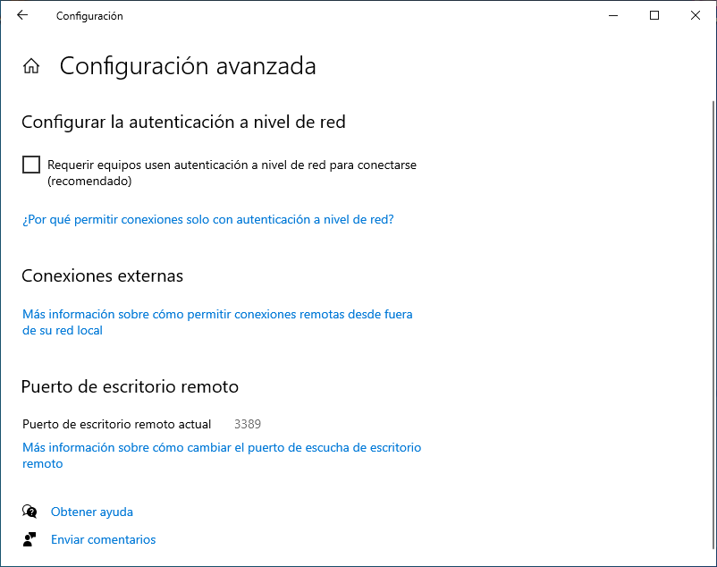

.. _ser-adm-rem:

Administración remota
*********************
Los *servicios de administración remota* permiten el acceso y manipulación de un
equipo desde otro situado en la misma o distinta red. Exigen la autenticación
del usuario remoto, por lo que es fundamental que la comunicación sea segura.

Hay, fundamentalmente, dos tipos de servicios:

* Los **servicios gráficos** que permiten acceder a sistemas con entorno de
  escritorio.
* Los **servicios de terminal de texto** que permiten acceder al entorno de la
  *shell* de un servidor remoto.

Servicios gráficos
==================
Nos centraremos en tres:

#. `Remote Desktop Protocol
   <https://en.wikipedia.org/wiki/Remote_Desktop_Protocol>`_, que es el
   protocolo que traen incorporados los *Windows* modernos para su
   administración remota.
#. `VNC <https://es.wikipedia.org/wiki/VNC>`_, que se basa en `el protocolo
   RFB <https://es.wikipedia.org/wiki/RFB_protocol>`_ y tiene versiones para
   múltiples sistemas operativos tanto como servidor como cliente.
#. `TeamViewer <https://en.wikipedia.org/wiki/TeamViewer_(company)>`_, que
   también funciona en múltiples sistemas operativos y está enfocado al soporte
   técnico: facilita que un técnico pueda acceder al ordenador de un cliente a
   fin de resolverle algún problema.

Remote Desktop Protocol (|RDP|)
-------------------------------
Permite gestionar de manera remota un sistema *Windows* desde cualquier sistema (gracias a que existe FreeRDP_, aunque existen otras implementaciones libres). Las claves para su uso son las siguientes:

.. rubric:: Servidor

Se puede acceder a su configuración a través de :kbd:`Configuración>Sistema>Escritorio remoto`, aunque en la búsqueda basta con escribir ":kbd:`remoto`" para que una de las opciones sea "Configuración del escritorio remoto". Por defecto, está deshabilitado, de modo que habrá que habilitarlo:

.. image:: files/conf-rdp.png

Si nuestra intención es conectarnos desde un cliente distinto al de *Windows*
(p.e. desde *Linux*), necesitamos deshabilitar en la configuración avanzada la
autenticación a nivel de red:

.. rubric:: Cliente

En *Windows* el cliente es muy fácil de usar. Basta con ejecutar :program:`mstsc.exe` al que se puede acceder sin recordar el nombre simplemente con escribir en la búsqueda ":kbd:`remoto`" y escoger la opción de "Conexión a Escritorio remoto":

.. image:: files/conex-rdp.png

*Linux* tiene varios clientes competentes: :deb:`rdesktop` o :deb:`remmina`
(este último también sirve como cliente VNC).

|VNC|
-----
Permite la gestión remota de múltiples sistemas desde un cliente que puede correr también en múltiples sistemas. Como para la gestión de un *Windows* es mejor utilizar su solución nativa (|RDP|), reservaremos esta posibilidad para la gestión remota de un *Linux*.

.. rubric:: Servidor

Podemos usar TigerVNC_. Si lo usamos, la mejor alternativa es utilizarlo como un módulo de :program:`Xorg`, para lo cual:

1. Instalamos::

      # apt install tigervnc-xorg-extension

2. Se crea el archivo de configuración para la carga del módulo\ [#]_:

   .. code-block:: xorg.conf

      # /etc/X11/xorg.conf.d/10-tigervnc.conf
      Section "Module"
         Load "vnc"
      EndSection

      Section "Screen"
         Identifier "Screen0"

         # Autenticación mediante contraseña
         Option "SecurityTypes" "TLSVnc"
         Option "PasswordFile" "/etc/tigervnc/vncpasswd"

         # Autenticación mediante usuario/contraseña local (alternativa)
         #Option "SecurityTypes" "VeNCrypt,TLSPlain"
         #Option "PAMService" "tigervnc"
         #Option "PlainUsers" "usuario,otrousuario"
      EndSection

3. El archivo anterior presenta dos alternativas:

   + La primera (que es la que no está comentada) exige la autenticación
     mediante una contraseña almacenada en un archivo. Si preferimos esta opción,
     necesitaremos crear la contraseña dentro de tal archivo con la orden::

      # vncpasswd /etc/tigervnc/vncpasswd

   + La segunda (comentada y, por tanto, sin efecto) permite la autenticación usando
     las credenciales de un usuario del sistema. Mediante la opción
     :kbd:`PlainUsers` definimos la lista de usuarios válidos.

4. Reiniciamos el servidor gráfico para que se haga efectiva la carga del módulo::

      # pkill -1 X 

5. Una vez de regreso, comprobamos que el servidor escucha en el puerto *5900*::

      $ ss -4ltn
        State        Recv-Q       Send-Q             Local Address:Port             Peer Address:Port      Process      
        LISTEN       0            5                        0.0.0.0:5900                  0.0.0.0:*

.. rubric:: Cliente

Existen muchas alternativas:

* En *Linux* Vinagre_, Remmina_ (válida también para |VNC|) o el cliente de
  TigerVNC_, disponible a través del paquete :deb:`tigervnc-viewer` que instala
  el ejecutable :program:`vncviewer`). 
* En *Windows*, el mismo cliente de TigerVNC_ (descargue de su página el cliente
  :program:`vncviewer64`).

En todos estos clientes, para conectar con el servidor, basta con indicar su
|IP| (o nombre) y, en caso de que escuche en el puerto **5900** se deberá
indicar también éste. Ahora bien, no se expresa directamente el número de puerto, sino el
número de *display* que se obtiene al sustraer *5900* del número de puerto. Por
tanto, un servidor escuchando en el puerto *5900*, escuchará en el display *0*;
uno en el puerto *5901*, en el display *1*; y así sucesivamente. Por ejemplo, si
el servidor se encuentra en la dirección *172.22.9.111* y escucha en el display
*0*, deberemos conectar a él mediante :kbd:`172.22.9.111:0`.

TeamViewer
----------

.. todo:: Probar el programa TeamViewer y hacer algunas indicaciones.

Servicios de terminal de texto
==============================
Dos son los servicios de administración remota para línea de comandos:

* Telnet_, ya totalmente en desuso por ser inseguro y, aunque puede asegurarse
  mediante :ref:`ssl`, por carecer de todas las características adicionales
  de su alternativa (transferencia de archivos, autenticación mediante claves
  asimétricas, tunelización de conexiones).

* :ref:`SSH <adm-rem>` que es profusamente desarrollado en el manual. De lo
  referido en él nos interesa para el curso:

  + :ref:`Su instalación <ssh-inst>`.
  + :ref:`Su configuración básica <ssh-conf>`.
  + La utilización de sus dos clientes principales:

    + El :ref:`cliente de openssh <openssh-cliente>`, usado fundamentalmente en
      entornos *UNIX*.
    + :ref:`Putty <putty-cliente>`, ampliamente usado en entornos *Windows* (aunque su
      *Powershell* incluye el cliente de openssh.
  
  + La :ref:`autenticación con claves <ssh-cert>`, aunque podemos limitarla a
    claves y que la autenticación con certificado quede para el :ref:`módulo de
    Seguridad Informática <seg>`.

  + :ref:`Tunelización de conexiones <tunel-ssh>`.

.. rubric:: Notas al pie

.. [#] La ubicación de estos archivos no tiene por qué ser
   :file:`/etc/X11/xorg.conf.d`. Otra ubicación posible es
   :file:`/usr/share/X11/xorg.conf.d`. En cualquier caso, el directorio debería
   existir de antemano, así que si no existe en su sistema, deberá investigar
   dónde se encuentra en vez de no crear uno.

.. |VNC| replace:: :abbr:`VNC (Virtual Network Computing)`
.. |RDP| replace:: :abbr:`RDP (Remote Desktop Protocol)`

.. _FreeRDP: https://www.freerdp.com
.. _TigerVNC: //https://tigervnc.org
.. _Vinagre: https://wiki.gnome.org/Apps/Vinagre
.. _Remmina: https://remmina.org
.. _Telnet: https://es.wikipedia.org/wiki/Telnet
